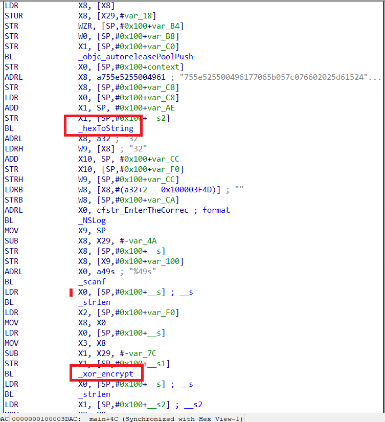
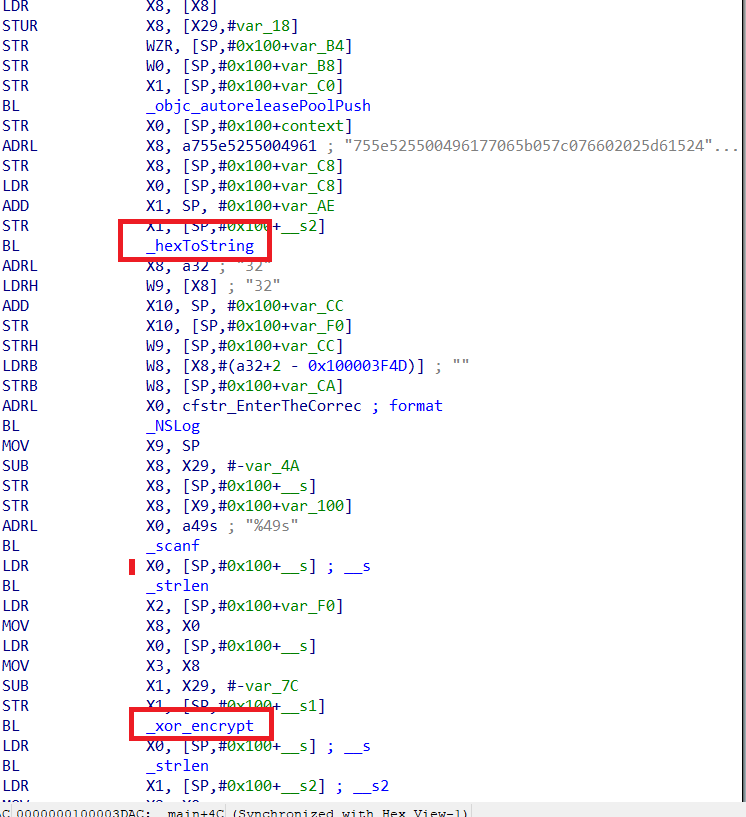
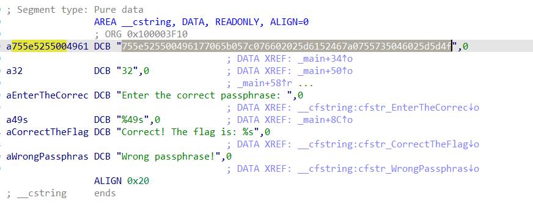
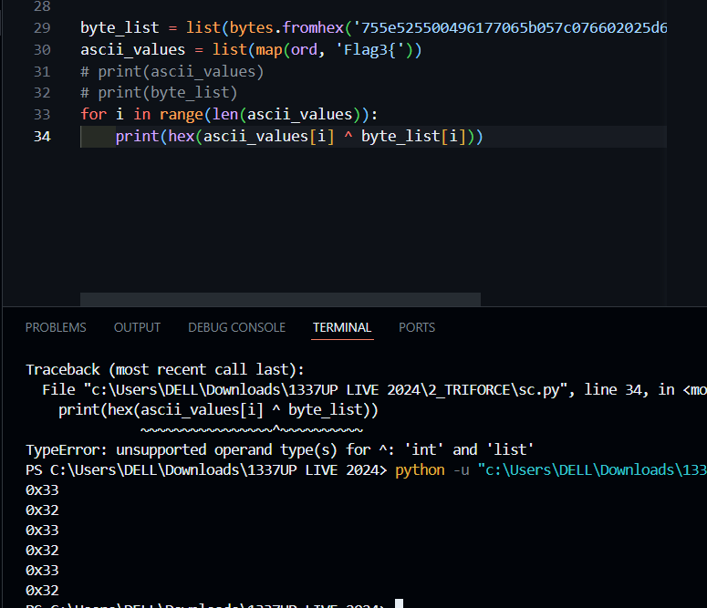

# 1_SECURE_BANK


- Chall: [FILE](CHALL/3_secure_bank.rar).

- Bài cho chúng ta một file thực thi và một câu lệnh để kết nối đến một máy chủ từ xa.

- Ta thực hiện phân tích file được cho:

    ```C
        int __fastcall main(int argc, const char **argv, const char **envp)
        {
        int v4; // [rsp+4h] [rbp-Ch] BYREF
        int v5; // [rsp+8h] [rbp-8h] BYREF
        int _2fa_code; // [rsp+Ch] [rbp-4h]

        banner(argc, argv, envp);
        login_message();
        printf("Enter superadmin PIN: ");
        __isoc99_scanf("%u", &v5);
        if ( v5 == 1337 )
        {
            _2fa_code = generate_2fa_code(1337LL);
            printf("Enter your 2FA code: ");
            __isoc99_scanf("%u", &v4);
            validate_2fa_code(v4, _2fa_code);
            return 0;
        }
        else
        {
            puts("Access Denied! Incorrect PIN.");
            return 1;
        }
    }
    ```

- Chương trình chính sẽ thực hiện bắt chúng ta nhập `superadmin PIN` và kiểm tra với `1337` không. Nếu đúng sẽ thực hiện kiểm tra tiếp.

    ```C
    int __fastcall validate_2fa_code(int a1, int a2)
    {
    if ( a1 != a2 )
        return puts("Access Denied! Incorrect 2FA code.");
    puts("Access Granted! Welcome, Superadmin!");
    return printf("Here is your flag: %s\n", "INTIGRITI{fake_flag}");
    }
    ```

- Tiếp đó chương trình sẽ thực hiện kiểm tra `2FA code` với `5670688`. Nếu đúng sẽ in ra flag.

    Trong đó `5670688` là kết quả của hàm này trả về:

    ```C
    __int64 __fastcall generate_2fa_code(int _1337)
    {
    int i; // [rsp+Ch] [rbp-Ch]
    int v3; // [rsp+10h] [rbp-8h]
    unsigned int v4; // [rsp+14h] [rbp-4h]

    v4 = 48879 * _1337;
    v3 = 48879 * _1337;
    for ( i = 0; i <= 9; ++i )
    {
        v4 = obscure_key(v4);
        v3 = ((v4 >> ((char)i % 5)) ^ (v4 << (i % 7))) + __ROL4__(v4 ^ v3, 5);
    }
    return v3 & 0xFFFFFF;
    }
    ```

- Ta thực hiện kết nối với máy chủ và thực hiện nhập đúng `superadmin PIN` và `2FA code` thì sẽ lấy được flag:

    

- Flag:

    ```txt
    INTIGRITI{pfff7_wh47_2f4?!}
    ```

# 2_TRIFORCE



- Chall: [FILE](CHALL/4_triforce.zip).

- Bài cho chúng ta 3 file thực thi của hệ điều hành Window, Linux và MacOS. Chúng ta thực hiện debug 3 file này để lấy được flag.

- File 1 (Window):

    ```C
    // HÀM MAIN
    int __fastcall main(int argc, const char **argv, const char **envp)
    {
    int v3; // eax
    size_t v4; // rax
    char key[2]; // [rsp+2Eh] [rbp-C2h] BYREF
    char correct_output[50]; // [rsp+30h] [rbp-C0h] BYREF
    char encrypted_input[50]; // [rsp+70h] [rbp-80h] BYREF
    char input[50]; // [rsp+B0h] [rbp-40h] BYREF
    const char *hexString; // [rsp+E8h] [rbp-8h]

    _main(argc, argv, envp);
    hexString = "7e54595f09434b0f4a5d59757b514a5b6d550d0f0c765b7d45";
    hexToString("7e54595f09434b0f4a5d59757b514a5b6d550d0f0c765b7d45", correct_output);
    strcpy(key, "8");
    printf("Enter the correct passphrase: ");
    scanf("%49s", input);
    v3 = strlen(input);
    xor_encrypt(input, encrypted_input, key, v3);
    v4 = strlen(input);
    if ( !memcmp(encrypted_input, correct_output, v4) )
    {
        printf("Correct! The flag is: ");
        printf(input);
    }
    else
    {
        puts("Wrong passphrase!");
    }
    return 0;
    }
    ```

    ```c
    void __cdecl xor_encrypt(char *input, char *output, char *key, int len)
    {
    int i; // [rsp+2Ch] [rbp-4h]

    for ( i = 0; i < len; ++i )
        output[i] = key[i % strlen(key)] ^ input[i];
    }
    ```

    Chương trình này thực hiện xor input với byte `0x38` roài thực hiện kiểm tra với chuỗi hex khai báo ở trên.

- File2 (Linux):

    ```C
    int __fastcall main(int argc, const char **argv, const char **envp)
    {
    int v3; // eax
    size_t v4; // rax
    char s2[67]; // [rsp+Dh] [rbp-C3h] BYREF
    char s1[64]; // [rsp+50h] [rbp-80h] BYREF
    char s[56]; // [rsp+90h] [rbp-40h] BYREF
    const char *v9; // [rsp+C8h] [rbp-8h]

    v9 = "775a5051034d5644706002635f467d0570030558454b";
    hexToString("775a5051034d5644706002635f467d0570030558454b", &s2[3]);
    strcpy(s2, "16");
    printf("Enter the correct passphrase: ");
    __isoc99_scanf("%49s", s);
    v3 = strlen(s);
    xor_encrypt((__int64)s, (__int64)s1, s2, v3);
    v4 = strlen(s);
    if ( !memcmp(s1, &s2[3], v4) )
    {
        printf("Correct! The flag is: ");
        printf(s);
    }
    else
    {
        puts("Wrong passphrase!");
    }
    return 0;
    }
    ```

    ```C
    __int64 __fastcall xor_encrypt(__int64 a1, __int64 a2, const char *a3, int a4)
    {
    char v4; // r12
    __int64 result; // rax
    int i; // [rsp+2Ch] [rbp-14h]

    for ( i = 0; ; ++i )
    {
        result = (unsigned int)i;
        if ( i >= a4 )
        break;
        v4 = *(_BYTE *)(i + a1);
        *(_BYTE *)(i + a2) = a3[i % strlen(a3)] ^ v4;
    }
    return result;
    }
    ```

    Phần này ý tưởng giống y hệt file đầu tiên, nhưng mà file này thực hiện xor input với 2 byte là `0x31`, `0x36`.

- File3 (MacOS): Do đây là file MacOS nên không thể nào có thể debug hay có máy ảo để cài được, nên tôi thực hiện ném vào IDA xem sao:

    

    Dù không thể debug được bài này nhưng mà ta thấy có vẻ như nội dung của file này na ná giống 2 file trên nên ta mạnh dạng guessing đoạn này.

    Ta lấy một đoạn giống giống `flag_en`:

    

    Từ 2 file trên ta nhận thấy format của flag sẽ là `Flag3{`, lúc này ta thử xor các byte đầu của flag_en với những kí tự trên xem sao.

    

    Đến đây ta mạnh dạng đoán file này sẽ thực hiện xor lần lượt các byte với 2 byte `0x33` và `0x32`, lúc này ta thử viết script thì nhận ra việc đoán ở trên của mình là chính xác.

- Scrip 3 file:

    ```python
    flag_1 = list(bytes.fromhex('7E54595F09434B0F4A5D59757B514A5B6D550D0F0C765B7D45'))
    xor_1 = [0x38]
    for i in range(len(flag_1)): print(end = chr(flag_1[i] ^ xor_1[i % len(xor_1)]))
    print()
    # Flag1{s7reaMCircUm574NcE}

    flag_2 = list(bytes.fromhex('775A5051034D5644706002635F467D0570030558454B'))
    xor_2 = [0x31, 0x36]
    for i in range(len(flag_2)): print(end = chr(flag_2[i] ^ xor_2[i % len(xor_2)]))
    print()
    # Flag2{grAV3UnpL3A54nt}

    flag_3 = list(bytes.fromhex('755e525500496177065b057c076602025d6152467a0755735046025d5d4f'))
    xor_3 = [0x33, 0x32] 
    for i in range(len(flag_3)): print(end = chr(flag_3[i] ^ xor_3[i % len(xor_3)]))
    # Flag3{RE5i6N4T10nSatI5fAct1on}
    ```

- Flag:

    ```txt
    INTIGRITI{s7reaMCircUm574NcEs7reaMCircUm574NcEs7reaMCircUm574NcE}
    ```
