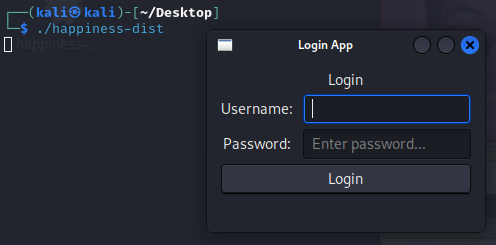
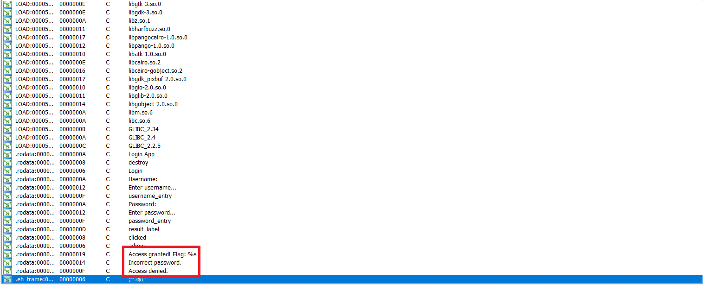
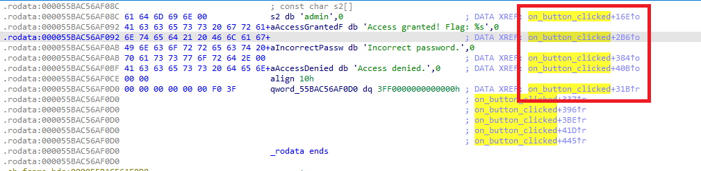
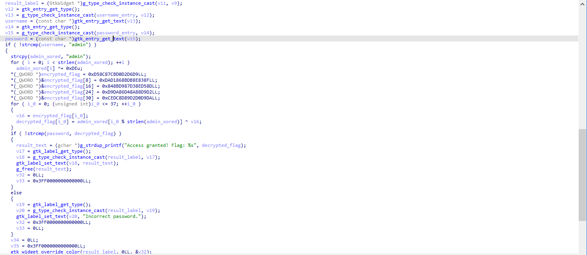
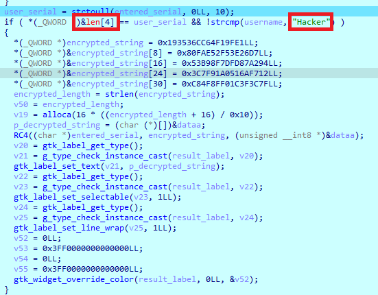
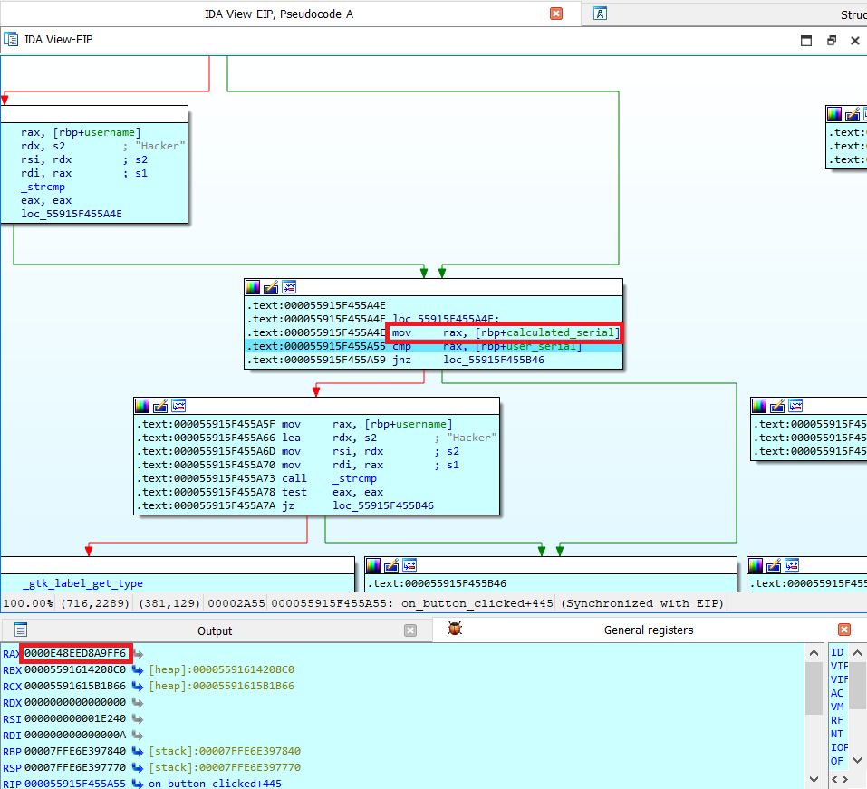
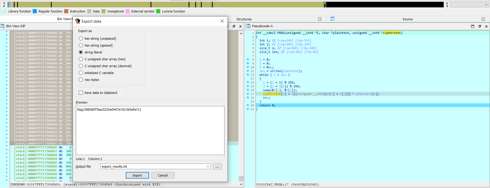

# 1_HAPPINESS_DIST.

- Chall: [FILE](CHALL/1_HAPPINESS_DIST.zip).

- Đề bài cho một file thực thi, khi chạy nó sẽ cung cấp cho mình một giao diện để mình có thể lấy được flag như sau:

    

- Điều khó của bài này chỉ là đoạn tìm vị trí hàm kiểm tra thoai, vì bài này nó là build chương trình từ đầu luôn thế sẽ gọi rất nhiều hàm và nó chỉ có phục vụ mục đích tạo giao diện.

- Có thể mình có một mindset chưa được chuẩn cho lắm vậy nên khi mới bắt đầu làm bài này thì mất khá là nhiều thời gian để có thể tìm được cái hàm `check_password`.

- Ban đâu mình thực hiện F8 từng dòng một thì mình thấy quá là sida, sau tầm 30 phút mò thì mình mới nhận thấy bản thân sida vãi ò. Muốn tìm hàm check_password thì mình chỉ cần xem các chuỗi có trong chương trình, như sau:

    

    Khi click vô thì mình thấy như sau:

    

    Như ta thấy chuỗi này có xuất hiện trong những địa chỉ data sau, click vô thì nó nhảy đến đúng hàm để `check_password`:

    

- Thoai không có gì để nói cả:

    ```python
    admin = [
        0x61, 0x64, 0x6D, 0x69, 0x6E
    ]   # adimn

    encrypted_flag = [
        0xD9, 0xD6, 0xD2, 0xD0, 0xCB, 0x87, 0x8C, 0xD5, 0x8F, 0x83, 
        0x8E, 0xDB, 0x8B, 0x86, 0xD1, 0xDA, 0x8D, 0xD5, 0x8E, 0xD3, 
        0x87, 0xD9, 0x8B, 0x84, 0xD2, 0xD9, 0x88, 0x8A, 0xD4, 0x86, 
        0xDA, 0xD9, 0xD0, 0xD2, 0x89, 0x8D, 0xDC, 0xCE
    ]

    for i in range(len(admin)): admin[i] ^= 0xDE

    for i in range(38): print(end = chr(admin[i % len(admin)] ^ encrypted_flag[i]))
    ```

    ```txt
    flag{86f831a81ae7f9c8c83bf29c6ecce92f}
    ```

# 2_REVVED_DIST.

- Chall: [FILE](CHALL/2_REVVED_DIST.zip).

- Thực hiện bước tìm hàm chính như bài trên, mỗi tội lần này bài này hàm kiểm tra hơi khác thoai (RC4).

    

- Ở phần trên có `user_serial` được chuyển từ chuỗi sang số, thực hiện xem giá trị của nó là bao nhiêu:

    

    Như vậy chúng ta biết thứ cần nhập và Serial có giá trị là `0x0000E48EED8A9FF6`, thực hiện nhập lại vào phần Serial rùi nhảy vô phần mã hóa RC4 thoai.

    

- Flag:

    ```txt
    flag{388580f7bac0230a0407e7d13b5afa71}
    ```

- Source:

    ```python
    entered_serial = [
        0x32, 0x35, 0x31, 0x33, 0x30, 0x32, 0x35, 0x32, 0x31, 0x37, 
        0x37, 0x34, 0x30, 0x37, 0x30
    ]

    encrypted_string = [
        0xE1, 0x9F, 0xF1, 0x64, 0xCC, 0x36, 0x35, 0x19, 0xD7, 0x26, 
        0x3E, 0xF5, 0x52, 0xAE, 0x0F, 0x08, 0x94, 0xA2, 0x87, 0xFD, 
        0x7D, 0x8F, 0xB9, 0x53, 0x12, 0xF7, 0x6A, 0x51, 0xA0, 0x91, 
        0x7F, 0x3C, 0x3F, 0x1C, 0xF0, 0x8F, 0x4F, 0xC8
    ]

    s = []

    for i in range(256): s.append(i)

    j = 0
    for i in range(256):
        j = (s[i] + j + entered_serial[i % len(entered_serial)]) & 0xff
        s[i], s[j] = s[j], s[i]

    i, j = 0, 0
    for index in range(len(encrypted_string)):
        i = (i + 1) & 0xff
        j = (j + s[i]) & 0xff
        s[i], s[j] = s[j], s[i]
        print(end = chr(s[(s[i] + s[j]) & 0xff] ^ encrypted_string[index]))
    ```

