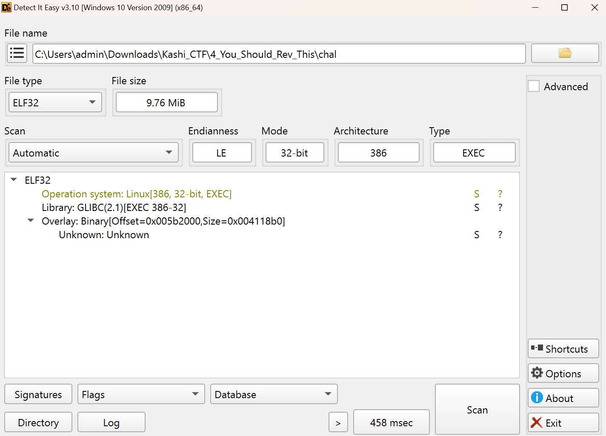
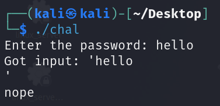
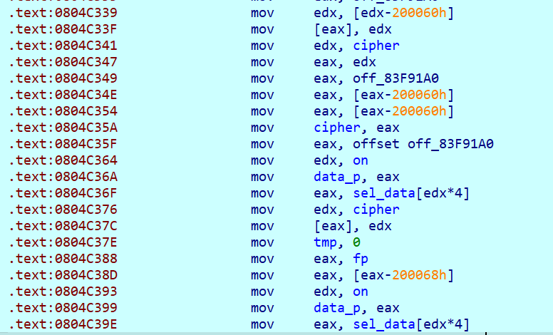
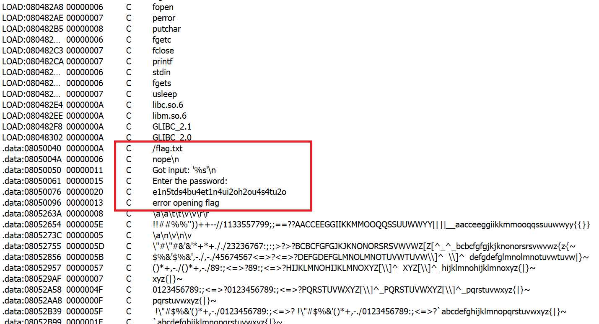
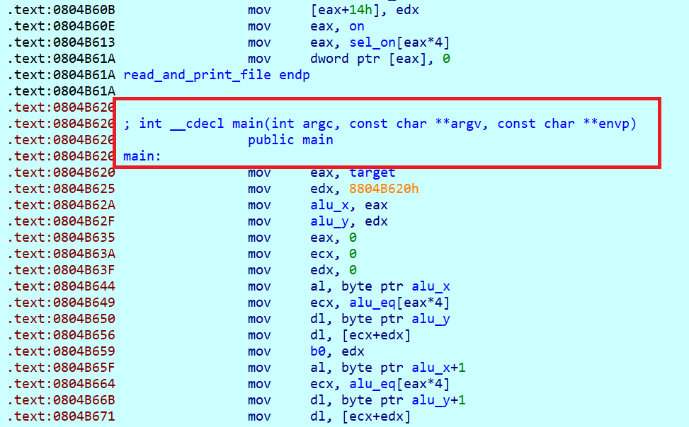
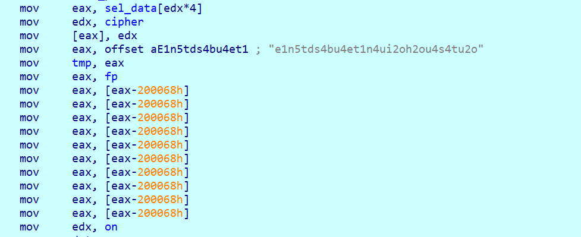
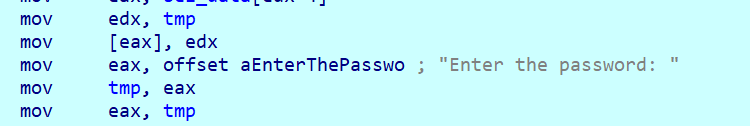
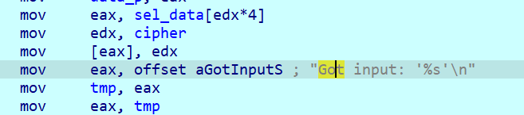
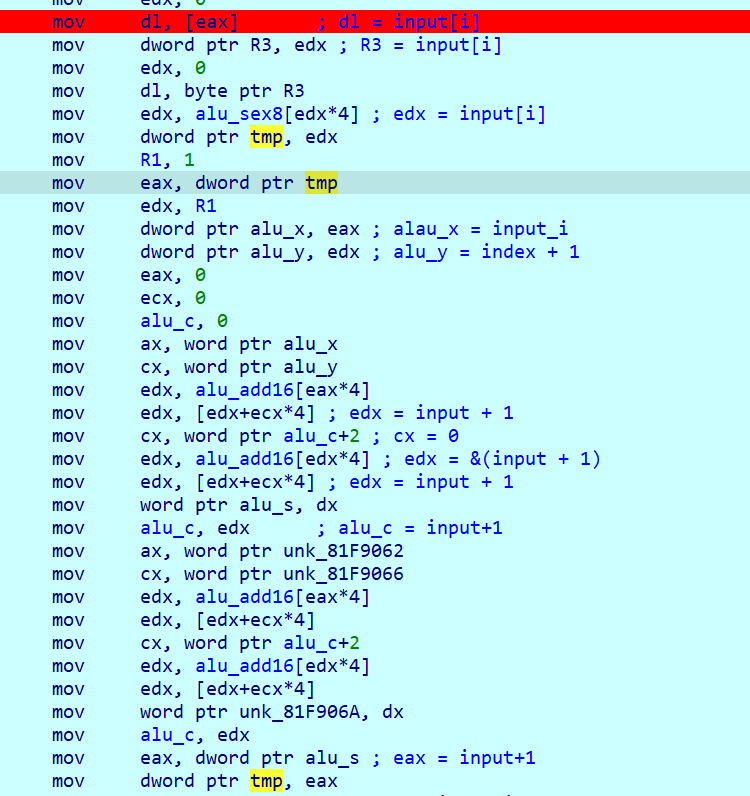
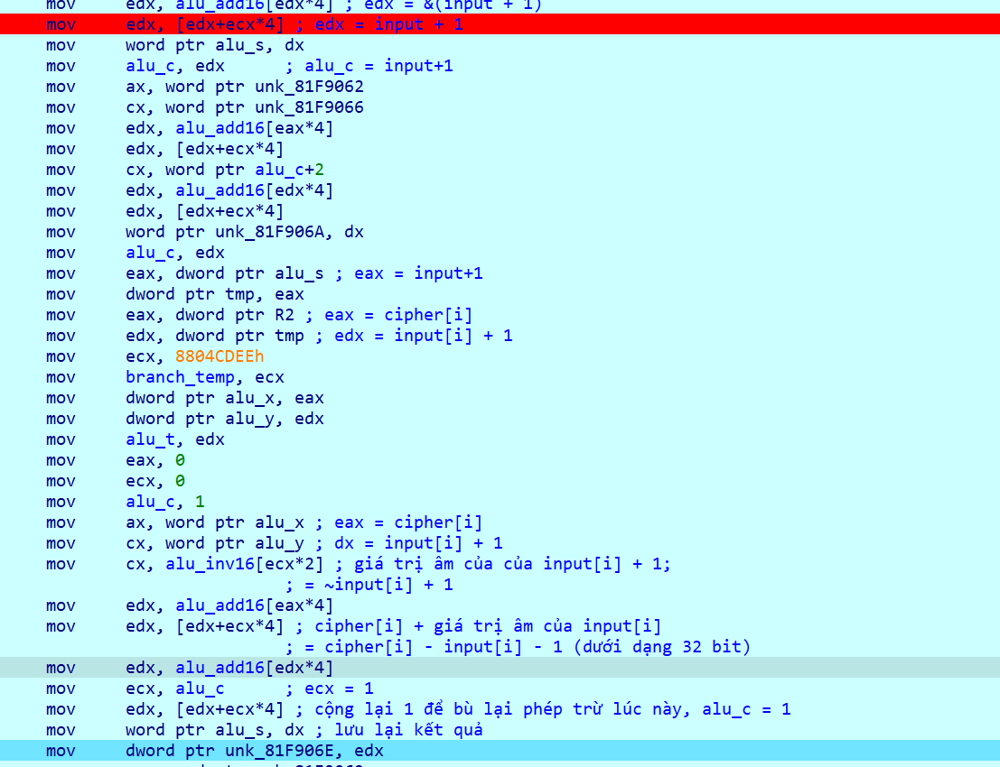

# You Should Rev This

- This challenge provides a 32-bit ELF file::

    

- The program, as I suspect, checks the input; if it doesn't match the expected value, it prints `nope`.

    

- This file uses `MOV Obfuscator` to make analyzing the program more difficult.

    

- At this point, I examined the strings present in the program to locate the `main()` function.

    

    

- Since there are a lot of `MOV` instructions in the program, I focused on analyzing those that move the address of a string into registers or pre-declared variables. I predicted that these parts are related to the input processing and should be analyzed more closely. For example:

    

    

    

    

- At this point, I suspected that analyzing only the assembly code between the strings "Got input: '%s' \n" and "Nope" would reveal what the program does with the input.

- Analyzing the MOV instructions:

    - Reading input and incrementing it by `1`:

        

        The program stores the input[i] as an 8-bit value and converts it to 32-bit (through a pre-declared array). It does this by extracting the 32-bit value from the ASCII code of each character. The variable tmp stores input[i] in 32-bit format. The variable alu_s stores input[i] + 1.

    - Computing input[i] with cipher[i]:

        

        The program negates input[i] + 1, then adds it to cipher[i], and stores the result. This is equivalent to comparing two values using subtraction.

- Based on this, I assumed that the program compares the input characters with a predefined cipher by adding 1 to their ASCII values. I then wrote the following script to retrieve the correct input:

    ```python
    key = [ord(i) - 1 for i in 'e1n5tds4bu4et1n4ui2oh2ou4s4tu2o']
    for i in key: print(end = chr(i))
    # d0m4scr3at3ds0m3th1ng1nt3r3st1n
    ```

