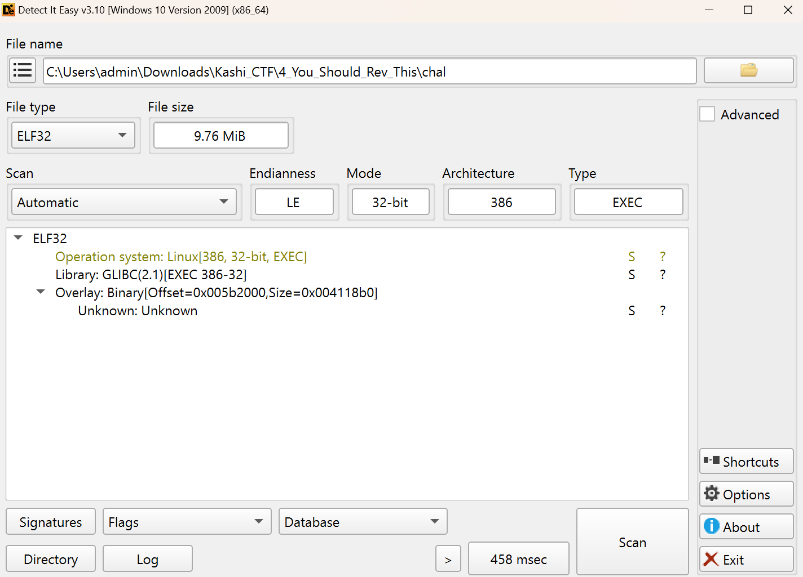
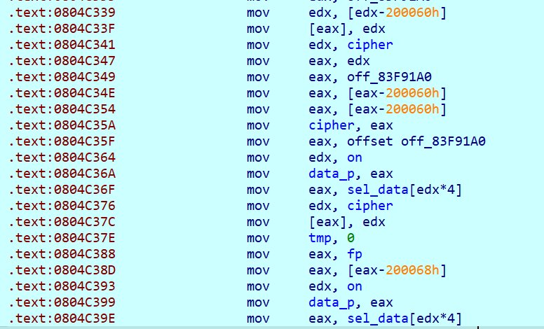
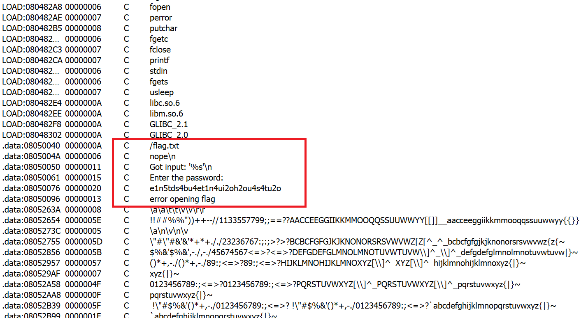
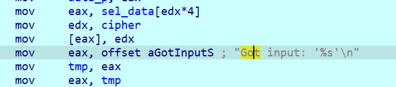
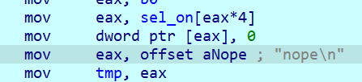

# You Should Rev This

- Bài này cung cấp một file ELF 32 bit:

    

- Chương trình theo như phỏng đoán của mình sẽ thực hiện kiểm tra input đầu vào, nếu không thì sẽ in ra `nope`.

    

- File này sử dụng `MOV Obfuscater` để gây khó khăn trong việc phân tích mã của chương trình.

    

- Lúc này mình thực hiện xem những string có thể xuất hiện ở trong chương trình để có thể biết được hàm `main()` của chương trình.

    

    

- Lệnh `mov` trong chương trình khá nhiều nên mình sẽ chú ý quan tâm phân tích tới những lệnh `mov` địa chỉ của một chuỗi vào các thanh ghi và những biến đã được khai báo từ trước, lúc đó mình dự đoán những phần đó sẽ liên quan tới input và chỉ cần phân tích dưới. Ví dụ như:

    

    

    

    

- Lúc này mình có suy nghĩ rằng chỉ phân tích đoạn mã asm từ chuỗi `Got input: '%s' \n` đến chuỗi `Nope` là sẽ biết được chương trình đang làm gì với input.

- Phân tích các lệnh mov:

    - Đọc `input` và tăng lên 1:

        

        Chương trình sẽ thực hiện lưu giá trị input[i] dưới dạng 8 bit thành dạng 32 bit (thông qua một mảng đã được khai báo từ trước, chương trình dựa vào giá trị mã ASCII của kí tự và trích ra giá trị 32 bit), biến `tmp` sẽ lưu trữ input[i] dưới dạng 32 bit và biến `alu_s` sẽ lưu trữ input[i] + 1.

    - Tính toán giá trị `input[i]` với `cipher[i]`:

        

        Chương trình thực hiện lấy giá trị âm của `input[i] + 1` rùi thực hiện cộng với `cipher[i]` rùi thực hiện lưu lại giá trị của kết quả đó. Nó giống như việc thực hiện so sánh 2 giá trị dựa vào phép trừ.

- Đến đây mình đoán chương trình sẽ thực hiện so sánh những kí tự của input với cipher cho sẵn thông qua phép cộng với số đối, trong đó những kí tự được so sánh là những giá trị mã `ASCII` của kí tự đó cộng với 1, mình thực hiện viết scrip:

    ```python
    key = [ord(i) - 1 for i in 'e1n5tds4bu4et1n4ui2oh2ou4s4tu2o']
    for i in key: print(end = chr(i))
    # d0m4scr3at3ds0m3th1ng1nt3r3st1n
    ```

