# KCSC_CTF_2024

## LỜI NÓI ĐẦU

Xin chào mọi người, `write_up` này của mình là nơi viết ra suy nghĩ cá nhân của mình khi tiếp cận một bài khi mình lần đầu tiếp xúc, nên sẽ có một chút hơi dài dòng và sẽ có một số chỗ mang tính cá nhân xíu (nên có thể có chút nhầm lẫn). Mọi thứ đều mang tính chất tham khảo. Tui sẽ dẫn dắt các bạn theo dòng suy nghĩ của tui khi làm bài (nó sẽ rất là dài dòng và lòng thòng). Nên nếu các bạn muốn tìm một `write_up` để lấy ý tưởng nhanh gọn hay chỉ đơn giản là làm sao để có flag nhanh thì tui nghĩ `write_up` này không phù hợp với các bạn. Đọc đến đây các bạn cũng thấy sự dài dòng của tui rùi đúng không? Vậy hãy bắt luôn đi @@.

## re_f@k3.

- Chall: [f@k3](Fake\re_fk3.exe).

### Phần đọc hiểu: 

- Lấy hết những thông tin có thể suy ra được từ đề. Một điều quan trọng khi tui làm đó là phải hiểu xem chương trình chạy ra sao, nếu bản thân tui mà không hiểu chương trình ra sao thì gần như 99% tui sẽ không có ý tưởng để xử lý bài (nên tui nghĩ phần này khá là quan trọng, nó sẽ chiếm tầm 20% để giải quyết bài toán, nếu không có 20% thì thì đừng mơ đến 80% sau đó).

#### Xem sơ lược qua File.

- Bước đầu tui ném vào kali để xem ta có thể thu được những thông tin gì từ file này (các bạn có thể sử dụng Dectect It Easy để biết rõ hơn), ta sẽ thu được như sau.

    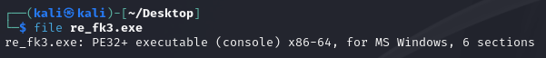

- Ta có thể dễ dàng suy ra được: File `re_fk3.exe` là một file thực thi trên Windows và file này là file 64 bit. Ta quăng vào `IDA64` ngồi phân tích tiếp.

- Đặt breakpoint ở đầu, chuyển sang chế độ `Local Windows debugged` và nhấn `F9`.

    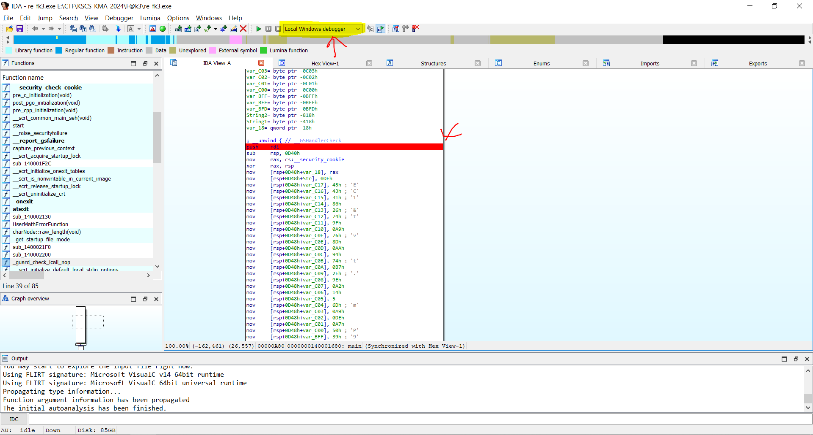

#### Đặt lại một số tên hàm/biến và ép lại một số kiểu dữ liệu.

- Việc đặt lại một số tên hàm/biến và ép lại một số kiểu dữ liệu tui thấy cũng ảnh hưởng không ít đến việc ta có thể đọc hiểu được chương trình. Vì mã giả để nguyên tui thấy trông khá là khó chịu và rối mắt, nên tui nghĩ việc `biết` để có thể ép kiểu và đặt tên biến là một kĩ năng nho nhỏ cần có để có thể đọc hiểu được chương trình (tui vẫn đang trong quá trình học hỏi nên có thể việc đặt biến và ép kiểu của tui nhiều lúc chưa được chuẩn cho lắm, tui luôn sẵn sàng lắng nghe và học hỏi nên có gì các bạn cứ góp ý). 

- Việc đổi tên biến/hàm trong IDA: click đến tên biến và hàm cần sửa, nhấn `N` để mở lên bảng `Please enter variable name`.

    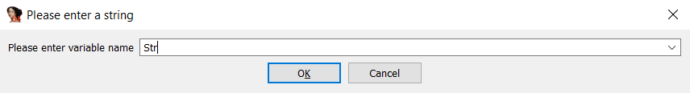

- Việc đổi kiểu dữ liệu (hay ép kiểu) trong IDA: click đến tên biến cần ép kiểu, nhấn `Y` để mở lên bảng `Please enter the type declaration`.

    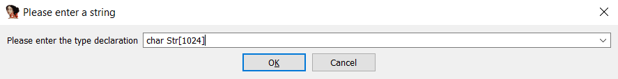

- Khi xem mã giả ta có thể thấy như sau.

    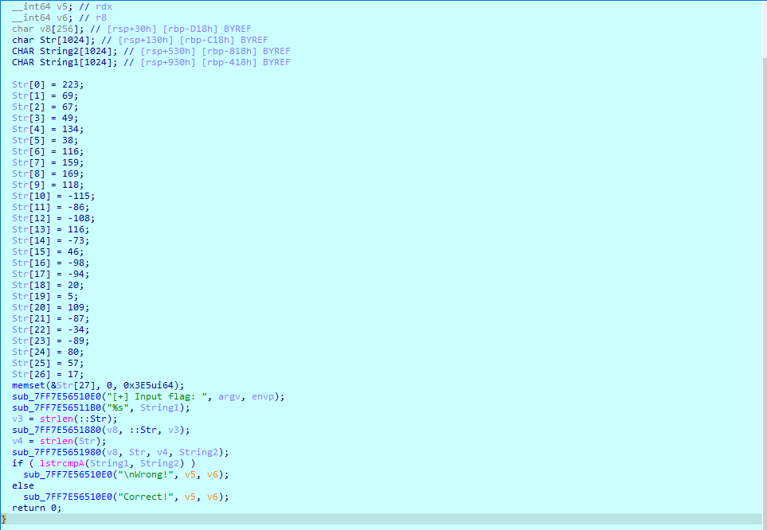

- Nhìn từ dòng 12 đến dòng 38 ta có thể thấy chương trình đang đưa các giá trị vào vào mảng `Str[]`, do chưa biết mảng này có chức năng gì nên tui sẽ đổi tên lại thành `cipher`. Bên cạnh đó đổi lun các giá trị trong mảng `cipher` thành các giá trị dạng hexa (bằng cách click vô giá trị và nhấn `H` để đển sang hexa).

- Không khó để nhận ra chức năng của 2 hàm dòng 40 và 41 tương tự như hàm `printf` và `scanf`, nhưng cú pháp truyền vào có thể hơi lạ, nên ta đổi thành một một hàm có tên na ná giống vậy là `print` và `scan`. Và đổi tên `String1` thành `input`, đổi `v3` thành `Str_len`, `v4` thành `cipher_len`.

- Dòng 43 và 45 ta nhìn thấy 2 hàm `sub_7FF7E5651880` và `sub_7FF7E5651980`, do lúc đầu tui vẫn chưa biết 2 hàm này để làm gì nên tui đặt tạm cho nó thành `function_1` và `function_2` (tý tôi sẽ ngồi quan sát kĩ hơn, bây giờ tui chỉ đặt tên biến với ép kiểu thui)

- Nhìn `v8` được khai báo mảng char 256 kí tự, tui sẽ đặt là `map`. Lúc này ta sẽ được như sau:

    

- Bây giờ ta sẽ click vào từng `function_1` và `function_2` để thực hiện nốt các thao tác. Với `function_1` và `function_2`, điều đầu tiên cần phải làm là đặt tên biến truyền vào từ hàm main và khi gọi hàm đó sao cho giống nhau. 

    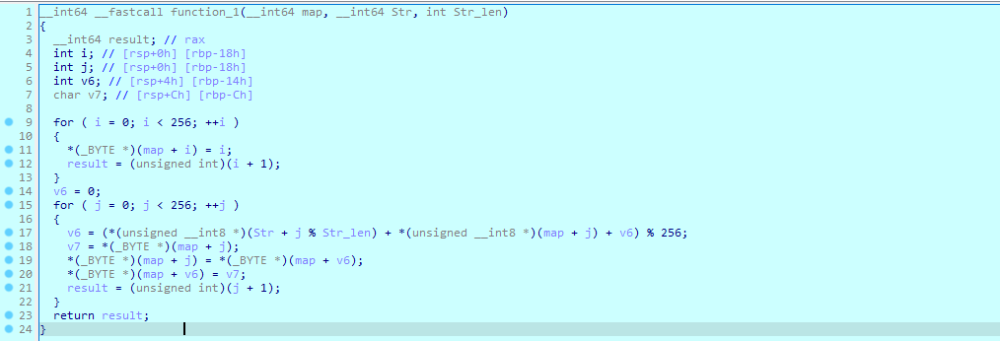

- Nhìn trong hàm `function_1` ta thấy, ta thấy ở dòng 11, 18, 19, 20 có kiểu ép sang `_BYTE *` từ `map`. Ban đầu truyền vào là địa chỉ của hàm map, hay con trỏ ở vị trí đầu tiên của map. Ví dụ như dòng 11 là `*(_BYTE *)(map + i) = i`, ta sẽ hiểu là lần lượt là trỏ con trỏ đến địa chỉ có vị trí thứ i của mảng map trong bộ nhớ, chuyển đổi con trỏ từ `__int64` sang `_BYTE *` và `*` là toán tử tham chiếu, lấy giá trị. Nên ta đổi kiểu dữ liệu của map sang `_BYTE *` để đỡ phải ép lại nhìn phức tạp.

- Tương tự như thế, ép kiểu `i` sang `unsigned int` (dòng 12 làm cơ sở), `j` sang `unsigned int` (cơ sở dòng 21), ép kiểu `Str` sang `unsigned __int8*` (cơ sở dòng 17).

- Ép xong ta thấy `map` ép vẫn còn bị lệch ở dòng 17 nên ta ép `map` sang kiểu `unsigned __int8*`, cuối cùng `function_1` ta được như sau.

    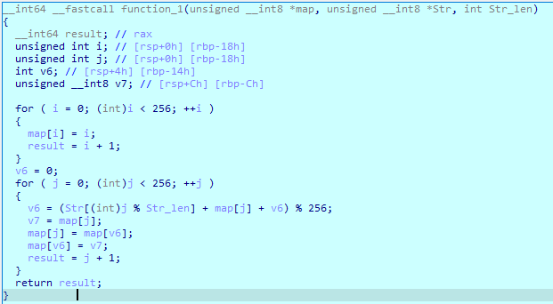

- Làm tương tự với `function_2` ta được như sau.

    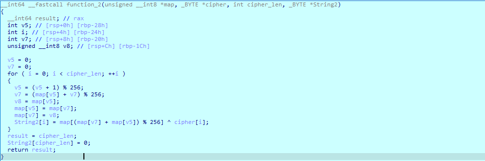

#### Ngồi đoán xem chương trình chạy như thế nào.

- Sau khi chúng ta thực hiện bước đặt lại tên biến và ép kiểu ở trên thì việc đoán cũng có thuận lợi.

- Câu hỏi to lớn nhất đầu tiên trong đầu của tui lúc bấy giờ là chức năng của hàm `function_1` và `function_2` là gì??? (sau khi nghe bạn tui làm được bài này nói thì đây là 2 hàm là `RC4_init` và `RC4_encrypt`). Nhưng câu hỏi tui muốn đặt ra là nếu như tui không biết về `RC4` thì có thể hiểu được chức năng của 2 hàm này không?? (sau đoạn này xin phép đổi lại tên `function_1` thành `RC4_init` và `function_2` thành `RC4_encypt` nhưng ta vẫn chưa biết nhiệm vụ của chúng là gì, nên bây giờ là những suy nghĩ của tui).

- Bắt đầu với `RC4_init`.

    

- Tham số truyền vào hàm `RC4_init` là mảng `map`, chuỗi `Str` (F@**!), và số nguyên `Str_len` (5).

- Thật không khó để ta nhận ra hàm for đầu tiên (dòng 9 - 13) có nhiệm vụ là gán lần lượt giá trị từ `0` đến `255` vào hàm `map` (tui **đoán** là hàm `map` này chắc chứa 255 kí tự trong mã `ASCII`, đúng hay không tui vẫn chưa rõ).

- Tiếp tục với hàm for thứ hai (từ dòng 15 đến 22). Ban đầu giá trị `v6` được tính như sau: `v6 = (Str[j % Str_len] + map[j] + v6) % 256` với `v6` ban đầu được khởi tạo giá trị `0`, từ dòng 18 đến 20 ta thấy nó thực hiện chức năng đổi chỗ của vị trí `map` thứ `v6` và thứ `j` trong mảng `map`. Như vậy đến lúc này tui hiểu là `v6` được xem như là vị trí mới để đổi chỗ cho các phần tử ở vị trí  thứ `i` sau mỗi vòng for.

- Vậy tóm lại với góc nhìn của tui thì hàm `RC4_init` là một hàm đổi chỗ các giá trị trong một mảng có `256` phần từ với các giá trị phần tử lần lượt từ `0` đến `255`, và hàm này là một hàm 'cố định' (tức là hàm sẽ trả về một mảng sau khi đổi chỗ là như nhau nếu tui có thay đổi input như thế nào, vì `Str` là chuỗi cố định ban đầu là `F@**!`).

- Tiếp theo với hàm `RC4_encrypt`.

    

- Tham số truyền vào hàm `RC4_encrypt` là mảng `map`, mảng `cipher`, số nguyên `cipher_len` (27), mảng `String2`.

- Ta thấy `v5` được tính như sau: `v5 = (v5 + 1) % 256` và `v7` được tính như sau: `v7 = (map[v5] + v7) % 256` (trong đó `v5` và `v7` được khởi tạo giá trị `0`, `0` ở ban đầu). Từ dòng 15 đến 17 ta dễ dàng nhận thấy là thực hiện đổi chỗ phần tử thứ `v5` và `v7` trong hàm `map`. Như vậy nhìn sơ qua thì thấy hàm này cũng có nhiệm vụ đổi chỗ các vị trí trong hàm `map`.

- Vòng for này chỉ lặp lại 27 lần, và rùi câu lệnh cuối trong vòng for là để gán giá trị thứ i của `String2` thông qua `map` bằng phép xor, cụ thể `String[i] = map[(map[v7] + map[v5]) % 256] ^ cipher[i]`. Đến đây tui nảy ra một suy nghĩ đó chính là `string2` kia là `flag`, bởi vì hàm for này có mục đích lại đổi chỗ các kí tự trong mảng `map` và nó thực hiện lấy kí tự từ việc `xor` giá trị trong mảng `map` đã xáo kia với một giá trị được khai báo từ ngay đầu bài (cipher).

- Trời ơi, chân ái là đây. Bởi vì từ đầu đến giờ chương trình chưa đụng một cái gì đến `input` nhập vào, và chắc chắn là hàm này cũng là đổi chỗ mảng `map` và lấy kí tự nhét vào `string2`, và đúng theo dòng suy nghĩ của tui thì đây vẫn là một hàm 'cố định' (tức là chương trình chạy đến đây đều trả về một kết quả `String2` và `map` giống nhau trong tất cả trường hợp dù tui nhập input là gì).

- Sau khi ngồi `khám xét` 2 hàm `RC4_init` và `RC4_encrypt` thì ta quay lại với hàm `main`.

    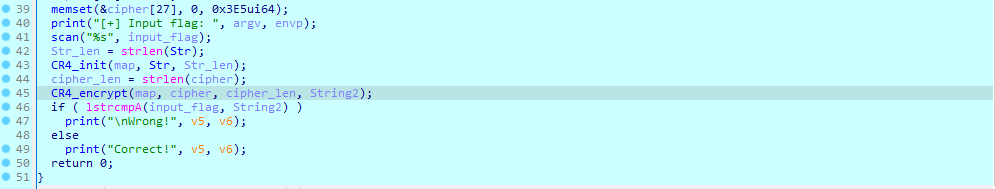

- Như đề cập ở trên thì sau hàm `RC4_encrypt` sẽ là phần trích `String2` mà tui nghi nghi là `flag`, xong ở dưới lại có hàm check với đầu vào của hàm là `input_flag` với `String2`. Mía lúc này tui nghĩ "Thời tới thời tới rùi ae ơi", bắt tay lun vào chạy chương trình đặt breakpoint tại `call cs:lstrcmpA` (dòng 46). Kết quả là:

    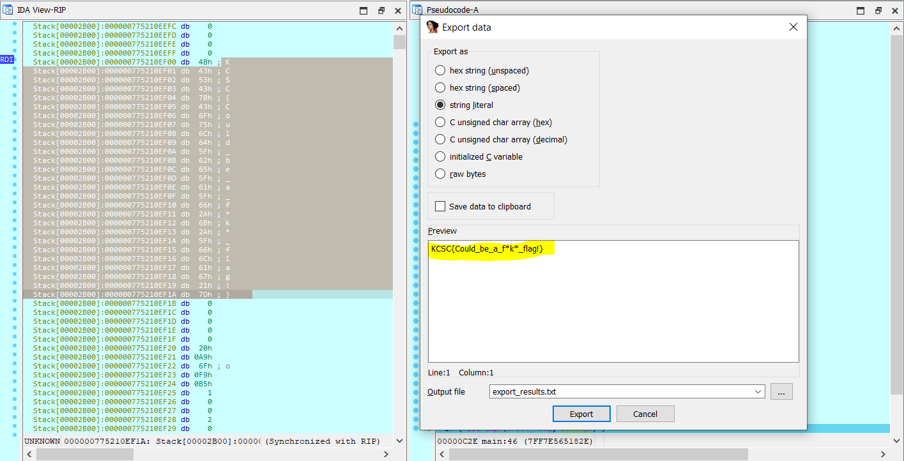

- Ta được flag là `KCSC{Could_be_a_f*k*_flag!}`. Đến lúc này là tui nghĩ "Toang" và "I wonder how, I wonder why". Bởi vì sao, bởi vì như tui nói từ trước, đó chính là từ đầu chương trình đến bây giờ thì tất cả các hàm sẽ *trả về, tráo và trích kí tự **y hệt** nhau* trong tất cả các TH dù tui nhập `input` như thế nào, vậy thì nếu đến đoạn này còn sai thì flag liệu còn nằm ở đâu, where????

- Và đương nhiên là tui cũng đặt một nghi vấn ở cái hàm `lstrcmpA` kia, bởi vì dù tui có để `input` là `String2` thì nó vẫn trả về giá trị `False`, dù tui có đặt chiều dài lớn hơn hay nhỏ hơn chiều dài của `string2` thì nó vẫn trả về `false`, theo phương châm "thà F7 nhầm còn hơn bỏ sót" tui click lun vào hàm đó xem sao, ta sẽ được một kết quả như hình (đã fomat):

    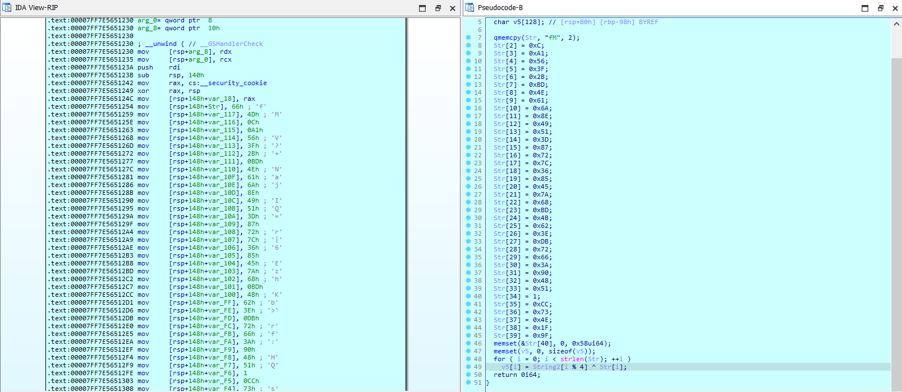

- Nhìn vào hàm này tui thấy nó `return 0i64`, tức là lun return về giá trị `0`. Đọc xong tui thấy là lạ, nếu là hàm thực hiện chức năng so sánh thì có vẻ hơi sai sai. Hoá ra hàm này là một hàm `fake` đặt tên nhằm `Dương Đông Kích Tây`. Đặt 1 dấu `?` ở hàm này. Phân tích hàm này thoai.

- Nhìn ban đầu vào hàm này thấy hàm gán các giá trị vào `Str[]`, xong rùi có một vòng for với 40 lần lặp. Hình như hàm for này là sinh ra flag và đặt trong mảng `v5`. Với `v5[i] = String2[i % 4] ^ Str[i]`, trong đó `Str[i]` là những thứ mà chương trình vừa được gán vào và lấy nó `xor` với lần lượt 4 kí tự đầu tiên trong `String2` (`KCSC`). Đến đây tui đoán chắc (chưa được 100%) flag là sẽ được sinh ở đây, bởi vì tui nghĩ flag mà không nằm ở đây thì chả có thể nằm ở đâu nữa cả. Thực hiện viết source_code và xem nó trả về cái gì:

- Không khó để ta có thể lấy dữ các giá trị của `Str[]` kia

    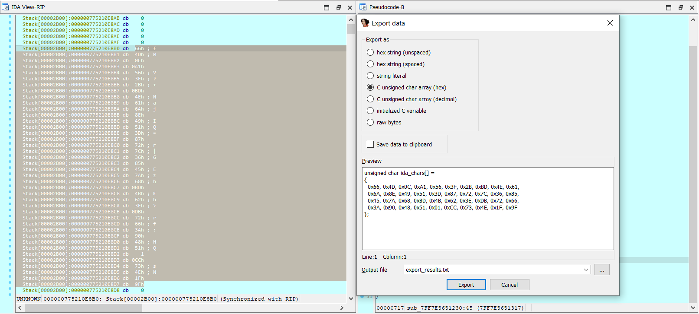

- Viết source_code ta được các giá trị `v5[]` là:
    ```C
    #include<stdio.h>
    #include<math.h>
    #include<string.h>

    int Str[40] =
    {
    0x66, 0x4D, 0x0C, 0xA1, 0x56, 0x3F, 0x2B, 0xBD, 0x4E, 0x61, 
    0x6A, 0x8E, 0x49, 0x51, 0x3D, 0x87, 0x72, 0x7C, 0x36, 0x85, 
    0x45, 0x7A, 0x68, 0xBD, 0x4B, 0x62, 0x3E, 0xDB, 0x72, 0x66, 
    0x3A, 0x90, 0x48, 0x51, 0x01, 0xCC, 0x73, 0x4E, 0x1F, 0x9F
    };

    char String2[100] = "KCSC{Could_be_a_f*k*_flag!}";
    int flag[100];

    int main(){
        for (int i = 0; i < 40; i++){
            flag[i] = String2[i % 4] ^ Str[i];
        }
        for (int i = 0; i < 40; i++){
            printf("0x%x ", flag[i]);
        }
    }
    ```
- In ra ta sẽ được kết quả giống y hết các kết quả được lưu trong máy khi chạy xong hàm:

    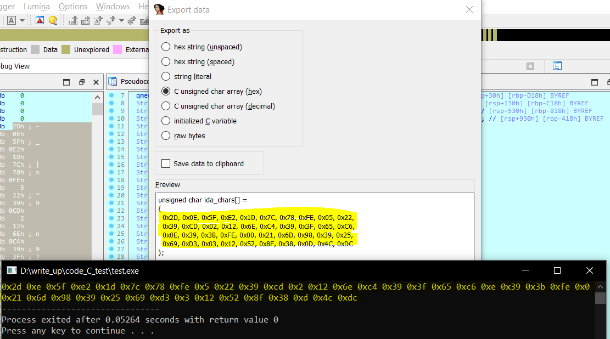

- Tui lại nghĩ: flag đây rùi, không nhầm được, kết quả khi in ra các kí tự là:

    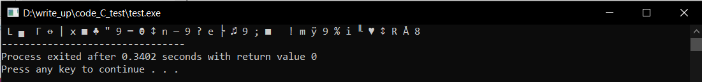

- Đến đây là tui bị choke từ đây đến tận 16h và tui không thể nghĩ xem là mình sai ở đâu được nhỉ, tại vì như tui nghĩ lại một lần nữa thì tất cả các hàm trong chương trình này đều là cố định và tui không tài nào nghĩ được xem flag sinh ra ở đâu????

### Phần suy nghĩ

- Trong khi nghĩ bài này thì tui mới chỉ dừng lại được đến `Phần đọc hiểu` (tức là biết chương trình chạy thế nào) và không tài nào nghĩ được hướng giải quyết của bài toán.

- Có 2 điều tui nghĩ là đúng trong khi tui làm và tui rút ra được sau khi tham khảo bài làm của người solve được bài này:
    
    - Tư duy ngược là cần thiết và việc đoán `flag` được sinh ra ở đâu cũng quan trọng không kém.

    - Chắc chắn `hint` phải có ở trong chương trình (nếu mình có thể hiểu được chương trình chạy như thế nào thì chắc chắn gợi ý nó ở trong chương trình chứ không phải `hint` nằm ở trong đầu người ra đề) và gợi ý sẽ rất là `tự nhiên`.

- Sau khi đoán được `flag` sinh ra ở đó, ta sẽ tư duy ngược xem là việc lấy `flag` diễn ra như thế nào.

    - `flag` được tính như sau: `v5[i] = String2[i % 4] ^ Str[i]`, chúng ta biết form của flag sẽ là `KCSC{...}`, nên kí tự đầu tiên mà `v5[i]` (i từ 0 đến 4) phải là `KCSC{`, nhưng `Str[i]` là một thứ cố định (và `Str[i]` thì các giá trị đầu tiên khác 0 nên `xor` với `String2` chắc chắn sẽ không thể ra KCSC) và `String2` sẽ là cái truyền vào hàm, nên ta sẽ đặt một dấu `?` ở `String2`.

    - Chuyển vấn đề từ `flag` sang `string2`.

- Xem xét `String2` được tạo ra như thế nào?

    - `String2` được tính như sau: `String2[i] = map[(map(v5) + map[v7]) % 256] ^ data_X[i]` trong đó `v5` và `v7` được gán cố định với khởi tạo ban đầu là 0, 0; còn `data_X[i]` là các giá trị cố định (được gán khi chương trình bắt đầu). Vậy vấn đề của `String2` sẽ chuyển thành vấn đề của cái gì, đó chính là vấn đề của `map`, đặt một dấu `?` vào `map`.

    - Chuyển vấn đề từ `String2` sang `map`.

- Xem xét `map` được tạo ra như thế nào?

    - Ta có thể thấy `map` được khởi tạo ban đầu là các số từ 0 đến 255, xong đó sẽ được xáo vị trí thứ i với vị trí map thứ v6. Với v6 được tính như sau `v6 = (map[i] + v6 + Str[i % strlen]) % 256`. Trong đó v6 được gán cố định bằng 0 ban đầu và nó phụ thuộc vào `Str[i]`, nên việc map được đổi vị trí phụ thuộc vào `v6` mà `v6` lại phụ thuộc vào `Str[i]`. 

    - Vậy ta chuyển vấn đề từ `map` sang `Str[i]`.

- Xem xét `Str[i]` ban đầu ta được những cái gì. Và ta thấy ban đầu `Str[i]` là một biến được khai báo ban đầu nhận giá trị là `'F@**!'`. Có vẻ như đây chính là vấn đề từ bài toán bởi vì ta không thể suy ngược Str được tạo như thế nào nữa cả và nó được khai báo trong chương trình rùi.

    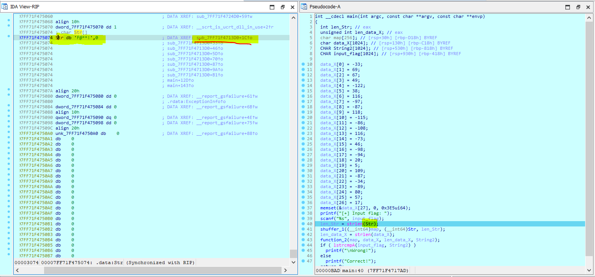

- Nhìn vào `Str db 'F@**!',0` ta thấy phía bên phải chú thích của nó có một thứ khá là lạ đó là `sub_7FF71F4713D0`, vậy nó là cái gì, ta click thử vào xem sao, ta được như hình sau:

    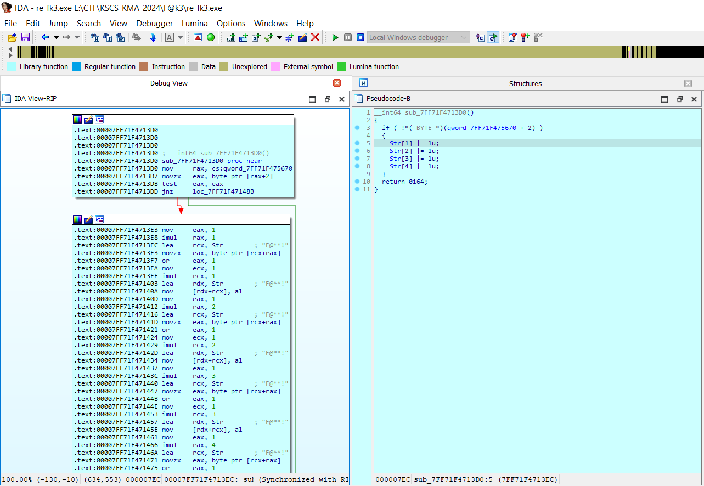

- Đây là một hàm khá là lạ, bởi vì như trong bước 1 thì tui nhớ là mình có phân tích hết từ mã giả kia rùi, chắc là sẽ còn sót lại ở đâu đó, nên chúng ta có thể đặt break_point tại hàm này rùi cố gắng xem nó xuất hiện của bước nào hay nó được gọi ở đâu khi chạy chương trình.

- Khi ta thực hiện đặt break_point thì ta thấy hàm này sẽ được gọi trước khi vào hàm `main`, cụ thể chương trình sẽ nhảy vào hàm này trước rùi mới nhảy vô hàm `main` sau. Như vậy chuỗi `'F@**!'` là một chuỗi đã bị thay đổi trước khi vào hàm `main`, hình như ý đồ của bài toán là thực hiện làm thay đổi một chuỗi ban đầu thành `'F@**'`, chắc vấn đề của `Str` là tại chỗ này.

- Như vậy ngay từ ban đầu là chương trình đã nhảy vào hàm`sub_7FF71F4713D0` rùi. Quan trọng là chương trình được thiết kế để nó không bao giờ nhảy vô được cái khối thực hiện phép `xor`, chỗ này ta chỉ cần `set eax = 0 `ở dòng `test eax, eax` là đươc.

- Sau khi để cho chương trình nhảy vô khối đó xong, ta được Str là `FA++!` thay vì `F@**!` như lúc trước, vậy ta đặt `break_point` tại cuối chương trình trong hàm `lstrcmpA` và thực hiện in ra ta sẽ được như sau:

    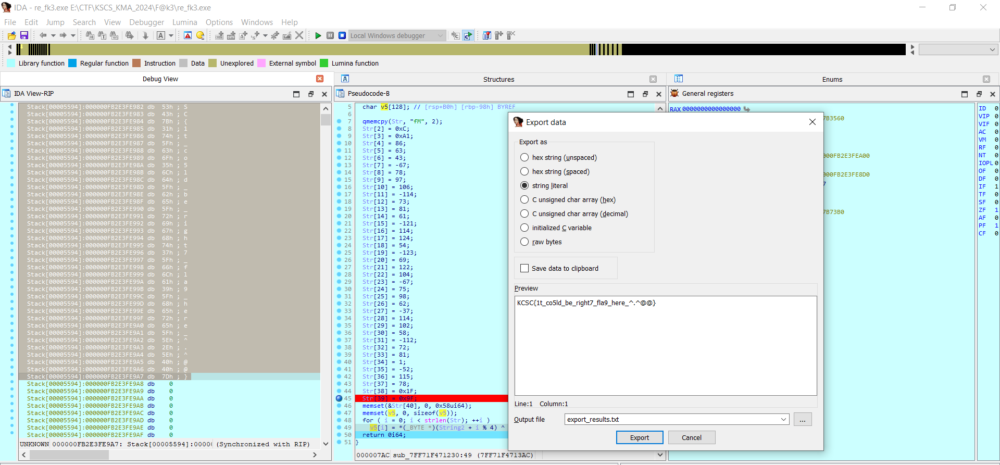

- Flag:

    ```
    KCSC{1t_co5ld_be_right7_fla9_here_^.^@@}
    ```

- Các bạn có thể sử dụng source_code để tìm ra flag:

    ```C
    #include<stdio.h>
    #include<math.h>
    #include<string.h>

    int Str_lstrcmpA[40] =
    {
    0x66, 0x4D, 0x0C, 0xA1, 0x56, 0x3F, 0x2B, 0xBD, 0x4E, 0x61, 
    0x6A, 0x8E, 0x49, 0x51, 0x3D, 0x87, 0x72, 0x7C, 0x36, 0x85, 
    0x45, 0x7A, 0x68, 0xBD, 0x4B, 0x62, 0x3E, 0xDB, 0x72, 0x66, 
    0x3A, 0x90, 0x48, 0x51, 0x01, 0xCC, 0x73, 0x4E, 0x1F, 0x9F
    };

    int cipher[27] =
    {
    0xDF, 0x45, 0x43, 0x31, 0x86, 0x26, 0x74, 0x9F, 0xA9, 0x76, 
    0x8D, 0xAA, 0x94, 0x74, 0xB7, 0x2E, 0x9E, 0xA2, 0x14, 0x05, 
    0x6D, 0xA9, 0xDE, 0xA7, 0x50, 0x39, 0x11
    };

    void xor_Str(char Str[]){
    for (int i = 0; i < 4; i++){
        Str[i] |= 1;
    }
    return;
    }

    void RC4_init(int map[], char Str[]){
    for (int i = 0; i < 256; i++) map[i] = i;
    int pos = 0;
    for (int i = 0; i < 256; i++){
        pos = (map[i] + Str[i % 5] + pos) % 256;
        int tmp = map[i];
        map[i] = map[pos];
        map[pos] = tmp;
    }
    }

    void RC4_encrypt(int map[], int String2[]){
    int pos1 = 0, pos2 = 0;
    for (int i = 0; i < 27; i++){
        pos1 = (pos1 + 1) % 256;
        pos2 = (pos2 + map[pos1]) % 256;
        int tmp = map[pos1];
        map[pos1] = map[pos2];
        map[pos2] = tmp;
        String2[i] = map[(map[pos1] + map[pos2]) % 256] ^ cipher[i];
    }
    String2[27] = 0;
    return;
    }

    void find_flag(int map[], int String2[], int flag[]){
    for (int i = 0; i < 40; i++){
        flag[i] = String2[i % 4] ^ Str_lstrcmpA[i];
    }
    return;
    }

    int main(){
    int map[256];
    char Str[6] = "FA++!";
    int String2[100];
    int flag[100];
    RC4_init(map, Str);
    RC4_encrypt(map, String2);
    find_flag(map, String2, flag);
    for (int i = 0; i < 40; i++) printf("%c", flag[i]); 
    }
    ```

    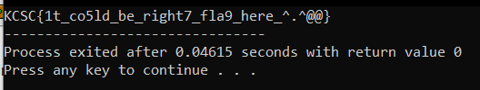

### Lời cảm ơn

Tui muốn gửi lời cảm ơn đến đồng chí Vũ Hải Sơn vì đã dành thời gian và sự hỗ trợ để giúp tui giải quyết bài này.


