# CTF_KMA_1

- Trong giải lần này may mắn mình cũng đã giải được 1 bài trong thời gian thi, còn bài thứ 2 thực sự mình không có ý tưởng gì để nghĩ trong lúc thi và mình chỉ có thể làm được sau khi được gợi ý một số gợi ý từ người bạn của mình thui.

- À tất cả những gì mình viết ở đây chỉ là ý kiến cá nhân của bản thân mình thui.

# 1_SIMPLE_MATH.

- Chall: [FILE](All_Chall/1_Simple_Math.rar).

- Bài này mình tốn khá nhiều thời gian khi làm (5 tiếng ngồi làm). Do mindset của mình chưa được chuẩn cho lắm nên khi làm vẫn còn sự lúng túng và mình mất quá nhiều thời gian trong việc xây lại chương trình để có gì để `brute force` nếu cần nên khi mà mình giải được bài này thì mình nhìn lại thấy những thứ mình làm ở trên cũng không cần thiết cho lắm.

- Ban đầu input chúng ta nhập vào sẽ được thực hiện biến đổi thông qua một vòng lặp với 20 lần ([400/21] = 20), vậy ta có thể đoán lun được là input đầu vào cần có 20 kí tự:

    

    Chúng ta dễ dàng viết lại hàm này, do phần lấy dữ liệu từ những biến được khai báo trước của tui khá là chậm nên đến đoạn này tui xử lý có hơi lúng túng và mất thời gian.

    Ví dụ như muốn lấy data như sau:

    

    Ta thấy `data_x2` bắt đầu từ địa chỉ `000000BAE999F250` và có 20 giá trị `data_x2`, mỗi phần tử của mảng `data_x2` chứa 4 byte vậy nên địa chỉ kết thức là: 0x000000BAE999F250 + 4 * 0x14 - 1= `000000BAE999F29F`.

    Ta sẽ thực hiện viết scrip để lấy giá trị. Vào `File` -> `Scrip Command`, đổi script sang python, dán code bên dưới vào:

    ```python
    import idaapi
    import idautils
    import idc

    start_addr = 0x000000BAE999F250
    end_addr = 0x000000BAE999F29F
    values = []

    for addr in range(start_addr, end_addr + 1):
        value = idc.get_wide_byte(addr)     # Đọc giá trị byte tại địa chỉ `addr`
        values.append(value)                # Thêm giá trị vào danh sách
    print(values)

    f = open('z_file.txt', 'w')
    for i in range(len(values)):
        if i % 10 == 9: f.write(f"0x{values[i]:02x},\n")
        else: f.write(f"0x{values[i]:02x}, ")
    f.close()
    print("OK")
    ```

    Từ đó ta dễ dàng nhặt được data và có thể gói gọn như như sau:

    ```python
    data_x2 = [
        0x29d3a7, 0x2ad5ab, 0x3870e1, 0x32e5cb, 0x3972e5, 0x2fdfbf, 0x32e5cb, 0x1a3468, 0x39f3e7, 0x3cf9f3,
        0x2fdfbf, 0x26cd9b, 0x3264c9, 0x1ab56a, 0x2fdfbf, 0x21c387, 0x2952a5, 0x1a3468, 0x21c387, 0x25cb97
    ]

    data_x1 = [
        0x3162c5, 0x30e1c3, 0x376edd, 0x2fdfbf, 0x3264c9, 0x30e1c3, 0x2fdfbf, 0x3162c5, 0x34e9d3, 0x2fdfbf,
        0x366cd9, 0x3af5eb, 0x30e1c3, 0x10a142, 0x10a142, 0x10a142, 0x10a142, 0x10a142, 0x10a142, 0x10a142
    ]
    ```

    Nếu bạn muốn biết mình nhặt như thế nào thì download file `.md` này xuống vì nó sẽ hiện trong file nhưng dưới dạng comment, mình sẽ ko dài dòng tại những chỗ như thế này.

<!-- ```python
data_x1 = [
    0xa7, 0xd3, 0x29, 0x00, 0xab, 0xd5, 0x2a, 0x00, 0xe1, 0x70,
    0x38, 0x00, 0xcb, 0xe5, 0x32, 0x00, 0xe5, 0x72, 0x39, 0x00,
    0xbf, 0xdf, 0x2f, 0x00, 0xcb, 0xe5, 0x32, 0x00, 0x68, 0x34,
    0x1a, 0x00, 0xe7, 0xf3, 0x39, 0x00, 0xf3, 0xf9, 0x3c, 0x00,
    0xbf, 0xdf, 0x2f, 0x00, 0x9b, 0xcd, 0x26, 0x00, 0xc9, 0x64,
    0x32, 0x00, 0x6a, 0xb5, 0x1a, 0x00, 0xbf, 0xdf, 0x2f, 0x00,
    0x87, 0xc3, 0x21, 0x00, 0xa5, 0x52, 0x29, 0x00, 0x68, 0x34,
    0x1a, 0x00, 0x87, 0xc3, 0x21, 0x00, 0x97, 0xcb, 0x25, 0x00
]

byte = bytes(data_x1)

f = open('tung', 'wb')
f.write(byte)
f.close()
ans = []
f = open('tung', 'rb')
byte = f.read(4)
while byte:
    tmp = int.from_bytes(byte, 'little')
    ans.append(tmp)
    byte = f.read(4)

for i in range(len(ans)):
    if i % 10 == 9: print(f'0x{ans[i]:06x}', end = ',\n')
    else: print(f'0x{ans[i]:06x}', end = ', ')
``` -->

- Như vậy ta có thể viết lại hàm dùng để biến đổi input đầu vào của chúng ta như sau:

    ```python
    data_x2 = [
        0x29d3a7, 0x2ad5ab, 0x3870e1, 0x32e5cb, 0x3972e5, 0x2fdfbf, 0x32e5cb, 0x1a3468, 0x39f3e7, 0x3cf9f3,
        0x2fdfbf, 0x26cd9b, 0x3264c9, 0x1ab56a, 0x2fdfbf, 0x21c387, 0x2952a5, 0x1a3468, 0x21c387, 0x25cb97
    ]

    data_x1 = [
        0x3162c5, 0x30e1c3, 0x376edd, 0x2fdfbf, 0x3264c9, 0x30e1c3, 0x2fdfbf, 0x3162c5, 0x34e9d3, 0x2fdfbf,
        0x366cd9, 0x3af5eb, 0x30e1c3, 0x10a142, 0x10a142, 0x10a142, 0x10a142, 0x10a142, 0x10a142, 0x10a142
    ]

    map = [
        0x00, 0x27, 0x0a, 0x18, 0x15, 0x08, 0x1e, 0x26, 0x0f, 0x05,
        0x08, 0x0f, 0x0a, 0x18, 0x07, 0x10, 0x14, 0x11, 0x08, 0x05,
        0x18, 0x01, 0x1d, 0x0f, 0x09, 0x19, 0x28, 0x16, 0x26, 0x02,
        0x05, 0x1b, 0x0e, 0x12, 0x26, 0x26, 0x11, 0x06, 0x20, 0x04,
        0x1a, 0x17, 0x02, 0x0c, 0x11, 0x01, 0x14, 0x0c, 0x25, 0x1a,
        0x25, 0x1c, 0x03, 0x0e, 0x04, 0x21, 0x0c, 0x18, 0x09, 0x24,
        0x17, 0x1a, 0x20, 0x03, 0x27, 0x08, 0x0e, 0x11, 0x18, 0x04,
        0x18, 0x11, 0x1e, 0x04, 0x10, 0x05, 0x0c, 0x0d, 0x0d, 0x08,
        0x03, 0x0f, 0x0e, 0x17, 0x04, 0x17, 0x1e, 0x07, 0x1c, 0x15,
        0x23, 0x00, 0x0d, 0x1e, 0x11, 0x11, 0x25, 0x27, 0x0a, 0x20,
        0x10, 0x21, 0x21, 0x0c, 0x00, 0x05, 0x1a, 0x18, 0x03, 0x1c,
        0x0c, 0x21, 0x1d, 0x28, 0x11, 0x10, 0x1c, 0x28, 0x06, 0x00,
        0x20, 0x22, 0x15, 0x1d, 0x26, 0x09, 0x06, 0x00, 0x23, 0x06,
        0x1d, 0x02, 0x01, 0x02, 0x28, 0x09, 0x1a, 0x00, 0x10, 0x16,
        0x08, 0x0c, 0x1c, 0x01, 0x1a, 0x27, 0x02, 0x07, 0x03, 0x19,
        0x27, 0x1b, 0x15, 0x11, 0x1f, 0x0c, 0x26, 0x07, 0x16, 0x1a,
        0x05, 0x03, 0x24, 0x17, 0x28, 0x06, 0x07, 0x20, 0x08, 0x0d,
        0x12, 0x10, 0x21, 0x11, 0x0c, 0x15, 0x23, 0x1a, 0x0a, 0x21,
        0x13, 0x0c, 0x11, 0x09, 0x1b, 0x13, 0x0b, 0x1e, 0x15, 0x09,
        0x02, 0x1f, 0x0d, 0x03, 0x15, 0x1c, 0x25, 0x28, 0x16, 0x04,
        0x17, 0x26, 0x02, 0x15, 0x12, 0x1e, 0x07, 0x0a, 0x1d, 0x09,
        0x0a, 0x0a, 0x15, 0x1e, 0x0a, 0x04, 0x02, 0x0e, 0x1e, 0x04,
        0x1d, 0x1b, 0x15, 0x18, 0x20, 0x21, 0x1b, 0x0b, 0x0d, 0x1c,
        0x03, 0x0b, 0x19, 0x13, 0x09, 0x15, 0x0a, 0x1d, 0x1f, 0x0c,
        0x10, 0x20, 0x1d, 0x27, 0x26, 0x28, 0x12, 0x1f, 0x27, 0x01,
        0x23, 0x00, 0x0c, 0x25, 0x00, 0x05, 0x02, 0x01, 0x1d, 0x0d,
        0x26, 0x25, 0x15, 0x17, 0x16, 0x08, 0x05, 0x24, 0x04, 0x15,
        0x16, 0x26, 0x24, 0x0d, 0x11, 0x05, 0x1d, 0x01, 0x09, 0x19,
        0x16, 0x17, 0x07, 0x0b, 0x16, 0x03, 0x1b, 0x0e, 0x12, 0x27,
        0x05, 0x25, 0x21, 0x1d, 0x0e, 0x1d, 0x0a, 0x1e, 0x25, 0x28,
        0x1d, 0x13, 0x1f, 0x25, 0x14, 0x12, 0x0e, 0x18, 0x19, 0x25,
        0x04, 0x11, 0x1e, 0x04, 0x27, 0x0f, 0x28, 0x05, 0x22, 0x19,
        0x09, 0x28, 0x28, 0x0d, 0x09, 0x03, 0x15, 0x24, 0x09, 0x0c,
        0x05, 0x0a, 0x16, 0x14, 0x06, 0x04, 0x10, 0x27, 0x22, 0x1d,
        0x14, 0x12, 0x13, 0x05, 0x17, 0x16, 0x09, 0x24, 0x1e, 0x1e,
        0x06, 0x25, 0x00, 0x02, 0x0f, 0x0f, 0x0a, 0x11, 0x06, 0x24,
        0x02, 0x22, 0x0b, 0x02, 0x27, 0x0b, 0x1c, 0x16, 0x25, 0x1e,
        0x13, 0x18, 0x05, 0x0e, 0x1b, 0x0d, 0x0c, 0x04, 0x12, 0x28,
        0x25, 0x05, 0x0f, 0x1c, 0x04, 0x0f, 0x0b, 0x19, 0x08, 0x23,
        0x20, 0x0c, 0x01, 0x12, 0x06, 0x07, 0x08, 0x28, 0x23, 0x13
    ]

    input_flag = [
        0x74, 0x75, 0x6e, 0x67, 0x64, 0x65, 0x70, 0x74, 0x72, 0x61, 
        0x69, 0x63, 0x6f, 0x6d, 0x6f, 0x74, 0x6b, 0x68, 0x6f, 0x6e
    ]   # tungdeptraicomotkhon
    ans = []
    for i in range(0, 400, 21):
        if input_flag[0] == 69:
            v14 = 127 * data_x1[map[i]]
            v15 = (input_flag[map[i]] + v14) >> 22
            ans.append(v15)
        else:
            v16 = 127 * data_x2[map[i]]
            v17 = (input_flag[map[i]] + v16) >> 22
            ans.append(v17)

    for i in ans: print(end = chr(i))
    # SUpeq_e4sx_Md5_CR4CK
    ```

- Như vậy đến đây ta có thể đoán được nó chắc là mã hóa `MD5`, nhưng bài này thú vị ở chỗ kể cả mình có nhập một chuỗi bất kì đi chăng nữa thì phần biến đổi input đầu vào lun hiện ra với cái đuôi là `_CR4CK`, thi thoảng thì nó sẽ xuất hiện `Md4` chắc để lừa. Vậy chúng ta tiếp tục.

- Tiếp theo có một hàm `anti_debug` check xem có phải là đang debug hay không, tui thực hiện `set IP` để có pass qua:

    

- Ở trên check debug xong thì chương trình ở dưới thì check thêm phát nữa, nếu không debug thì giá trị mảng `v22` được thay đổi bằng các giá trị mảng `v23`, còn không thì giữ nguyên.

    

    Thực ra các giá trị của mảng `v22` hoặc `v23` tui đoán là để mã hóa `md5`, tại nó là những giá trị cố định xong ở bên dưới nó cũng dùng trong quá trình mã hóa `md5`.

- Phần tiếp theo của chương trình:

    

    Ở phần này sẽ thực hiện tách 4 kí tự một của phần **biến đổi input ở trên** rùi thực hiện mã hóa MD5 xong lưu vào biến `md5_input`, rùi vòng for để lấy ra phần flag đã mã hóa `md5`, sau đó thực kiện check giá trị `md5_input` với giá trị `flag_en`, nếu không giống sẽ thực hiện in ra `Something unto death` ra thoát chương trình. Vậy việc của chúng ta chỉ đơn giản là ngồi thay đổi cờ và lấy hết các giá trị của `flag_en` thui. Khi lấy được ta sẽ được như sau:

    ```txt
    09d15b9f2464cf02284a7e1abdb1fd17    SUpe
    e7c50ea784c33f4c9af6c10884f432b1    r_e4
    1b8910d2945628d17722ba4172fe6dc8    sy_M
    1beeee88127bbfaffbedea161d825230    d5_C
    cb1ca008224675a7158b0ee3fd3ee08c    R4CK
    ```

- Ukm đến lúc này thì tui thực hiện tìm web để decode MD5 thoai, 2 chữ `sy_M` và `d5_C` khá là khó tìm vậy nếu mà không tìm được web decode lại thì đến đây chắc tui cũng hoang mang. Trang web đó ở [đây](https://hashes.com/en/decrypt/hash).

- Sau khi ghép lại ta được: `SUper_e4sy_Md5_CR4CK`.

- Flag: 

    ```txt
    KMACTF{SUper_e4sy_Md5_CR4CK}
    ```

- **NOTE:** quên mất đóa chính là do lúc nãy tui thực hiện `setIP` chỗ `anti_debug` nên mới ra chuỗi `SUper_e4sy_Md5_CR4CK`, còn nếu không thực hiện `setIP` chỗ nó thì chuỗi ta thu được sẽ là: `ban_da_bi_lua!!!!!!!`.

    - Sau khi tìm ra được flag thì mình đúng kiểu: "ơ thế việc mình build lại một số hàm của chương trình làm cái gì nhỉ", chính điều đóa đã khiến cho mình làm bài này mất rất nhiều thời gian.

# 2_PUSH_WINDOW_POP_NOTHING.

- Chall: [FILE](All_Chall/2_Push_Window_Pop_Nothing.rar).

- Hãy thử debug ở chế độ `Local`, bạn sẽ được gặp ông `kẹ`.

    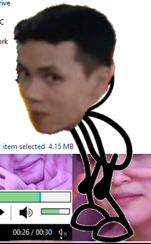

- Nếu bạn dùng IDA debug mà nó xuất hiện như sau:

    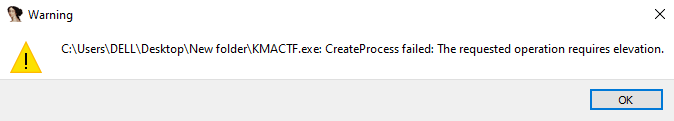

    Cách xử lý là chạy IDA với quyền `administrator`.

    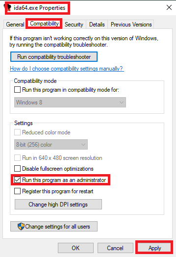

- Bây giờ ta cùng đi tìm hàm chính giúp ta kiểm tra input:

    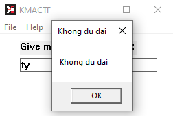

    Với màn hình hiện `Khong du dai` thì ta có thể tìm được cái hàm kiểm trai dạo đầu của input bằng `alt + I`.

    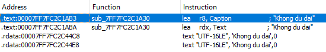

    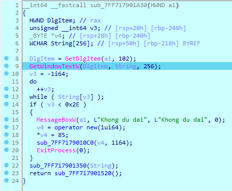

- Với bài này thì tui có một suy nghĩ lệch đóa chính là cứ đinh ninh hàm check_flag phải ở đâu đóa trong chương trình nên khi ngồi làm bài này tui ngồi mò hết tất cả các hàm và vẫn không thấy, đến lúc đó trong phòng thi là tui rất là bí rùi. Nên trong thời gian thi thì với bài này tui dừng lại ở đây. 

- Sau khi được bạn gợi ý thì đúng là chương trình này không có hàm `check` thật, nó sử dụng `pipe` để truyền dữ liệu giữa 2 tiến trình độc lập.

- Bài này nó resolve ra 1 `checker` khác, rùi gửi input từ chall gốc thông qua pipe đến `checker`, để `checker` xử lý, xong gửi lại thông báo `correct/incorrect` đến chall gốc thông qua `pipe`, đó là lý dó tại sao chúng ta không tìm được hàm check ở file thực thi chính.

- Uhmmm, vậy chúng ta bắt đầu đi tìm đi tìm chương trình `checker` vậy. Ssau khi lục tung những hàm ở IDA thì tui có nhận thấy một hàm có vẻ như có nhiệm vụ phát sinh ra một chương trình.

    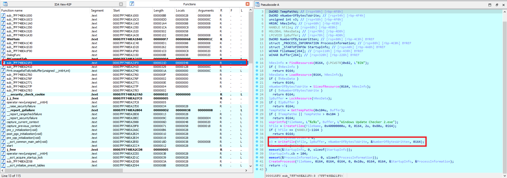

    Thực hiện đặt break-point để xem nơi được lưu của chương trình đóa thì ta thấy như sau: `C:\Users\DELL\AppData\Local\Temp\Windows Update Checker 2.exe`.

    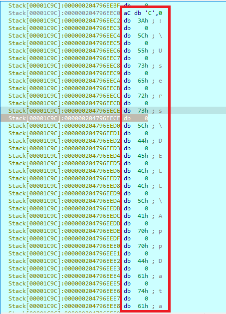

    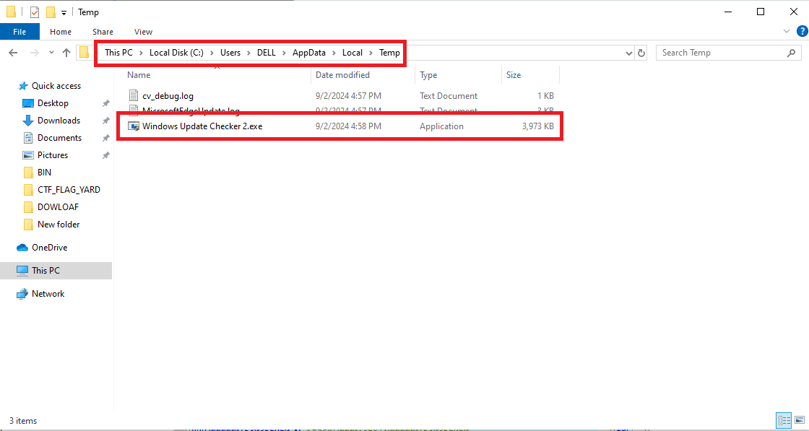

- Oce, sau khi biết được `checker` ở đây rùi thì chúng ta tìm cách `debug` 2 kiểu gì để có thể nhìn thấy chương trình gửi dữ liệu cộng với gửi thông báo thông qua `pipe` đây, đến đoạn này mình mất tận **1 ngày hơn** để có thể mò được cách `debug` đan xen 2 chương trình cùng một lúc (khóc rất nhiều). 

- Trước khi mình nói về cách chia sẻ debug thì chúng ta xem qua một chút về file `Windows Update Checker 2.exe`, thì trong file có 3 phần (mã hóa base64, biến đổi kí tự, và check mã hóa).

    - Mã hóa base64:

        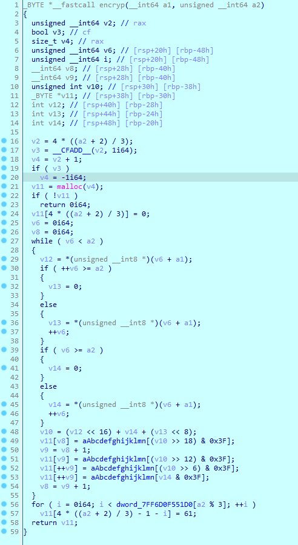

    - Biến đổi kí tự theo thứ tự có sắn trong mảng `_case`:

        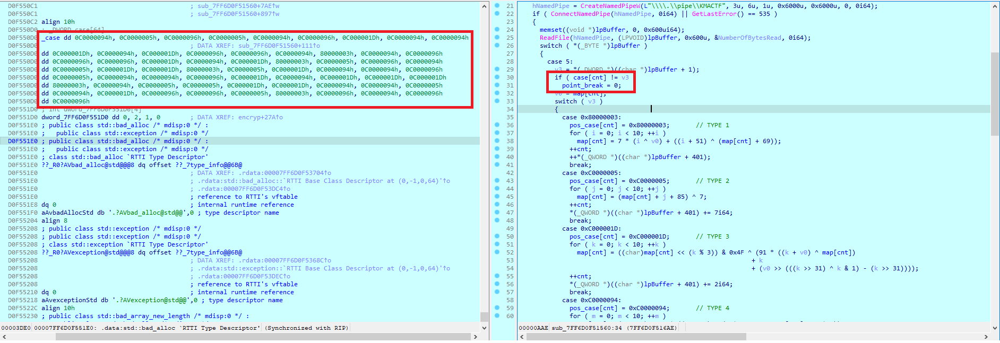

        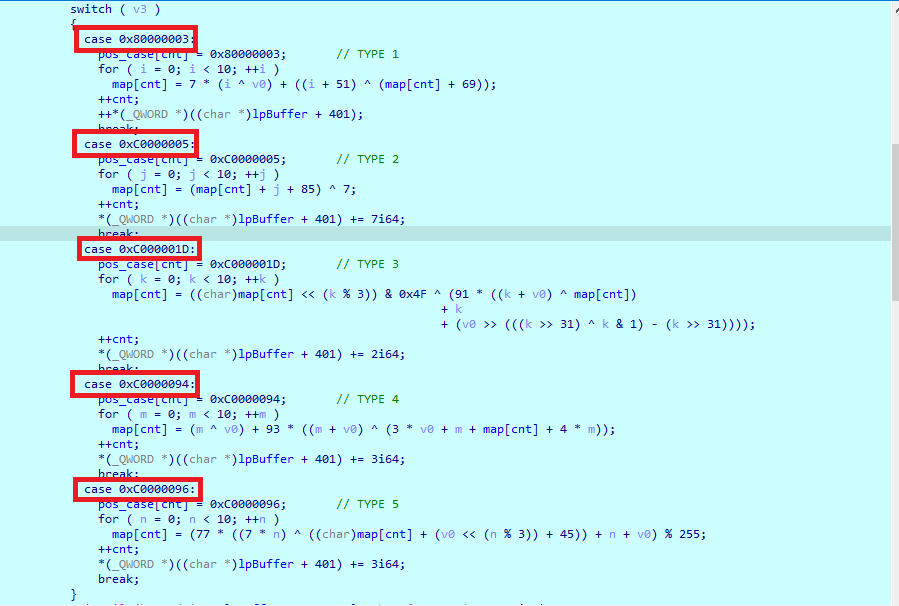

    - Check:

        

- Tiếp theo chúng ta đến với cách để có thể debug 2 chương trình cùng một lúc khi mà chương trình có sử dụng `pipe` (cách này là mình tự mò ra nên nó có đúng hay không thì mình không rõ nhưng nó giúp mình có thể làm được bài này):

    Trước hết mình thực hiện xem những hàm nào có thể có sử dụng pipe để truyền dữ liệu (sau một hồi vô xem thì mình có đặt `break_point` như trên):

    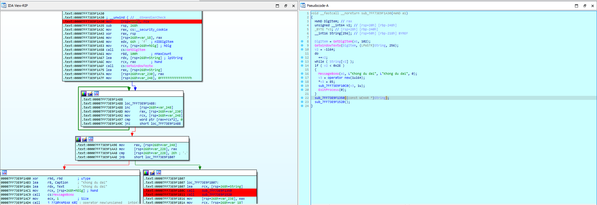

    Sau khi mình nhấn F9 thì nó nhảy đến câu lệnh `call sub_7FF73E9F1350`, mình nhấn F9 một lần nữa thì nó chưa nhảy đến câu lệnh `call    sub_7FF73E9F1520` ở dưới lun mà nó bị chững lại một lúc.

    Đến lúc này nó tui quay lại debug file `checker2.exe` thì nó cho thầy phần kết nối pipe thành công, như vậy chúng ta đã có thể tiến hành debug:

    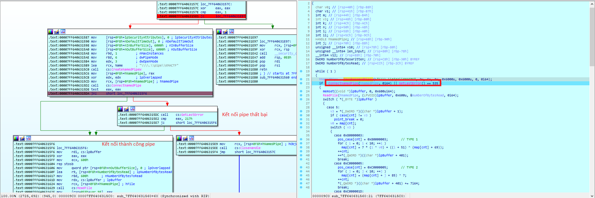

    Chú ý thao tác phải đúng thứ tự (tức là `F9` ở file `KMACTF.exe`, đợi chững lại rùi mới quay sang debug file `checker2.exe`), nếu mà bạn thực hiện debug `checker2.exe` trước thì nó sẽ không bao giờ có thể kết nối pipe dù bạn có xóa đi tải lại, để khắc phục điều đóa bạn chỉ có thể chạy một lượt chương trình `KMACTF.exe` rùi restart lại máy thoai.

    Nếu chạy thành công thì chương trình `KMACTF.exe` sẽ xuất hiện màu cam nhấp nháy để thông báo rằng đã nhảy đến câu tiếp theo và đã nhận được giá trị thông qua pipe như các bạn thấy dưới đây:

    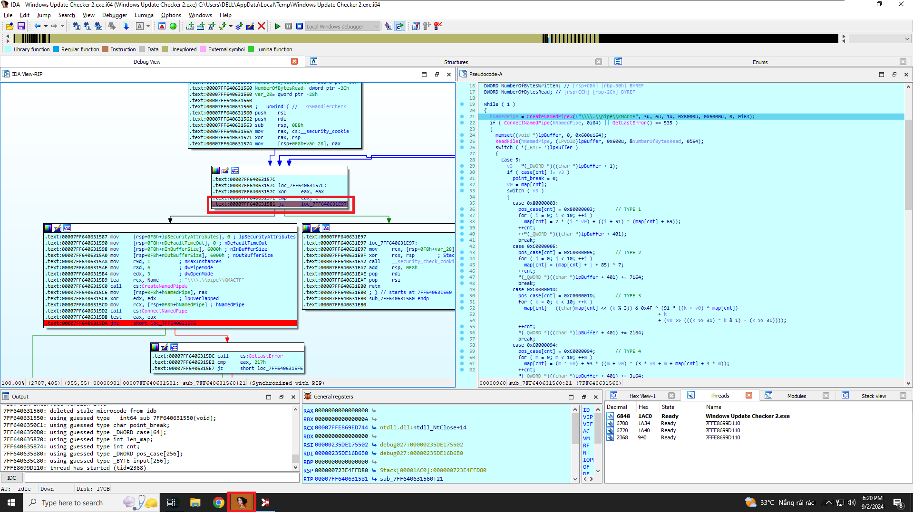

    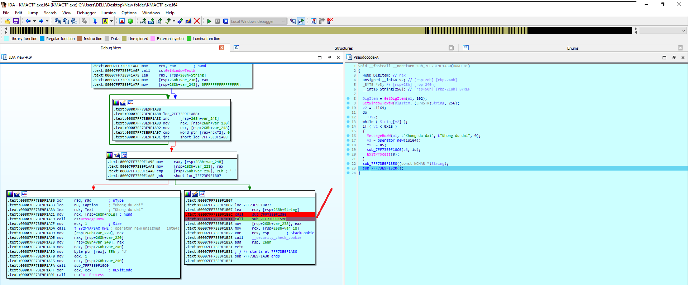

    Tóm lại debug file `checker2.exe` cẩn thận từng bước một nhận ra khi nào một lần gửi dữ liệu thông qua pipe thì nó có dấu hiệu kết thúc là file KMACTF.exe sẽ nhấp nháy màu cam, nên vừa dựa vào đó để có thể debug. Mình đã tốn khá nhiều thời gian để có thể debug 2 chương trình thông qua pipe.

- Sau khi biết cách debug chương trình trên thì mình lại gặp một vấn đề khi build lại chương trình này để có thể brute force nếu cần, đó chính là nội dung của case biến đổi kí tự đó chính là `movsx eax, byte ptr [rcx+rax]`.

    Lệnh `movsx eax, byte ptr [rcx+rax]` thực hiện việc sao chép một giá trị từ bộ nhớ vào thanh ghi eax với việc mở rộng dấu (sign-extension). Điều này có nghĩa là nếu giá trị được sao chép là một giá trị âm (trong phạm vi byte, tức là 8-bit), nó sẽ được mở rộng thành một số âm trong thanh ghi 32-bit eax.

    Nếu giá trị byte tại địa chỉ `[rcx+rax]` là một số dương (bit cao nhất là 0), `eax` sẽ chứa giá trị đó, với các bit cao hơn của `eax` (24 bit cao nhất) được điền bằng 0. Ví dụ giá trị của địa chỉ đóa là `0x7F` (**0**111 1111) thì bit cao nhất là 0 nên khi mở rộng nó sẽ là số dương là 0x7F.

    Nếu giá trị byte là một số âm (bit cao nhất là 1), `eax` sẽ chứa giá trị âm tương ứng sau khi mở rộng dấu, với các bit cao hơn của `eax` được điền bằng 1. Ví dụ giá trị của địa chỉ đóa là `0x9F` (**1**001 1111) thì bit cao nhất là 1 nên khi mở rộng nó sẽ có giá trị là 0xFFFFFF9F và là số âm.

- Sau khi biết được điều đó thì mình có thực hiện brute force luôn, vì mình cũng biết thứ tự biến đổi của từng kí tự rùi, và mình cũng biến kí tự đó có thể là những giá trị nào rùi nên viết khá là dễ (một phần thì mã giả gen cho cũng khá dễ nhìn):

    ```python
    from itertools import product
    import base64

    check_flag = [
        0x72, 0xBB, 0xB2, 0xCD, 0x58, 0xB2, 0x81, 0x0E, 0xA4, 0xB1, 
        0xED, 0xDB, 0x84, 0xB2, 0xC0, 0xAA, 0x60, 0xD0, 0xE8, 0xE8, 
        0xB0, 0x12, 0x81, 0x1E, 0xED, 0xD0, 0xF3, 0x05, 0xB0, 0xB1, 
        0x04, 0x04, 0x7D, 0xF3, 0xC0, 0xE8, 0xED, 0x12, 0xF3, 0xC2, 
        0x7D, 0x0E, 0x0E, 0x0E, 0x7D, 0x04, 0xC0, 0xBB, 0xED, 0xB1, 
        0x81, 0xED, 0xA4, 0xCF, 0xC0, 0x68, 0x84, 0xD0, 0xE2, 0x1B, 
        0xC2, 0x58, 0x30, 0x30
    ] 

    chr_ = [
        0x41, 0x42, 0x43, 0x44, 0x45, 0x46, 0x47, 0x48, 0x49, 0x4A, 
        0x4B, 0x4C, 0x4D, 0x4E, 0x4F, 0x50, 0x51, 0x52, 0x53, 0x54, 
        0x55, 0x56, 0x57, 0x58, 0x59, 0x5A, 0x61, 0x62, 0x63, 0x64, 
        0x65, 0x66, 0x67, 0x68, 0x69, 0x6A, 0x6B, 0x6C, 0x6D, 0x6E, 
        0x6F, 0x70, 0x71, 0x72, 0x73, 0x74, 0x75, 0x76, 0x77, 0x78, 
        0x79, 0x7A, 0x30, 0x31, 0x32, 0x33, 0x34, 0x35, 0x36, 0x37, 
        0x38, 0x39, 0x2B, 0x2F
    ]   # ABCDEFGHIJKLMNOPQRSTUVWXYZabcdefghijklmnopqrstuvwxyz0123456789+/


    case = [
        0x04, 0x02, 0x05, 0x02, 0x04, 0x05, 0x03, 0x04, 0x04, 0x03,
        0x04, 0x03, 0x05, 0x05, 0x04, 0x01, 0x04, 0x05, 0x05, 0x05,
        0x03, 0x04, 0x03, 0x01, 0x02, 0x05, 0x04, 0x02, 0x03, 0x03,
        0x01, 0x02, 0x03, 0x04, 0x04, 0x05, 0x02, 0x04, 0x04, 0x05,
        0x03, 0x04, 0x03, 0x03, 0x03, 0x01, 0x04, 0x02, 0x02, 0x03,
        0x03, 0x04, 0x04, 0x02, 0x04, 0x03, 0x05, 0x05, 0x02, 0x01,
        0x05, 0x04, 0x05, 0x05
    ]

    def type1(arr, v0, count):
        for i in range(10):
            if arr[count] & 0x80:
                tmp = 0xFFFFFF00 | arr[count]
                arr[count] = (tmp - 0x100000000)
            arr[count] = (7 * (i ^ v0) + ((i + 51) ^ (arr[count] + 69))) & 0xff

    def type2(arr, v0, count):
        for i in range(10):
            if arr[count] & 0x80:
                tmp = 0xFFFFFF00 | arr[count]
                arr[count] = (tmp - 0x100000000)
            arr[count] = ((arr[count] + i + 85) ^ 7) & 0xff

    def type3(arr, v0, count):
        for i in range(10):
            if arr[count] & 0x80:
                tmp = 0xFFFFFF00 | arr[count]
                arr[count] = (tmp - 0x100000000)
            arr[count] = ((arr[count] << (i % 3)) & 0x4F ^ (91 * ((i + v0) ^ arr[count]) + i + (v0 >> (((i >> 31) ^ i & 1) - (i >> 31))))) & 0xff

    def type4(arr, v0, count):
        for i in range(10):
            if arr[count] & 0x80:
                tmp = 0xFFFFFF00 | arr[count]
                arr[count] = (tmp - 0x100000000)
            arr[count] = ((i ^ v0) + 93 * ((i + v0) ^ (3 * v0 + i + arr[count] + 4 * i))) & 0xff

    def type5(arr, v0, count):
        for i in range(10):
            if arr[count] & 0x80:
                tmp = 0xFFFFFF00 | arr[count]
                arr[count] = (tmp - 0x100000000)
            arr[count] = ((77 * ((7 * i) ^ (arr[count] + (v0 << (i % 3)) + 45)) + i + v0) % 255) & 0xff

    if __name__ == '__main__':
        ans = []
        for i in range(64):
            find = []
            if case[i] == 1:
                for j in chr_:
                    find2 = [j]
                    type1(find2, find2[0], 0)
                    if find2[0] == check_flag[i]: find.append(j)
            if case[i] == 2:
                for j in chr_:
                    find2 = [j]
                    type2(find2, find2[0], 0)
                    if find2[0] == check_flag[i]: find.append(j)
            if case[i] == 3:
                for j in chr_:
                    find2 = [j]
                    type3(find2, find2[0], 0)
                    if find2[0] == check_flag[i]: find.append(j)
            if case[i] == 4:
                for j in chr_:
                    find2 = [j]
                    type4(find2, find2[0], 0)
                    if find2[0] == check_flag[i]: find.append(j)
            if case[i] == 5:
                for j in chr_:
                    find2 = [j]
                    type5(find2, find2[0], 0)
                    if find2[0] == check_flag[i]: find.append(j)
            ans.append(find)

        ans[len(ans) - 1][0] = 0x3D
        ans[len(ans) - 2][0] = 0x3D
    ```

- Khi mình vét cạn thì mình thấy có những chỗ mà nó có thể nhận được 2 giá trị:

    

    Thôi lại ngồi vét hết tất cả các tổ hợp có thể rùi decode `base64` thui:

    ```python
    from itertools import product
    import base64

    ans = [[83], [48], [49], [66], [81], [49], [82], [71], [101], [50], [104], [118], [100], [49], [57], [116], [89], [87, 118], [53], [53], [88], [51], [82], [112], [98], [87, 118], [86], [122], [88], [50], [70], [121], [90], [86], [57], [53], [98], [51], [86], [102], [90], [71], [99, 108], [99, 108], [90], [70], [57], [48], [98], [50], [82], [104], [101], [84], [57], [111], [100], [87, 118], [103], [47], [102], [81], [61], [61]]

    combinations = list(product(*ans))

    for comb in combinations:
        str = ''.join([chr(value) for value in comb])
        decoded_bytes = base64.b64decode(str)
        decoded_str = decoded_bytes.decode('utf-8', errors='ignore')
        print(decoded_str)
    ```

    Ta sẽ được `output` như sau, chọn cái nào hợp lý nhất thoai, nếu không thì thử từng TH chăc cũng không sao đâu:

    ```py
    KMACTF{how_many_times_are_you_dg∟d_today?huh?}
    KMACTF{how_many_times_are_you_dg∟d_today?hv?} 
    KMACTF{how_many_times_are_you_dg%d_today?huh?}
    KMACTF{how_many_times_are_you_dg%d_today?hv?}
    KMACTF{how_many_times_are_you_di\d_today?huh?}
    KMACTF{how_many_times_are_you_di\d_today?hv?}
    #KMACTF{how_many_times_are_you_died_today?huh?}
    KMACTF{how_many_times_are_you_died_today?hv?}
    KMACTF{how_many_tins_are_you_dg∟d_today?huh?}
    KMACTF{how_many_tins_are_you_dg∟d_today?hv?}
    KMACTF{how_many_tins_are_you_dg%d_today?huh?}
    KMACTF{how_many_tins_are_you_dg%d_today?hv?}
    KMACTF{how_many_tins_are_you_di\d_today?huh?}
    KMACTF{how_many_tins_are_you_di\d_today?hv?}
    KMACTF{how_many_tins_are_you_died_today?huh?}
    KMACTF{how_many_tins_are_you_died_today?hv?}
    KMACTF{how_mby_times_are_you_dg∟d_today?huh?}
    KMACTF{how_mby_times_are_you_dg∟d_today?hv?}
    KMACTF{how_mby_times_are_you_dg%d_today?huh?}
    KMACTF{how_mby_times_are_you_dg%d_today?hv?}
    KMACTF{how_mby_times_are_you_di\d_today?huh?}
    KMACTF{how_mby_times_are_you_di\d_today?hv?}
    KMACTF{how_mby_times_are_you_died_today?huh?}
    KMACTF{how_mby_times_are_you_died_today?hv?}
    KMACTF{how_mby_tins_are_you_dg∟d_today?huh?}
    KMACTF{how_mby_tins_are_you_dg∟d_today?hv?}
    KMACTF{how_mby_tins_are_you_dg%d_today?huh?}
    KMACTF{how_mby_tins_are_you_dg%d_today?hv?}
    KMACTF{how_mby_tins_are_you_di\d_today?huh?}
    KMACTF{how_mby_tins_are_you_di\d_today?hv?}
    KMACTF{how_mby_tins_are_you_died_today?huh?}
    KMACTF{how_mby_tins_are_you_died_today?hv?}
    ```

## NOTE.

- Có vẻ hình như cách tiếp cận trên của mình có vẻ chưa đúng hướng cho lắm vì nó vẫn cần ngồi lọc trong 32 giá trị, không may mà nó có lên 64 hay 128 thì chắc cũng niệm.

- Ta để ý hàm giao tiếp với `checker2.exe`:

    

- Thì ở đây các case này đều gọi những hàm sẽ tạo ra lỗi, có tổng cộng 5 lỗi tất cả (cái này mình lấy trên IDA nhá):

    - `BUG()`: (exc.code `c000001d`).

    - `__debugbreak()`: (exc.code `80000003`).

    - `read_fail_addr()`: (exc.code `c0000005`).

    - `__readcr0()`: (exc.code `c0000096`)

    - `div_zero`: (exc.code `c0000094`).

- Tức là sau khi mã hóa base64 xong thì chương trình sẽ lấy từng kí tự một, mỗi kí tự tạo ra một lỗi riêng, sẽ gửi kí tự đóa kèm mã lỗi qua `checker2.exe`, chương trình sẽ thực hiện check mã lỗi trước, nếu đúng mã lỗi thì thực hiện biến đổi kí tự.

- Bây giờ tiến hành viết script thoai (mình tận dụng luôn cái script ở trên chứ lần này khi hướng đúng hơn thì nó không có dài dòng như thế này đâu nhưng mà hiện tại mình lười chỉnh lại quá):

    ```python
    from itertools import product
    import base64

    check_flag = [
        0x72, 0xBB, 0xB2, 0xCD, 0x58, 0xB2, 0x81, 0x0E, 0xA4, 0xB1, 
        0xED, 0xDB, 0x84, 0xB2, 0xC0, 0xAA, 0x60, 0xD0, 0xE8, 0xE8, 
        0xB0, 0x12, 0x81, 0x1E, 0xED, 0xD0, 0xF3, 0x05, 0xB0, 0xB1, 
        0x04, 0x04, 0x7D, 0xF3, 0xC0, 0xE8, 0xED, 0x12, 0xF3, 0xC2, 
        0x7D, 0x0E, 0x0E, 0x0E, 0x7D, 0x04, 0xC0, 0xBB, 0xED, 0xB1, 
        0x81, 0xED, 0xA4, 0xCF, 0xC0, 0x68, 0x84, 0xD0, 0xE2, 0x1B, 
        0xC2, 0x58, 0x30, 0x30
    ] 

    chr_1 = [
        0x2f, 0x43, 0x44, 0x46, 0x4e, 0x50, 0x63, 0x6a, 0x6b, 0x70, 
        0x71, 0x74, 0x77
    ]   # chr1: /CDFNPcjkpqtw

    chr_4 = [
        0x33, 0x39, 0x45, 0x47, 0x4d, 0x51, 0x53, 0x56, 0x59, 0x65, 
        0x68, 0x69, 0x6e
    ]   # chr4: 39EGMQSVYehin

    chr_3 = [
        0x2b, 0x32, 0x48, 0x52, 0x58, 0x5a, 0x61, 0x6c, 0x6d, 0x6f,
        0x73, 0x76, 0x78
    ]   # chr3: +2HRXZalmosvx

    chr_2 = [
        0x30, 0x36, 0x37, 0x41, 0x42, 0x4b, 0x4c, 0x4f, 0x54, 0x62,
        0x67, 0x79, 0x7a
    ]   # chr2: 067ABKLOTbgyz

    chr_5 = [
        0x31, 0x34, 0x35, 0x38, 0x3d, 0x49, 0x4a, 0x55, 0x57, 0x64,
        0x66, 0x72, 0x75
    ]   # chr5: 1458=IJUWdfru

    case = [
        0x04, 0x02, 0x05, 0x02, 0x04, 0x05, 0x03, 0x04, 0x04, 0x03,
        0x04, 0x03, 0x05, 0x05, 0x04, 0x01, 0x04, 0x05, 0x05, 0x05,
        0x03, 0x04, 0x03, 0x01, 0x02, 0x05, 0x04, 0x02, 0x03, 0x03,
        0x01, 0x02, 0x03, 0x04, 0x04, 0x05, 0x02, 0x04, 0x04, 0x05,
        0x03, 0x04, 0x03, 0x03, 0x03, 0x01, 0x04, 0x02, 0x02, 0x03,
        0x03, 0x04, 0x04, 0x02, 0x04, 0x03, 0x05, 0x05, 0x02, 0x01,
        0x05, 0x04, 0x05, 0x05
    ]

    def type1(arr, v0, count):
        for i in range(10):
            if arr[count] & 0x80:
                tmp = 0xFFFFFF00 | arr[count]
                arr[count] = (tmp - 0x100000000)
            arr[count] = (7 * (i ^ v0) + ((i + 51) ^ (arr[count] + 69))) & 0xff

    def type2(arr, v0, count):
        for i in range(10):
            if arr[count] & 0x80:
                tmp = 0xFFFFFF00 | arr[count]
                arr[count] = (tmp - 0x100000000)
            arr[count] = ((arr[count] + i + 85) ^ 7) & 0xff

    def type3(arr, v0, count):
        for i in range(10):
            if arr[count] & 0x80:
                tmp = 0xFFFFFF00 | arr[count]
                arr[count] = (tmp - 0x100000000)
            arr[count] = ((arr[count] << (i % 3)) & 0x4F ^ (91 * ((i + v0) ^ arr[count]) + i + (v0 >> (((i >> 31) ^ i & 1) - (i >> 31))))) & 0xff

    def type4(arr, v0, count):
        for i in range(10):
            if arr[count] & 0x80:
                tmp = 0xFFFFFF00 | arr[count]
                arr[count] = (tmp - 0x100000000)
            arr[count] = ((i ^ v0) + 93 * ((i + v0) ^ (3 * v0 + i + arr[count] + 4 * i))) & 0xff

    def type5(arr, v0, count):
        for i in range(10):
            if arr[count] & 0x80:
                tmp = 0xFFFFFF00 | arr[count]
                arr[count] = (tmp - 0x100000000)
            arr[count] = ((77 * ((7 * i) ^ (arr[count] + (v0 << (i % 3)) + 45)) + i + v0) % 255) & 0xff

    if __name__ == '__main__':
        ans = []
        for i in range(64):
            find = []
            if case[i] == 1:
                for j in chr_1:
                    find2 = [j]
                    type1(find2, find2[0], 0)
                    if find2[0] == check_flag[i]: find.append(j)
            if case[i] == 2:
                for j in chr_2:
                    find2 = [j]
                    type2(find2, find2[0], 0)
                    if find2[0] == check_flag[i]: find.append(j)
            if case[i] == 3:
                for j in chr_3:
                    find2 = [j]
                    type3(find2, find2[0], 0)
                    if find2[0] == check_flag[i]: find.append(j)
            if case[i] == 4:
                for j in chr_4:
                    find2 = [j]
                    type4(find2, find2[0], 0)
                    if find2[0] == check_flag[i]: find.append(j)
            if case[i] == 5:
                for j in chr_5:
                    find2 = [j]
                    type5(find2, find2[0], 0)
                    if find2[0] == check_flag[i]: find.append(j)
            ans.append(find)

        combinations = list(product(*ans))

        for comb in combinations:
            str = ''.join([chr(value) for value in comb])
            decoded_bytes = base64.b64decode(str)
            decoded_str = decoded_bytes.decode('utf-8', errors='ignore')
            print(decoded_str)
    ```

- Với lần chỉnh sửa lần này thì ta chắc chắn lấy được flag:

    ```txt
    KMACTF{how_many_times_are_you_died_today?huh?}
    ```

## KẾT.

Thực sự khi khi làm đến chall này thì mình thấy bản thân mình còn thiếu quá nhiều, nếu không tham khảo wu của một số người khác thì những hàm mà được gọi trong chall này và cách nó hoạt động như thế nào mình cũng không thể biết luôn. Những gì mình làm được ở phần trên NOTE chỉ là những thứ mình vừa ngồi đoán mình vừa ngồi làm chứ thực sự là mình không thể hiểu nó một cách hoàn toàn, kiểu cũng chỉ là cưỡi ngựa xem hoa, điều đấy cũng nhắc nhở mình cần phải xem xét lại base cơ bản. Cảm ơn các bạn đã đọc đến tận bây giờ, mong wu này sẽ hữu ích cho các bạn.