# Callfuscate

- Chall: [callfuscate](callfuscate/callfuscate.exe)

## B1: Đọc hiểu.

- Sau khi nhìn sơ lượt qua mã giả thì chúng ta có thể thấy chương trình này cấp cho chúng ta 3 hàm nhưng chỉ có cái hàm đầu tiên là `print` thì chúng ta mới đoán được thoai, còn 2 cái hàm `sub_7FF6067F2500`, `sub_7FF6067F35B0`,`sub_7FF6067F4680` thì thực sự là rất khó hình dung khi mới bắt tay vào làm bài này. 

    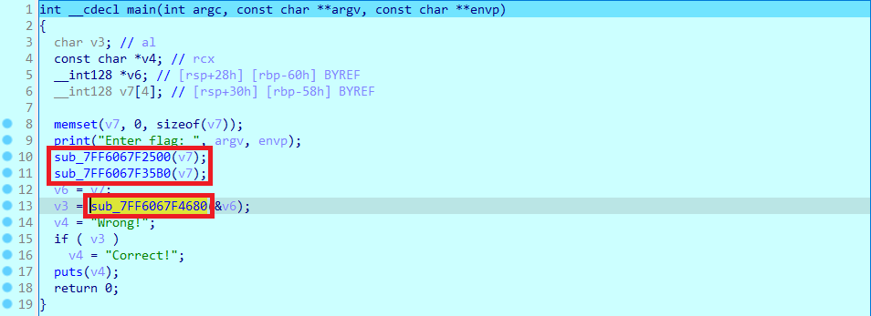

- Ta thử click vào hàm `sub_7FF6067F2500` thì thấy hiện ra một số thứ trông rất là kinh dị.

    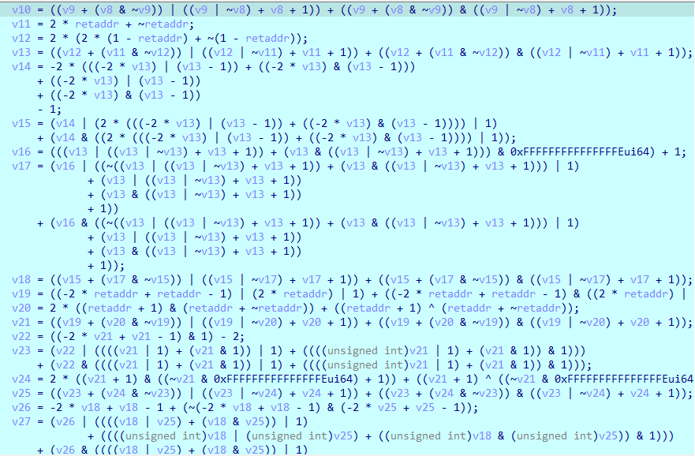
    
    Nhưng khi ta debug chạy qua hàm đó thì hàm `sub_7FF6067F2500` chỉ có mục đích đơn giản là kiểu `scan` thui nhưng mà trong cái hàm đó nó không được biểu diễn trực tiếp là `scanf` mà thông qua hàm loạt các phép tính kinh tởm kia. Dường như bài toán đang gợi ý cho ta cách xử lý hàm sú sú này thông qua một hàm có chức năng đơn giản là `scan` để ta tự suy ra được các hàm sau nó như thế nào (thực ra là ban đầu tui nhìn vào cx sợ z ò ra, chứ chưa có kiểu suy luận như thế này, sau khi làm xong mới kiểu logic lại những gợi ý từ đề bài và thấy cũng hợp lý, nếu mà hàm `scan` này nó không kiểu thực hiện các phép tính như thế kia mà chỉ những hàm `encrypt` với cả `check` thì thực sự làm cho người chơi rất khó hình dung).

    Quay trở lại với hàm sú sú có chức năng `scan`, ta thấy ban đầu truyền vào hàm là một biến (tui đặt là `input`) thì trong cái hàm scan đó nó thực hiện một loạt các phép tính toán nhưng mà các phép tính đó không phụ thuộc gì vào biến `input` truyền vào cả, biến `input` đó chỉ xuất hiện ở cuối hàm đó thoai. Mục đích là chương trình không thực hiện gọi trực tiếp chúng ra mà thực hiện rất nhiều các phép toán tính ra địa chỉ của hàm có chức năng scan. Rồi ép kiểu và `__fastcall`.

    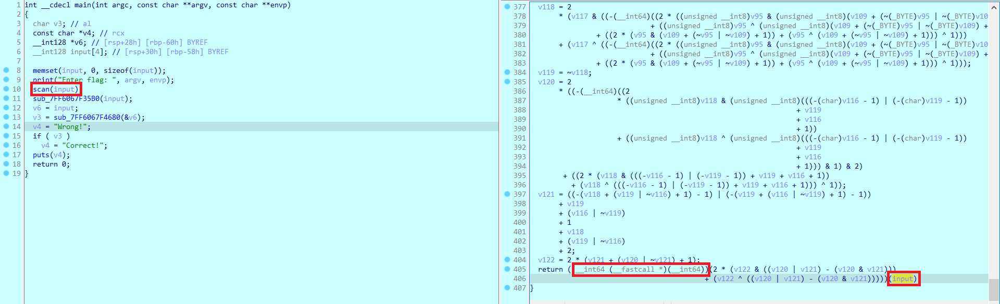

    Khi ta thực hiện nhảy vào lệnh call đó thì hàm thực hiện chức năng scan sẽ xuất hiện. Cụ thể như sau:

    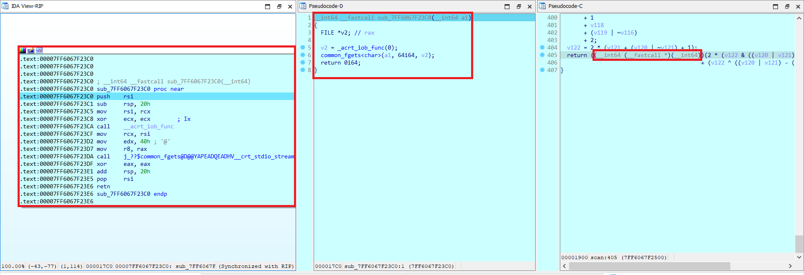

- Như vậy thông qua hàm scan trên ta có thể biết được chính xác các hàm `sub_7FF6067F35B0` và `sub_7FF6067F4680` có chức năng là gì.

    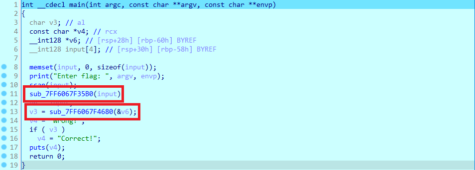

    **sub_7FF6067F35B0**: `encrypt` input trong đó có hàm con là `encrypt_chr` thực hiện mục đích đó.
    
    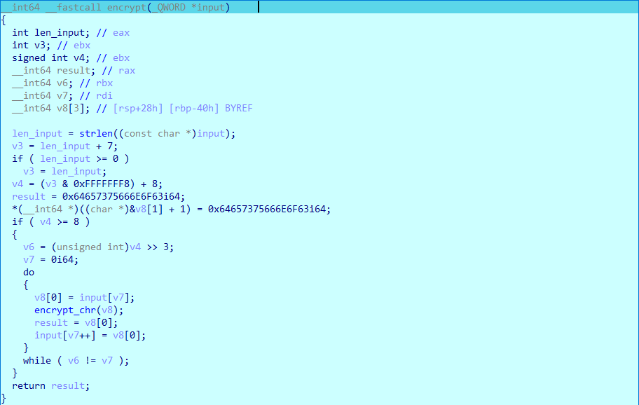

    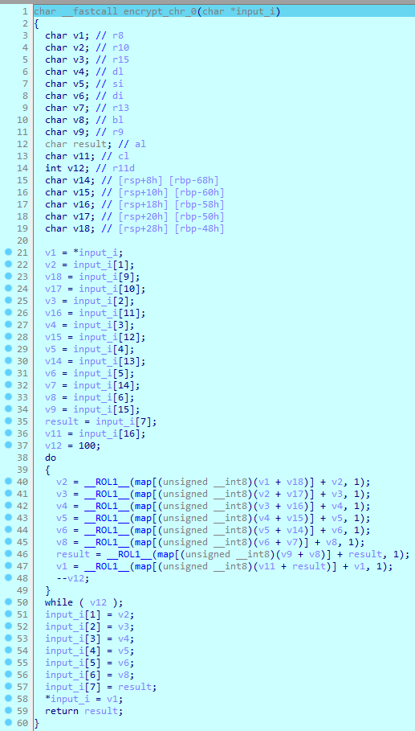

    **sub_7FF6067F4680**: check flag.

    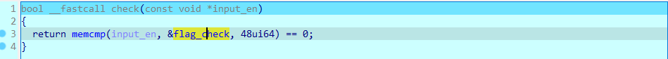

- Tóm lại sau phần đọc hiểu này là chúng ta hiểu là chương trình có hiện tại có 3 phần, những hàm không được gọi trực tiếp mà mình phải tìm chúng.

## B2: Khai thác.

- Khi nhìn qua chall này thi chúng ta không thể thấy trực tiếp chiều dài của flag, nhưng mà nếu ta để ý hàm `check_flag` ở cuối thì flag sẽ có chiều dài `48`.

    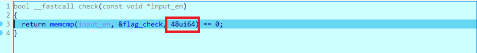

- Đến lúc này ta thực hiện kết hợp đọc mã giả và debug thì sẽ hiểu được chương trình đang làm gì. (với input đầu vào là **tungdva1tungdva2tungdva3tungdva4tungdva5tungdva6**)

- Trong hàm `encrypt`, trước khi vào hàm `encrypt_chr` thì chương trình sẽ thực hiện lấy lần lượt 8 kí tự của `input` rùi nối nó với chuỗi có tên là `confused`, xong mới truyền vào hàm `encrypt_chr`. Cụ thể như hình sau:

    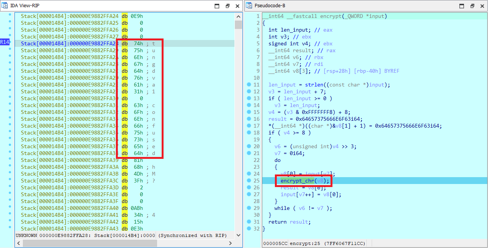

- Trong hàm `encrypt_chr` thì nó chỉ thực hiện chức năng là gán lại những giá trị của 8 kí tự của flag thông qua một phép dịch trái bit của một giá trị của `map` cho trước, rùi trả về 8 kí tự mới sau `100` vòng lặp thoai.

    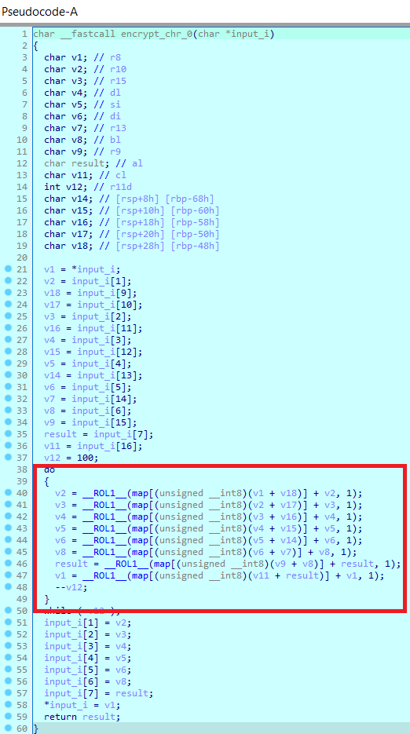

    Map có những giá trị sau:

    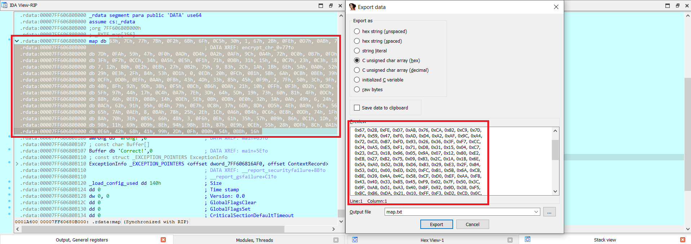

- Còn trong hàm `check_flag` thì chúng ta tìm được cái `flag_en` với các giá trị như sau:

    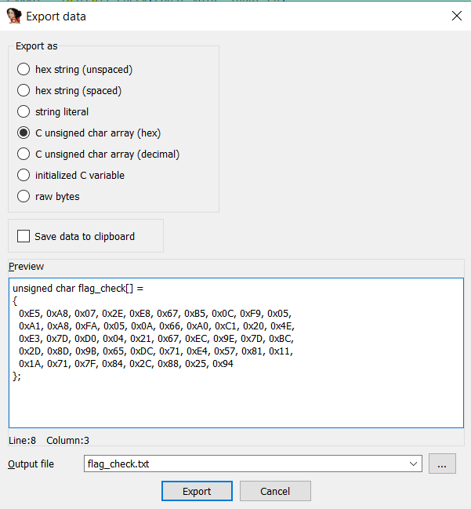

- Trước khi bước sang bước thứ 3 là tìm flag thì ta sẽ thực hiện build lại bài này (sương sương thoai không phải y hệt) bằng ngôn ngữ python để xem bản thân đã hiểu đúng mục đích của bài này chưa.

    ```python
    map = [
        0x63, 0x7C, 0x77, 0x7B, 0xF2, 0x6B, 0x6F, 0xC5, 0x30, 0x01, 
        0x67, 0x2B, 0xFE, 0xD7, 0xAB, 0x76, 0xCA, 0x82, 0xC9, 0x7D, 
        0xFA, 0x59, 0x47, 0xF0, 0xAD, 0xD4, 0xA2, 0xAF, 0x9C, 0xA4, 
        0x72, 0xC0, 0xB7, 0xFD, 0x93, 0x26, 0x36, 0x3F, 0xF7, 0xCC, 
        0x34, 0xA5, 0xE5, 0xF1, 0x71, 0xD8, 0x31, 0x15, 0x04, 0xC7, 
        0x23, 0xC3, 0x18, 0x96, 0x05, 0x9A, 0x07, 0x12, 0x80, 0xE2, 
        0xEB, 0x27, 0xB2, 0x75, 0x09, 0x83, 0x2C, 0x1A, 0x1B, 0x6E, 
        0x5A, 0xA0, 0x52, 0x3B, 0xD6, 0xB3, 0x29, 0xE3, 0x2F, 0x84, 
        0x53, 0xD1, 0x00, 0xED, 0x20, 0xFC, 0xB1, 0x5B, 0x6A, 0xCB, 
        0xBE, 0x39, 0x4A, 0x4C, 0x58, 0xCF, 0xD0, 0xEF, 0xAA, 0xFB, 
        0x43, 0x4D, 0x33, 0x85, 0x45, 0xF9, 0x02, 0x7F, 0x50, 0x3C, 
        0x9F, 0xA8, 0x51, 0xA3, 0x40, 0x8F, 0x92, 0x9D, 0x38, 0xF5, 
        0xBC, 0xB6, 0xDA, 0x21, 0x10, 0xFF, 0xF3, 0xD2, 0xCD, 0x0C, 
        0x13, 0xEC, 0x5F, 0x97, 0x44, 0x17, 0xC4, 0xA7, 0x7E, 0x3D, 
        0x64, 0x5D, 0x19, 0x73, 0x60, 0x81, 0x4F, 0xDC, 0x22, 0x2A, 
        0x90, 0x88, 0x46, 0xEE, 0xB8, 0x14, 0xDE, 0x5E, 0x0B, 0xDB, 
        0xE0, 0x32, 0x3A, 0x0A, 0x49, 0x06, 0x24, 0x5C, 0xC2, 0xD3, 
        0xAC, 0x62, 0x91, 0x95, 0xE4, 0x79, 0xE7, 0xC8, 0x37, 0x6D, 
        0x8D, 0xD5, 0x4E, 0xA9, 0x6C, 0x56, 0xF4, 0xEA, 0x65, 0x7A, 
        0xAE, 0x08, 0xBA, 0x78, 0x25, 0x2E, 0x1C, 0xA6, 0xB4, 0xC6, 
        0xE8, 0xDD, 0x74, 0x1F, 0x4B, 0xBD, 0x8B, 0x8A, 0x70, 0x3E, 
        0xB5, 0x66, 0x48, 0x03, 0xF6, 0x0E, 0x61, 0x35, 0x57, 0xB9, 
        0x86, 0xC1, 0x1D, 0x9E, 0xE1, 0xF8, 0x98, 0x11, 0x69, 0xD9, 
        0x8E, 0x94, 0x9B, 0x1E, 0x87, 0xE9, 0xCE, 0x55, 0x28, 0xDF, 
        0x8C, 0xA1, 0x89, 0x0D, 0xBF, 0xE6, 0x42, 0x68, 0x41, 0x99, 
        0x2D, 0x0F, 0xB0, 0x54, 0xBB, 0x16
    ]

    input = [
        0x74, 0x75, 0x6e, 0x67, 0x64, 0x76, 0x61, 0x31, 0x74, 0x75,
        0x6e, 0x67, 0x64, 0x76, 0x61, 0x32, 0x74, 0x75, 0x6e, 0x67,
        0x64, 0x76, 0x61, 0x33, 0x74, 0x75, 0x6e, 0x67, 0x64, 0x76,
        0x61, 0x34, 0x74, 0x75, 0x6e, 0x67, 0x64, 0x76, 0x61, 0x35,
        0x74, 0x75, 0x6e, 0x67, 0x64, 0x76, 0x61, 0x36
    ]   # tungdva1tungdva2tungdva3tungdva4tungdva5tungdva6

    confused = [
        0x00, 0x63, 0x6F, 0x6E, 0x66, 0x75, 0x73, 0x65, 0x64
    ]

    def rol(a, b):
        return  ((a << b) | (a >> (8 - b))) & 0xff

    def function_1(pos):
        a = input[pos : pos + 8: 1]
        a += confused
        return a

    def function_2(a):
        for i in range(100):
            a[1] = rol((map[(a[0] + a[9]) & 0xff] + a[1]) & 0xff, 1)
            a[2] = rol((map[(a[1] + a[10]) & 0xff] + a[2]) & 0xff, 1)
            a[3] = rol((map[(a[2] + a[11]) & 0xff] + a[3]) & 0xff, 1)
            a[4] = rol((map[(a[3] + a[12]) & 0xff] + a[4]) & 0xff, 1)
            a[5] = rol((map[(a[4] + a[13]) & 0xff] + a[5]) & 0xff, 1)
            a[6] = rol((map[(a[5] + a[14]) & 0xff] + a[6]) & 0xff, 1)
            a[7] = rol((map[(a[6] + a[15]) & 0xff] + a[7]) & 0xff, 1)
            a[0] = rol((map[(a[7] + a[16]) & 0xff] + a[0]) & 0xff, 1)
        a = a[0 : 8 : 1]
        return a


    if __name__ == "__main__":
        ans = []
        for i in range(0, 48, 8):
            tmp = function_1(i)
            tmp_1 = function_2(tmp)
            ans += tmp_1
        for i in range(len(ans)):
            if i % 10 == 9: print(f"{hex(ans[i])},")
            else: print(hex(ans[i]), ", ", sep = '', end = '')
    ```

- Sau khi chạy xong thì thấy kết quả trên IDA khớp với kết quả ủa chương trình trên, vậy là chúng ta tạm yên tâm với với những suy nghĩ ở trên roài.

    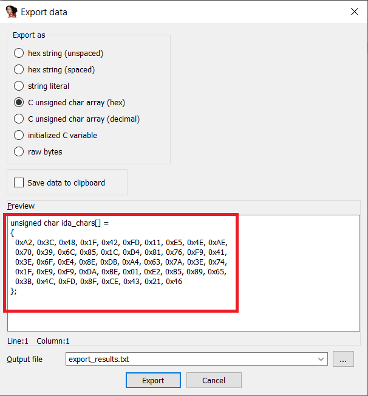

    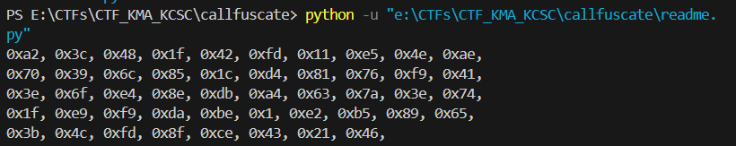

## B3: Tìm flag.

- Bài này lúc ban đầu tui làm thì tui không thể nghĩ ra cách nào để có thể làm ngược lại bài toán cả, chỉ dừng lại ửo bước hiểu chương trình mà thoai, nhưng sau khi tham khảo thì với bài này chúng ta vẫn có thể **bruteforce** được.

- Ta chú ý vào cái hàm chính cần **bruteforce** đó chính là `function_2` sau:
    
    ```python
    def function_2(a):
        for i in range(100):
            a[1] = rol((map[(a[0] + a[9]) & 0xff] + a[1]) & 0xff, 1)
            a[2] = rol((map[(a[1] + a[10]) & 0xff] + a[2]) & 0xff, 1)
            a[3] = rol((map[(a[2] + a[11]) & 0xff] + a[3]) & 0xff, 1)
            a[4] = rol((map[(a[3] + a[12]) & 0xff] + a[4]) & 0xff, 1)
            a[5] = rol((map[(a[4] + a[13]) & 0xff] + a[5]) & 0xff, 1)
            a[6] = rol((map[(a[5] + a[14]) & 0xff] + a[6]) & 0xff, 1)
            a[7] = rol((map[(a[6] + a[15]) & 0xff] + a[7]) & 0xff, 1)
            a[0] = rol((map[(a[7] + a[16]) & 0xff] + a[0]) & 0xff, 1)
        a = a[0 : 8 : 1]
        return a
    ```

    Bây giờ chúng ta cần suy nghĩ ngược lại, sau 100 vòng lặp thì cuối cùng nó sẽ return về kết quả. Ví dụ ở vòng lặp thứ 100 thì thứ tự các kí tự đó chính là biết kí tự `a[1] `rùi đến `a[2]` rùi ... đến `a[7]`, `a[0]`. Điều đặc biệt đó chính là những `a[i]` ở đằng sau được tính dựa trên `a[j]` ở trước đó và chính giá trị `a[i]` ở vòng lặp trước đấy, tức là `a[2]` (vòng lặp thứ **100**) được tính bằng thông qua `a[1]` (vòng lặp thứ **100**) và chính giá trị `a[2]` (vòng lặp thứ **99**),... Vậy nên kết quả trả về là kết quả thứ 100, theo quy nạp thì chúng ta hoàn toàn có thể tính được tất cả các giá trị `a[i]` ở mỗi vòng lặp thứ i (i từ 1 đến 100). Vậy tức là chúng ta hoàn toàn có thể tìm `a[i]` ở vòng lặp thứ 0, tức là **flag** ban đầu dựa trên `flag_encrypt`. Vậy điều chúng ta cần tìm đó chính là các giá trị a[i] sau mỗi vòng lặp (từ 100 về 1).

    Cụ thể như sau:

    ```python
    flag_encryp = [
        0xE5, 0xA8, 0x07, 0x2E, 0xE8, 0x67, 0xB5, 0x0C, 0xF9, 0x05, 
        0xA1, 0xA8, 0xFA, 0x05, 0x0A, 0x66, 0xA0, 0xC1, 0x20, 0x4E, 
        0xE3, 0x7D, 0xD0, 0x04, 0x21, 0x67, 0xEC, 0x9E, 0x7D, 0xBC, 
        0x2D, 0x8D, 0x9B, 0x65, 0xDC, 0x71, 0xE4, 0x57, 0x81, 0x11, 
        0x1A, 0x71, 0x7F, 0x84, 0x2C, 0x88, 0x25, 0x94
    ]

    map = [
        0x63, 0x7C, 0x77, 0x7B, 0xF2, 0x6B, 0x6F, 0xC5, 0x30, 0x01, 
        0x67, 0x2B, 0xFE, 0xD7, 0xAB, 0x76, 0xCA, 0x82, 0xC9, 0x7D, 
        0xFA, 0x59, 0x47, 0xF0, 0xAD, 0xD4, 0xA2, 0xAF, 0x9C, 0xA4, 
        0x72, 0xC0, 0xB7, 0xFD, 0x93, 0x26, 0x36, 0x3F, 0xF7, 0xCC, 
        0x34, 0xA5, 0xE5, 0xF1, 0x71, 0xD8, 0x31, 0x15, 0x04, 0xC7, 
        0x23, 0xC3, 0x18, 0x96, 0x05, 0x9A, 0x07, 0x12, 0x80, 0xE2, 
        0xEB, 0x27, 0xB2, 0x75, 0x09, 0x83, 0x2C, 0x1A, 0x1B, 0x6E, 
        0x5A, 0xA0, 0x52, 0x3B, 0xD6, 0xB3, 0x29, 0xE3, 0x2F, 0x84, 
        0x53, 0xD1, 0x00, 0xED, 0x20, 0xFC, 0xB1, 0x5B, 0x6A, 0xCB, 
        0xBE, 0x39, 0x4A, 0x4C, 0x58, 0xCF, 0xD0, 0xEF, 0xAA, 0xFB, 
        0x43, 0x4D, 0x33, 0x85, 0x45, 0xF9, 0x02, 0x7F, 0x50, 0x3C, 
        0x9F, 0xA8, 0x51, 0xA3, 0x40, 0x8F, 0x92, 0x9D, 0x38, 0xF5, 
        0xBC, 0xB6, 0xDA, 0x21, 0x10, 0xFF, 0xF3, 0xD2, 0xCD, 0x0C, 
        0x13, 0xEC, 0x5F, 0x97, 0x44, 0x17, 0xC4, 0xA7, 0x7E, 0x3D, 
        0x64, 0x5D, 0x19, 0x73, 0x60, 0x81, 0x4F, 0xDC, 0x22, 0x2A, 
        0x90, 0x88, 0x46, 0xEE, 0xB8, 0x14, 0xDE, 0x5E, 0x0B, 0xDB, 
        0xE0, 0x32, 0x3A, 0x0A, 0x49, 0x06, 0x24, 0x5C, 0xC2, 0xD3, 
        0xAC, 0x62, 0x91, 0x95, 0xE4, 0x79, 0xE7, 0xC8, 0x37, 0x6D, 
        0x8D, 0xD5, 0x4E, 0xA9, 0x6C, 0x56, 0xF4, 0xEA, 0x65, 0x7A, 
        0xAE, 0x08, 0xBA, 0x78, 0x25, 0x2E, 0x1C, 0xA6, 0xB4, 0xC6, 
        0xE8, 0xDD, 0x74, 0x1F, 0x4B, 0xBD, 0x8B, 0x8A, 0x70, 0x3E, 
        0xB5, 0x66, 0x48, 0x03, 0xF6, 0x0E, 0x61, 0x35, 0x57, 0xB9, 
        0x86, 0xC1, 0x1D, 0x9E, 0xE1, 0xF8, 0x98, 0x11, 0x69, 0xD9, 
        0x8E, 0x94, 0x9B, 0x1E, 0x87, 0xE9, 0xCE, 0x55, 0x28, 0xDF, 
        0x8C, 0xA1, 0x89, 0x0D, 0xBF, 0xE6, 0x42, 0x68, 0x41, 0x99, 
        0x2D, 0x0F, 0xB0, 0x54, 0xBB, 0x16
    ]

    confused = [
        0x00, 0x63, 0x6F, 0x6E, 0x66, 0x75, 0x73, 0x65, 0x64
    ] #confused

    def rol(a, b):
        return  ((a << b) | (a >> (8 - b))) & 0xff

    def function_1(pos):
        a = flag_encryp[pos : pos + 8: 1]
        a += confused
        return a

    def function_rev2(a):
        for i in range(100):
            for j in range(256):
                if a[0] == rol((map[(a[7] + a[16]) & 0xff] + j) & 0xff, 1):
                    a[0] = j
                    break
            for j in range(256):
                if a[7] == rol((map[(a[6] + a[15]) & 0xff] + j) & 0xff, 1):
                    a[7] = j
                    break
            for j in range(256):
                if a[6] == rol((map[(a[5] + a[14]) & 0xff] + j) & 0xff, 1):
                    a[6] = j
                    break
            for j in range(256):
                if a[5] == rol((map[(a[4] + a[13]) & 0xff] + j) & 0xff, 1):
                    a[5] = j
                    break
            for j in range(256):
                if a[4] == rol((map[(a[3] + a[12]) & 0xff] + j) & 0xff, 1):
                    a[4] = j
                    break
            for j in range(256):
                if a[3] == rol((map[(a[2] + a[11]) & 0xff] + j) & 0xff, 1):
                    a[3] = j
                    break
            for j in range(256):
                if a[2] == rol((map[(a[1] + a[10]) & 0xff] + j) & 0xff, 1):
                    a[2] = j
                    break
            for j in range(256):
                if a[1] == rol((map[(a[0] + a[9]) & 0xff] + j) & 0xff, 1):
                    a[1] = j
                    break
        a = a[0 : 8 : 1]
        return a


    if __name__ == "__main__":
        ans = []
        for i in range(0, 48, 8):
            tmp = function_1(i)
            tmp_1 = function_rev2(tmp)
            ans += tmp_1
        for i in range(len(ans)): print(chr(ans[i]), end = '')
    ```

    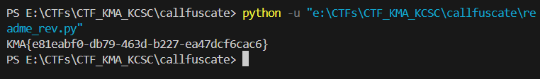

    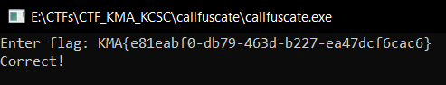

    Flag: `KMA{e81eabf0-db79-463d-b227-ea47dcf6cac6}`

# Crackme

- Chall: [crackme](crackme/crackme.exe)

## B1: Đọc hiểu.

- Với bài toán này khi ta đọc mã giả thì thấy nó qua ư là dễ nhìn ạ. Bài này mọi thứ đã hiện lên trước mắt hết rùi ạ.

    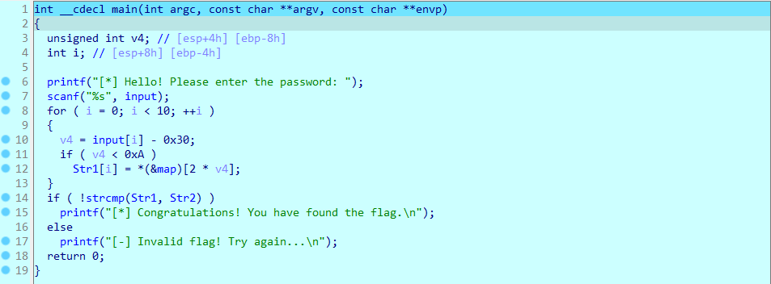

- Nhìn sơ qua là thấy bài này nhập input vào xong xử lý `10` kí tự đầu thông qua vòng `for` rùi nếu mà thoả mãn thì gán vô `str1`, xong rùi so sánh với `str2`, nếu thoả thì in ra thành công.

## B2: Khai thác.

- Trước hết điều ta lấy được đầu tiên đó chính là `str2`.

    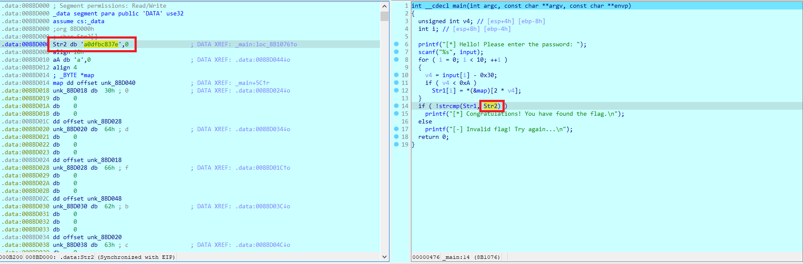

- Ta thấy các giá trị rằng `map` là lưu các giá trị, nhưng mà `map` ko lưu giá trị bình thường mà lại lưu địa chỉ.

    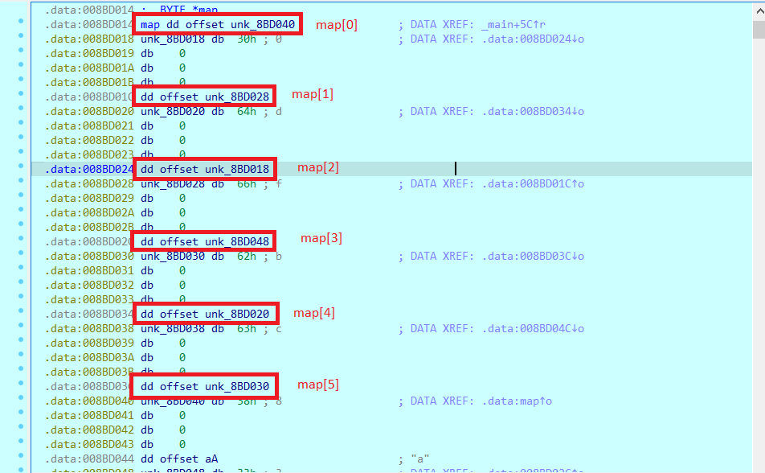

- Ta phân tích kĩ đoạn này:

    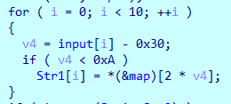

    Đầu tiên là `str2` chỉ có 10 kí tự, mà vòng `for` này chỉ lặp có 10 lần, từ đó ra suy ra một điều đó chính là chắc chắn phải cố tình để `input[i] - 0x30 < 0xA`, tức là `input[i] < 58`.

    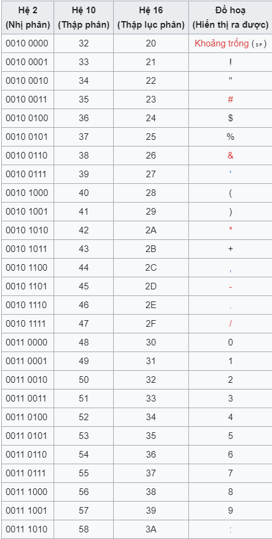

    Từ đây ta có thể suy ra **90%** đó chính là input đầu vào sẽ là các số trong khoảng từ 0 đến 9.

    Bây giờ ta sẽ phân tích kĩ chỗ này:

    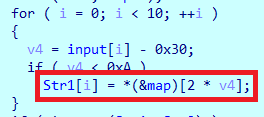

    Nếu mà chỗ này chỉ đọc ở mã giả thì đúng là có hơi lú lú đấy, chúng ta kết hợp debug nữa thì sẽ dễ hiểu hơn.

    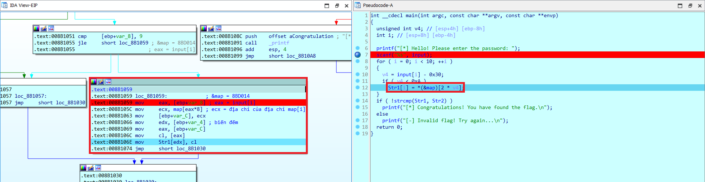

    Nếu ta đọc mã máy thì thấy trên mã máy chỉ có `map[eax * 8]` nhưng mà trên mã giả lại là `(&map)[2 * v4]`, có một chút sự khác biệt ở đây ạ, ưu tiên hiểu mã giả hơn.

    Ví dụ trong vòng lặp này thì chương trình thực hiện đọc kí `7` cho vào thanh `eax` (câu lệnh **eax, [ebp+var_8]**), rùi nó sẽ chuyển giá trị của map vị trí thứ **8*eax**. 

    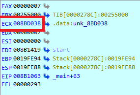

    Chúng ta thực hiện click vô `map` thì thấy `map` có kiểu dữ liệu `byte`, có địa chỉ bắt đầu từ `.data:008BD012`.

    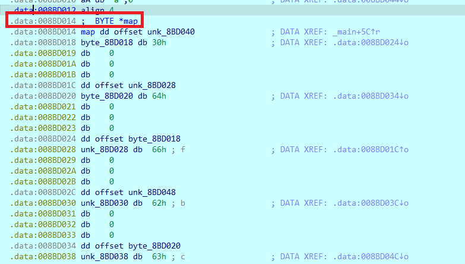

    Vậy chúng ta thực hiện tính lấy 0x008BD012 + 0x38 (vì 0x38 = 56 = 7.8) = 0x008BD04C. Vậy tức là nó sẽ đến địa chỉ 0x008BD04C và gán giá trị tại địa điểm đó cho eax. Ta thực hiện tìm và đối chiếu thì nó hoàn toàn khớp.

    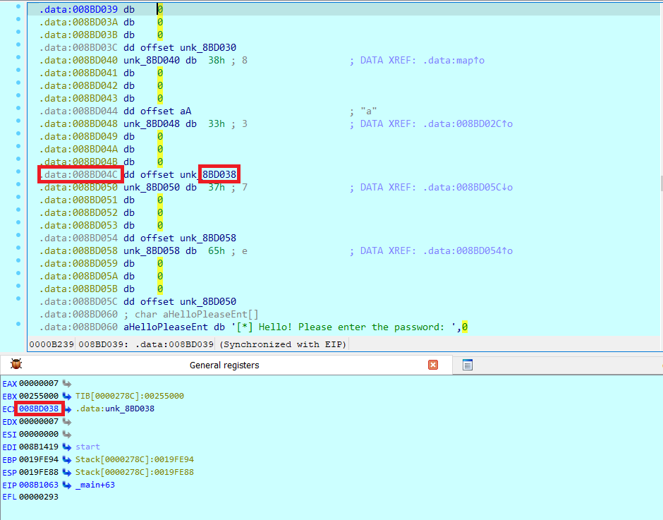

    Sau đó sẽ chuyển giá trị đó vào thành `eax` thông qua câu lệnh `[ebp+var_C], ecx` và `eax, [ebp+var_C]`, rùi xong đưa giá trị của địa chỉ đó vào thành cl bằng câu lệnh `cl, [eax]`.

- Tóm lại nãy giờ tui phân tích đó chính là `map` này sẽ lưu địa chỉ (hay một con trỏ trỏ tới một giá trị) và nó sẽ lấy giá trị của địa chỉ mà map lưu rùi gán lại cho từng `str[i]`.

## B3: Tìm flag.

- Như vậy bây giờ chúng ta muốn tìm flag thì chỉ cần lọc những giá trị của địa chỉ mà map lưu lần lượt thoai, do có mỗi 10 kí tự nên cũng nhanh. Cụ thể như sau:

    |i|map[i]|giá trị mà map[i] trỏ tới|
    |--|--|--|
    |0|unk_8BD040|8|
    |1*8|unk_8BD028|f|
    |2*8|byte_8BD018|0|
    |3*8|unk_8BD048|3|
    |4*8|byte_8BD020|d|
    |5*8|unk_8BD030|b|
    |6*8|aA|a|
    |7*8|unk_8BD038|c|
    |8*8|unk_8BD058|e|
    |9*8|unk_8BD050|7|

- Mà str2 là chuỗi `a0dfbc837e` nên đối chiếu bảng trên ta được str1 cần nhập đó chính là `6241570398`

    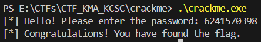

# Encryptor

- Chall: [encryptor.exe](encryptor/encryptor.exe) và [flag.bmp.encrypted](encryptor\flag.bmp.encrypted)

## B1: Đọc hiểu.

- Trước hết điều đầu tiên ta cần chú ý với bài này là bài này có tham số truyền vào chứ không phải là chạy chương trình mới nhập.

    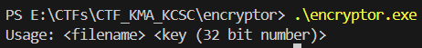

    Vậy tức là mình cần truyền một file vào roài truyền một số nào đó có vẻ như là key để chương trình làm một cái gì đó.

- Ta thực hiện đọc mã giả, thấy chương trình có bố cụ khá là dễ đọc.

    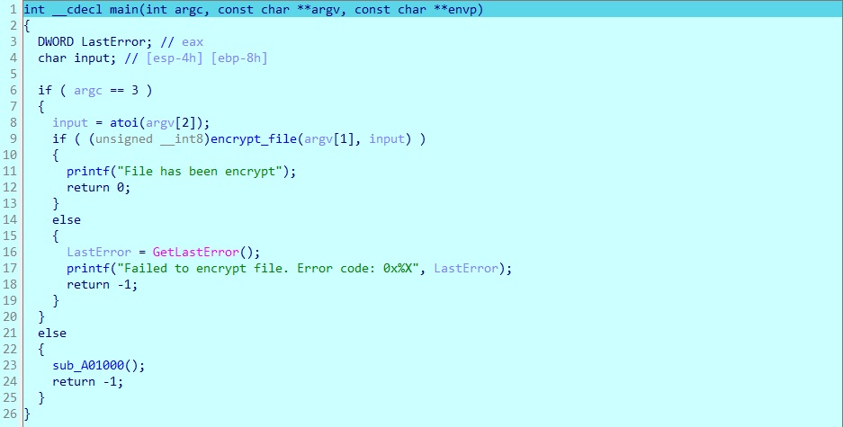

- Trước hết, chúng ta cần biết dòng `input = atoi(argv[2])` là gì.

    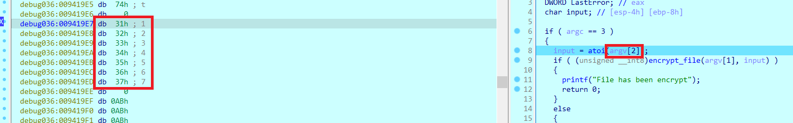

    `argv[2]` sẽ là key mà ta truyền vô, sau khi gọi hàm call xong thì input sẽ là key dưới dạng số (chứ trước đó vẫn là dạng chuỗi).

    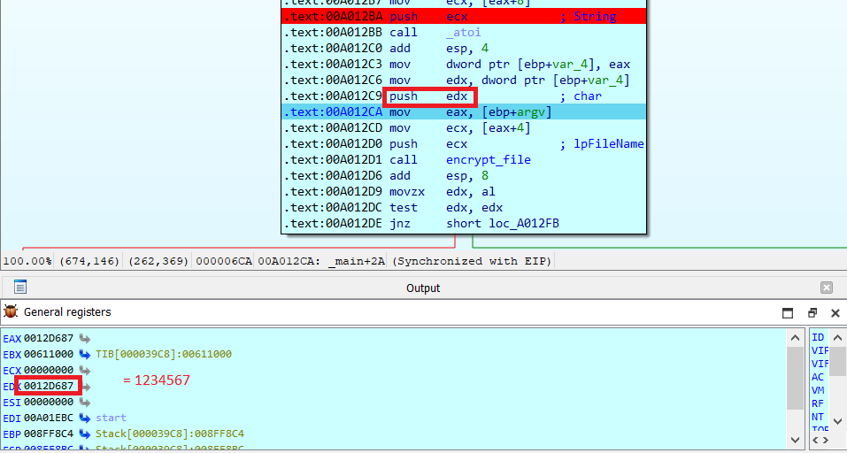

    Tương tự như thế ta cx có thể biết argv[1] là file ta truyền vào.

    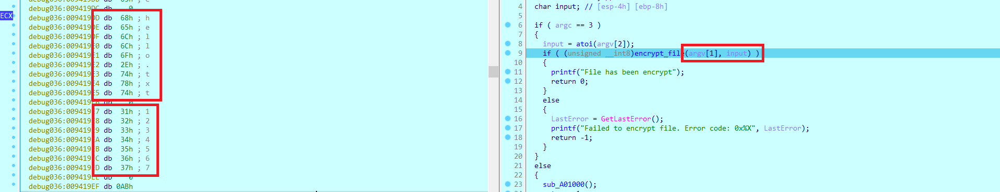

- Khi ta vào trong hàm `file_encrypt` thì ta sẽ thấy như sau:

    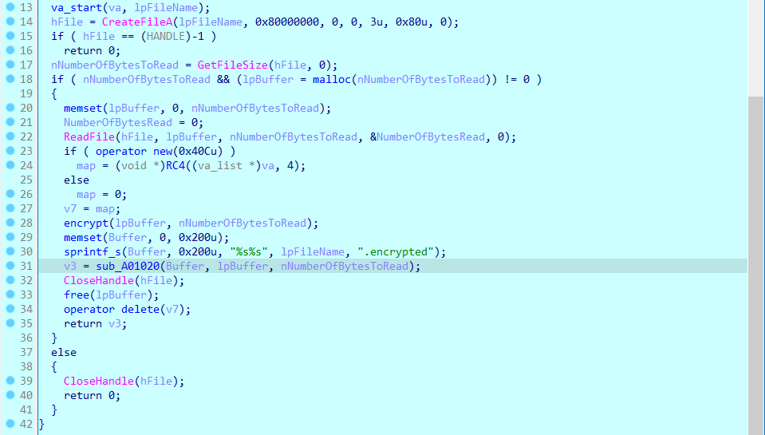

- Hàm **RC4**: Đến dòng 24 của mã giả, ta thực hiện xem giá trị truyền vào hàm là gì, khi ta đọc ta biết được truyền và `va` nhưng mà chúng ta không thực sự biết `va` là gì, thì kết hợp với việc debug ta có thể biết `va` chính là một mảng được tạo ra bởi chính `key` mà chúng ta truyền vào ở trên, và số 4 chính là số lượng phần tử của mảng đoá.

    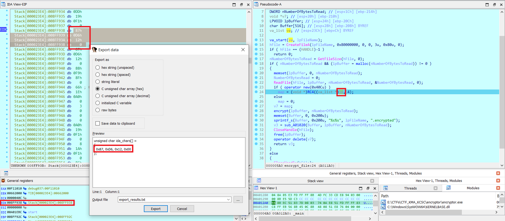

    Như ở trên thì ta truyền vào số `1234567` thì máy sẽ chuyển từ chuỗi sang số dưới dạng hexa là `12D687` rồi từ số đó chuyển thành mảng có các phần tử lần lượt là `0x87`, `0xD6`, `0x12`, `0x00`.

    Sau hàm này cx chỉ đơn giản là sinh ra một mảng thoai.

    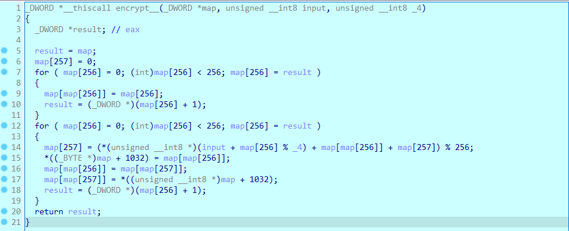

- Hàm **encrypt**: Dòng 28, hàm này cần truyền vào nội dung của file và kích thước size của file (tại sao tui lại biết điều đó, vì tui thử truyền một file txt vào với nội dung là tui soạn sẵn chứ nếu không thử tui cũng chả biết đâu).

    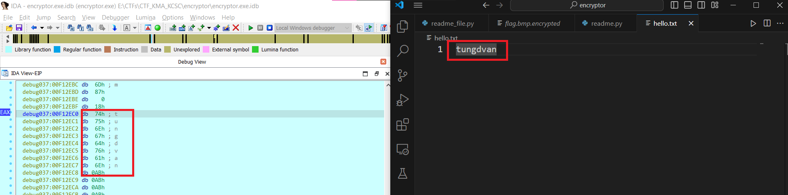

    Bên trong cũng chỉ là mã hoá `input` thui.

- Những hàm ở bên dưới là hàm đưa nội dung mã hoá vào một file rùi đặt tên file đó thêm đuôi .encrypted, nói chung cx không quan trọng mấy.

- Tóm lại, đến lúc này ta biết bài này là một bài mã hoá file theo kiểu RC4 với key là số mà ta truyền vào.

## B2: Khai thác.

- Bài cho ta thêm một file nữa đã được mã hoá đó chính là `flag.bmp.encrypted`. Như vậy ta sẽ biết là file gốc của chúng ta sẽ là file `flag.bmp`, đây là một file ảnh, xong đó là tất cả những gì mà chúng ta có thể biết.

## B3: Tìm flag.

- Đến chỗ này thực sự là tui không thể nào có ý tưởng gì cho bài này, đây cx là lần đầu tui làm bài dạng mã hoá file nên gần như ban đầu tui chả có ý tưởng gì để `bruteforce` cả, sau khi được gợi ý về phần header của file bmp thì lúc đó tui mới biết.

- File bmp: sẽ luôn có phần header là `BM`, các 8 byte tiếp theo sẽ là kích thước của file ảnh đó, các bạn có thể thử bằng việc lấy một file ảnh bmp bất gì rùi thực hiện đọc dữ liệu từ file đó nhá (có thể tham khảo trong **readme_file.py** của tui).

- Như vậy chúng ta sẽ biết được kích thước của file `flag.bmp` thông qua file `flag.bmp.encrypted` vì việc mã hoá RC4 không làm tăng thêm kích thước của file. Vậy file sẽ có kích thước là `551766`, vậy tức là byte để biểu thị sau phần header BM là `0x56`, `0x6b`, `0x08`. Vậy chắc chắn ảnh flag.bmp ban đầu sẽ có 5 byte đầu tiên là `0x42`, `0x4d`, `0x56`, `0x6b`, `0x08`.

- Vậy bây giờ ta chỉ cần biết được 5 byte ban đầu sau phần mã hoá rùi bruteforce để tìm ra key chính xác là được. Dễ dàng để ta có thể tìm ta 5 byte đầu tiên của file `flag.bmp.encrypted` là `0xe0`, `0x3b`, `0xe1`, `0x66`, `0xf8`.

- Như vậy ta viết sc để tìm key thoai, bạn có thể tham khảo:

    ```python
    data_encrypt = [
        0xe0, 0x3b, 0xe1, 0x66, 0xf8
    ]

    data_mau = [
        0x42, 0x4d, 0x56, 0x6b, 0x08
    ]   # BMVk

    def copy_list():
        ans = []
        for i in range(len(data_mau)):
            ans.append(data_mau[i])
        return ans

    def convert(a):
        ans = []
        for i in range(4):
            ans.append(a & 0xff)
            a = a >> 8
        return ans

    def RC4(key):
        map = []
        for i in range(256): map.append(i)
        tmp = 0
        for i in range(256):
            tmp = (key[i % 4] + map[i] + tmp) % 256
            tmp_i = map[i]
            map[i] = map[tmp]
            map[tmp] = tmp_i
        return map

    def RC4_en(map, data):
        tmp1, tmp2 = 0, 0
        for i in range(len(data)):
            tmp1 = (tmp1 + 1) % 256
            tmp2 = (map[tmp1] + tmp2) % 256
            tmp = map[tmp1]
            map[tmp1] = map[tmp2]
            map[tmp2] = tmp
            data[i] ^= map[(map[tmp1] + map[tmp2]) % 256]
            if data[i] != data_encrypt[i]: return False
        return True

    if __name__ == "__main__":
        for i in range(4294967296):
            key = convert(i)
            map = RC4(key)
            data = copy_list()
            if RC4_en(map, data): 
                print(i)
                break
    ```

- Dễ dàng tìm ra được key là `25110`, do việc mã hoá RC4 là mã hoá đối xứng nên ta chỉ cần mã hoá một lần nữa file encrypt là sẽ ra file ban đầu. Thực hiện đổi lại tên về đúng định dạng file bmp là ta sẽ được flag.

    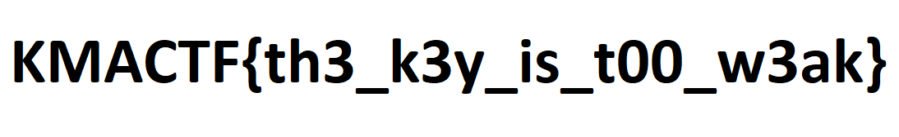

- Flag: `KMACTF{th3_k3y_is_t00_w3ak}`.
