# 1_BABY_RE_DONE

- Chall: [FILE](CHALL/babyre.rar).

- Bài này chúng ta `Shift_F12` là ra flag.

    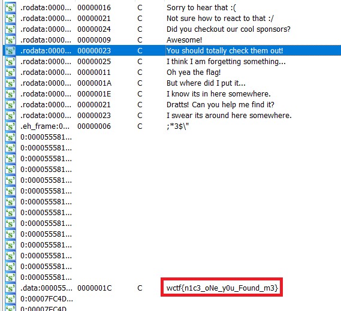

- Flag: `wctf{n1c3_oNe_y0u_Found_m3}`.

# 2_SHREDDED_STUPID

- Chall: [FILE](CHALL/2_SHREDDED_STUPID.rar).

# 3_DOUBLE_DELETES_REVENGE_DONE

- Chall: [FILE](CHALL/3_DOUBLE_DELETES_REVENGE.rar)\

- Bài này là một bài mã hóa, đọc từ một file thực hiện mã hóa xong lưu vào một file khác, và chương trình thực hiện lấy lần lượt 4 byte một rùi thực hiện phép xoay trái trên một giá trị 32 bit:

    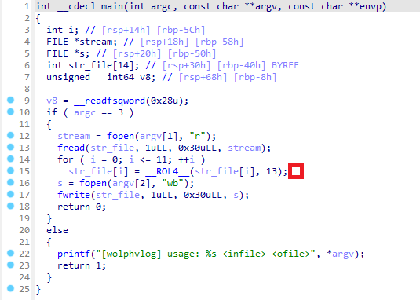

- Ta hoàn toàn có thể check khi debug:

    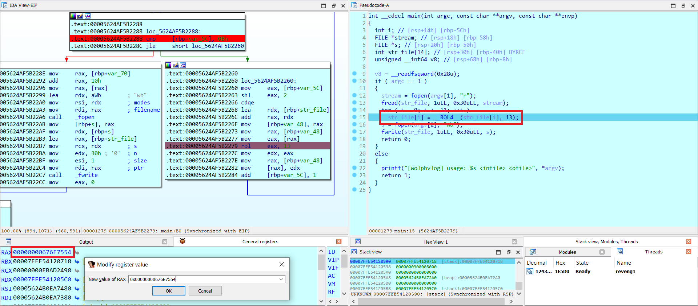

    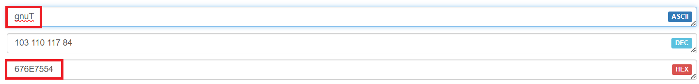

    Trong đó nội dung file tui truyền vào là `TungDvan`.

    Lưu ý bài này chương trình thực hiện lấy byte thấp, tức là byte thấp sẽ xuất hiện trước vậy nên viết scrip thì chúng ta nên chú ý tránh sai.

- Lấy 4 byte một từ file encrypt:

    ```python
    def read_4_bytes(file_path):
        with open(file_path, 'rb') as file:     # Mở file ở chế độ nhị phân đọc
            bytes_data = file.read(4)           # Đọc 4 byte từ file
            while bytes_data:
                reversed_bytes = bytes_data[::-1]
                hex_value = ''.join(f"{byte:02x}" for byte in reversed_bytes)
                print(end = "0x" + hex_value + ", ")
                bytes_data = file.read(4)

    file_path = 'flag.txt.enc'                   
    # Output: 0x8c6eecce, 0xed2f6e8b, 0xc62d0d6d, 0x0f2beea6, 0x2dabee66, 0x8dcea66c, 0x8e6e460e, 0xec860d0b, 0xeee60e4b, 0x2e860666, 0x0eebee46, 0xa6ad614f,
    ```

- Sau khi lấy được rùi thì ta viết ngược lại tìm flag thoai:

    ```python
    flag_en = [
        0x8c6eecce, 0xed2f6e8b, 0xc62d0d6d, 0x0f2beea6, 0x2dabee66, 0x8dcea66c, 0x8e6e460e, 0xec860d0b, 0xeee60e4b, 0x2e860666, 0x0eebee46, 0xa6ad614f
    ]

    def ROR4(ans):
        return (ans >> 13) | ((ans << 19) & ((1 << 32) - 1))

    flag = []

    for i in range(len(flag_en)):
        flag.append(ROR4(flag_en[i]))

    for i in range(len(flag)):
        while flag[i]:
            print(chr(flag[i] & 0xff), end = '')
            flag[i] >>= 8
    ```

- Flag: `wctf{i_th1nk_y0u_m1sund3rst00d_h0w_r0t13_w0rk5}`.

# 4_REV_ASSEMBLED_DONE

- Chall: [FILE](CHALL/4_REV_ASSEMBLED.rar).

- Sau khi chạy thử bài này thì chúng ta nhận thấy là bài này không thể dùng mã giả để tìm flag mà phải đọc mã máy.

    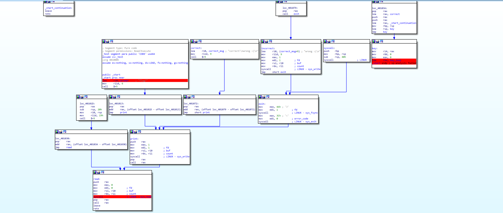

    Luồng chương trình cx khá là lạ.

- Khi chúng ta đọc thì chúng ta bắt đầu xác định chương trình sẽ thực hiện như thế nào.

    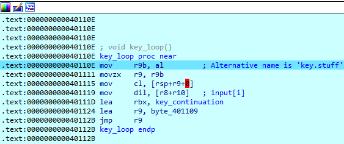

    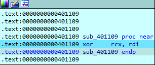

    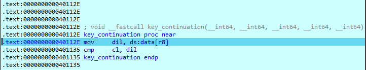

    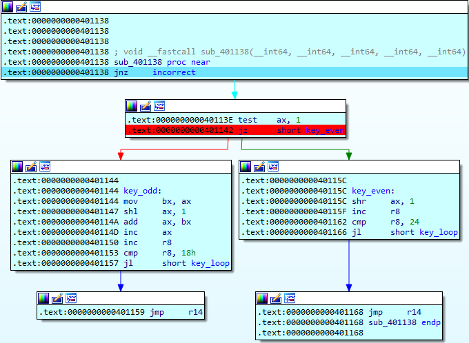

    Ban đầu chương trình sẽ thực hiện lấy giá trị 1 byte cuối của thanh rax, sau đó chuyển giá trị tại ví trí [rsp + r9] vô thanh cl, chuyển giá trị hex của kí tự input[i] vô dil, thực hiện xor thành ecx, với rdi. Xong kiểm tra chúng với ds:data[8]. Nếu mà sai là nhảy sang hàm in `Wrong :(` luôn.

- Vậy mấu chốt là chúng ta cần biết là thành thanh `eax` chứa cái gì và giá trị tại vị trí `[rsp + r9]` là gì. Sau nhiều lần F8 thì tui thấy nó luôn nhận giá trị khởi tạo ban đầu là `3148`.

    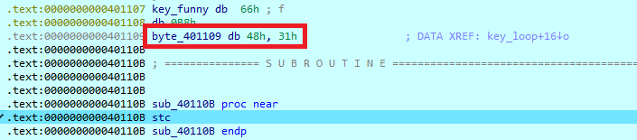

    

    Còn giá trị tại thanh [rsp] chính là giá trị opcode của những câu lệnh.

    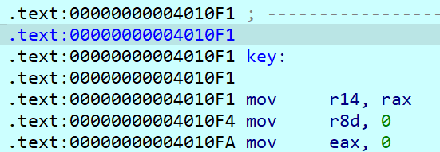 

    Ví dụ như tại địa chỉ `.text:data00000000004010F1` có câu lệnh là `mov r14, rax` thì khi ta chuyển sang giá trị opcode của nó thì nó tương đương với `0x49`, `0x89`, `0xc6`.

    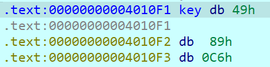

    Vậy ta chỉ cần nhặt những giá trị bắt đầu từ địa chỉ mà của thanh `rsp` thoai. 
    
- Sau khi xử lý được phần rsp thì chúng ta quay lại việc lấy 1 byte từ thanh rax kiểu gì, bởi vì giá trị chúng ta lấy phụ thuộc vào nó mà. Bây giờ chúng ta phát hiện ra như sau:

    

    Đây chính là đoạn mà giá trị thanh rax (khởi tạo 3148) bị thay đổi giá trị sau mỗi lần kiểm tra từng kí tự. Tóm tắt chỗ đó như sau:

    ```python
    n = 0x3148
    if n % 2 == 0:
        n >>= 1
    else:
        n = n + (n << 1) + 1
    ```

- Như vậy là phần tính toán giá trị tại thanh rax chúng ta đã biết, những giá trị tại [rsp + r9] ta cũng đã biết. Như vậy tìm flag thoai.

    ```python
    data_r8 = [
        0xF2, 0x0F, 0x6C, 0xEC, 0x1A, 0xE2, 0x57, 0x70, 0x70, 0x86, 
        0xEA, 0xBA, 0xB5, 0x63, 0xCF, 0x8C, 0xF8, 0x0B, 0x6C, 0xE0, 
        0x6E, 0x15, 0x53, 0x45
    ]

    rsp = [
        0x49, 0x89, 0xC6, 0x41, 0xB8, 0x00, 0x00, 0x00, 0x00, 0xB8, 
        0x00, 0x00, 0x00, 0x00, 0x48, 0x8D, 0x1C, 0x25, 0x0E, 0x11, 
        0x40, 0x00, 0x66, 0xB8, 0x48, 0x31, 0xF9, 0xFF, 0xE3, 0x41, 
        0x88, 0xC1, 0x4D, 0x0F, 0xB6, 0xC9, 0x42, 0x8A, 0x0C, 0x0C, 
        0x43, 0x8A, 0x3C, 0x10, 0x48, 0x8D, 0x1D, 0x0A, 0x00, 0x00, 
        0x00, 0x4C, 0x8D, 0x0D, 0xDE, 0xFF, 0xFF, 0xFF, 0x41, 0xFF, 
        0xE1, 0x41, 0x8A, 0xB8, 0x83, 0x11, 0x40, 0x00, 0x40, 0x38, 
        0xF9, 0x0F, 0x85, 0x41, 0xFF, 0xFF, 0xFF, 0x66, 0xA9, 0x01, 
        0x00, 0x74, 0x18, 0x66, 0x89, 0xC3, 0x66, 0xD1, 0xE0, 0x66, 
        0x01, 0xD8, 0x66, 0xFF, 0xC0, 0x49, 0xFF, 0xC0, 0x49, 0x83, 
        0xF8, 0x18, 0x7C, 0xB5, 0x41, 0xFF, 0xE6, 0x66, 0xD1, 0xE8, 
        0x49, 0xFF, 0xC0, 0x49, 0x83, 0xF8, 0x18, 0x7C, 0xA6, 0x41, 
        0xFF, 0xE6, 0x66, 0x6C, 0x61, 0x67, 0x3F, 0x20, 0x63, 0x6F, 
        0x72, 0x72, 0x65, 0x63, 0x74, 0x21, 0x0A, 0x77, 0x72, 0x6F, 
        0x6E, 0x67, 0x20, 0x3A, 0x28, 0x0A, 0xF2, 0x0F, 0x6C, 0xEC, 
        0x1A, 0xE2, 0x57, 0x70, 0x70, 0x86, 0xEA, 0xBA, 0xB5, 0x63, 
        0xCF, 0x8C, 0xF8, 0x0B, 0x6C, 0xE0, 0x6E, 0x15, 0x53, 0x45, 
        0x00, 0x00, 0x00, 0x00, 0x00, 0x00, 0x00, 0x00, 0x00, 0x00, 
        0x00, 0x00, 0x00, 0x00, 0x00, 0x00, 0x00, 0x00, 0x00, 0x00, 
        0x00, 0x00, 0x00, 0x00, 0x00, 0x00, 0x00, 0x00, 0x00, 0x01, 
        0x00, 0x00, 0x00, 0x04, 0x00, 0xF1, 0xFF, 0x00, 0x00, 0x00, 
        0x00, 0x00, 0x00, 0x00, 0x00, 0x00, 0x00, 0x00, 0x00, 0x00, 
        0x00, 0x00, 0x00, 0x0A, 0x00, 0x00, 0x00, 0x00, 0x00, 0x01, 
        0x00, 0x5D, 0x10, 0x40, 0x00, 0x00, 0x00, 0x00, 0x00, 0x00, 
        0x00, 0x00, 0x00, 0x00, 0x00, 0x00, 0x00, 0x20, 0x00, 0x00, 
        0x00, 0x00, 0x00, 0x01, 0x00, 0x5F, 0x10, 0x40, 0x00, 0x00, 
        0x00, 0x00, 0x00, 0x00, 0x00, 0x00, 0x00, 0x00, 0x00, 0x00, 
        0x00, 0x1E, 0x00, 0x00, 0x00, 0x00, 0x00, 0x01, 0x00, 0x7F, 
        0x10, 0x40, 0x00, 0x00, 0x00, 0x00, 0x00, 0x00, 0x00, 0x00, 
        0x00, 0x00, 0x00, 0x00, 0x00, 0x28, 0x00, 0x00, 0x00, 0x00, 
        0x00, 0x01, 0x00, 0xA1, 0x10, 0x40, 0x00, 0x00, 0x00, 0x00, 
        0x00, 0x00, 0x00, 0x00, 0x00, 0x00, 0x00, 0x00, 0x00
    ]

    n = 0x3148

    for i in range(24):
        print(chr(rsp[n & 0xff] ^ data_r8[i]), end = '')
        if n % 2 == 0:
            n >>= 1
        else:
            n = n + (n << 1) + 1
    ```