# Dynamic Function

- Chall: [file RAR](chall/rev_dynamic_function.rar)

- Đọc qua mã giả của bài này thì thấy như sau:

    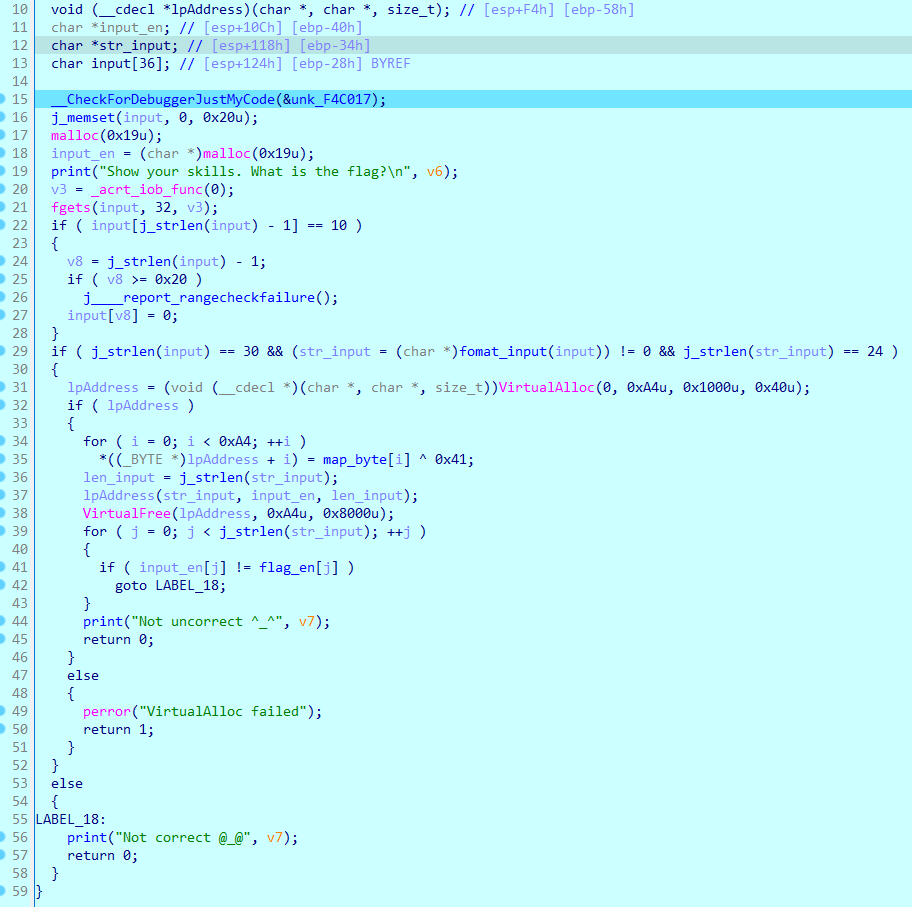

    Chương trình thực hiện check chiều dài của chuỗi với `30` xong rùi thực hiện tách `KCSC{` và `}` ra rùi thực hiện check chiều dài của nội dung của nó với `24`.

- Ở phần tiếp theo, chương trình cấp phát một vùng nhớ ảo cho biến `lpAddress`, sau đó `xor` từng byte với `0x41`. Lúc này `lpAddress` đã trở thành `1 hàm` và sau đó chương trình gọi đến hàm này (chắc có lẽ vì đây là bài có tên là **Dynamic Function**).

    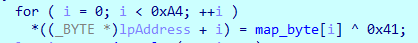

- Đến đây là thực hiện nhảy vô hàm lpAddress xem nội dụng của hàm là gì:

    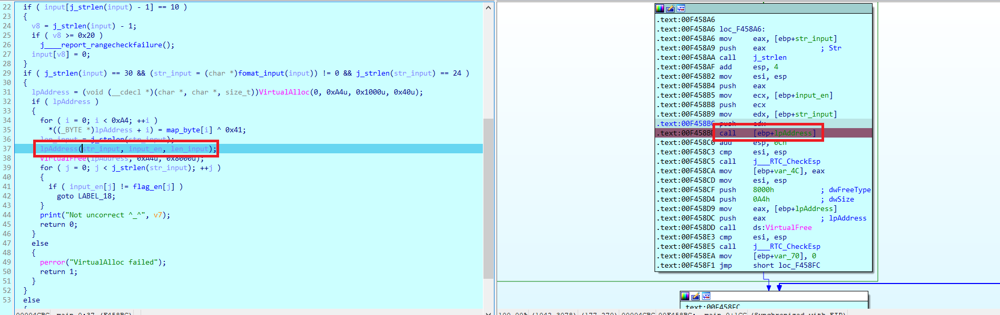

    Đến lúc này ta nhấn chuột phải chọn `Create Function` hoặc bôi đen nhấn `P`:

    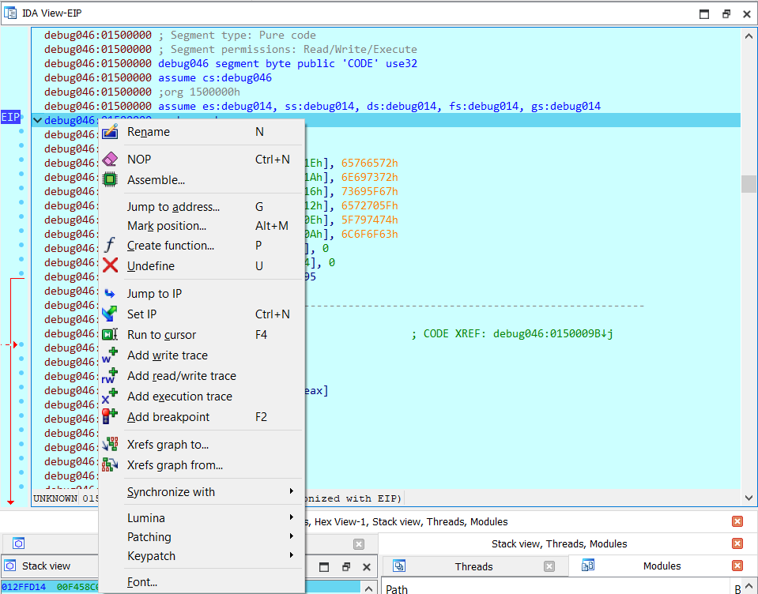

    Ta thấy chương trình sẽ thực hiện mã hoá flag bằng hàm lpaddress roài thực hiện so sánh với `flag_en`, như sau:

    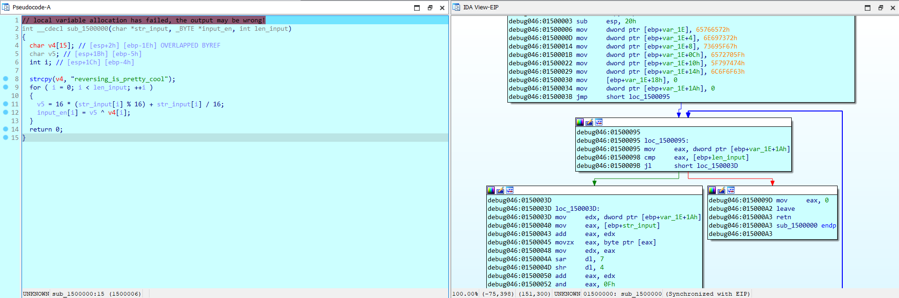

    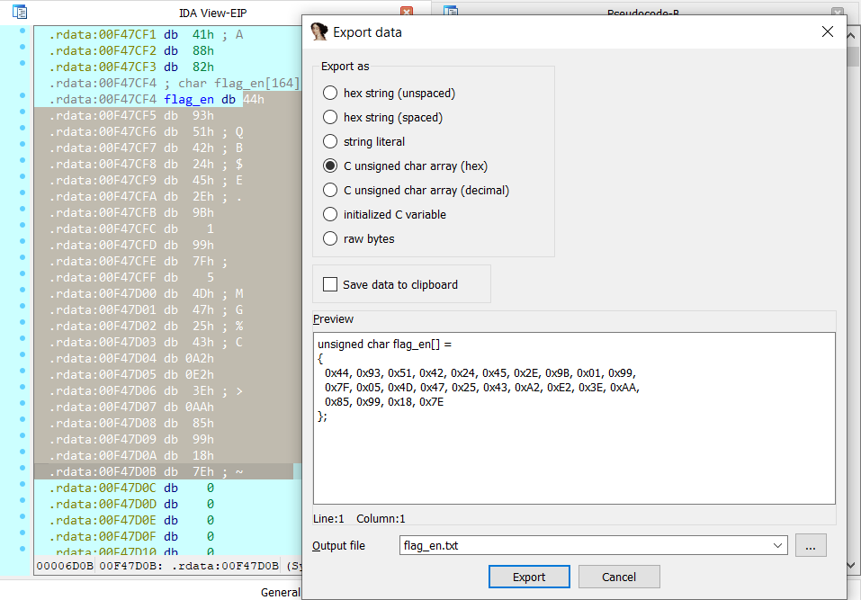

- Tui thấy mấu chốt bài này đó chính là chúng ta biết lpAddress là một hàm và biết cách để đọc nội dung hàm đó thoai chứ về phần mã hoá input thì khá dễ dàng, các bạn có thể tham khảo source python.

    ```python
    flag_en = [
        0x44, 0x93, 0x51, 0x42, 0x24, 0x45, 0x2E, 0x9B, 0x01, 0x99, 
        0x7F, 0x05, 0x4D, 0x47, 0x25, 0x43, 0xA2, 0xE2, 0x3E, 0xAA, 
        0x85, 0x99, 0x18, 0x7E
    ]

    RIPC = [
        0x72, 0x65, 0x76, 0x65, 0x72, 0x73, 0x69, 0x6E, 0x67, 0x5F, 
        0x69, 0x73, 0x5F, 0x70, 0x72, 0x65, 0x74, 0x74, 0x79, 0x5F, 
        0x63, 0x6F, 0x6F, 0x6C
    ]   # reversing_is_pretty_cool

    for i in range(len(flag_en)): flag_en[i] ^= RIPC[i]
    for i in range(len(flag_en)):
        for j in range(256):
            if flag_en[i] == 16 * (j % 16) + j // 16: print(chr(j), end = '')
    ```

- Flag: `KCSC{correct_flag!submit_now!}`.

# Two Faces.

- Chall: [FILE](chall/rev_two_faces.rar).

- Đọc qua mã giả thì chúng ta có thể tóm tắt lại  chương trình như sau:

    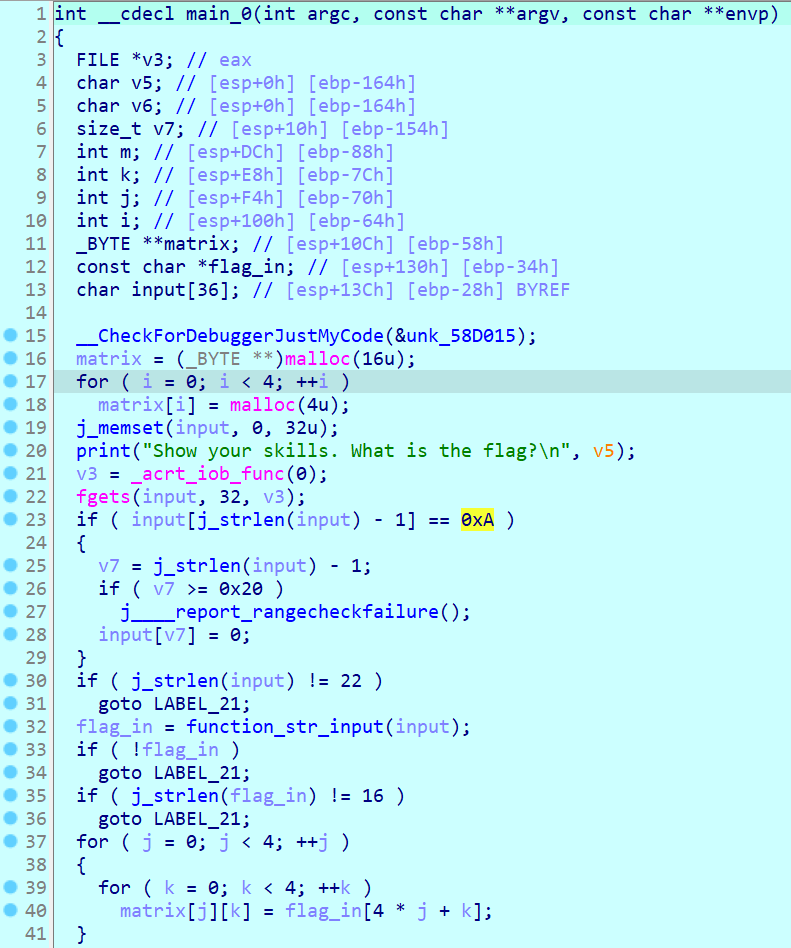

    Chương trình yêu cầu chúng ta nhập `input`, kiểm tra chiều dài input với `22` hay không, sau đó loại bỏ phần `KCSC{` và `}` từ input, rùi thực hiện kiểm tra với `16`, xong rùi đưa các kí tự lần lượt vào một ma trận (mảng 2 chiều) cỡ `4x4`. 

    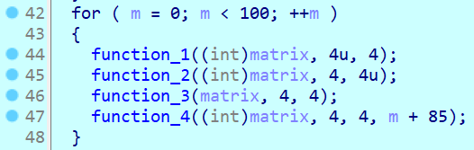

    Về phần này thì chương trình sẽ gọi các hàm function1, 2, 3, 4 thực hiện 100 lần với chức năng của các hàm như sau:

    - `function_1`: xoay **trái** các hàng của matrix theo thứ tự của hàng đó.

        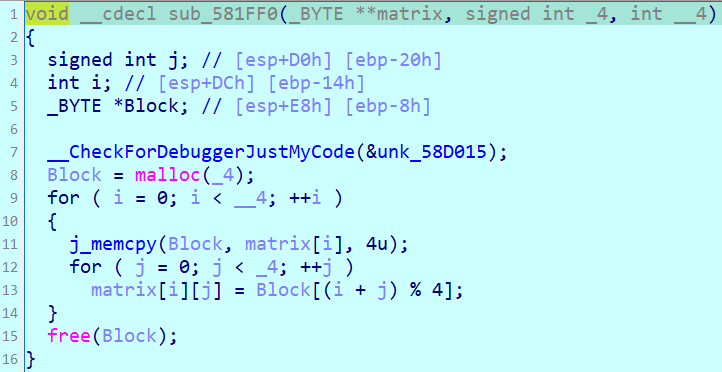

        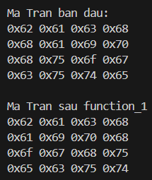

    - `function_2:` xoay **lên** các cột của matrix theo thứ tự của cột đó.

        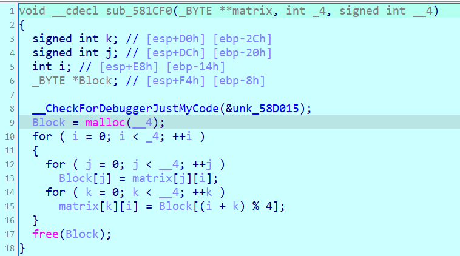

        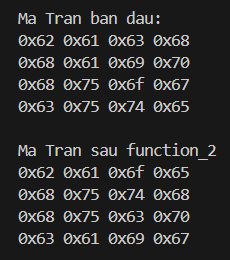

    - `function_3`: đảo 4 bit đầu và 4 bit cuối của mỗi phần tử trong matrix.

        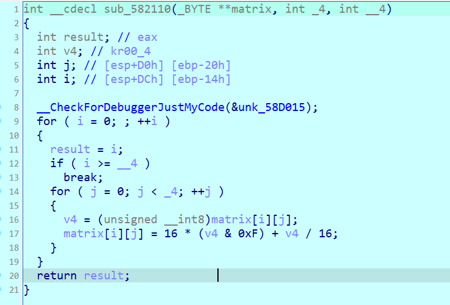

        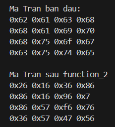

    - `function_4`: xor từng phần tử của matrix với m + 88 (với m là chỉ số của vòng lặp hiện tại).

        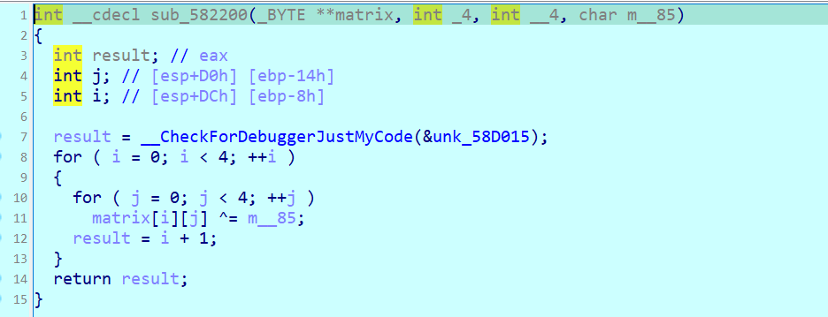

    Sau đó đến phần `check_flag`, chương trình sẽ chuyển những giá trị của mỗi phần tử trong matrix thành những kí tự, ví dụ `0xFA` thì chuyển thành kí tự `F` và `A` xong gán vô `str1`, sau đó so sánh `str1` với `FDA6FF91ADA0FDB7ABA9FB91EFAFFAA2`:

    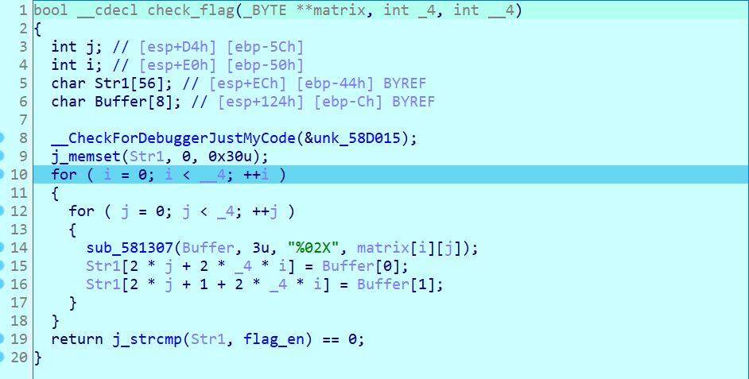

- Thực hiện viết sc:

    ```python
    flag_en = [
        0xFD, 0xA6, 0xFF, 0x91, 0xAD, 0xA0, 0xFD, 0xB7, 0xAB, 0xA9, 
        0xFB, 0x91, 0xEF, 0xAF, 0xFA, 0xA2
    ]

    def matrix_(data):
        ans = []
        for i in range(4):
            tmp = []
            for j in range(4): tmp.append(data[4 * i + j])
            ans.append(tmp)
        return ans

    def function1_rev(matrix):
        for i in range(4):
            tmp = matrix[i][:]
            for j in range(4): 
                matrix[i][j] = tmp[(4 - i + j) % 4]

    def function2_rev(matrix):
        for i in range(4):
            tmp = []
            for j in range(4): tmp.append(matrix[j][i])
            for j in range(4): matrix[j][i] = tmp[(4 - i + j) % 4]

    def function3_rev(matrix):
        for i in range(4):
            for j in range(4):
                tmp = matrix[i][j]
                matrix[i][j] = 16 * (tmp & 0xF) + tmp // 16

    def function4_rev(matrix, num):
        for i in range(4):
            for j in range(4): matrix[i][j] ^= num

    if __name__ == "__main__":
        matrix = matrix_(flag_en)
        for i in range (99, -1, -1):
            function4_rev(matrix, i + 85)
            function3_rev(matrix)
            function2_rev(matrix)
            function1_rev(matrix)
        for i in range(4):
            for j in range(4): print(chr(matrix[i][j]), end = '')

    ```

- Thu được kết quả là `KCSC{3a5y_ch41leng3_!}`. Thử lại thì thấy chương trình hiện sai.

    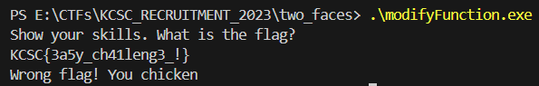

- Sau một hồi `debug` thì hoá ra bài này có gọi một hàm trước hàm main đó chính là hàm `TlsCallback0_0`, trong hàm này có một hàm check là `debugger` hay không.

    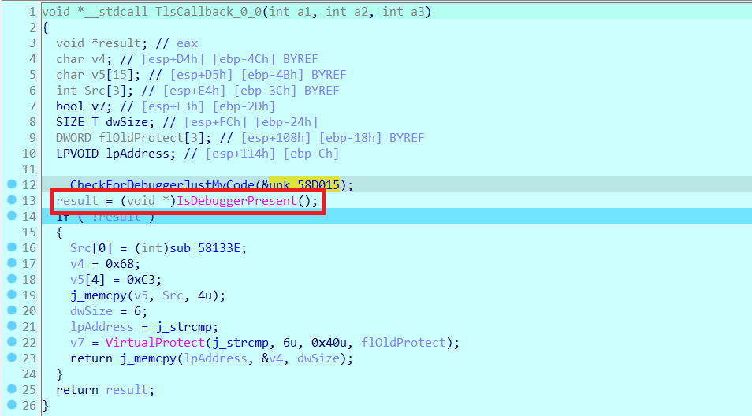

- Phân tích kĩ đoạn này một chút:

    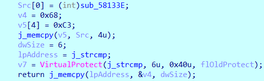

    **Src[0] = (int)sub_58133E:** Đây là gán địa chỉ của hàm `sub_58133E` vào phần tử đầu tiên của mảng `Src`.

    **v4 = 0x68:** Gán giá trị thập lục phân `0x68` cho biến `v4`.

    **v5[4] = 0xC3:** Gán giá trị `0xC3` cho phần tử thứ năm của mảng `v5`. `0xC3` là mã lệnh `RET` trong ASM, dùng để kết thúc một hàm.
    
    **j_memcpy(v5, Src, 4u):** Sao chép `4` byte từ Src sang `v5`. Sau dòng này, `v5` sẽ chứa địa chỉ của hàm `sub_58133E` trong `4` byte đầu tiên.

    **dwSize = 6:** Gán giá trị `6` cho `dwSize`. Đây là kích thước của vùng bộ nhớ mà chúng ta sẽ thay đổi quyền truy cập.
    
    **lpAddress = j_strcmp:** Gán địa chỉ của hàm `j_strcmp` cho `lpAddress`.

    **v7 = VirtualProtect(j_strcmp, 6u, 0x40u, flOldProtect):** Thay đổi quyền truy cập của 6 byte tại địa chỉ của hàm `j_strcmp` sang `PAGE_EXECUTE_READWRITE` (`0x40u`). Lưu quyền truy cập cũ vào `flOldProtect`.

    - `0x40u` (hay `PAGE_EXECUTE_READWRITE`) nghĩa là bạn muốn cho phép thực thi, đọc và ghi vào vùng bộ nhớ này.
    
    **return j_memcpy(lpAddress, &v4, dwSize):** Sao chép `6` byte từ địa chỉ của `v4` sang `lpAddress` (địa chỉ của hàm `j_strcmp`).
    
    - Nếu mà nhìn từ trên xuống nãy giờ thì kích thước vùng ô nhớ của v4 bây giờ sẽ là mã sau:

        ```asm
        push sub_41133E
        ret
        ```

- Như vậy, Mã này có thể được sử dụng để khi mà ta gọi `j_strcmp`, chương trình thực tế sẽ nhảy đến hàm `sub_58133E` thay vì thực thi mã gốc của `j_strcmp`.

- Thực hiện jump IP để nhảy vô câu lệnh trong if hoặc thực hiện sửa cờ để check lại.

    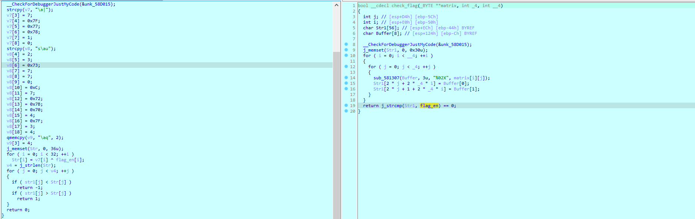

    Như vậy thì đây mới chính là hàm check flag thực sự. Ta thực hiện sửa một chút source code để tìm flag thoai.

    ```python
    flag_en = [
        0x46, 0x44, 0x41, 0x36, 0x46, 0x46, 0x39, 0x31, 0x41, 0x44, 
        0x41, 0x30, 0x46, 0x44, 0x42, 0x37, 0x41, 0x42, 0x41, 0x39, 
        0x46, 0x42, 0x39, 0x31, 0x45, 0x46, 0x41, 0x46, 0x46, 0x41, 
        0x41, 0x32
    ]   # FDA6FF91ADA0FDB7ABA9FB91EFAFFAA2

    v7 = [
        0x07, 0x7C, 0x00, 0x07, 0x7F, 0x77, 0x78, 0x01, 0x00, 0x73, 
        0x07, 0x75, 0x00, 0x02, 0x03, 0x73, 0x07, 0x07, 0x00, 0x0C, 
        0x07, 0x72, 0x7B, 0x70, 0x04, 0x7F, 0x03, 0x04, 0x07, 0x71, 
        0x00, 0x04
    ]

    for i in range(32):
        if i % 2 == 0: print(end = '0x')
        print(chr(flag_en[i] ^ v7[i]), end = '')
        if i % 2 == 1 and i != 31: print(end = ', ')
    ```

    Ta ném output vừa rùi vào phần `flag_en` của source code phía trên là sẽ được flag là: `function_h00k1ng`

    ```python
    flag_en = [
        0xA8, 0xA1, 0x91, 0xA0, 0xA7, 0xFE, 0xFF, 0xAD, 0xFE, 0xA5, 
        0xA0, 0xBA, 0xA9, 0xBB, 0xA0, 0xA6
    ]

    def matrix_(data):
        ans = []
        for i in range(4):
            tmp = []
            for j in range(4): tmp.append(data[4 * i + j])
            ans.append(tmp)
        return ans

    def function1_rev(matrix):
        for i in range(4):
            tmp = matrix[i][:]
            for j in range(4): 
                matrix[i][j] = tmp[(4 - i + j) % 4]

    def function2_rev(matrix):
        for i in range(4):
            tmp = []
            for j in range(4): tmp.append(matrix[j][i])
            for j in range(4): matrix[j][i] = tmp[(4 - i + j) % 4]

    def function3_rev(matrix):
        for i in range(4):
            for j in range(4):
                tmp = matrix[i][j]
                matrix[i][j] = 16 * (tmp & 0xF) + tmp // 16

    def function4_rev(matrix, num):
        for i in range(4):
            for j in range(4): matrix[i][j] ^= num

    if __name__ == "__main__":
        matrix = matrix_(flag_en)
        for i in range (99, -1, -1):
            function4_rev(matrix, i + 85)
            function3_rev(matrix)
            function2_rev(matrix)
            function1_rev(matrix)
        for i in range(4):
            for j in range(4): print(chr(matrix[i][j]), end = '')
    ```


