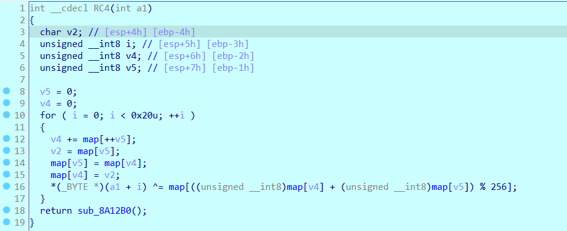
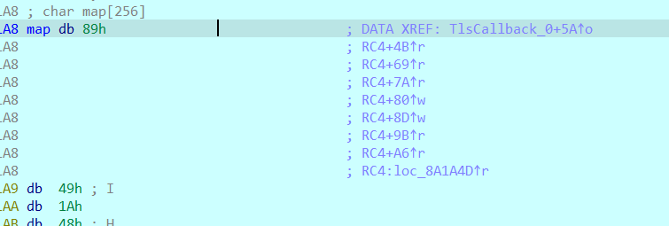
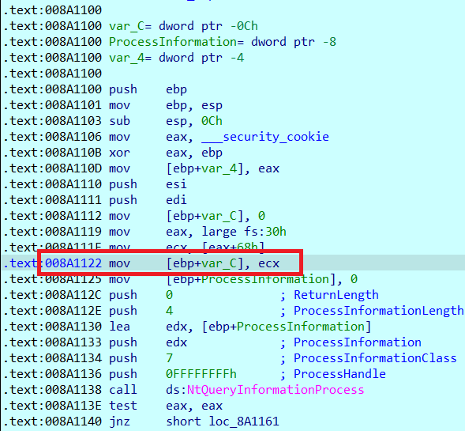
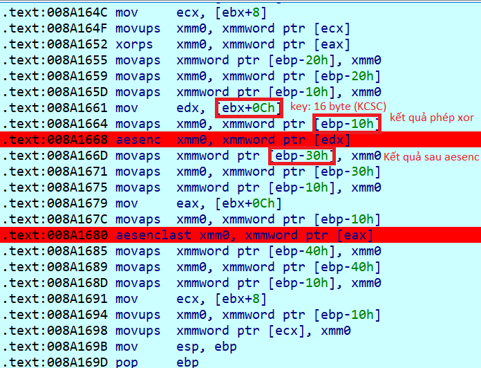
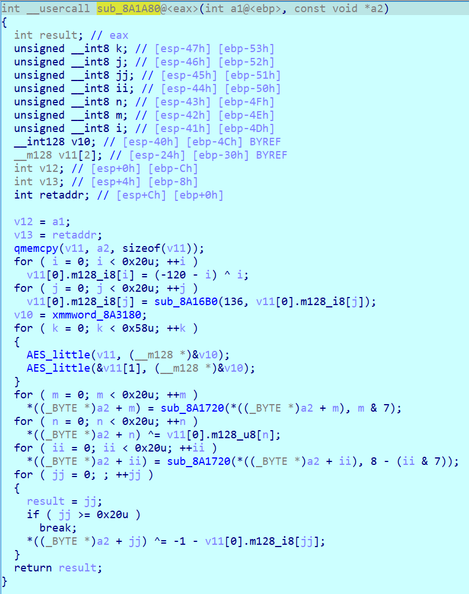
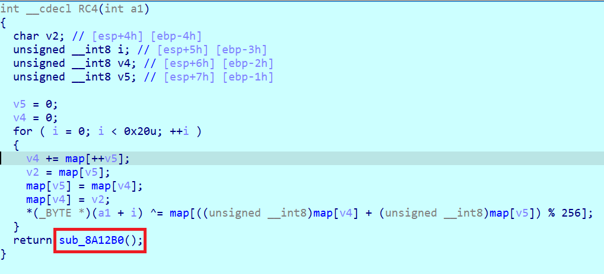
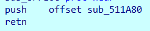
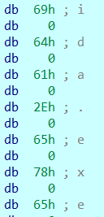
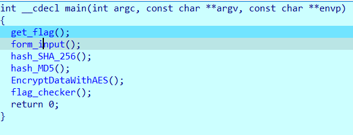

<!-- # 1_RAMSOM (eAsY, troller)

- Chall: [FILE](0_CHALL/1_RAMSOM.rar). -->

# 2_TUNG_QUEN (warmup)

- Chall: [FILE](0_CHALL/2_TUNG_QUEN.rar).

- Đây là một bài mã hóa file bằng việc sử dụng các giá trị ngẫu nhiên từ hàm `srand()` và hàm `rand()`.

- Giải thích sơ qua về `srand()`:

    Hàm `srand()` được sử dụng để thiết lập giá trị `seed` cho bộ sinh số ngẫu nhiên. Nếu không gọi `srand()`, mặc định sử dụng `seed` là 1, dẫn đến kết quả của `rand()` sẽ luôn giống nhau mỗi lần bạn chạy chương trình.

- Giải thích sơ qua về `rand()`:

    Hàm `rand()` thực hiện tính toán trên `seed` (hạt giống) để tạo ra một chuỗi số có vẻ ngẫu nhiên, với cùng một `seed` thì luôn trả về các giá trị random giống nhau.

- Chall của chúng ta có:

    

    Đây là phần mã hóa file bằng các giá trị random đã cho từ trước bằng việc xor kí tự đóa với các giá trị random `seed` đã cho. Có thể tóm lược đơn giản như sau.

    ```python
    for i in range(len(buffer)):
        buffer[i] ^= byte_random[i % 16] 
    ```

    

    Như vậy bài này này `seed` là sử dụng giá trị của thời gian hiện tại `time32(0i64)`.

    Chương trình thực hiện lấy các 16 giá trị random rùi thực hiện đặt lại các giá trị random thứ `12`, `13`, `14`, `15`.

    Ở đây ta dễ dàng lấy được giá trị thứ `12`, `13`, `14`, `15` khi debug:

    

    Để ý ở phần comment ta thấy các biến này còn được gọi ở một trong một hàm khác tên là `TlsCallback_0`, click vào và thực hiện đặt `break_point` thì ta thấy hàm này được gọi trước khi nào hàm main.

    - TLS là gì:

        **Thread-local storage (TLS)** là một kỹ thuật trong lập trình đa luồng cho phép các biến được khai báo là `local` cho mỗi `thread`. Mỗi `thread` có một bản sao của các biến này, do đó mỗi `thread` có thể đọc và ghi các biến này mà không ảnh hưởng đến các `thread` khác.

        **TLS callback** là một hàm được gọi khi một `thread` được tạo ra hoặc kết thúc. Hàm này có thể được sử dụng để khởi tạo các biến local cho mỗi `thread`.

    

- Đoạn code này có chức năng kiểm tra xem một tiến trình có đang được gắn với trình gỡ lỗi (`debugger`) hay không (`anti_debug` này). Cụ thể, nó sử dụng hàm `NtQueryInformationProcess` với tham số `ProcessDebugPort` để lấy thông tin về cổng `debug` của tiến trình.

    `NtQueryInformationProcess` là một hàm để truy xuất thông tin về một tiến trình. Trong trường hợp này, nó được gọi với tham số `ProcessDebugPort`, có nghĩa là hàm này sẽ trả về thông tin về cổng debug của tiến trình (nếu có).

    Tham số thứ hai `(HANDLE)0xFFFFFFFFFFFFFFFFi64` đại diện cho tiến trình hiện tại (là `-1`, tương đương với giá trị `0xFFFFFFFFFFFFFFFF` trong mã hex).

    `ProcessInformation` là một biến nhận giá trị từ hàm `NtQueryInformationProcess`, và nó sẽ chứa thông tin về cổng debug của tiến trình.

- Kết quả trả về của `NtQueryInformationProcess`:

    Nếu hàm trả về `0` (`STATUS_SUCCESS`), tức là lệnh đã thành công. Nếu `ProcessInformation` có giá trị khác không, điều này có nghĩa là **tiến trình đang được debug**, vì có một cổng debug được gắn với tiến trình. Vì vậy, đoạn code này có thực hiện kiểm tra xem tiến trình hiện tại có đang bị debug hay không bằng cách kiểm tra giá trị của `ProcessInformation` sau khi gọi `NtQueryInformationProcess`.

- Tóm lại, đoạn code có kiểm tra debugger, do ta đang debug nên các giá trị sẽ sẽ được gán lần lượt là `0xDE`, `0xAD`, `0xBA`, `0xBE`. Vậy để nhận giá trị đúng chúng ta cần by pass nhảy qua câu lệnh if này. Lúc này chúng ta sẽ nhận được giá trị cần quan tâm:

    

- Sau khi xong xuôi thì chúng ta đến việc ngồi tìm seed của bài này sao cho chuẩn, bằng kiểu format của flag là `KCSC{` thì khả năng cao các byte đầu tiên chính là `0x4b`, `0x43`, `0x53`, `0x43`, `0x7b`, bây giờ chúng ta chỉ cần tìm seed sao cho byte cuối các giá trị random đó bằng `flag_en[i] ^ KCSC[i]`. Tóm lược lại như sau (do time32 là kiểu dữ liệu 32 bit nên nó chỉ có giá trị từ 0 đến 2^32 - 1):

    ```C
    #include<stdio.h>
    #include <stdlib.h>
    int flag_en[101] = 
    {
        0xf4, 0xb6, 0x74, 0x47, 0x38, 0x1a, 0xae, 0x65, 0xd4, 0x82,
        0xa5, 0xbb, 0xea, 0x9f, 0xd0, 0x87, 0x9f, 0x97, 0x48, 0x6d,
        0x63, 0x06, 0xa9, 0x65, 0x9a, 0xc3, 0xae, 0xbe, 0xea, 0x8a,
        0xd6, 0x9a, 0xde, 0xd5, 0x55, 0x6b, 0x2a, 0x54, 0xb2, 0x65,
        0xd7, 0x82, 0xa5, 0xbb, 0xea, 0x92, 0xdf, 0x82, 0x9f, 0x99,
        0x48, 0x6d, 0x63, 0x15, 0xa8, 0x64, 0x9a, 0xc1, 0xa8, 0xa3,
        0xab, 0xde, 0xca, 0x9a, 0xd1, 0x92, 0x07, 0x60, 0x22, 0x19,
        0xe6, 0x62, 0xd5, 0xcb, 0xe0, 0xb7, 0xa4, 0x96, 0x9e, 0x96,
        0xda, 0x80, 0x07, 0x69, 0x2c, 0x00, 0xe6, 0x6d, 0xd3, 0x82,
        0xb4, 0xbe, 0xaf, 0xde, 0xd0, 0x8e, 0xc6, 0xd4, 0x06, 0x79
    };

    int KCSC[6] = 
    {
        0x4b, 0x43, 0x53, 0x43, 0x7b
    };

    int check[6] =
    {
        0xbf, 0xf5, 0x27, 0x04, 0x43
    };

    int main(){
        for (int i = 0; i < 4294967295; i++){
            srand(i);
            int count = 0;
            for (int j = 0; j < 5; j++){
                int tmp = rand();
                tmp &= 0xff;
                if (tmp == check[j]) count++;
                else break;
            }
            if (count == 5){
                printf("%d,\n", i);
                break;
            }
        }
    }
    ```

- Sau khi brute force để thấy có nhiều giá trị seed thỏa mãn, khi mình thử các seed đóa thì đều thỏa mãn các byte cuối giống nhau nên mình sẽ chỉ lấy đại diện một số thui (`13973678`).

    

- Xong xuôi thì viết source code để lấy flag thoai:

    ```C
    #include<stdio.h>
    #include <stdlib.h>
    int flag_en[101] = 
    {
        0xf4, 0xb6, 0x74, 0x47, 0x38, 0x1a, 0xae, 0x65, 0xd4, 0x82,
        0xa5, 0xbb, 0xea, 0x9f, 0xd0, 0x87, 0x9f, 0x97, 0x48, 0x6d,
        0x63, 0x06, 0xa9, 0x65, 0x9a, 0xc3, 0xae, 0xbe, 0xea, 0x8a,
        0xd6, 0x9a, 0xde, 0xd5, 0x55, 0x6b, 0x2a, 0x54, 0xb2, 0x65,
        0xd7, 0x82, 0xa5, 0xbb, 0xea, 0x92, 0xdf, 0x82, 0x9f, 0x99,
        0x48, 0x6d, 0x63, 0x15, 0xa8, 0x64, 0x9a, 0xc1, 0xa8, 0xa3,
        0xab, 0xde, 0xca, 0x9a, 0xd1, 0x92, 0x07, 0x60, 0x22, 0x19,
        0xe6, 0x62, 0xd5, 0xcb, 0xe0, 0xb7, 0xa4, 0x96, 0x9e, 0x96,
        0xda, 0x80, 0x07, 0x69, 0x2c, 0x00, 0xe6, 0x6d, 0xd3, 0x82,
        0xb4, 0xbe, 0xaf, 0xde, 0xd0, 0x8e, 0xc6, 0xd4, 0x06, 0x79
    };

    int main(){
        srand(13973678);
        int a[16];
        for (int i = 0; i < 12; i++){
            int tmp = rand();
            a[i] = tmp & 0xff;
        }
        a[12] = 0xCA;
        a[13] = 0xFE;
        a[14] = 0xBE;
        a[15] = 0xEF;
        for (int i = 0; i < 100; i++){
            printf("%c", flag_en[i] ^ a[i % 16]);
        }
    }
    ```

- Flag:

    ```txt
    KCSC{nhin em anh boi roi anh thua roi tim em lam loi anh chua tung dam noi anh yeu mot ai the nay!!}
    ```


# 3_ELIF (Easy)

- Chall: [FILE](0_CHALL/3_ELIF.rar).

- Bài này cung cấp cho ta một file python có nhiệm vụ check_flag bằng hệ phương trình tổng các giá trị mã ASCII của input đầu vào. Z3 thui không có gì.

    ```python
    from z3 import *

    inp = [Int(f"inp[{i}]") for i in range(49)]
    s = Solver()

    s.add(inp[0] == 0x4b)
    s.add(inp[1] == 0x43)
    s.add(inp[2] == 0x53)
    s.add(inp[3] == 0x43)
    s.add(inp[4] == 0x7b)

    s.add(inp[30] + inp[44] + inp[16] + inp[38] + inp[47] + inp[7] == 398)
    s.add(inp[41] + inp[22] + inp[38] + inp[33] + inp[28] + inp[20] == 451)
    s.add(inp[10] + inp[3] + inp[39] + inp[14] + inp[4] + inp[47] == 440)
    s.add(inp[2] + inp[12] + inp[45] + inp[4] + inp[42] + inp[30] == 581)
    s.add(inp[36] + inp[36] + inp[26] + inp[43] + inp[21] + inp[1] == 587)
    s.add(inp[16] + inp[3] + inp[16] + inp[20] + inp[38] + inp[39] == 274)
    s.add(inp[28] + inp[39] + inp[18] + inp[38] + inp[47] + inp[8] == 372)
    s.add(inp[25] + inp[19] + inp[36] + inp[19] + inp[20] + inp[31] == 470)
    s.add(inp[44] + inp[27] + inp[5] + inp[41] + inp[16] + inp[42] == 565)
    s.add(inp[46] + inp[35] + inp[8] + inp[1] + inp[4] + inp[47] == 447)
    s.add(inp[41] + inp[20] + inp[42] + inp[40] + inp[3] + inp[43] == 503)
    s.add(inp[36] + inp[4] + inp[21] + inp[46] + inp[34] + inp[38] == 532)
    s.add(inp[43] + inp[45] + inp[3] + inp[45] + inp[3] + inp[17] == 382)
    s.add(inp[24] + inp[2] + inp[6] + inp[2] + inp[25] + inp[1] == 490)
    s.add(inp[38] + inp[41] + inp[33] + inp[34] + inp[21] + inp[42] == 569)
    s.add(inp[17] + inp[38] + inp[1] + inp[15] + inp[46] + inp[35] == 364)
    s.add(inp[40] + inp[17] + inp[34] + inp[33] + inp[39] + inp[19] == 398)
    s.add(inp[18] + inp[21] + inp[4] + inp[27] + inp[19] + inp[29] == 541)
    s.add(inp[30] + inp[34] + inp[42] + inp[26] + inp[18] + inp[47] == 588)
    s.add(inp[23] + inp[24] + inp[30] + inp[1] + inp[13] + inp[7] == 471)
    s.add(inp[17] + inp[16] + inp[32] + inp[16] + inp[15] + inp[14] == 343)
    s.add(inp[30] + inp[10] + inp[24] + inp[3] + inp[40] + inp[3] == 519)
    s.add(inp[10] + inp[34] + inp[27] + inp[38] + inp[46] + inp[40] == 480)
    s.add(inp[6] + inp[6] + inp[46] + inp[35] + inp[5] + inp[13] == 357)
    s.add(inp[18] + inp[16] + inp[5] + inp[6] + inp[12] + inp[32] == 411)
    s.add(inp[1] + inp[3] + inp[37] + inp[4] + inp[22] + inp[44] == 514)
    s.add(inp[26] + inp[11] + inp[12] + inp[47] + inp[22] + inp[2] == 541)
    s.add(inp[32] + inp[32] + inp[18] + inp[34] + inp[31] + inp[37] == 454)
    s.add(inp[38] + inp[25] + inp[1] + inp[23] + inp[28] + inp[27] == 403)
    s.add(inp[37] + inp[11] + inp[2] + inp[24] + inp[39] + inp[21] == 457)
    s.add(inp[21] + inp[4] + inp[3] + inp[11] + inp[42] + inp[2] == 588)
    s.add(inp[11] + inp[36] + inp[27] + inp[1] + inp[18] + inp[19] == 549)
    s.add(inp[16] + inp[18] + inp[37] + inp[41] + inp[25] + inp[45] == 446)
    s.add(inp[19] + inp[19] + inp[18] + inp[8] + inp[25] + inp[14] == 453)
    s.add(inp[19] + inp[2] + inp[40] + inp[34] + inp[27] + inp[5] == 461)
    s.add(inp[48] + inp[41] + inp[33] + inp[41] + inp[23] + inp[37] == 533)
    s.add(inp[45] + inp[9] + inp[8] + inp[32] + inp[4] + inp[26] == 531)
    s.add(inp[47] + inp[27] + inp[2] + inp[32] + inp[3] + inp[38] == 393)
    s.add(inp[32] + inp[27] + inp[2] + inp[34] + inp[27] + inp[14] == 506)
    s.add(inp[24] + inp[14] + inp[39] + inp[20] + inp[3] + inp[17] == 365)
    s.add(inp[10] + inp[17] + inp[43] + inp[28] + inp[48] + inp[48] == 565)
    s.add(inp[35] + inp[47] + inp[27] + inp[42] + inp[35] + inp[37] == 415)
    s.add(inp[10] + inp[37] + inp[37] + inp[44] + inp[21] + inp[15] == 502)
    s.add(inp[9] + inp[44] + inp[9] + inp[48] + inp[38] + inp[15] == 600)
    s.add(inp[16] + inp[47] + inp[12] + inp[27] + inp[39] + inp[16] == 386)
    s.add(inp[2] + inp[37] + inp[32] + inp[41] + inp[9] + inp[13] == 485)
    s.add(inp[25] + inp[18] + inp[25] + inp[41] + inp[40] + inp[11] == 566)
    s.add(inp[36] + inp[37] + inp[4] + inp[12] + inp[35] + inp[42] == 546)
    s.add(inp[45] + inp[32] + inp[12] + inp[19] + inp[16] + inp[3] == 371)


    if s.check() == sat:
        m = s.model()
        for c in inp: print(end = chr(m[c].as_long()))
    else:
        print("huhuhuu")
    ```

- Flag:

    ```txt
    KCSC{700_much_1f-3l53_f0r_fl46ch3ck3r!!!7ry_z3<3}
    ```

# 4_GO (Easy, Golang)

- Chall: [FILE](0_CHALL/4_GO.rar).

- Chương trình sơ sơ như sau:

    ```C
    void __cdecl main_main()
    {
    __int64 v0; // r14
    __int128 v1; // xmm15
    _QWORD *v2; // rcx
    __int64 i; // rax
    __int64 v4; // r9
    unsigned __int64 v5; // r8
    __int64 v6; // rax
    __int64 v7; // [rsp+38h] [rbp-200h]
    __int64 v8; // [rsp+40h] [rbp-1F8h]
    __int128 v9[4]; // [rsp+48h] [rbp-1F0h] BYREF
    char v10; // [rsp+90h] [rbp-1A8h] BYREF
    _QWORD *input; // [rsp+1D8h] [rbp-60h]
    __int128 v12; // [rsp+1E0h] [rbp-58h]
    void *v13; // [rsp+1F0h] [rbp-48h]
    char **v14; // [rsp+1F8h] [rbp-40h]
    void *v15; // [rsp+200h] [rbp-38h]
    char **v16; // [rsp+208h] [rbp-30h]
    const char *v17; // [rsp+210h] [rbp-28h]
    _QWORD *v18; // [rsp+218h] [rbp-20h]
    void *v19; // [rsp+220h] [rbp-18h]
    char **v20; // [rsp+228h] [rbp-10h]

    if ( (unsigned __int64)&v10 <= *(_QWORD *)(v0 + 16) )
        runtime_morestack_noctxt_abi0();
    v8 = 18LL;
    sub_5DF062(v9, (__int128 *)"\x1B");
    input = (_QWORD *)runtime_newobject();
    *input = 0LL;
    v19 = &10h;
    v20 = &aEnterYourFlag;
    fmt_Fprint();
    v17 = "\b";
    v18 = input;
    fmt_Fscanln();
    v2 = input;
    if ( input[1] != 51LL )
    {
        v15 = &10h;
        v16 = &aWrongLength;
        fmt_Fprintln();
        os_Exit();
        v2 = input;
    }
    for ( i = 0LL; i < 51; i = v4 + 1 )
    {
        if ( (unsigned __int64)i >= v2[1] )
        runtime_panicIndex();
        v4 = i;
        v5 = i - (i & 0xFFFFFFFFFFFFFFE0LL);
        if ( v5 >= 0x20 )
        runtime_panicIndex();
        if ( *(&v8 + i) != ((unsigned __int8)aYxv0ag9ybm9vym[v5] ^ (unsigned __int64)*(unsigned __int8 *)(i + *v2)) )
        {
        v7 = i;
        v13 = &10h;
        v14 = &aWrongFlag;
        fmt_Fprintln();
        os_Exit();
        v2 = input;
        v4 = v7;
        }
    }
    v12 = v1;
    runtime_concatstring2();
    v6 = runtime_convTstring();
    *(_QWORD *)&v12 = &10h;
    *((_QWORD *)&v12 + 1) = v6;
    fmt_Fprintln();
    os_Exit();
    }
    ```

- Về chall này thì sẽ thực hiện lấy input đề bài cho đi xor với các kí tự ở trong mảng `aYxv0ag9ybm9vym`. Sau đó so sánh giá trị xor được với mảng `v8`. Vậy chúng ta chỉ cần trích được phần data ở trong `v8` và mảng `aYxv0ag9ybm9vym`.

- Giải thích: `v5 = i - (i & 0xFFFFFFFFFFFFFFE0LL);`.

    `i & 0xFFFFFFFFFFFFFFE0LL:` Khi i & 0xFFFFFFFFFFFFFFE0LL, nó sẽ làm xóa 5 bit cuối cùng của i, tức là làm cho giá trị của i trở thành bội số gần nhất của `32` (vì `5` bit cuối cùng bằng `0` tương đương với chia hết cho `32`).
    
    `i - (i & 0xFFFFFFFFFFFFFFE0LL):` Sau khi thực hiện phép `and` ở bước trên, phần này tính giá trị `v5` bằng cách lấy giá trị của `i` trừ đi bội số gần nhất của `32`.
    
    Kết quả của phép trừ này chính là phần dư của `i` khi chia cho `32`, hoặc có thể hiểu đơn giản hơn: `v5` sẽ bằng `i` `%` `32` (phần dư khi `i` chia cho `32`).

- Về việc lấy dữ liệu ở trong mảng v8, ta thực hiện viết script (máy của mình bắt đầu từ địa chỉ `000000C0001C3D80`, cái này là tùy từng máy nhá). Do `v8` được là mảng các giá trị 8 byte nên khi viết script sẽ cần chú ý điều này.

    

    

    ```python
    import idaapi
    import idautils
    import idc

    start_addr = 0x000000C0001C3D80
    end_addr = 0x000000C0001C3F17
    values = []

    for addr in range(start_addr, end_addr + 1, 8):
        value = idc.get_wide_byte(addr)     # Đọc giá trị byte tại địa chỉ `addr`
        values.append(value)                # Thêm giá trị vào danh sách
    print(values)

    f = open('z_file.txt', 'w')
    for i in range(len(values)):
        if i % 10 == 9: f.write(f"0x{values[i]:02x},\n")
        else: f.write(f"0x{values[i]:02x}, ")
    f.close()
    print("OK")
    ```

- Dán code trên vào rồi thực hiện, giá trị của biến `v8` sẽ được in ra `Console Output`.

- Sau khi lấy được hết rùi thì phần còn lại chỉ là thủ tục:

    ```python
    flag_en = [
        0x12, 0x1b, 0x05, 0x73, 0x1a, 0x70, 0x51, 0x48, 0x57, 0x32,
        0x08, 0x43, 0x06, 0x5e, 0x05, 0x5d, 0x1b, 0x5b, 0x05, 0x19,
        0x6e, 0x00, 0x7c, 0x29, 0x01, 0x3f, 0x40, 0x06, 0x0f, 0x01,
        0x23, 0x0b, 0x6a, 0x07, 0x61, 0x55, 0x00, 0x75, 0x5d, 0x18,
        0x53, 0x5a, 0x66, 0x4a, 0x6a, 0x51, 0x02, 0x49, 0x43, 0x4c,
        0x48
    ]

    xor = [
        0x59, 0x58, 0x56, 0x30, 0x61, 0x47, 0x39, 0x79, 0x62, 0x6D, 
        0x39, 0x76, 0x59, 0x6D, 0x31, 0x68, 0x62, 0x6D, 0x35, 0x75, 
        0x5A, 0x6E, 0x4A, 0x76, 0x62, 0x57, 0x74, 0x6A, 0x63, 0x32, 
        0x4D, 0x3D
    ]

    for i in range(len(flag_en)): print(end = chr(xor[i % 32] ^ flag_en[i]))
    ```

- Flag:

    ```txt
    KCSC{7h15_15_345y60l4n6_ch4ll3n63_7ea2da17_<3<3!!!}
    ```


# 5_LIES (Hard)

- Chall: [FILE](0_CHALL/5_LIES.rar).

- Đây là một bài ở mức độ khó, với bản thân mình sau khi làm bài này xong mình thấy bài này khá là bựa, ý đồ của tác giả ra thì ác z ò. Thoai chúng ta bắt đầu lun.

- Chúng ta đến với hàm main của chương trình:

    ```C
    int __cdecl main(int argc, const char **argv, const char **envp)
    {
    char v4; // [esp+0h] [ebp-10h]
    unsigned int len; // [esp+0h] [ebp-10h]
    unsigned __int8 i; // [esp+Fh] [ebp-1h]

    print("Enter Your Flag: ", v4);
    scan("%s", (char)flag);
    len = strlen(flag);
    if ( len != 32 )
    {
        print("Wrong Length!!!\n", len);
        exit(0);
    }
    supper_xor(flag);
    RC4(flag);
    AES(flag);
    for ( i = 0; i < 0x20u; ++i )
    {
        if ( flag[i] != flag_checker[i] )
        {
        print("Wrong Flag!!!\n", 32);
        exit(0);
        }
    }
    print("Correct :3\n", 32);
    return 0;
    }
    ```

- Như vậy bài này sẽ yêu cầu nhập `flag`, xong rùi thực hiện biến đổi thông qua 3 hàm là `supper_xor`, `RC4` và `AES`. Xong rùi thực hiện check với flag_checker để in ra `Correct` hay `Wrongs`. Oce có vẻ như ý tưởng của bài này chỉ là để chúng ta phân tích 3 cái hàm kia thoai.

- Hàm `supper_xor`:

    Với hàm này khá là dễ để chúng ta có thể build lại nên tui sẽ viết lại bằng python ở đây có gì thuận tiện cho việc brute force sau này:

    ```python
    def supper_xor(flag):
        for i in range(0x20):
            flag[i] ^= 0xAB
        for i in range(0x20):
            flag[i] ^= (i + 0xAB) & 0xFF
        for i in range(0, 0x20, 4):
            flag[i] ^= 0xEF
            flag[i + 1] ^= 0xBE
            flag[i + 2] ^= 0xFE
            flag[i + 3] ^= 0xC0
        for i in range(0, 0x20, 4):
            flag[i] ^= 0xBE
            flag[i + 1] ^= 0xBA
            flag[i + 2] ^= 0xAD
            flag[i + 3] ^= 0xDE
        for i in range(0x20):
            flag[i] ^= 0xCD
        for i in range(0x20):
            flag[i] ^= (i + 0xCD) & 0xFF
        for i in range(0, 0x20, 4):
            flag[i] ^= 0xBE
            flag[i + 1] ^= 0xBA
            flag[i + 2] ^= 0xFE
            flag[i + 3] ^= 0xC0
        for i in range(0, 0x20, 4):
            flag[i] ^= 0xEF
            flag[i + 1] ^= 0xBE    
            flag[i + 2] ^= 0xAD
            flag[i + 3] ^= 0xDE
        for i in range(0x20):
            flag[i] ^= 0xEF
        for i in range(0x20):
            flag[i] ^= (i + 0xEF) & 0xFF
    ```

- Hàm `RC4`: nhìn **lướt qua** cũng thấy build lại hàm này dễ.

    

    Có một điều chú ý là trong hàm ở `map` có nó được gọi trong 1 phần `TLSCallback`, chú ý vì nguy cơ rất cao ở đây có `anti debug`.

     

    Nhảy vô thì thấy như sau:

    ```C
    NTSTATUS __stdcall TlsCallback_0(int a1, int a2, int a3)
    {
    NTSTATUS result; // eax
    ULONG NtGlobalFlag; // [esp+8h] [ebp-Ch]
    int ProcessInformation; // [esp+Ch] [ebp-8h] BYREF

    NtGlobalFlag = NtCurrentPeb()->NtGlobalFlag;
    ProcessInformation = 0;
    result = NtQueryInformationProcess((HANDLE)0xFFFFFFFF, ProcessDebugPort, &ProcessInformation, 4u, 0);
    if ( !result && ProcessInformation )
    {
        result = NtGlobalFlag & 0x70;
        if ( (NtGlobalFlag & 0x70) != 0 )
        qmemcpy(map, &unk_8A40A8, sizeof(map));
    }
    return result;
    }
    ```

    `NtGlobalFlag = NtCurrentPeb()->NtGlobalFlag;` (lấy cờ toàn cục): Hàm này truy xuất **PEB** hiện tại và lấy giá trị của **NtGlobalFlag**.

    `result = NtQueryInformationProcess((HANDLE)0xFFFFFFFF, ProcessDebugPort, &ProcessInformation, 4u, 0);` (Kiểm tra thông tin quy trình): Cuộc gọi hàm **NtQueryInformationProcess** kiểm tra thông tin của quy trình. Ở đây, nó đang kiểm tra cổng debug (**debug port**) của quy trình hiện tại. **0xFFFFFFFF** thường ám chỉ đến quy trình hiện tại. 
    
    Oce tới đây là đã thấy có dấu hiện `anti_debug` roài, nhìn ở dưới thì nó thực hiện kiểm tra nếu là đang debug thì nó sẽ sao chép vùng bộ nhớ `unk_8A40A8` sang `map`. Chúng ta có thể setIP để nó nhảy qua hoặc thực hiện thay đổi giá trị thanh `ecx` thành `0` trong khi nó được nhảy đến đây.

    

    Như vậy sau khi check xong phần anti_debug này thì chúng ta dễ dàng lấy được những giá trị cần lấy, chúng ta dễ dàng viết lại được hàm đó nhưu sau:

    ```python
    map = [
        0x89, 0xCD, 0x32, 0x41, 0x9A, 0x7C, 0xE5, 0x51, 0xF1, 0xC2, 
        0xA1, 0x76, 0x96, 0x59, 0x5F, 0x7A, 0x4F, 0x47, 0x88, 0x70, 
        0x4C, 0x63, 0x28, 0xA4, 0x21, 0x90, 0xEA, 0x00, 0x09, 0xB0, 
        0x8F, 0x16, 0x3A, 0x8D, 0x3E, 0x9F, 0x8B, 0xE6, 0x74, 0x33, 
        0x40, 0xA2, 0xA8, 0x39, 0x2A, 0x36, 0xC7, 0x5B, 0xF0, 0xB4, 
        0xD7, 0x87, 0xDE, 0xF7, 0x4A, 0x8A, 0x77, 0x30, 0x75, 0xAF, 
        0x94, 0x5A, 0xDF, 0x67, 0x48, 0xDD, 0x52, 0x93, 0xA3, 0x2F, 
        0xFE, 0xA6, 0x03, 0xD9, 0x4B, 0xC5, 0x5D, 0x62, 0x17, 0x66, 
        0xC6, 0x1E, 0xE4, 0xCA, 0x46, 0x19, 0xD6, 0x92, 0x78, 0xEC, 
        0xB5, 0x4D, 0xF4, 0xF2, 0x7B, 0x27, 0x8C, 0x31, 0xA9, 0x3B, 
        0x12, 0xAA, 0x73, 0x9D, 0x05, 0xE9, 0xB6, 0xAB, 0x0B, 0x08, 
        0x97, 0x7E, 0xBA, 0x9E, 0x20, 0x25, 0x71, 0x38, 0x80, 0x0E, 
        0x64, 0xEB, 0xE2, 0xCC, 0xFA, 0xCE, 0xAD, 0x44, 0x61, 0xF6, 
        0xFF, 0x69, 0xD0, 0x13, 0x99, 0xFD, 0xDA, 0x6B, 0x3C, 0x22, 
        0x56, 0x6E, 0xB2, 0x45, 0x26, 0x7F, 0xF8, 0x0C, 0xBC, 0x1B, 
        0x6D, 0xC4, 0x42, 0xD8, 0x84, 0x72, 0xB3, 0x8E, 0x43, 0x1D, 
        0xB9, 0x5C, 0xBE, 0x5E, 0x53, 0x83, 0xCB, 0x85, 0x95, 0x9B, 
        0xAE, 0xE8, 0x15, 0xB7, 0xD5, 0xE3, 0xBF, 0xCF, 0x6C, 0xD3, 
        0xC3, 0xC1, 0x14, 0x0D, 0x01, 0xE1, 0xC9, 0x3F, 0xEF, 0x18, 
        0x68, 0xA7, 0xE0, 0xC8, 0x2C, 0x86, 0x1F, 0xF5, 0xFB, 0x6A, 
        0xDB, 0x54, 0xD4, 0xBB, 0xD2, 0x49, 0x37, 0x23, 0xD1, 0xEE, 
        0x2D, 0xAC, 0x60, 0x4E, 0xE7, 0x79, 0x1C, 0xB1, 0x98, 0x0F, 
        0x6F, 0x02, 0x7D, 0x0A, 0xED, 0xA5, 0xA0, 0x06, 0x55, 0x24, 
        0x58, 0xC0, 0xBD, 0x91, 0x2B, 0xF3, 0x2E, 0x9C, 0x07, 0xDC, 
        0xF9, 0x29, 0x35, 0x04, 0x81, 0x57, 0x82, 0xB8, 0x50, 0x3D, 
        0x65, 0x11, 0x34, 0xFC, 0x10, 0x1A
    ]

    def RC4(flag):
        tmp1, tmp2 = 0, 0
        for i in range(0x20):
            tmp2 += 1
            tmp1 = (tmp1 + map[tmp2]) & 0xff
            map[tmp1], map[tmp2] = map[tmp2], map[tmp1]
            input[i] ^= map[(map[tmp1] + map[tmp2]) & 0xff]
    ```

- Hàm `AES`, nhưng mà phần này sẽ không phải là mã hóa toàn bộ các công đoạn của `AES` mà chỉ là một **phần nhỏ** trong quá trình mã hóa `AES` thui, cụ thể như sau:

    ```C
    unsigned __int8 __usercall AES@<al>(int a1@<ebp>, __m128 *input)
    {
    unsigned __int8 result; // al
    unsigned __int8 i; // [esp-21h] [ebp-2Dh]
    __m128 v4[2]; // [esp-20h] [ebp-2Ch] BYREF
    int v5; // [esp+0h] [ebp-Ch]
    int v6; // [esp+4h] [ebp-8h]
    int retaddr; // [esp+Ch] [ebp+0h]

    v5 = a1;
    v6 = retaddr;
    v4[0] = (__m128)xmmword_8A3180;               // KCSC
    AES_little(input, v4);
    result = (unsigned __int8)AES_little(input + 1, v4);
    for ( i = 0; i < 0x20u; ++i )
    {
        input->m128_i8[i] ^= AES_xor[i];
        result = i + 1;
    }
    return result;
    }
    ```

    ```C
    __m128 *__cdecl AES_little(__m128 *a1, __m128 *a2)
    {
    __m128 *result; // eax
    __m128 v6; // [esp-20h] [ebp-2Ch]

    v6 = _mm_xor_ps(*a1, *a2);
    _EDX = a2;
    __asm { aesenc  xmm0, xmmword ptr [edx] }
    result = a2;
    __asm { aesenclast xmm0, xmmword ptr [eax] }
    *a1 = _XMM0;
    return result;
    }
    ```

    Ban đầu sẽ thực hiện hiện lấy lần lượt từng 16 byte của flag rùi thực hiện truyền vô hàm `AES_little` với tham số cố định là `v4`.

    ```python
    v4 = [
        0x43, 0x00, 0x00, 0x00, 0x53, 0x00, 0x00, 0x00, 0x43, 0x00, 
        0x00, 0x00, 0x4B, 0x00, 0x00, 0x00
    ]
    ```

    Bây giờ chúng ta thực hiện xem hàm AES_little có những cái gì.

    ```C
    v6 = _mm_xor_ps(*a1, *a2);
    ```

    Phép toán này sử dụng lệnh `_mm_xor_ps` để thực hiện phép `XOR` trên các phần tử của hai vector `a1` và `a2`.
    
    Kết quả của phép `XOR` được lưu vào biến tạm thời `v6`.

    ```C
    __asm { aesenc  xmm0, xmmword ptr [edx] }
    ```

    Dòng lệnh này sử dụng lệnh lắp ráp `aesenc`, đây là một lệnh mã hóa `AES` cho **một vòng mã hóa** (vói tham số truyền vào là data và key).

    `xmm0`: chứa giá trị của phép xor `a1` và `a2`.

    [edx]: chứa giá trị của v4 (KCSC).

    Sau khi gọi thì `xmm0` sẽ thay đổi, các bạn có thể theo dõi thông qua các địa chi khi debug.

    

    Tương tự như thế, kết quả tại lệnh `aesenc` lại được tiếp tục làm tham số truyền vào của lệnh `aesenclast` với `key` vẫn là `v4`.

    Sau khi biến đổi thông qua lệnh `aesenc` và `aesenclast` thì lấy tiếp tục 16 byte sau của input và thực hiện lại quá trình như trên. Sau đó xor các với các giá trị trong mảng `AES_xor`.

    Có vẻ như là đến phần này cần chúng ta phải ngồi tra cứu tìm cách hoạt động của 2 lệnh aesenc và aesenclast, không là thôi khỏi tính đến TH sau. Đến đây trong lúc thi là mình bế tắc lun bởi vì tìm decode của nó thui đã rất là khó rùi, nhưng mà khó chứ không phải không có, sau một hồi tham khảo thì mình cũng đã tìm được 1 nguồn xây dựng lại 2 hàm đó cũng uy tín. Các bạn có thể tham khảo nó tại [đây](https://github.com/noobmannn/CTF_WriteUp/blob/main/AES_NI.md) (chú ý dữ liệu nhập vào và in ra sẽ bị ngược).

- Sau khi nắm sơ lược được quá trình của các hàm trong chall thì thực hiện viết lại chỉ là thủ tục, mình bắt tay vào viết sc lun:

    ```python
    from copy import deepcopy as copy

    sboxInv = [
        0x52, 0x09, 0x6a, 0xd5, 0x30, 0x36, 0xa5, 0x38, 0xbf, 0x40, 0xa3, 0x9e, 0x81, 0xf3, 0xd7, 0xfb,
        0x7c, 0xe3, 0x39, 0x82, 0x9b, 0x2f, 0xff, 0x87, 0x34, 0x8e, 0x43, 0x44, 0xc4, 0xde, 0xe9, 0xcb,
        0x54, 0x7b, 0x94, 0x32, 0xa6, 0xc2, 0x23, 0x3d, 0xee, 0x4c, 0x95, 0x0b, 0x42, 0xfa, 0xc3, 0x4e,
        0x08, 0x2e, 0xa1, 0x66, 0x28, 0xd9, 0x24, 0xb2, 0x76, 0x5b, 0xa2, 0x49, 0x6d, 0x8b, 0xd1, 0x25,
        0x72, 0xf8, 0xf6, 0x64, 0x86, 0x68, 0x98, 0x16, 0xd4, 0xa4, 0x5c, 0xcc, 0x5d, 0x65, 0xb6, 0x92,
        0x6c, 0x70, 0x48, 0x50, 0xfd, 0xed, 0xb9, 0xda, 0x5e, 0x15, 0x46, 0x57, 0xa7, 0x8d, 0x9d, 0x84,
        0x90, 0xd8, 0xab, 0x00, 0x8c, 0xbc, 0xd3, 0x0a, 0xf7, 0xe4, 0x58, 0x05, 0xb8, 0xb3, 0x45, 0x06,
        0xd0, 0x2c, 0x1e, 0x8f, 0xca, 0x3f, 0x0f, 0x02, 0xc1, 0xaf, 0xbd, 0x03, 0x01, 0x13, 0x8a, 0x6b,
        0x3a, 0x91, 0x11, 0x41, 0x4f, 0x67, 0xdc, 0xea, 0x97, 0xf2, 0xcf, 0xce, 0xf0, 0xb4, 0xe6, 0x73,
        0x96, 0xac, 0x74, 0x22, 0xe7, 0xad, 0x35, 0x85, 0xe2, 0xf9, 0x37, 0xe8, 0x1c, 0x75, 0xdf, 0x6e,
        0x47, 0xf1, 0x1a, 0x71, 0x1d, 0x29, 0xc5, 0x89, 0x6f, 0xb7, 0x62, 0x0e, 0xaa, 0x18, 0xbe, 0x1b,
        0xfc, 0x56, 0x3e, 0x4b, 0xc6, 0xd2, 0x79, 0x20, 0x9a, 0xdb, 0xc0, 0xfe, 0x78, 0xcd, 0x5a, 0xf4,
        0x1f, 0xdd, 0xa8, 0x33, 0x88, 0x07, 0xc7, 0x31, 0xb1, 0x12, 0x10, 0x59, 0x27, 0x80, 0xec, 0x5f,
        0x60, 0x51, 0x7f, 0xa9, 0x19, 0xb5, 0x4a, 0x0d, 0x2d, 0xe5, 0x7a, 0x9f, 0x93, 0xc9, 0x9c, 0xef,
        0xa0, 0xe0, 0x3b, 0x4d, 0xae, 0x2a, 0xf5, 0xb0, 0xc8, 0xeb, 0xbb, 0x3c, 0x83, 0x53, 0x99, 0x61,
        0x17, 0x2b, 0x04, 0x7e, 0xba, 0x77, 0xd6, 0x26, 0xe1, 0x69, 0x14, 0x63, 0x55, 0x21, 0x0c, 0x7d
    ]

    def transpose4x4(m):
        return m[0::4] + m[1::4] + m[2::4] + m[3::4]

    def list2hex(list):
        list = list[::-1]
        hex = ""
        for e in list:
            hex += "{:02X}".format(e)
        return hex

    def hex2list(hex):
        byte_list = [hex[i:i+2] for i in range(0, len(hex), 2)][::-1]
        hex = ''.join(byte_list)
        lst = []
        if len(hex) % 2 == 0:
            for i in range(len(hex)//2):
                lst.append(int(hex[i*2:i*2+2], 16))
        return lst

    def xor(bytelist1, bytelist2):
        res = []
        length = min(len(bytelist1), len(bytelist2))
        for i in range(length):
            res.append(bytelist1[i] ^ bytelist2[i])
        return res

    def aesdec_cal(state, roundkey, last=False):
        def rotate(word, n):
            return word[n:]+word[0:n]

        def shift_rows_inv(state):
            for i in range(4):
                state[i*4:i*4+4] = rotate(state[i*4:i*4+4],-i)

        def sub_bytes_inv(state):
            for i in range(16):
                state[i] = sboxInv[state[i]]

        def galoisMult(a, b):
            p = 0
            hiBitSet = 0
            for i in range(8):
                if b & 1 == 1:
                    p ^= a
                hiBitSet = a & 0x80
                a <<= 1
                if hiBitSet == 0x80:
                    a ^= 0x1b
                b >>= 1
            return p % 256

        def mixColumnInv(column):
            temp = copy(column)
            column[0] = galoisMult(temp[0],14) ^ galoisMult(temp[3],9) ^ \
                        galoisMult(temp[2],13) ^ galoisMult(temp[1],11)
            column[1] = galoisMult(temp[1],14) ^ galoisMult(temp[0],9) ^ \
                        galoisMult(temp[3],13) ^ galoisMult(temp[2],11)
            column[2] = galoisMult(temp[2],14) ^ galoisMult(temp[1],9) ^ \
                        galoisMult(temp[0],13) ^ galoisMult(temp[3],11)
            column[3] = galoisMult(temp[3],14) ^ galoisMult(temp[2],9) ^ \
                        galoisMult(temp[1],13) ^ galoisMult(temp[0],11)
            return column
        

        def mix_columns_inv(data):
            new = bytearray(16)
            for i in range(4):
                column = [data[i], data[i+4], data[i+8], data[i+12]]
                column = mixColumnInv(column)
                data[i], data[i+4], data[i+8], data[i+12] = column[0], column[1], column[2], column[3]
                # new[i*4: i*4+4] = column[0], column[1], column[2], column[3]
            return data

        state = xor(state, roundkey)
        if not last:
            state = mix_columns_inv(state)
        shift_rows_inv(state)
        sub_bytes_inv(state)
        return state

    def aesdec(dat, k):
        data = transpose4x4(hex2list(dat.hex()))
        key = transpose4x4(hex2list(k.hex()))    
        res = transpose4x4(aesdec_cal(data, key))
        return bytes.fromhex(list2hex(res))

    def aesdeclast(dat, k):
        data = transpose4x4(hex2list(dat.hex()))
        key = transpose4x4(hex2list(k.hex()))    
        res = transpose4x4(aesdec_cal(data, key, last=True))
        return bytes.fromhex(list2hex(res))

    ############################################################

    flag_en = [
        0x9c, 0x87, 0x9c, 0x6e, 0x64, 0x27, 0x3b, 0x78, 0x71, 0x53,
        0x2b, 0x6d, 0xd4, 0x0e, 0x82, 0x22, 0x5d, 0xc4, 0xe2, 0xe8,
        0x07, 0xb9, 0x85, 0xa7, 0x49, 0x9a, 0x6d, 0xd4, 0xfc, 0x64,
        0xba, 0x02
    ]

    KCSC = [
        0x43, 0x00, 0x00, 0x00, 0x53, 0x00, 0x00, 0x00, 0x43, 0x00, 
        0x00, 0x00, 0x4B, 0x00, 0x00, 0x00
    ]

    ASE_xor = [
        0x1D, 0x97, 0x2B, 0x75, 0x6B, 0x11, 0xA2, 0xA5, 0xEC, 0x95, 
        0x5C, 0x49, 0xE6, 0x04, 0x33, 0x92, 0xEC, 0x44, 0xA1, 0x2A, 
        0xEC, 0x61, 0x46, 0x88, 0xC8, 0x49, 0xE8, 0x6D, 0x75, 0xD7, 
        0xF7, 0x20
    ]
    map = [
        0x89, 0x49, 0x1a, 0x48, 0x98, 0xd6, 0xaf, 0x56, 0xce, 0x67,
        0xed, 0x16, 0x2e, 0x2f, 0x53, 0x8f, 0x08, 0xc3, 0x94, 0x15,
        0x50, 0x4d, 0x69, 0x33, 0x03, 0x1c, 0x2c, 0xea, 0xbb, 0xcc,
        0x57, 0x7c, 0x59, 0x8d, 0x3e, 0x9f, 0x8b, 0xe6, 0x74, 0xa4,
        0x40, 0xa2, 0xa8, 0x39, 0x2a, 0x36, 0xc7, 0x5b, 0xf0, 0xb4,
        0xd7, 0x87, 0xde, 0xf7, 0x4a, 0x8a, 0x77, 0x30, 0x75, 0xe5,
        0x88, 0x5a, 0xdf, 0xc2, 0x41, 0xdd, 0x52, 0x93, 0xa3, 0x3a,
        0xfe, 0xa6, 0x21, 0xd9, 0x4b, 0xc5, 0x5d, 0x62, 0x17, 0x66,
        0xc6, 0x1e, 0xe4, 0xca, 0x46, 0x19, 0x76, 0x92, 0x78, 0xec,
        0xb5, 0x63, 0xf4, 0xf2, 0x7b, 0x27, 0x8c, 0x31, 0xa9, 0x3b,
        0x12, 0xaa, 0x73, 0x9d, 0x05, 0xe9, 0xb6, 0xab, 0x0b, 0x4f,
        0x97, 0x7e, 0xba, 0x9e, 0x20, 0x25, 0x71, 0x38, 0x80, 0x0e,
        0x64, 0xeb, 0xe2, 0xb0, 0xfa, 0xf1, 0xad, 0x44, 0x61, 0xf6,
        0xff, 0x28, 0xd0, 0x13, 0x99, 0xfd, 0xda, 0x6b, 0x3c, 0x22,
        0x51, 0x6e, 0xb2, 0x45, 0x26, 0x7f, 0xf8, 0x0c, 0xbc, 0x1b,
        0x6d, 0xc4, 0x42, 0xd8, 0x84, 0x72, 0xb3, 0x8e, 0x43, 0x1d,
        0xb9, 0x5c, 0xbe, 0x5e, 0x5f, 0x83, 0xcb, 0x85, 0x95, 0x9b,
        0xae, 0xe8, 0x70, 0xb7, 0xd5, 0xe3, 0xbf, 0xcf, 0x6c, 0xd3,
        0x47, 0xc1, 0x14, 0x0d, 0x01, 0xe1, 0xc9, 0x3f, 0xef, 0x18,
        0x68, 0xa7, 0xe0, 0xc8, 0x00, 0x86, 0x1f, 0xf5, 0xfb, 0x6a,
        0xdb, 0x54, 0xd4, 0x09, 0xd2, 0xcd, 0x37, 0x23, 0xd1, 0xee,
        0x2d, 0xac, 0x60, 0x4e, 0xe7, 0x79, 0x90, 0xb1, 0x9a, 0x0f,
        0x6f, 0x02, 0x7d, 0x0a, 0xa1, 0xa5, 0xa0, 0x06, 0x55, 0x24,
        0x58, 0xc0, 0xbd, 0x91, 0x2b, 0xf3, 0x96, 0x9c, 0x07, 0xdc,
        0xf9, 0x29, 0x35, 0x04, 0x81, 0x7a, 0x82, 0xb8, 0x4c, 0x3d,
        0x65, 0x11, 0x34, 0xfc, 0x10, 0x32
    ]

    if __name__ == '__main__':
        for i in range(len(flag_en)):
            flag_en[i] ^= ASE_xor[i]
        k = b'\x00\x00\x00K\x00\x00\x00C\x00\x00\x00S\x00\x00\x00C'
        tmp1 = flag_en[0:16]
        tmp1 = bytes(tmp1[::-1])
        tmp1 = aesdeclast(tmp1, k)
        tmp1 = aesdec(tmp1, k)
        tmp1 = list(tmp1[::-1])
        for i in range(len(tmp1)):
            tmp1[i] ^= KCSC[i]
        for i in range(16):
            flag_en[i] = tmp1[i]
        tmp1 = flag_en[16:32]
        tmp1 = bytes(tmp1[::-1])
        tmp1 = aesdeclast(tmp1, k)
        tmp1 = aesdec(tmp1, k)
        tmp1 = list(tmp1[::-1])
        for i in range(len(tmp1)):
            tmp1[i] ^= KCSC[i]
        for i in range(16, 32):
            flag_en[i] = tmp1[i - 16]

        v4, v5 = 0, 0
        for i in range(0x20):
            v5 += 1
            v4 = (v4 + map[v5]) & 0xff
            map[v4], map[v5] = map[v5], map[v4]
            flag_en[i] ^= map[(map[v4] + map[v5]) & 0xff]

        for i in range(0x20):
            flag_en[i] ^= (i + 0xEF) & 0xFF
        for i in range(0x20):
            flag_en[i] ^= 0xEF
        for i in range(0, 0x20, 4):
            flag_en[i] ^= 0xEF
            flag_en[i + 1] ^= 0xBE    
            flag_en[i + 2] ^= 0xAD
            flag_en[i + 3] ^= 0xDE
        for i in range(0, 0x20, 4):
            flag_en[i] ^= 0xBE
            flag_en[i + 1] ^= 0xBA
            flag_en[i + 2] ^= 0xFE
            flag_en[i + 3] ^= 0xC0
        for i in range(0x20):
            flag_en[i] ^= (i + 0xCD) & 0xFF
        for i in range(0x20):
            flag_en[i] ^= 0xCD
        for i in range(0, 0x20, 4):
            flag_en[i] ^= 0xBE
            flag_en[i + 1] ^= 0xBA
            flag_en[i + 2] ^= 0xAD
            flag_en[i + 3] ^= 0xDE
        for i in range(0, 0x20, 4):
            flag_en[i] ^= 0xEF
            flag_en[i + 1] ^= 0xBE
            flag_en[i + 2] ^= 0xFE
            flag_en[i + 3] ^= 0xC0
        for i in range(0x20):
            flag_en[i] ^= (i + 0xAB) & 0xFF
        for i in range(0x20):
            flag_en[i] ^= 0xAB
        for i in range(0x20):
            print(end = chr(flag_en[i]))
    ```

- Sự sida bắt đầu xuất hiện khi chúng ta thu được flag là:

    ```txt
    KCSC{y0u_5h0uldn'7_5ubm17_m3!!!}
    ``` 

    Mía `flag` mà đọc xong biết lun là fake, vì thực sự là việc tìm cái hàm `aesdec` và `aesdeclast` đã rát là khó roài nhưng mà vẫn chưa phải là mục đích chính của bài này. Liệu chúng ta có bỏ qua một chỗ nào đó hay bị dính phải anti_debug mà không biết ko nhỉ.

- Đến lúc này vì mình không biết là mình đã bỏ qua cái gì quan trọng hay không hay mình cũng không biết là mình bị dính anti debug từ lúc nào, vậy mình sẽ chơi style đọc hết tất cả các hàm trong bài mang tên **Shift F3** thần thánh. Sau một hồi đọc thì mình tìm thấy một hàm khá là lạ:

    

    Thực hiện xrefs liên tục để xem hàm đó được gọi trong hàm nào, thì điều bất ngờ tui phát hiện ra ở chính cái hàm `RC4` thứ 2 của chúng ta:

    

    Hàm RC4 này return về một hàm khác chứ không hề chỉ đơn giản là hàm RC4 thông thướng, mía ý đồ của tác giá cố tình giấu đi rùi, heheheh bây giờ chúng ta bắt đầu thực hiện phân tích hàm đó.

- Bây giờ chúng ta tiến hành phân tích hàm `sub_8A12B0`:

    ```C
    int sub_8A12B0()
    {
    DWORD CurrentProcessId; // eax
    int v2; // [esp+10h] [ebp-288h]
    int v3; // [esp+1Ch] [ebp-27Ch]
    int v4; // [esp+20h] [ebp-278h]
    int v5; // [esp+24h] [ebp-274h]
    HANDLE hSnapshot; // [esp+28h] [ebp-270h]
    unsigned __int8 v7; // [esp+57h] [ebp-241h]
    PROCESSENTRY32W pe; // [esp+5Ch] [ebp-23Ch] BYREF
    DWORD flOldProtect; // [esp+288h] [ebp-10h] BYREF
    char Src[6]; // [esp+28Ch] [ebp-Ch] BYREF

    v7 = 0;
    GetCurrentProcessId();
    CurrentProcessId = GetCurrentProcessId();
    v2 = sub_8A11F0(CurrentProcessId);
    memset(&pe, 0, sizeof(pe));
    pe.dwSize = 556;
    hSnapshot = CreateToolhelp32Snapshot(2u, 0);
    if ( Process32FirstW(hSnapshot, &pe) )
    {
        while ( 1 )
        {
        if ( pe.th32ProcessID == v2 )
        {
            v5 = wcscmp(pe.szExeFile, (const unsigned __int16 *)sub_8A1180(aFlagchecker4Ex));
            if ( v5 )
            v5 = v5 < 0 ? -1 : 1;
            if ( v5 )
            {
            v4 = wcscmp(pe.szExeFile, (const unsigned __int16 *)sub_8A1180(aCmdExe));
            if ( v4 )
                v4 = v4 < 0 ? -1 : 1;
            if ( v4 )
            {
                v3 = wcscmp(pe.szExeFile, (const unsigned __int16 *)sub_8A1180(aExplorerExe));
                if ( v3 )
                v3 = v3 < 0 ? -1 : 1;
                if ( v3 )
                break;
            }
            }
        }
        if ( !Process32NextW(hSnapshot, &pe) )
            goto LABEL_14;
        }
        v7 = 1;
    }
    LABEL_14:
    if ( !v7 )
    {
        v7 = 0;
        Src[0] = 0x68;
        Src[5] = 0xC3;
        *(_DWORD *)&Src[1] = sub_8A1A80;
        VirtualProtect(AES, 6u, 0x40u, &flOldProtect);
        memcpy(AES, Src, 6u);
    }
    CloseHandle(hSnapshot);
    return v7;
    }
    ```

    Khoan hãy quan tâm đến từng chi tiết của hàm này mà thực hiện nhìn xuống `LABEL_14` với nội dung như sau:

    ```C
    LABEL_14:
    if ( !v7 )
    {
        v7 = 0;
        Src[0] = 0x68;
        Src[5] = 0xC3;
        *(_DWORD *)&Src[1] = sub_8A1A80;
        VirtualProtect(AES, 6u, 0x40u, &flOldProtect);
        memcpy(AES, Src, 6u);
    }
    CloseHandle(hSnapshot);
    return v7;
    ```

    Đến đây là một chương trình tạo ra một đoạn `Assembly`:

    - **sub_8A1A80**: Hàm này chính là cái hàm là lạ chúng ta tìm được.

    - **0x68**: Opcode của lệnh `push`.

    - **0xC3**: Opcode của lệnh `ret`.

    ```C
    *(_DWORD *)&Src[1] = sub_8A1A80;
    ``` 

    Phép gán này thực hiện việc lưu trữ địa chỉ của hàm `sub_8A1A80` vào các byte từ `Src[1]` đến `Src[4]`. Điều này nghĩa là sau lệnh `PUSH` ở byte 0 (**0x68**), địa chỉ của hàm `sub_8A1A80` sẽ được đặt vào stack. Điều này có nghĩa là sau khi đoạn mã được thực thi, nó sẽ đẩy địa chỉ của hàm `sub_8A1A80` lên ngăn xếp và trả về địa chỉ đó.

    ```C
    VirtualProtect(AES, 6u, 0x40u, &flOldProtect);
    ```

    Hàm `VirtualProtect` là `API` của Windows, dùng để thay đổi quyền truy cập của một vùng bộ nhớ. Cụ thể, nó sẽ thay đổi quyền truy cập của vùng nhớ được trỏ tới bởi `AES` với kích thước `6` byte.
    
    `0x40` là một giá trị quyền truy cập, tương ứng với `PAGE_EXECUTE_READWRITE`, cho phép vùng bộ nhớ có thể đọc, ghi và thực thi.

    `flOldProtect` là một biến lưu trữ quyền truy cập cũ của vùng bộ nhớ trước khi thay đổi, để có thể khôi phục lại sau đó nếu cần.

    ```C
    memcpy(AES, Src, 6u);
    ```

    Hàm `memcpy` sao chép **6** byte từ `Src` vào vùng nhớ `AES`.

    Vùng nhớ `AES` giờ đã được bảo vệ bằng quyền `PAGE_EXECUTE_READWRITE`, vì vậy nội dung sao chép này sẽ có thể thực thi được nếu nó chứa mã máy.

    Nội dung mã asm `Src` có cú pháp như sau:

    ```asm
    push sub_511A80
    retn
    ```

    

    Đoạn assembly này đẩy địa chỉ của hàm `sub_511A80` vào stack, sau đó `ret` sẽ lấy địa chỉ đó ra và nhảy đến đó.

    Vậy là ta đã sửa lại hàm `AES`. Từ đây, mỗi khi gọi `AES`, đoạn assembly trên sẽ được thực thi, và ta sẽ nhảy đến hàm `sub_511A80`.

    Uhhh, nhìn lướt qua thì có vẻ như là đây là là một phần nào đó của `antidebug` roài, chúng ta xem những thứ bên trên là gì.

    Đoạn mã chall cung cấp có chức năng kiểm tra xem tiến trình hiện tại có phải là một trong những tiến trình cụ thể (`Flagchecker4Ex`, `CmdExe`, `ExplorerExe`) hay không, dựa trên `ID` của tiến trình cha.

    - **Khởi tạo:**

        `CurrentProcessId` lưu `ID` của tiến trình hiện tại.

        `v2` lưu `ID` của tiến trình cha, được lấy từ hàm `sub_6D11F0` (mà bạn đã cho biết là `sub_A511F0`).
    
    - **Snapshot và Duyệt Tiến Trình:**

        Tạo một snapshot của tất cả các tiến trình hiện tại.
        
        Sử dụng `Process32FirstW` và `Process32NextW` để duyệt qua từng tiến trình.
    
    - **Kiểm tra Tiến Trình:**

        Nếu ID của tiến trình hiện tại **pe.th32ProcessID** trùng với `ID` của tiến trình cha `v2`:
        
        So sánh tên tiến trình với các tên được định nghĩa trước (`Flagchecker4Ex`, `CmdExe`, `ExplorerExe`) bằng `wcscmp`.

        Nếu tên tiến trình không khớp với bất kỳ tên nào, vòng lặp sẽ dừng lại.
        
    - **Kết quả:**

        Nếu tên của tiến trình cha không trùng với bất kỳ tên nào đã kiểm tra, thì biến **v7** sẽ được đặt thành **1**, cho thấy rằng tiến trình cha không phải là một trong những tiến trình cụ thể được kiểm tra. 

    Do chúng ta đang debug bằng IDA nên tiến trình của chúng ta lúc này là `ida.exe`:

    

    Đây là một phần kiểm tra để chống `debug`. Chúng ta thực hiện `setIP` để nhảy vô đúng luồng chương trình thoai.

- Come back lại phân tích hàm `AES`:

    ```C
    int __usercall sub_8A1A80@<eax>(int a1@<ebp>, const void *input)
    {
    int result; // eax
    unsigned __int8 k; // [esp-47h] [ebp-53h]
    unsigned __int8 j; // [esp-46h] [ebp-52h]
    unsigned __int8 jj; // [esp-45h] [ebp-51h]
    unsigned __int8 ii; // [esp-44h] [ebp-50h]
    unsigned __int8 n; // [esp-43h] [ebp-4Fh]
    unsigned __int8 m; // [esp-42h] [ebp-4Eh]
    unsigned __int8 i; // [esp-41h] [ebp-4Dh]
    __int128 v10; // [esp-40h] [ebp-4Ch] BYREF
    __m128 v11[2]; // [esp-24h] [ebp-30h] BYREF
    int v12; // [esp+0h] [ebp-Ch]
    int v13; // [esp+4h] [ebp-8h]
    int retaddr; // [esp+Ch] [ebp+0h]

    v12 = a1;
    v13 = retaddr;
    qmemcpy(v11, input, sizeof(v11));
    for ( i = 0; i < 0x20u; ++i )
        v11[0].m128_i8[i] = (-120 - i) ^ i;
    for ( j = 0; j < 0x20u; ++j )
        v11[0].m128_i8[j] = sub_D316B0(0x88u, v11[0].m128_u8[j]);
    v10 = xmmword_D33180;
    for ( k = 0; k < 0x58u; ++k )
    {
        AES_little(v11, (__m128 *)&v10);
        AES_little(&v11[1], (__m128 *)&v10);
    }
    for ( m = 0; m < 0x20u; ++m )
        *((_BYTE *)input + m) = ROL_8bit(*((_BYTE *)input + m), m & 7);
    for ( n = 0; n < 0x20u; ++n )
        *((_BYTE *)input + n) ^= v11[0].m128_u8[n];
    for ( ii = 0; ii < 0x20u; ++ii )
        *((_BYTE *)input + ii) = ROL_8bit(*((_BYTE *)input + ii), 8 - (ii & 7));
    for ( jj = 0; ; ++jj )
    {
        result = jj;
        if ( jj >= 0x20u )
        break;
        *((_BYTE *)input + jj) ^= -1 - v11[0].m128_i8[jj];
    }
    return result;
    }
    ```

- Đến đoạn này thì ta thấy input cúa chúng ta có một số sự thay đổi nho nhỏ thông phép dịch bit sang bên trái, phép xor với giá trị **v11[0].m128_u8[n]**, phép dịch bit sang bên trái và phép xor một lần nữa, và đương nhiên là những giá trị của `v11[]` là hoàn toàn cố định khi được tính ở trên (thông qua phép gán, phép tính lũy thừa mod 251, phép `aesenc` và `aesenclast`). Đến lúc này thì việc làm ngược lại chỉ là thủ tục nên mình viết sc lun.

    ```python
    flag_en = [
        0x9c, 0x87, 0x9c, 0x6e, 0x64, 0x27, 0x3b, 0x78, 0x71, 0x53,
        0x2b, 0x6d, 0xd4, 0x0e, 0x82, 0x22, 0x5d, 0xc4, 0xe2, 0xe8,
        0x07, 0xb9, 0x85, 0xa7, 0x49, 0x9a, 0x6d, 0xd4, 0xfc, 0x64,
        0xba, 0x02
    ]

    KCSC = [
        0x43, 0x00, 0x00, 0x00, 0x53, 0x00, 0x00, 0x00, 0x43, 0x00, 
        0x00, 0x00, 0x4B, 0x00, 0x00, 0x00
    ]

    ASE_xor = [
        0x1D, 0x97, 0x2B, 0x75, 0x6B, 0x11, 0xA2, 0xA5, 0xEC, 0x95, 
        0x5C, 0x49, 0xE6, 0x04, 0x33, 0x92, 0xEC, 0x44, 0xA1, 0x2A, 
        0xEC, 0x61, 0x46, 0x88, 0xC8, 0x49, 0xE8, 0x6D, 0x75, 0xD7, 
        0xF7, 0x20
    ]
    map = [
        0x89, 0xcd, 0x32, 0x41, 0x9a, 0x7c, 0xe5, 0x51, 0xf1, 0xc2,
        0xa1, 0x76, 0x96, 0x59, 0x5f, 0x7a, 0x4f, 0x47, 0x88, 0x70,
        0x4c, 0x63, 0x28, 0xa4, 0x21, 0x90, 0xea, 0x00, 0x09, 0xb0,
        0x8f, 0x16, 0x3a, 0x8d, 0x3e, 0x9f, 0x8b, 0xe6, 0x74, 0x33,
        0x40, 0xa2, 0xa8, 0x39, 0x2a, 0x36, 0xc7, 0x5b, 0xf0, 0xb4,
        0xd7, 0x87, 0xde, 0xf7, 0x4a, 0x8a, 0x77, 0x30, 0x75, 0xaf,
        0x94, 0x5a, 0xdf, 0x67, 0x48, 0xdd, 0x52, 0x93, 0xa3, 0x2f,
        0xfe, 0xa6, 0x03, 0xd9, 0x4b, 0xc5, 0x5d, 0x62, 0x17, 0x66,
        0xc6, 0x1e, 0xe4, 0xca, 0x46, 0x19, 0xd6, 0x92, 0x78, 0xec,
        0xb5, 0x4d, 0xf4, 0xf2, 0x7b, 0x27, 0x8c, 0x31, 0xa9, 0x3b,
        0x12, 0xaa, 0x73, 0x9d, 0x05, 0xe9, 0xb6, 0xab, 0x0b, 0x08,
        0x97, 0x7e, 0xba, 0x9e, 0x20, 0x25, 0x71, 0x38, 0x80, 0x0e,
        0x64, 0xeb, 0xe2, 0xcc, 0xfa, 0xce, 0xad, 0x44, 0x61, 0xf6,
        0xff, 0x69, 0xd0, 0x13, 0x99, 0xfd, 0xda, 0x6b, 0x3c, 0x22,
        0x56, 0x6e, 0xb2, 0x45, 0x26, 0x7f, 0xf8, 0x0c, 0xbc, 0x1b,
        0x6d, 0xc4, 0x42, 0xd8, 0x84, 0x72, 0xb3, 0x8e, 0x43, 0x1d,
        0xb9, 0x5c, 0xbe, 0x5e, 0x53, 0x83, 0xcb, 0x85, 0x95, 0x9b,
        0xae, 0xe8, 0x15, 0xb7, 0xd5, 0xe3, 0xbf, 0xcf, 0x6c, 0xd3,
        0xc3, 0xc1, 0x14, 0x0d, 0x01, 0xe1, 0xc9, 0x3f, 0xef, 0x18,
        0x68, 0xa7, 0xe0, 0xc8, 0x2c, 0x86, 0x1f, 0xf5, 0xfb, 0x6a,
        0xdb, 0x54, 0xd4, 0xbb, 0xd2, 0x49, 0x37, 0x23, 0xd1, 0xee,
        0x2d, 0xac, 0x60, 0x4e, 0xe7, 0x79, 0x1c, 0xb1, 0x98, 0x0f,
        0x6f, 0x02, 0x7d, 0x0a, 0xed, 0xa5, 0xa0, 0x06, 0x55, 0x24,
        0x58, 0xc0, 0xbd, 0x91, 0x2b, 0xf3, 0x2e, 0x9c, 0x07, 0xdc,
        0xf9, 0x29, 0x35, 0x04, 0x81, 0x57, 0x82, 0xb8, 0x50, 0x3d,
        0x65, 0x11, 0x34, 0xfc, 0x10, 0x1a
    ]

    v9 = [
        0xa4, 0xa9, 0x01, 0xff, 0x22, 0xd3, 0xa3, 0x06, 0xde, 0x2c,
        0x17, 0x81, 0xa6, 0x70, 0xa6, 0xe6, 0x7b, 0xb6, 0x47, 0x02,      
        0x7b, 0x8d, 0x2c, 0x0c, 0x4a, 0x17, 0x21, 0x91, 0x60, 0x72,      
        0x08, 0xe4
    ]

    def ROR_8bit(a1, a2):
        return ((a1 >> a2) | (a1 << (8 - a2))) & 0xff

    if __name__ == '__main__':
        for i in range(0x20):
            flag_en[i] ^= (0xff - v9[i])
        for i in range(0x20):
            flag_en[i] = ROR_8bit(flag_en[i], 8 - (i & 7))
        for i in range(0x20):
            flag_en[i] ^= v9[i]
        for i in range(0x20):
            flag_en[i] = ROR_8bit(flag_en[i], i & 7)

        v4, v5 = 0, 0
        for i in range(0x20):
            v5 += 1
            v4 = (v4 + map[v5]) & 0xff
            map[v4], map[v5] = map[v5], map[v4]
            flag_en[i] ^= map[(map[v4] + map[v5]) & 0xff]

        for i in range(0x20):
            flag_en[i] ^= (i + 0xEF) & 0xFF
        for i in range(0x20):
            flag_en[i] ^= 0xEF
        for i in range(0, 0x20, 4):
            flag_en[i] ^= 0xEF
            flag_en[i + 1] ^= 0xBE    
            flag_en[i + 2] ^= 0xAD
            flag_en[i + 3] ^= 0xDE
        for i in range(0, 0x20, 4):
            flag_en[i] ^= 0xBE
            flag_en[i + 1] ^= 0xBA
            flag_en[i + 2] ^= 0xFE
            flag_en[i + 3] ^= 0xC0
        for i in range(0x20):
            flag_en[i] ^= (i + 0xCD) & 0xFF
        for i in range(0x20):
            flag_en[i] ^= 0xCD
        for i in range(0, 0x20, 4):
            flag_en[i] ^= 0xBE
            flag_en[i + 1] ^= 0xBA
            flag_en[i + 2] ^= 0xAD
            flag_en[i + 3] ^= 0xDE
        for i in range(0, 0x20, 4):
            flag_en[i] ^= 0xEF
            flag_en[i + 1] ^= 0xBE
            flag_en[i + 2] ^= 0xFE
            flag_en[i + 3] ^= 0xC0
        for i in range(0x20):
            flag_en[i] ^= (i + 0xAB) & 0xFF
        for i in range(0x20):
            flag_en[i] ^= 0xAB

        for i in range(0x20):
            print(end = chr(flag_en[i]))`
    ```

- Flag:

    ```txt
    KCSC{6r347!!!y0u_4r3_w1nn3r:333}
    ```

# 6_SHELTER (Medium)

- Chall: [FILE](0_CHALL/6_SHELTER.rar).

    

- Tóm tắt ngắn gọn nội dung các hàm rùi thực hiện build luôn chương trình:

    `get_flag`: Yêu cầu người dùng nhập **flag** và đọc giá trị vào biến **Src**.

    `form_input`: Đảm bảo độ dài của **flag** là một bội số của 16 bằng cách thêm **padding** nếu cần.

    `hash_SHA_256`: Khởi tạo một Cryptographic Provider, rùi thực hiện tạo một hash sử dụng thuật toán SHA-256, thực hiện tính toán hash cho dữ liệu, lưu lại và giải phóng.

    `hash_MD5`: Tuơng tự như trên nhưng mà là sử dụng thuật toán MD5.

    `EncryptDataWithAES`: Khởi tạo Cryptographic Provider, nhập khóa mã hóa -> Thiết lập Tham số khóa -> Mã hóa dữ liệu -> Giải phóng.

    `flag_checker`: check mã hóa input ở trên.

- Chương trình xuôi (mã hóa):

    ```CPP
    #include <windows.h>
    #include <wincrypt.h>
    #include <iostream>
    #include <cstring> 


    int main() {
        char link_YT[100] = "https://www.youtube.com/watch?v=fzQ6gRAEoy0";
        unsigned char _32_byte[32];
        HCRYPTPROV phProv;
        HCRYPTHASH phHash;
        DWORD pdwDataLen;
        BOOL ans1;

        if (CryptAcquireContextW(&phProv, 0, 0, PROV_RSA_AES, CRYPT_VERIFYCONTEXT)){
            if (CryptCreateHash(phProv, CALG_SHA_256, 0, 0, &phHash)){
                if (CryptHashData(phHash, (BYTE*)link_YT, strlen(link_YT), 0)){
                    pdwDataLen = 32;
                    CryptGetHashParam(phHash, HP_HASHVAL, (BYTE*)_32_byte, &pdwDataLen, 0);
                    CryptDestroyHash(phHash);
                    CryptReleaseContext(phProv, 0);
                }
            }
        }
        unsigned char _16_byte[16];
        if (CryptAcquireContextW(&phProv, 0, 0, PROV_RSA_AES, CRYPT_VERIFYCONTEXT)){
            if (CryptCreateHash(phProv, CALG_MD5, 0, 0, &phHash)){
                if (CryptHashData(phHash, (BYTE*)link_YT, strlen(link_YT), 0)){
                    pdwDataLen = 16;
                    CryptGetHashParam(phHash, HP_HASHVAL, (BYTE*)_16_byte, &pdwDataLen, 0);
                    CryptDestroyHash(phHash);
                    CryptReleaseContext(phProv, 0);
                }
            }
        }
        unsigned char pbData[44] = 
        {  
            0x08, 0x02, 0x00, 0x00, 0x10, 0x66, 0x00, 0x00, 0x20, 0x00, 
            0x00, 0x00, 0xBB, 0x8C, 0x8C, 0x09, 0x51, 0xE8, 0x1C, 0x3C, 
            0x56, 0x8C, 0x72, 0x81, 0xA3, 0x96, 0x46, 0x3B, 0x0F, 0x0E, 
            0x05, 0x87, 0xBE, 0xA9, 0x9A, 0x26, 0x7A, 0xF1, 0x59, 0x83, 
            0x2E, 0x71, 0x7F, 0x06
        };
        HCRYPTKEY phKey;
        unsigned char flag_en[80] = 
        {
            0x5D, 0xDE, 0x8C, 0xAC, 0xAE, 0xE2, 0x2D, 0x9F, 0xF2, 0x49, 
            0x3F, 0x18, 0x35, 0x09, 0x3C, 0x9E, 0xEF, 0xC5, 0xD1, 0x14, 
            0xA5, 0x78, 0x02, 0x97, 0x18, 0x5A, 0xE8, 0xA0, 0x8E, 0x4C, 
            0xDD, 0x19, 0x74, 0x5C, 0xE4, 0x9B, 0x29, 0x95, 0xB8, 0xD7, 
            0xB9, 0x7D, 0xD0, 0x56, 0xBD, 0x94, 0x99, 0x72, 0xFF, 0x58, 
            0xB9, 0x1E, 0x57, 0xE9, 0xDA, 0x27, 0xD5, 0xA9, 0x4D, 0xF5, 
            0xB6, 0x3B, 0x07, 0x46, 0xC8, 0xDB, 0x37, 0x6E, 0x77, 0x95, 
            0x97, 0xFA, 0x7F, 0x5D, 0x4D, 0x54, 0x86, 0xDA, 0xE3, 0x17

        };
        
        unsigned char v6[4] = {1, 0, 0, 0};
        if (CryptAcquireContextW(&phProv, 0, L"Microsoft Enhanced RSA and AES Cryptographic Provider", PROV_RSA_AES, CRYPT_VERIFYCONTEXT)){
            if (CryptImportKey(phProv, (BYTE*)pbData, 0x2Cu, 0, 0, &phKey)){
                if (CryptSetKeyParam(phKey, 4u, (BYTE*)v6, 0) && CryptSetKeyParam(phKey, 1u, (BYTE*)_16_byte, 0)){
                    DWORD pdwDataLen = 80;
                    if (CryptEncrypt(phKey, 0, 1, 0, 0, &pdwDataLen, 0)){
                        if (CryptEncrypt(phKey, 0, 1, 0, (BYTE*)flag_en, &pdwDataLen, 0x400)){
                            for (int i = 0; i < 80; i++) printf("0x%x, ", flag_en[i]);
                        }
                    }
                }
            }
        }
    }
    ```

- Giải mã (@@ tui không biết nói gì thêm về chall này ngoài lời giải ra lun):

    ```CPP
    #include <windows.h>
    #include <wincrypt.h>
    #include <iostream>
    #include <cstring> 


    int main() {
        char link_YT[100] = "https://www.youtube.com/watch?v=fzQ6gRAEoy0";
        unsigned char _32_byte[32];
        HCRYPTPROV phProv;
        HCRYPTHASH phHash;
        DWORD pdwDataLen;
        BOOL ans1;

        if (CryptAcquireContextW(&phProv, 0, 0, PROV_RSA_AES, CRYPT_VERIFYCONTEXT)){
            if (CryptCreateHash(phProv, CALG_SHA_256, 0, 0, &phHash)){
                if (CryptHashData(phHash, (BYTE*)link_YT, strlen(link_YT), 0)){
                    pdwDataLen = 32;
                    CryptGetHashParam(phHash, HP_HASHVAL, (BYTE*)_32_byte, &pdwDataLen, 0);
                    CryptDestroyHash(phHash);
                    CryptReleaseContext(phProv, 0);
                }
            }
        }
        unsigned char _16_byte[16];
        if (CryptAcquireContextW(&phProv, 0, 0, PROV_RSA_AES, CRYPT_VERIFYCONTEXT)){
            if (CryptCreateHash(phProv, CALG_MD5, 0, 0, &phHash)){
                if (CryptHashData(phHash, (BYTE*)link_YT, strlen(link_YT), 0)){
                    pdwDataLen = 16;
                    CryptGetHashParam(phHash, HP_HASHVAL, (BYTE*)_16_byte, &pdwDataLen, 0);
                    CryptDestroyHash(phHash);
                    CryptReleaseContext(phProv, 0);
                }
            }
        }
        unsigned char pbData[44] = 
        {  
            0x08, 0x02, 0x00, 0x00, 0x10, 0x66, 0x00, 0x00, 0x20, 0x00, 
            0x00, 0x00, 0xBB, 0x8C, 0x8C, 0x09, 0x51, 0xE8, 0x1C, 0x3C, 
            0x56, 0x8C, 0x72, 0x81, 0xA3, 0x96, 0x46, 0x3B, 0x0F, 0x0E, 
            0x05, 0x87, 0xBE, 0xA9, 0x9A, 0x26, 0x7A, 0xF1, 0x59, 0x83, 
            0x2E, 0x71, 0x7F, 0x06
        };
        HCRYPTKEY phKey;
        unsigned char flag_en[80] = 
        {
            0x5D, 0xDE, 0x8C, 0xAC, 0xAE, 0xE2, 0x2D, 0x9F, 0xF2, 0x49, 
            0x3F, 0x18, 0x35, 0x09, 0x3C, 0x9E, 0xEF, 0xC5, 0xD1, 0x14, 
            0xA5, 0x78, 0x02, 0x97, 0x18, 0x5A, 0xE8, 0xA0, 0x8E, 0x4C, 
            0xDD, 0x19, 0x74, 0x5C, 0xE4, 0x9B, 0x29, 0x95, 0xB8, 0xD7, 
            0xB9, 0x7D, 0xD0, 0x56, 0xBD, 0x94, 0x99, 0x72, 0xFF, 0x58, 
            0xB9, 0x1E, 0x57, 0xE9, 0xDA, 0x27, 0xD5, 0xA9, 0x4D, 0xF5, 
            0xB6, 0x3B, 0x07, 0x46, 0xC8, 0xDB, 0x37, 0x6E, 0x77, 0x95, 
            0x97, 0xFA, 0x7F, 0x5D, 0x4D, 0x54, 0x86, 0xDA, 0xE3, 0x17

        };
        
        unsigned char v6[4] = {1, 0, 0, 0};
        if (CryptAcquireContextW(&phProv, 0, L"Microsoft Enhanced RSA and AES Cryptographic Provider", PROV_RSA_AES, CRYPT_VERIFYCONTEXT)){
            if (CryptImportKey(phProv, (BYTE*)pbData, 0x2Cu, 0, 0, &phKey)){
                if (CryptSetKeyParam(phKey, 4u, (BYTE*)v6, 0) && CryptSetKeyParam(phKey, 1u, (BYTE*)_16_byte, 0)){
                    DWORD pdwDataLen = 80;
                    pdwDataLen = sizeof(flag_en);
                    if (CryptDecrypt(phKey, 0, FALSE, 0, (BYTE*)flag_en, &pdwDataLen)){
                        for (int i = 0; i < 80; i++) printf("%c", flag_en[i]);
                    }
                }
            }
        }
    }
    ```

- Flag:

    ```txt
    KCSC{md5_4nd_5h4256_4nd_435_w17h_w1n4p1_YXV0aG9ybm9vYm1hbm5uZnJvbWtjc2M=}
    ```

# 7_JUST_NOT_A_SIMLE_FLAG_CHECKER (hard)

- Chall: [FILE](0_CHALL/7_JUST_NOT_A_SIMLE_FLAG_CHECKER.rar).

- Đây là một bài check flag với tưởng chính là sử dụng `stack`.

- Với chall này thì chỉ cần bạn cứ mem theo các giá trị ở thanh ghi khi debug thui là sẽ hiểu được ý định của chương trình. Vậy nên mình sẽ giải thích các chức năng chính của một số hàm thui vì bài này chỉ cần dựng lại được chương trình là hoàn toàn có thể làm ngược lại được và ra flag.

    ```C
    int __cdecl main(int argc, const char **argv, const char **envp)
    {
    _BYTE *new_Node; // rax
    __int64 v4; // rdx
    __int64 v5; // r8
    _BYTE *node; // rax
    _BYTE *v7; // rax
    _BYTE *v8; // rax
    __int64 v9; // rdx
    __int64 v10; // r8
    char v11; // al
    __int64 v12; // rdx
    __int64 v13; // r8
    int k; // [rsp+20h] [rbp-108h]
    int m; // [rsp+24h] [rbp-104h]
    int i; // [rsp+28h] [rbp-100h]
    int j; // [rsp+2Ch] [rbp-FCh]
    int n; // [rsp+34h] [rbp-F4h]
    int v20; // [rsp+38h] [rbp-F0h]
    __int64 len_input; // [rsp+40h] [rbp-E8h]
    int v22; // [rsp+4Ch] [rbp-DCh]
    _BYTE *v23; // [rsp+70h] [rbp-B8h]
    _QWORD *stack_tmp2; // [rsp+78h] [rbp-B0h] BYREF
    _QWORD *stack_tmp1; // [rsp+80h] [rbp-A8h] BYREF
    _QWORD *stack_flag_en; // [rsp+88h] [rbp-A0h] BYREF
    char v27[16]; // [rsp+90h] [rbp-98h] BYREF
    char input[112]; // [rsp+A0h] [rbp-88h] BYREF

    stack_tmp1 = 0i64;
    stack_tmp2 = 0i64;
    stack_flag_en = 0i64;
    for ( i = 423; i >= 0; --i )
    {
        new_Node = make_node(flag_check[4 * i]);
        push(&stack_flag_en, new_Node);
    }
    print(aShowYourSkill, argv, envp);
    scan("%s", input);
    len_input = -1i64;
    do
        ++len_input;
    while ( input[len_input] );
    if ( (_DWORD)len_input == 53 )
    {
        for ( j = 0; j < 53; ++j )
        {
        node = make_node(input[j]);
        push(&stack_tmp1, node);
        }
        create_stack_based(&stack_tmp1, (__int64)&stack_tmp2, 10u, 2u);
        for ( k = 423; k >= 0; --k )
        {
        *(_DWORD *)&map[4 * k] ^= (unsigned __int8)value((__int64)stack_tmp2);
        pop(&stack_tmp2);
        }
        for ( m = 0; m < 424; m += 2 )
        {
        v7 = make_node(map[4 * m + 4]);
        push(&stack_tmp2, v7);
        v8 = make_node(map[4 * m]);
        push(&stack_tmp2, v8);
        }
        create_stack_based(&stack_tmp2, (__int64)&stack_tmp1, 2u, 8u);
        v20 = 0;
        while ( stack_tmp1 )
        {
        for ( n = 0; n < 8; ++n )
        {
            v27[n] = value((__int64)stack_tmp1);
            pop(&stack_tmp1);
        }
        v11 = value_from_decimal((__int64)v27);
        v23 = make_node(LOBYTE(xor_value[v20]) ^ v11);
        push(&stack_tmp2, v23);
        ++v20;
        }
        while ( stack_tmp2 )
        {
        v22 = (unsigned __int8)value((__int64)stack_tmp2);
        if ( v22 != (unsigned __int8)value((__int64)stack_flag_en) )
        {
            print(aNope, v12, v13);
            return 0;
        }
        pop(&stack_tmp2);
        pop(&stack_flag_en);
        }
        print(aCorrect, v9, v10);
    }
    else
    {
        print(aWrongInputLeng, v4, v5);
    }
    return 0;
    }
    ```

- Trong đó hàm `make_node` có nội dung như sau:

    ```C
    _BYTE *__fastcall sub_7FF679851810(char a1)
    {
    _BYTE *result; // rax

    result = malloc(0x10ui64);
    result[8] = a1;
    *(_QWORD *)result = 0i64;
    return result;
    }
    ```

    Ban đầu sẽ cấp phát 16 byte bộ nhớ động, sau đó gán 8 byte đầu tiên của vùng nhớ đó bằng 0 rùi gán byte thứ 9 (vị trí thứ 8) bằng giá trị của tham số a1.Trả về con trỏ đến vùng bộ nhớ này.

- Hàm `push` có nội dung như sau:

    ```C
    _QWORD *__fastcall push(_QWORD *header_tmp1, _QWORD *node)
    {
    _QWORD *result; // rax

    *node = *header_tmp1;
    result = header_tmp1;
    *header_tmp1 = node;
    return result;
    }
    ```

    Hàm này thực hiện các bước để đẩy một phần tử vào một stack. 

    Sao chép giá trị của phần tử đầu hiện tại `header_tmp1` vào `node`. Điều này giúp phần tử mới `node` trỏ tới phần tử đầu cũ. Gán `node` vào `header_tmp1`, biến `node` trở thành phần tử đầu tiên trong danh sách hoặc stack. Trả về địa chỉ của phần tử đầu trước khi cập nhật.

- Hàm `create_stack_based` có chức năng như sau:

    ```C
    _QWORD **__fastcall create_stack_based(_QWORD **header_input, _QWORD *header_output, int a3, int base)
    {
    _QWORD **result; // rax
    unsigned __int8 val; // al
    unsigned __int8 v6; // al
    int i; // [rsp+20h] [rbp-28h]
    char v8[8]; // [rsp+28h] [rbp-20h] BYREF

    if ( a3 == 10 )
    {
        while ( 1 )
        {
        result = header_input;
        if ( !*header_input )
            break;
        val = value((__int64)*header_input);
        make_node_8_byte(header_output, val, base);
        pop(header_input);
        }
    }
    else
    {
        while ( 1 )
        {
        result = header_input;
        if ( !*header_input )
            break;
        for ( i = 0; i < 8; ++i )
        {
            v8[i] = value((__int64)*header_input);
            pop(header_input);
        }
        v6 = value_from_octan((__int64)v8, a3);
        make_node_8_byte(header_output, v6, base);
        }
    }
    return result;
    }
    ```

    Hàm này với sẽ có 2 chức năng chính tùy thuộc vào những gì chúng ta truyền vào trong hàm.

    Nếu `a3` `=` `10` thì hàm sẽ thực hiện đẩy từng phần tử của `stack` ra rùi lưu đẩy 8 byte cuả số đóa tùy theo base chúng ta truyền vào. Ví dụ val = 123 và base = 2, 123(10) = 01111011(2) thì sẽ thực hiện đẩy vào `stack_out` theo thứ tự là `1` -> `1` -> `0` -> `1` -> `1` -> `1` -> `1` -> `0`. Cứ thực hiện như thé đén khi hết giá trị của stack_in thì thui.

    Nếu `a3` `!=` `10` thì hàm sẽ thực hiện lấy 8 byte mỗi mỗi lần, rùi thực hiện lấy từ 8 byte đó chuyển sang giá trị mà tương ứng với các hệ cơ số `a3`, rùi thực hiện đẩy 8 byte của số đã tính được tùy theo `base` cho trước. Ví  dụ 8 byte đọc được từ `stack_in` là `0, 1, 1, 1, 0, 1, 0, 0`, `a3` = `2`, `base` = `8`. Ban đầu sẽ chuyển 0111010 (cơ số `a3` = 2) sang thập phân bằng `116`. `Base` = 8 nên chuyển 116(10) = 164(8) nên đẩy 8 byte là `0, 0, 0, 0, 0, 1, 6, 4` theo tứ tự lần lượt là `4` -> `6` -> `1` -> `0` -> `0` -> `0` -> `0` -> `0`.

- Sơ lược qua chương trình, ban đầu chương trình sẽ đẩy các byte của `flag_check` vô `stack_flag_en`. Thực hiện đọc input, kiểm tra xem chuỗi đầu vào có đúng chiều dài là `53` hay không, nếu đúng thì thực hiện đẩy từng kí tự đó vô `stack_input`. Sau đó sẽ tạo ra một `stack_input_binary` để lưu lại từng kí tự của input dưới dạng số nhị phân (8 byte một). Tiếp đến là xor từng giá trị của map với những giá trị nhị phân lưu được trong `stack_input_binary` theo đúng như quy luật sau:

    ```C
    for ( k = 423; k >= 0; --k )
    {
      *(_DWORD *)&map[4 * k] ^= (unsigned __int8)value((__int64)stack_input_binary);
      pop(&stack_tmp2);
    }
    ```

    Tiếp đến sau khi xor xong map thì sẽ thực hiện đẩy một số giá trị trong mảng map vô `stack_bit_from_map` theo đúng quy luật sau:

    ```C
    for ( m = 0; m < 424; m += 2 )
    {
      v7 = make_node(map[4 * m + 4]);
      push(&stack_tmp2, v7);
      v8 = make_node(map[4 * m]);
      push(&stack_tmp2, v8);
    }
    ```

    Xong rùi thực hiện `pop` để lấy 8 byte của `stack_bit_from_map` ra, chuyển nó thành số thập phân rùi lại thực hiện đẩy vô `stack_octan` 8 byte của số đó dưới dạng số `octan`. Sau đó lại thực hiện pop 8 byte của `stack_octan` rùi thực hiện đưa đưa 8 byte đó thành số thập phân được tạo từ 8 byte đó (ví dụ 8 byte là `0, 0, 0, 0, 1, 2, 3, 4` thì sẽ đưua thành số `1234`) rùi xor với các giá trị trong một mảng, cuối cùng là so sánh giá trị xor được với `stack_flag_en`.

- Build lại chương trình bằng python (tùy theo input là gig và tự đặt nhá):

    ```python
    flag = [
        0x74, 0x75, 0x6E, 0x67, 0x64, 0x76, 0x61, 0x6E, 0x64, 0x65, 
        0x70, 0x74, 0x72, 0x61, 0x63, 0x6F, 0x6D, 0x6F, 0x74, 0x6B, 
        0x68, 0x6F, 0x6E, 0x67, 0x63, 0x6F, 0x68, 0x61, 0x69, 0x74, 
        0x68, 0x69, 0x63, 0x68, 0x62, 0x68, 0x62, 0x72, 0x61, 0x74, 
        0x6E, 0x68, 0x69, 0x75, 0x65, 0x64, 0x65, 0x6E, 0x6E, 0x6F, 
        0x69, 0x6C, 0x68
    ]

    map = [
        0, 0, 0, 0, 1, 0, 0, 0, 0, 0, 0, 0, 0, 0, 0, 0, 1, 0, 0, 0, 0, 0, 0, 0, 1, 0, 0, 0, 1, 0,
        0, 0, 0, 0, 0, 0, 1, 0, 0, 0, 0, 0, 0, 0, 0, 0, 0, 0, 0, 0, 0, 0, 0, 0, 0, 0, 1, 0, 0, 0,
        1, 0, 0, 0, 0, 0, 0, 0, 1, 0, 0, 0, 0, 0, 0, 0, 1, 0, 0, 0, 0, 0, 0, 0, 0, 0, 0, 0, 1, 0,
        0, 0, 1, 0, 0, 0, 0, 0, 0, 0, 1, 0, 0, 0, 0, 0, 0, 0, 0, 0, 0, 0, 0, 0, 0, 0, 0, 0, 0, 0,
        1, 0, 0, 0, 1, 0, 0, 0, 0, 0, 0, 0, 1, 0, 0, 0, 1, 0, 0, 0, 1, 0, 0, 0, 1, 0, 0, 0, 0, 0,
        0, 0, 1, 0, 0, 0, 1, 0, 0, 0, 0, 0, 0, 0, 1, 0, 0, 0, 0, 0, 0, 0, 1, 0, 0, 0, 0, 0, 0, 0,
        0, 0, 0, 0, 1, 0, 0, 0, 1, 0, 0, 0, 0, 0, 0, 0, 0, 0, 0, 0, 1, 0, 0, 0, 1, 0, 0, 0, 0, 0,
        0, 0, 0, 0, 0, 0, 0, 0, 0, 0, 1, 0, 0, 0, 0, 0, 0, 0, 1, 0, 0, 0, 1, 0, 0, 0, 0, 0, 0, 0,
        1, 0, 0, 0, 1, 0, 0, 0, 0, 0, 0, 0, 1, 0, 0, 0, 0, 0, 0, 0, 1, 0, 0, 0, 1, 0, 0, 0, 1, 0,
        0, 0, 0, 0, 0, 0, 0, 0, 0, 0, 0, 0, 0, 0, 0, 0, 0, 0, 0, 0, 0, 0, 1, 0, 0, 0, 1, 0, 0, 0,
        0, 0, 0, 0, 1, 0, 0, 0, 1, 0, 0, 0, 0, 0, 0, 0, 0, 0, 0, 0, 0, 0, 0, 0, 1, 0, 0, 0, 1, 0,
        0, 0, 0, 0, 0, 0, 0, 0, 0, 0, 1, 0, 0, 0, 0, 0, 0, 0, 1, 0, 0, 0, 0, 0, 0, 0, 1, 0, 0, 0,
        0, 0, 0, 0, 1, 0, 0, 0, 1, 0, 0, 0, 1, 0, 0, 0, 1, 0, 0, 0, 1, 0, 0, 0, 0, 0, 0, 0, 1, 0,
        0, 0, 0, 0, 0, 0, 0, 0, 0, 0, 0, 0, 0, 0, 0, 0, 0, 0, 1, 0, 0, 0, 1, 0, 0, 0, 0, 0, 0, 0,
        1, 0, 0, 0, 1, 0, 0, 0, 0, 0, 0, 0, 1, 0, 0, 0, 0, 0, 0, 0, 0, 0, 0, 0, 0, 0, 0, 0, 0, 0,
        0, 0, 1, 0, 0, 0, 1, 0, 0, 0, 0, 0, 0, 0, 0, 0, 0, 0, 0, 0, 0, 0, 0, 0, 0, 0, 1, 0, 0, 0,
        0, 0, 0, 0, 1, 0, 0, 0, 1, 0, 0, 0, 0, 0, 0, 0, 1, 0, 0, 0, 1, 0, 0, 0, 0, 0, 0, 0, 0, 0,
        0, 0, 0, 0, 0, 0, 1, 0, 0, 0, 1, 0, 0, 0, 0, 0, 0, 0, 1, 0, 0, 0, 1, 0, 0, 0, 0, 0, 0, 0,
        0, 0, 0, 0, 0, 0, 0, 0, 1, 0, 0, 0, 1, 0, 0, 0, 0, 0, 0, 0, 0, 0, 0, 0, 1, 0, 0, 0, 0, 0,
        0, 0, 1, 0, 0, 0, 0, 0, 0, 0, 1, 0, 0, 0, 1, 0, 0, 0, 0, 0, 0, 0, 1, 0, 0, 0, 1, 0, 0, 0,
        1, 0, 0, 0, 0, 0, 0, 0, 0, 0, 0, 0, 1, 0, 0, 0, 1, 0, 0, 0, 0, 0, 0, 0, 0, 0, 0, 0, 1, 0,
        0, 0, 1, 0, 0, 0, 1, 0, 0, 0, 0, 0, 0, 0, 1, 0, 0, 0, 1, 0, 0, 0, 0, 0, 0, 0, 0, 0, 0, 0,
        1, 0, 0, 0, 0, 0, 0, 0, 1, 0, 0, 0, 0, 0, 0, 0, 1, 0, 0, 0, 0, 0, 0, 0, 1, 0, 0, 0, 1, 0,
        0, 0, 1, 0, 0, 0, 1, 0, 0, 0, 1, 0, 0, 0, 0, 0, 0, 0, 1, 0, 0, 0, 1, 0, 0, 0, 1, 0, 0, 0,
        0, 0, 0, 0, 0, 0, 0, 0, 1, 0, 0, 0, 1, 0, 0, 0, 0, 0, 0, 0, 1, 0, 0, 0, 1, 0, 0, 0, 1, 0,
        0, 0, 0, 0, 0, 0, 1, 0, 0, 0, 0, 0, 0, 0, 1, 0, 0, 0, 0, 0, 0, 0, 1, 0, 0, 0, 1, 0, 0, 0,
        0, 0, 0, 0, 0, 0, 0, 0, 0, 0, 0, 0, 1, 0, 0, 0, 0, 0, 0, 0, 0, 0, 0, 0, 1, 0, 0, 0, 1, 0,
        0, 0, 0, 0, 0, 0, 1, 0, 0, 0, 1, 0, 0, 0, 0, 0, 0, 0, 1, 0, 0, 0, 0, 0, 0, 0, 1, 0, 0, 0,
        1, 0, 0, 0, 0, 0, 0, 0, 1, 0, 0, 0, 1, 0, 0, 0, 0, 0, 0, 0, 1, 0, 0, 0, 0, 0, 0, 0, 1, 0,
        0, 0, 1, 0, 0, 0, 0, 0, 0, 0, 1, 0, 0, 0, 0, 0, 0, 0, 0, 0, 0, 0, 1, 0, 0, 0, 0, 0, 0, 0,
        1, 0, 0, 0, 1, 0, 0, 0, 1, 0, 0, 0, 0, 0, 0, 0, 1, 0, 0, 0, 0, 0, 0, 0, 0, 0, 0, 0, 0, 0,
        0, 0, 1, 0, 0, 0, 0, 0, 0, 0, 1, 0, 0, 0, 1, 0, 0, 0, 1, 0, 0, 0, 1, 0, 0, 0, 1, 0, 0, 0,
        0, 0, 0, 0, 1, 0, 0, 0, 1, 0, 0, 0, 1, 0, 0, 0, 0, 0, 0, 0, 1, 0, 0, 0, 0, 0, 0, 0, 0, 0,
        0, 0, 0, 0, 0, 0, 1, 0, 0, 0, 1, 0, 0, 0, 0, 0, 0, 0, 1, 0, 0, 0, 0, 0, 0, 0, 0, 0, 0, 0,
        0, 0, 0, 0, 0, 0, 0, 0, 1, 0, 0, 0, 1, 0, 0, 0, 0, 0, 0, 0, 1, 0, 0, 0, 0, 0, 0, 0, 0, 0,
        0, 0, 1, 0, 0, 0, 0, 0, 0, 0, 1, 0, 0, 0, 1, 0, 0, 0, 1, 0, 0, 0, 0, 0, 0, 0, 0, 0, 0, 0,
        1, 0, 0, 0, 1, 0, 0, 0, 0, 0, 0, 0, 1, 0, 0, 0, 0, 0, 0, 0, 1, 0, 0, 0, 1, 0, 0, 0, 1, 0,
        0, 0, 1, 0, 0, 0, 1, 0, 0, 0, 0, 0, 0, 0, 1, 0, 0, 0, 1, 0, 0, 0, 0, 0, 0, 0, 0, 0, 0, 0,
        0, 0, 0, 0, 0, 0, 0, 0, 1, 0, 0, 0, 0, 0, 0, 0, 1, 0, 0, 0, 1, 0, 0, 0, 0, 0, 0, 0, 1, 0,
        0, 0, 1, 0, 0, 0, 1, 0, 0, 0, 0, 0, 0, 0, 0, 0, 0, 0, 1, 0, 0, 0, 1, 0, 0, 0, 0, 0, 0, 0,
        0, 0, 0, 0, 1, 0, 0, 0, 0, 0, 0, 0, 0, 0, 0, 0, 0, 0, 0, 0, 1, 0, 0, 0, 0, 0, 0, 0, 1, 0,
        0, 0, 1, 0, 0, 0, 1, 0, 0, 0, 1, 0, 0, 0, 1, 0, 0, 0, 0, 0, 0, 0, 1, 0, 0, 0, 1, 0, 0, 0,
        0, 0, 0, 0, 0, 0, 0, 0, 1, 0, 0, 0, 1, 0, 0, 0, 1, 0, 0, 0, 0, 0, 0, 0, 1, 0, 0, 0, 1, 0,
        0, 0, 0, 0, 0, 0, 0, 0, 0, 0, 1, 0, 0, 0, 0, 0, 0, 0, 1, 0, 0, 0, 0, 0, 0, 0, 1, 0, 0, 0,
        1, 0, 0, 0, 1, 0, 0, 0, 0, 0, 0, 0, 1, 0, 0, 0, 0, 0, 0, 0, 0, 0, 0, 0, 0, 0, 0, 0, 1, 0,
        0, 0, 0, 0, 0, 0, 1, 0, 0, 0, 1, 0, 0, 0, 1, 0, 0, 0, 1, 0, 0, 0, 1, 0, 0, 0, 0, 0, 0, 0,
        0, 0, 0, 0, 1, 0, 0, 0, 1, 0, 0, 0, 0, 0, 0, 0, 0, 0, 0, 0, 0, 0, 0, 0, 0, 0, 0, 0, 0, 0,
        0, 0, 1, 0, 0, 0, 0, 0, 0, 0, 1, 0, 0, 0, 1, 0, 0, 0, 1, 0, 0, 0, 1, 0, 0, 0, 1, 0, 0, 0,
        0, 0, 0, 0, 1, 0, 0, 0, 1, 0, 0, 0, 1, 0, 0, 0, 0, 0, 0, 0, 0, 0, 0, 0, 0, 0, 0, 0, 0, 0,
        0, 0, 0, 0, 0, 0, 1, 0, 0, 0, 1, 0, 0, 0, 0, 0, 0, 0, 1, 0, 0, 0, 1, 0, 0, 0, 1, 0, 0, 0,
        1, 0, 0, 0, 0, 0, 0, 0, 1, 0, 0, 0, 1, 0, 0, 0, 0, 0, 0, 0, 1, 0, 0, 0, 0, 0, 0, 0, 0, 0,
        0, 0, 1, 0, 0, 0, 0, 0, 0, 0, 1, 0, 0, 0, 1, 0, 0, 0, 0, 0, 0, 0, 1, 0, 0, 0, 1, 0, 0, 0,
        1, 0, 0, 0, 0, 0, 0, 0, 0, 0, 0, 0, 1, 0, 0, 0, 1, 0, 0, 0, 1, 0, 0, 0, 0, 0, 0, 0, 1, 0,
        0, 0, 0, 0, 0, 0, 0, 0, 0, 0, 0, 0, 0, 0, 1, 0, 0, 0, 0, 0, 0, 0, 1, 0, 0, 0, 1, 0, 0, 0,
        1, 0, 0, 0, 1, 0, 0, 0, 0, 0, 0, 0, 0, 0, 0, 0, 1, 0, 0, 0, 0, 0, 0, 0, 1, 0, 0, 0, 1, 0,
        0, 0, 1, 0, 0, 0, 1, 0, 0, 0, 0, 0, 0, 0, 0, 0, 0, 0, 1, 0, 0, 0, 1, 0, 0, 0, 1, 0, 0, 0,
        1, 0, 0, 0, 1, 0, 0, 0, 0, 0, 0, 0, 1, 0, 0, 0
    ]

    xor_xor = [
        0x0c2, 0x03d, 0x029, 0x0cf, 0x134, 0x0de, 0x138, 0x110, 0x0cc, 0x075,
        0x13d, 0x154, 0x0f2, 0x047, 0x11b, 0x0b5, 0x087, 0x118, 0x0b6, 0x0a7,
        0x104, 0x001, 0x104, 0x134, 0x004, 0x128, 0x159, 0x0f0, 0x018, 0x0f7,
        0x019, 0x043, 0x10d, 0x000, 0x0e1, 0x08c, 0x0ad, 0x162, 0x153, 0x0eb,
        0x0e5, 0x0da, 0x0a0, 0x0d8, 0x04c, 0x068, 0x05c, 0x0a0, 0x034, 0x0c8,
        0x03e, 0x066, 0x150
    ]

    fla_en = [
        0x24, 0x24, 0x24, 0x24, 0x24, 0x24, 0x24, 0x24, 0x24, 0x24,
        0x24, 0x24, 0x7d, 0x67, 0x61, 0x6c, 0x66, 0x20, 0x65, 0x6b,
        0x61, 0x66, 0x20, 0x61, 0x20, 0x74, 0x6f, 0x6e, 0x20, 0x74,
        0x73, 0x75, 0x6a, 0x20, 0x65, 0x72, 0x65, 0x68, 0x20, 0x67,
        0x6e, 0x69, 0x68, 0x74, 0x20, 0x74, 0x6f, 0x6e, 0x7b, 0x43,
        0x53, 0x43, 0x4b
    ]   # 

    ans = []

    def int_to_8bit_list(number):
        binary_str = format(number, '08b')
        bit_list = [int(bit) for bit in binary_str]
        return bit_list

    def int_to_8byte_octal_list(number):
        octal_str = format(number, '08o')
        octal_list = [int(digit) for digit in octal_str]
        return octal_list
    for i in flag:
        ans += int_to_8bit_list(i)
    pos = -1
    for i in range(423, -1, -1):
        pos += 1
        map[4 * i] ^= ans[pos]
    ans.clear()
    _map_xor_4_bit = []
    for i in range(0, 424, 2):
        _map_xor_4_bit.append(map[4 * i + 4])
        _map_xor_4_bit.append(map[4 * i])
    _map_xor_4_bit = _map_xor_4_bit[::-1]
    tmp = []
    for i in range(0, len(_map_xor_4_bit), 8):
        tmp.append(_map_xor_4_bit[i] * 128 + _map_xor_4_bit[i + 1] * 64 + _map_xor_4_bit[i + 2] * 32 + _map_xor_4_bit[i + 3] * 16 + _map_xor_4_bit[i + 4] * 8 + _map_xor_4_bit[i + 5] * 4 + _map_xor_4_bit[i + 6] * 2 + _map_xor_4_bit[i + 7] * 1)
    tmp = tmp[::-1]
    for i in range(len(tmp)):
        ans += int_to_8byte_octal_list(tmp[i])
    print(ans)
    tmp.clear()
    for i in range(0, len(ans), 8):
        tmp.append((ans[i] * 10000000 + ans[i + 1] * 1000000 + ans[i + 2] * 100000 + ans[i + 3] * 10000 + ans[i + 4] * 1000 + ans[i + 5] * 100 + ans[i + 6] * 10 + ans[i + 7]))
    for i in range(len(tmp)):
        tmp[i] = (tmp[i] ^ xor_xor[i]) & 0xff
    tmp = tmp[::-1]
    for i in tmp: print(hex(i))
    ```


- Source code làm ngược lại quá trình:

    ```python
    flag_en = [
        0x24, 0x24, 0x24, 0x24, 0x24, 0x24, 0x24, 0x24, 0x24, 0x24,
        0x24, 0x24, 0x7d, 0x67, 0x61, 0x6c, 0x66, 0x20, 0x65, 0x6b,
        0x61, 0x66, 0x20, 0x61, 0x20, 0x74, 0x6f, 0x6e, 0x20, 0x74,
        0x73, 0x75, 0x6a, 0x20, 0x65, 0x72, 0x65, 0x68, 0x20, 0x67,
        0x6e, 0x69, 0x68, 0x74, 0x20, 0x74, 0x6f, 0x6e, 0x7b, 0x43,
        0x53, 0x43, 0x4b
    ]

    xor_xor = [
        0x0c2, 0x03d, 0x029, 0x0cf, 0x134, 0x0de, 0x138, 0x110, 0x0cc, 0x075,
        0x13d, 0x154, 0x0f2, 0x047, 0x11b, 0x0b5, 0x087, 0x118, 0x0b6, 0x0a7,
        0x104, 0x001, 0x104, 0x134, 0x004, 0x128, 0x159, 0x0f0, 0x018, 0x0f7,
        0x019, 0x043, 0x10d, 0x000, 0x0e1, 0x08c, 0x0ad, 0x162, 0x153, 0x0eb,
        0x0e5, 0x0da, 0x0a0, 0x0d8, 0x04c, 0x068, 0x05c, 0x0a0, 0x034, 0x0c8,
        0x03e, 0x066, 0x150
    ]

    map_ = [
        0, 0, 0, 0, 1, 0, 0, 0, 0, 0, 0, 0, 0, 0, 0, 0, 1, 0, 0, 0, 0, 0, 0, 0, 1, 0, 0, 0, 1, 0,
        0, 0, 0, 0, 0, 0, 1, 0, 0, 0, 0, 0, 0, 0, 0, 0, 0, 0, 0, 0, 0, 0, 0, 0, 0, 0, 1, 0, 0, 0,
        1, 0, 0, 0, 0, 0, 0, 0, 1, 0, 0, 0, 0, 0, 0, 0, 1, 0, 0, 0, 0, 0, 0, 0, 0, 0, 0, 0, 1, 0,
        0, 0, 1, 0, 0, 0, 0, 0, 0, 0, 1, 0, 0, 0, 0, 0, 0, 0, 0, 0, 0, 0, 0, 0, 0, 0, 0, 0, 0, 0,
        1, 0, 0, 0, 1, 0, 0, 0, 0, 0, 0, 0, 1, 0, 0, 0, 1, 0, 0, 0, 1, 0, 0, 0, 1, 0, 0, 0, 0, 0,
        0, 0, 1, 0, 0, 0, 1, 0, 0, 0, 0, 0, 0, 0, 1, 0, 0, 0, 0, 0, 0, 0, 1, 0, 0, 0, 0, 0, 0, 0,
        0, 0, 0, 0, 1, 0, 0, 0, 1, 0, 0, 0, 0, 0, 0, 0, 0, 0, 0, 0, 1, 0, 0, 0, 1, 0, 0, 0, 0, 0,
        0, 0, 0, 0, 0, 0, 0, 0, 0, 0, 1, 0, 0, 0, 0, 0, 0, 0, 1, 0, 0, 0, 1, 0, 0, 0, 0, 0, 0, 0,
        1, 0, 0, 0, 1, 0, 0, 0, 0, 0, 0, 0, 1, 0, 0, 0, 0, 0, 0, 0, 1, 0, 0, 0, 1, 0, 0, 0, 1, 0,
        0, 0, 0, 0, 0, 0, 0, 0, 0, 0, 0, 0, 0, 0, 0, 0, 0, 0, 0, 0, 0, 0, 1, 0, 0, 0, 1, 0, 0, 0,
        0, 0, 0, 0, 1, 0, 0, 0, 1, 0, 0, 0, 0, 0, 0, 0, 0, 0, 0, 0, 0, 0, 0, 0, 1, 0, 0, 0, 1, 0,
        0, 0, 0, 0, 0, 0, 0, 0, 0, 0, 1, 0, 0, 0, 0, 0, 0, 0, 1, 0, 0, 0, 0, 0, 0, 0, 1, 0, 0, 0,
        0, 0, 0, 0, 1, 0, 0, 0, 1, 0, 0, 0, 1, 0, 0, 0, 1, 0, 0, 0, 1, 0, 0, 0, 0, 0, 0, 0, 1, 0,
        0, 0, 0, 0, 0, 0, 0, 0, 0, 0, 0, 0, 0, 0, 0, 0, 0, 0, 1, 0, 0, 0, 1, 0, 0, 0, 0, 0, 0, 0,
        1, 0, 0, 0, 1, 0, 0, 0, 0, 0, 0, 0, 1, 0, 0, 0, 0, 0, 0, 0, 0, 0, 0, 0, 0, 0, 0, 0, 0, 0,
        0, 0, 1, 0, 0, 0, 1, 0, 0, 0, 0, 0, 0, 0, 0, 0, 0, 0, 0, 0, 0, 0, 0, 0, 0, 0, 1, 0, 0, 0,
        0, 0, 0, 0, 1, 0, 0, 0, 1, 0, 0, 0, 0, 0, 0, 0, 1, 0, 0, 0, 1, 0, 0, 0, 0, 0, 0, 0, 0, 0,
        0, 0, 0, 0, 0, 0, 1, 0, 0, 0, 1, 0, 0, 0, 0, 0, 0, 0, 1, 0, 0, 0, 1, 0, 0, 0, 0, 0, 0, 0,
        0, 0, 0, 0, 0, 0, 0, 0, 1, 0, 0, 0, 1, 0, 0, 0, 0, 0, 0, 0, 0, 0, 0, 0, 1, 0, 0, 0, 0, 0,
        0, 0, 1, 0, 0, 0, 0, 0, 0, 0, 1, 0, 0, 0, 1, 0, 0, 0, 0, 0, 0, 0, 1, 0, 0, 0, 1, 0, 0, 0,
        1, 0, 0, 0, 0, 0, 0, 0, 0, 0, 0, 0, 1, 0, 0, 0, 1, 0, 0, 0, 0, 0, 0, 0, 0, 0, 0, 0, 1, 0,
        0, 0, 1, 0, 0, 0, 1, 0, 0, 0, 0, 0, 0, 0, 1, 0, 0, 0, 1, 0, 0, 0, 0, 0, 0, 0, 0, 0, 0, 0,
        1, 0, 0, 0, 0, 0, 0, 0, 1, 0, 0, 0, 0, 0, 0, 0, 1, 0, 0, 0, 0, 0, 0, 0, 1, 0, 0, 0, 1, 0,
        0, 0, 1, 0, 0, 0, 1, 0, 0, 0, 1, 0, 0, 0, 0, 0, 0, 0, 1, 0, 0, 0, 1, 0, 0, 0, 1, 0, 0, 0,
        0, 0, 0, 0, 0, 0, 0, 0, 1, 0, 0, 0, 1, 0, 0, 0, 0, 0, 0, 0, 1, 0, 0, 0, 1, 0, 0, 0, 1, 0,
        0, 0, 0, 0, 0, 0, 1, 0, 0, 0, 0, 0, 0, 0, 1, 0, 0, 0, 0, 0, 0, 0, 1, 0, 0, 0, 1, 0, 0, 0,
        0, 0, 0, 0, 0, 0, 0, 0, 0, 0, 0, 0, 1, 0, 0, 0, 0, 0, 0, 0, 0, 0, 0, 0, 1, 0, 0, 0, 1, 0,
        0, 0, 0, 0, 0, 0, 1, 0, 0, 0, 1, 0, 0, 0, 0, 0, 0, 0, 1, 0, 0, 0, 0, 0, 0, 0, 1, 0, 0, 0,
        1, 0, 0, 0, 0, 0, 0, 0, 1, 0, 0, 0, 1, 0, 0, 0, 0, 0, 0, 0, 1, 0, 0, 0, 0, 0, 0, 0, 1, 0,
        0, 0, 1, 0, 0, 0, 0, 0, 0, 0, 1, 0, 0, 0, 0, 0, 0, 0, 0, 0, 0, 0, 1, 0, 0, 0, 0, 0, 0, 0,
        1, 0, 0, 0, 1, 0, 0, 0, 1, 0, 0, 0, 0, 0, 0, 0, 1, 0, 0, 0, 0, 0, 0, 0, 0, 0, 0, 0, 0, 0,
        0, 0, 1, 0, 0, 0, 0, 0, 0, 0, 1, 0, 0, 0, 1, 0, 0, 0, 1, 0, 0, 0, 1, 0, 0, 0, 1, 0, 0, 0,
        0, 0, 0, 0, 1, 0, 0, 0, 1, 0, 0, 0, 1, 0, 0, 0, 0, 0, 0, 0, 1, 0, 0, 0, 0, 0, 0, 0, 0, 0,
        0, 0, 0, 0, 0, 0, 1, 0, 0, 0, 1, 0, 0, 0, 0, 0, 0, 0, 1, 0, 0, 0, 0, 0, 0, 0, 0, 0, 0, 0,
        0, 0, 0, 0, 0, 0, 0, 0, 1, 0, 0, 0, 1, 0, 0, 0, 0, 0, 0, 0, 1, 0, 0, 0, 0, 0, 0, 0, 0, 0,
        0, 0, 1, 0, 0, 0, 0, 0, 0, 0, 1, 0, 0, 0, 1, 0, 0, 0, 1, 0, 0, 0, 0, 0, 0, 0, 0, 0, 0, 0,
        1, 0, 0, 0, 1, 0, 0, 0, 0, 0, 0, 0, 1, 0, 0, 0, 0, 0, 0, 0, 1, 0, 0, 0, 1, 0, 0, 0, 1, 0,
        0, 0, 1, 0, 0, 0, 1, 0, 0, 0, 0, 0, 0, 0, 1, 0, 0, 0, 1, 0, 0, 0, 0, 0, 0, 0, 0, 0, 0, 0,
        0, 0, 0, 0, 0, 0, 0, 0, 1, 0, 0, 0, 0, 0, 0, 0, 1, 0, 0, 0, 1, 0, 0, 0, 0, 0, 0, 0, 1, 0,
        0, 0, 1, 0, 0, 0, 1, 0, 0, 0, 0, 0, 0, 0, 0, 0, 0, 0, 1, 0, 0, 0, 1, 0, 0, 0, 0, 0, 0, 0,
        0, 0, 0, 0, 1, 0, 0, 0, 0, 0, 0, 0, 0, 0, 0, 0, 0, 0, 0, 0, 1, 0, 0, 0, 0, 0, 0, 0, 1, 0,
        0, 0, 1, 0, 0, 0, 1, 0, 0, 0, 1, 0, 0, 0, 1, 0, 0, 0, 0, 0, 0, 0, 1, 0, 0, 0, 1, 0, 0, 0,
        0, 0, 0, 0, 0, 0, 0, 0, 1, 0, 0, 0, 1, 0, 0, 0, 1, 0, 0, 0, 0, 0, 0, 0, 1, 0, 0, 0, 1, 0,
        0, 0, 0, 0, 0, 0, 0, 0, 0, 0, 1, 0, 0, 0, 0, 0, 0, 0, 1, 0, 0, 0, 0, 0, 0, 0, 1, 0, 0, 0,
        1, 0, 0, 0, 1, 0, 0, 0, 0, 0, 0, 0, 1, 0, 0, 0, 0, 0, 0, 0, 0, 0, 0, 0, 0, 0, 0, 0, 1, 0,
        0, 0, 0, 0, 0, 0, 1, 0, 0, 0, 1, 0, 0, 0, 1, 0, 0, 0, 1, 0, 0, 0, 1, 0, 0, 0, 0, 0, 0, 0,
        0, 0, 0, 0, 1, 0, 0, 0, 1, 0, 0, 0, 0, 0, 0, 0, 0, 0, 0, 0, 0, 0, 0, 0, 0, 0, 0, 0, 0, 0,
        0, 0, 1, 0, 0, 0, 0, 0, 0, 0, 1, 0, 0, 0, 1, 0, 0, 0, 1, 0, 0, 0, 1, 0, 0, 0, 1, 0, 0, 0,
        0, 0, 0, 0, 1, 0, 0, 0, 1, 0, 0, 0, 1, 0, 0, 0, 0, 0, 0, 0, 0, 0, 0, 0, 0, 0, 0, 0, 0, 0,
        0, 0, 0, 0, 0, 0, 1, 0, 0, 0, 1, 0, 0, 0, 0, 0, 0, 0, 1, 0, 0, 0, 1, 0, 0, 0, 1, 0, 0, 0,
        1, 0, 0, 0, 0, 0, 0, 0, 1, 0, 0, 0, 1, 0, 0, 0, 0, 0, 0, 0, 1, 0, 0, 0, 0, 0, 0, 0, 0, 0,
        0, 0, 1, 0, 0, 0, 0, 0, 0, 0, 1, 0, 0, 0, 1, 0, 0, 0, 0, 0, 0, 0, 1, 0, 0, 0, 1, 0, 0, 0,
        1, 0, 0, 0, 0, 0, 0, 0, 0, 0, 0, 0, 1, 0, 0, 0, 1, 0, 0, 0, 1, 0, 0, 0, 0, 0, 0, 0, 1, 0,
        0, 0, 0, 0, 0, 0, 0, 0, 0, 0, 0, 0, 0, 0, 1, 0, 0, 0, 0, 0, 0, 0, 1, 0, 0, 0, 1, 0, 0, 0,
        1, 0, 0, 0, 1, 0, 0, 0, 0, 0, 0, 0, 0, 0, 0, 0, 1, 0, 0, 0, 0, 0, 0, 0, 1, 0, 0, 0, 1, 0,
        0, 0, 1, 0, 0, 0, 1, 0, 0, 0, 0, 0, 0, 0, 0, 0, 0, 0, 1, 0, 0, 0, 1, 0, 0, 0, 1, 0, 0, 0,
        1, 0, 0, 0, 1, 0, 0, 0, 0, 0, 0, 0, 1, 0, 0, 0
    ]

    def number_to_8digit_list(number):
        number_str = f"{number:08d}"
        digit_list = [int(digit) for digit in number_str]
        return digit_list

    def list_to_octal(digit_list):
        octal_str = ''.join(map(str, digit_list))
        decimal_number = int(octal_str, 8)
        return decimal_number

    def number_to_8bit_list(number):
        binary_str = f"{number:08b}"
        bit_list = [int(bit) for bit in binary_str]
        return bit_list

    def bit_list_to_decimal(bit_list):
        binary_str = ''.join(map(str, bit_list))
        decimal_number = int(binary_str, 2)
        return decimal_number

    if __name__ == "__main__":
        flag_en = flag_en[::-1] 
        for i in range(len(flag_en)): flag_en[i] ^= xor_xor[i]
        # for i in flag_en: print(hex(i))
        ans = []
        for i in flag_en: ans += number_to_8digit_list(i)
        tmp = []
        for i in range(0, len(ans), 8):
            k = ans[i : i + 8 : 1]
            tmp.append(list_to_octal(k))
        tmp = tmp[::-1]
        ans.clear()
        for i in tmp:
            ans += number_to_8bit_list(i)
        ans = ans[::-1]
        for i in range(0, len(ans), 2):
            ans[i], ans[i + 1] = ans[i + 1], ans[i]
        flag = []
        for i in range(424):
            map_[4 * i] ^= ans[i]
        flag.clear()
        for i in range(423, -1, -1):
            flag.append(map_[4 * i])
        tmp.clear()
        for i in range(0, len(flag), 8):
            tmp = flag[i : i + 8 : 1]
            print(end = chr(bit_list_to_decimal(tmp)))
        # KCSC{3V3rY_r3v3R53_En91n33r_kN0w_H0W_TH3_5t4ck_w0Rkk}
    ```

- Flag:

    ```txt
    KCSC{3V3rY_r3v3R53_En91n33r_kN0w_H0W_TH3_5t4ck_w0Rkk}
    ```

# 8_RIEL_WARMUP_DONE (warmup)

- Chall: [FILE](0_CHALL/8_RIEL_WARMUP_DONE.rar).

- Đây là một bài khởi động nhẹ nhàng và tình cảm, nhưng không đến nỗi `F5` là ra nên ai mà phụ thuộc vào `F5` quá nhiều thì chắc cũng thẹo.

    

- FLAG1: một giá trị 8 byte được đẩy vào thanh `rax` và `rdx`, sau đó chuyển vào vùng bộ nhớ tại địa chỉ `[rbp-0x20]` và `[rbp+var_18]`, xong chuyển 0x6E vào vùng bộ nhớ tại địa chỉ [`rbp+var_10]`.

    

- FLAG2: 

    

- FLAG3: tương tự FLAG1.

    

- FLAG4: chuỗi được đảo ngược lại.

    

- Ghép 4 phần lại ta được flag:

    ```txt
    KCSC{have_u_known_how_to_use_IDA_after_this_real_warmup}
    ```

# 9_SIMPLE_FLAG_CHECKER_BUT_NO_SEE (medium, easy)

- Chall: [FILE](0_CHALL/9_SIMPLE_FLAG_CHECKER_BUT_NO_SEE.rar).

- Bài này cho ta một file Java và khi làm bài này tui phải ngồi đoán xem chương trình nó sẽ kiểm tra như thế nào vì dường như tác giả đã cố tình giấu tên hàm đi và cho ta một phần check khá là bựa.

    ```java
    if (check(check(check(check(check(ret, input), input, isDigit), input, pos), input, let), input, ""))
    ```

- Ta thực hiện từ trong ra ngoài, với **phần check đầu tiên:**

    ```java
    check(ret, input)
    ```

    Do chỉ có 2 tham số cần truyền vào nên ta sẽ ưu tiên tìm những hàm cần 2 tham số đầu vào. Khi xem ở trên thì chúng ta thấy có duy nhất 1 hàm thỏa mãn.

    ```java
	public static boolean check(boolean ret, String s) {
		if ((!s.substring(0, 5).equals("KCSC{")) || !(s.charAt(s.length() - 1) == '}'))
			ret = false;
		return ret;
	}
    ```

    Nội dung của hàm là check xem có đúng format của flag chưa, không có gì lắm

- **Phần check thứ 2:**

    ```java
    check(true, input, isDigit)
    ```

    Ta lần lượt mò từng hàm ở trên xem hàm nào có dính líu một xíu với isDigit hay check chữ số là ta tóm lun (`isDigit[]` là một mảng bool chứa các giá trị true và false). Sau một hồi ta tóm được hàm phù hợp nhất:

    ```java
	boolean[] isDigit = { false, false, false, false, false, false, false, false, false, false, true, false,
				false, false, false, true, false, false, false, true, false, false, false, false, false, false, false,
				false, true, false, true, false, false, false, false, false, false, false, false, false, false, false,
				false, false, true, false, false, false, false, true, false, false, false, false, false, false, false };

    static int[] pos = { 10, 15, 19, 28, 30, 44, 49 };

    public static boolean check(boolean ret, String s, boolean[] arr) {
        int[] num = new int[10];

        for (int i = 0; i < s.length(); ++i) {
            if (Character.isDigit(s.charAt(i)) != arr[i])
                ret = false;
        }
        for (int i = 0; i < pos.length; ++i) {
            num[i] = s.charAt(pos[i]) - 0x30;
        }
        if ((num[1] != num[6])
                || (num[0] != num[1] - num[6])
                || (num[3] + num[4] != num[1])
                || (num[6] * num[5] != 20)
                || (num[0] != num[2])
                || (Math.pow(num[3], num[5]) != 256)
                || ((num[1] ^ num[4]) != 4)
                || (num[1] != 5)) {
            ret = false;
        }
        return ret;
    }
    ```

    Như vậy thông qua hàm này là chúng ta biết được flag sẽ có chiều dài là `57` (dựa vào số phần tử của mảng `isDigit[]` và những vị trí được là chữ số hay không và có thể tìm luôn được những giá trị của kí tự đóa ở vị trí là chữ số).

    Bài sẽ lấy ra kí tự thứ `pos[i]` của flag rùi thực hiện lấy kí tự đó trừ đi 0x30, việc này làm lấy giá trị số của của kí tự đó (tương tự như '9' - '0' chả hạn). 

    Để tìm được các giá trị đóa thì chúng ta 1 là nhìn nhanh (tui thấy tự nhẩm được giá trị), 2 là quăng vào `z3`. Sau khi nhẩm qua thì ta thấy có những giá trị như sau:

    ```python
    num[0] = 0
    num[1] = 5
    num[2] = 0
    num[3] = 4
    num[4] = 1
    num[5] = 4
    num[6] = 5
    ```

    Như vậy đến lúc này ta sẽ được flag như sau:

    ```txt
    KCSC{*****0****5***0********4*1*************4****5******}
    ```

- **Phần check thứ 3:**

    ```java
    check(true, input, pos)
    ```

    Tương tự như ở phần check thứ 2, ta không khó để tìm hàm phù hợp với phần check này.

    ```java
    int[] pos = { 17, 21, 24, 29, 32, 35, 38, 47, 52 };

    public static boolean check(boolean ret, String s, int[] arr) {
        for (int i = 0; i < arr.length; ++i) {
            if (s.charAt(arr[i]) != 95)
                return false;
        }
        return ret;
    }
    ```

    Hàm này chỉ đơn giản là kiểm tra những kí tự ở vị trí pos[i] xem nó có là kí tự `_` hay không. Sau phần này ta sẽ được flag như sau:

    ```txt
    KCSC{*****0****5*_*0*_**_***4_1*_**_**_*****4**_*5**_**?}
    ```

- **Phần check thứ 4:**

    ```txt
    check(true, input, let)
    ```

    ```java
    char[] let = { 't', 'P', 'i', 'o', 't', 'L', 'n', 'y', 'i', 'm', 'h', 'r', 'c', 'p', 'o', 'h', 'r', 'i', 'P', 'm' };
    
    public static boolean check(boolean ret, String s, char[] arr) {
        int l = 5, r = 55, cnt = 0;
        while (cnt < arr.length) {
            while (!Character.isLetter(s.charAt(l)))
                l++;
            while (!Character.isLetter(s.charAt(r)))
                r--;
            if (s.charAt(r) != arr[cnt] || s.charAt(l) != arr[cnt + 1]) {
                ret = false;
            }
            cnt += 2;
            l++;
            r--;
        }
        return ret;
    }
    ```

    Nội dung chính của hàm này đó chính là kiểm tra kí tự việc sử dụng 2 biến đánh dấu phần vị trí là `l` và `r`, vòng while đầu tiên sẽ thực hiện kiểm tra kí tự hiện tại có phải là chữ cái hay không, nếu không thì tăng biến l lên 1 đơn vị rùi check ở kí tự đó, đến khi nào tìm được kí tự là chữ cái thì dừng. Vòng while tiếp theo tương tự như thế nhưung mà chỉ là từ cuối lên trên thui. Sau khi tìm được vị trí là kí tự thì mới thực hiện so sánh với kết quả trong `let[]`.

    Ban đầu khi làm bài này là mình quá ngây thơ mà cứ việc lấy một cách lần lượt, bởi vì tất cả các phần từ còn lại đều không phải là chữ số, mình quên mất một điều là ngoài chữ cái, chữ số thì còn có những kí tự đặc biệt, nên như vậy thì hàm này chúng ta sẽ không thể biết chính xác được vị trí nào là chữ cái và là kí tự đặc biệt. Thế nên chúng ta sẽ thực hiện check ở **phần check thứ 5** trước rùi mới quay lại hàm này sau vì dường như hàm này hiện tại đang không thể mò ngược lại được. Vậy tại sao mình lại liên tưởng đến **kí tự đặc biệt**, ở **phần 5** có một `hint` cho điều đó.

- **Phần check thứ 5:**

    ```txt
    check(true, input, "")
    ```

    ```java
    static int[] f1nal = { 18, 20, 22, 23, 25, 26, 27, 31, 33, 34, 36, 37, 39, 40 };

    public static boolean check(boolean ret, String s, String tmp) {
        for (int i = 0; i < f1nal.length; ++i)
            tmp += s.charAt(f1nal[i]);

        if (((tmp.charAt(2) ^ tmp.charAt(0)) != 32)
                || (tmp.charAt(0) + tmp.charAt(5) + tmp.charAt(6) != 294)
                || (tmp.charAt(1) * tmp.charAt(3) != 8160)
                || ((tmp.charAt(3) ^ tmp.charAt(4)) != 44)
                || ((tmp.charAt(2) ^ tmp.charAt(3)) != 9)
                || (tmp.charAt(0) * tmp.charAt(3) != 8058)
                || (tmp.charAt(3) - tmp.charAt(4) != 28)
                || ((tmp.charAt(2) ^ tmp.charAt(7)) != 28)
                || (tmp.charAt(12) - tmp.charAt(13) + tmp.charAt(9) - tmp.charAt(8) != 38)
                || (tmp.charAt(3) - tmp.charAt(4) != 28)
                || ((tmp.charAt(2) ^ tmp.charAt(11)) != 0)
                || (tmp.charAt(4) - tmp.charAt(6) != -44)
                || ((tmp.charAt(6) ^ tmp.charAt(8)) != 19)
                || (tmp.charAt(9) - tmp.charAt(5) != 25)
                || (tmp.charAt(0) + tmp.charAt(5) + tmp.charAt(7) != 291)
                || ((tmp.charAt(10) ^ tmp.charAt(5)) != 21)
                || (tmp.charAt(1) != tmp.charAt(13))
                || (tmp.charAt(11) != 111)
                || (s.charAt(s.length() - 2) != 63)) {
            ret = false;
        }
        return
    }
    ```

    Nhìn vô hàm check này là `z3` rùi, điều đặc biệt trong lần check lần này đó chính là có một câu lệnh chả liên quan gì đến hầu hết các câu lệnh check còn lại đó chính là `(s.charAt(s.length() - 2) != 63)`, oce xem thử giá trị này là giá trị nào thì phát hiện ra một điều đó là kí tự `?`. Oce thế nên `mindset` ở phần check 4 là lấy lần lượt là cực kì sida, mình phải thực hiện check phần 5 trước rùi còn thừa những vị trí nào thì ta sẽ chèn lần lượt vô đó sau. Vì phần check 4 với phần check 5 không bị phụ thuộc lẫn nhau nên thoải mái.

    Phần Z3 tìm các giá trị trên:

    ```python
    from z3 import *

    a = [BitVec(f"a[{i}]", 64) for i in range(14)]
    s = Solver()

    s.add(a[0] + a[5] + a[6] == 294)
    s.add(a[1] * a[3] == 8160)
    s.add(a[3] ^ a[4] == 44)
    s.add(a[2] ^ a[3] == 9)
    s.add(a[0] * a[3] == 8058)
    s.add(a[3] - a[4] == 28)
    s.add(a[2] ^ a[7] == 28)
    s.add(a[12] - a[13] + a[9] - a[8] == 38)
    s.add(a[3] - a[4] == 28)
    s.add(a[2] ^ a[11] == 0)
    s.add(a[4] - a[6] == -44)
    s.add(a[6] ^ a[8] == 19)
    s.add(a[9] - a[5] == 25)
    s.add(a[0] + a[5] + a[7] == 291)
    s.add(a[10] ^ a[5] == 21)
    s.add(a[1] == a[13])
    s.add(a[11] == 111)

    if s.check() == sat:
        m = s.model()
        for c in a:
            print(f"'{chr(m[c].as_long())}'", end = ' ')
    # 'O' 'P' 'o' 'f' 'J' 'a' 'v' 's' 'e' 'z' 't' 'o' 'a' 'P'
    ```

    Đưa lần lượt các kí tự đó vào những ví trị mà đã được đánh dấu sẵn trong `f1nal[]` thui, ta được flag như sau:

    ```txt
    KCSC{*****0****5*_O0P_of_Jav4_1s_ez_to_aP***4**_*5**_**?}
    ```

- Bây giờ thì ngon rùi, còn đúng 20 kí tự chưa được biết mà bây giờ quay lại hàm check thứ 4 thì có đúng 20 kí tự kiểm tra, cứ thế mà spam vào và lấy flag thoai.

    ```txt
    KCSC{PoLym0rphi5m_O0P_of_Jav4_1s_ez_to_aPPro4ch_i5nt_it?}
    ```

# 10_TIME_TRAVEL (easy)

- Chall: [FILE](0_CHALL/10_TIME_TRAVEL.rar).

- Đây là một bài mã hóa file, việc max hóa na ná bài `2_TUNG_QUEN` nhưng ở mức độ dễ hơn, thui không có gì đề giải thích nữa vô thẳng viết source code luôn.

- Tìm seed:

    ```C
    #include<stdio.h>
    #include <stdlib.h>
    int flag_en[74] = 
    {
        0x68, 0x68, 0x7d, 0xc6, 0x37, 0x8e, 0xfd, 0xeb, 0x34, 0xfe,    
        0x17, 0xfe, 0x9d, 0x28, 0xe0, 0x04, 0x70, 0x85, 0xb7, 0x44,    
        0x68, 0x37, 0xc0, 0xfb, 0x22, 0xc9, 0xa0, 0x49, 0xbd, 0x2a,    
        0xb6, 0xcf, 0xb8, 0x45, 0xbd, 0x44, 0x50, 0x87, 0xb1, 0x48,    
        0xf3, 0xc9, 0x7c, 0x23, 0xb8, 0xf9, 0x2e, 0x83, 0xbd, 0xee,    
        0xa8, 0xd9, 0x08, 0xef, 0x37, 0x98, 0x1c, 0x76, 0xc5, 0x13,    
        0xf6, 0xf0, 0xdc, 0x0e, 0x2a, 0x51, 0xbd, 0xd4, 0x23, 0x64,    
        0x84, 0x53, 0xe1, 0x4b
    };

    int KCSC[6] = 
    {
        0x4b, 0x43, 0x53, 0x43, 0x7b
    };

    int check[6] =
    {
        0x23, 0x2b, 0x2e, 0x85, 0x4c
    };

    int main(){
        for (int i = 0; i < 4294967295; i++){
            srand(i);
            int count = 0;
            for (int j = 0; j < 5; j++){
                int tmp = rand();
                tmp &= 0xff;
                if (tmp == check[j]) count++;
                else break;
            }
            if (count == 5){
                printf("%d", i);
                break;
            }
        }
    }
    ```

    Tìm được 1 giá trị seed thỏa mãn là: `16777215`.

- Lấy flag:

    ```C
    #include<stdio.h>
    #include <stdlib.h>
    int flag_en[74] = 
    {
        0x68, 0x68, 0x7d, 0xc6, 0x37, 0x8e, 0xfd, 0xeb, 0x34, 0xfe,    
        0x17, 0xfe, 0x9d, 0x28, 0xe0, 0x04, 0x70, 0x85, 0xb7, 0x44,    
        0x68, 0x37, 0xc0, 0xfb, 0x22, 0xc9, 0xa0, 0x49, 0xbd, 0x2a,    
        0xb6, 0xcf, 0xb8, 0x45, 0xbd, 0x44, 0x50, 0x87, 0xb1, 0x48,    
        0xf3, 0xc9, 0x7c, 0x23, 0xb8, 0xf9, 0x2e, 0x83, 0xbd, 0xee,    
        0xa8, 0xd9, 0x08, 0xef, 0x37, 0x98, 0x1c, 0x76, 0xc5, 0x13,    
        0xf6, 0xf0, 0xdc, 0x0e, 0x2a, 0x51, 0xbd, 0xd4, 0x23, 0x64,    
        0x84, 0x53, 0xe1, 0x4b
    };

    int main(){
        srand(16777215);
        for (int i = 0; i < 74; i++){
            int tmp = rand();
            tmp &= 0xff;
            printf("%c", flag_en[i] ^ tmp);
        }
    }
    ```

- Flag:

    ```txt
    KCSC{0xffffff_is_1970-07-14,I_created_this_challenge_at_"the_end"_of_time}
    ```