<!-- # 1_RAMSOM (eAsY, troller)

- Chall: [FILE](0_CHALL/1_RAMSOM.rar). -->

# 2_TUNG_QUEN (warmup)

- Chall: [FILE](0_CHALL/2_TUNG_QUEN.rar).

- Đây là một bài mã hóa file bằng việc sử dụng các giá trị ngẫu nhiên từ hàm `srand()` và hàm `rand()`.

- Giải thích sơ qua về `srand()`:

    Hàm `srand()` được sử dụng để thiết lập giá trị `seed` cho bộ sinh số ngẫu nhiên. Nếu không gọi `srand()`, mặc định sử dụng `seed` là 1, dẫn đến kết quả của `rand()` sẽ luôn giống nhau mỗi lần bạn chạy chương trình.

- Giải thích sơ qua về `rand()`:

    Hàm `rand()` thực hiện tính toán trên `seed` (hạt giống) để tạo ra một chuỗi số có vẻ ngẫu nhiên, với cùng một `seed` thì luôn trả về các giá trị random giống nhau.

- Chall của chúng ta có:

    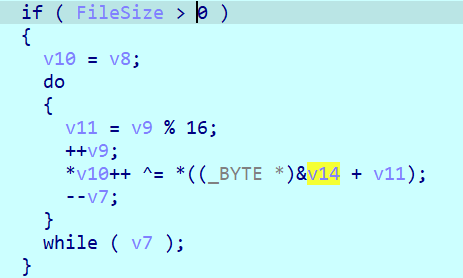

    Đây là phần mã hóa file bằng các giá trị random đã cho từ trước bằng việc xor kí tự đóa với các giá trị random `seed` đã cho. Có thể tóm lược đơn giản như sau.

    ```python
    for i in range(len(buffer)):
        buffer[i] ^= byte_random[i % 16] 
    ```

    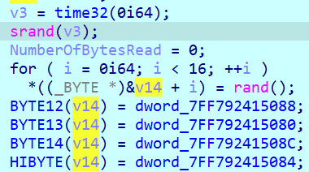

    Như vậy bài này này `seed` là sử dụng giá trị của thời gian hiện tại `time32(0i64)`.

    Chương trình thực hiện lấy các 16 giá trị random rùi thực hiện đặt lại các giá trị random thứ `12`, `13`, `14`, `15`.

    Ở đây ta dễ dàng lấy được giá trị thứ `12`, `13`, `14`, `15` khi debug:

    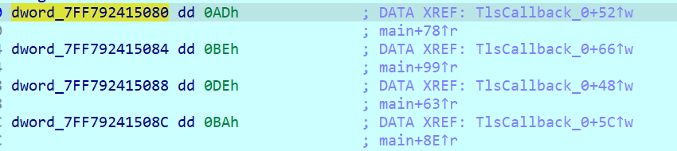

    Để ý ở phần comment ta thấy các biến này còn được gọi ở một trong một hàm khác tên là `TlsCallback_0`, click vào và thực hiện đặt `break_point` thì ta thấy hàm này được gọi trước khi nào hàm main.

    - TLS là gì:

        **Thread-local storage (TLS)** là một kỹ thuật trong lập trình đa luồng cho phép các biến được khai báo là `local` cho mỗi `thread`. Mỗi `thread` có một bản sao của các biến này, do đó mỗi `thread` có thể đọc và ghi các biến này mà không ảnh hưởng đến các `thread` khác.

        **TLS callback** là một hàm được gọi khi một `thread` được tạo ra hoặc kết thúc. Hàm này có thể được sử dụng để khởi tạo các biến local cho mỗi `thread`.

    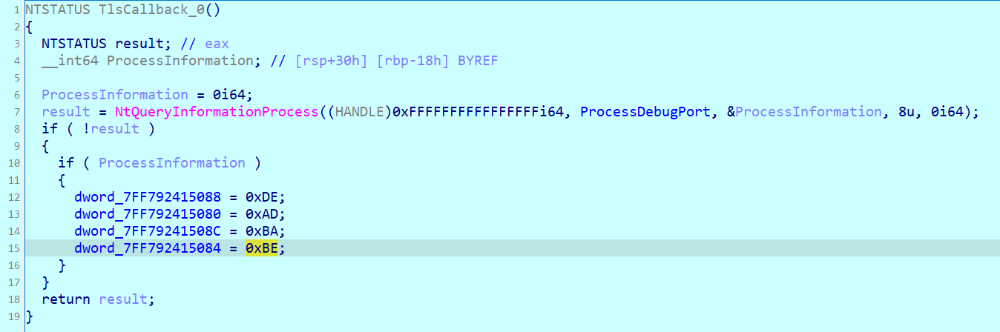

- Đoạn code này có chức năng kiểm tra xem một tiến trình có đang được gắn với trình gỡ lỗi (`debugger`) hay không (`anti_debug` này). Cụ thể, nó sử dụng hàm `NtQueryInformationProcess` với tham số `ProcessDebugPort` để lấy thông tin về cổng `debug` của tiến trình.

    `NtQueryInformationProcess` là một hàm để truy xuất thông tin về một tiến trình. Trong trường hợp này, nó được gọi với tham số `ProcessDebugPort`, có nghĩa là hàm này sẽ trả về thông tin về cổng debug của tiến trình (nếu có).

    Tham số thứ hai `(HANDLE)0xFFFFFFFFFFFFFFFFi64` đại diện cho tiến trình hiện tại (là `-1`, tương đương với giá trị `0xFFFFFFFFFFFFFFFF` trong mã hex).

    `ProcessInformation` là một biến nhận giá trị từ hàm `NtQueryInformationProcess`, và nó sẽ chứa thông tin về cổng debug của tiến trình.

- Kết quả trả về của `NtQueryInformationProcess`:

    Nếu hàm trả về `0` (`STATUS_SUCCESS`), tức là lệnh đã thành công. Nếu `ProcessInformation` có giá trị khác không, điều này có nghĩa là **tiến trình đang được debug**, vì có một cổng debug được gắn với tiến trình. Vì vậy, đoạn code này có thực hiện kiểm tra xem tiến trình hiện tại có đang bị debug hay không bằng cách kiểm tra giá trị của `ProcessInformation` sau khi gọi `NtQueryInformationProcess`.

- Tóm lại, đoạn code có kiểm tra debugger, do ta đang debug nên các giá trị sẽ sẽ được gán lần lượt là `0xDE`, `0xAD`, `0xBA`, `0xBE`. Vậy để nhận giá trị đúng chúng ta cần by pass nhảy qua câu lệnh if này. Lúc này chúng ta sẽ nhận được giá trị cần quan tâm:

    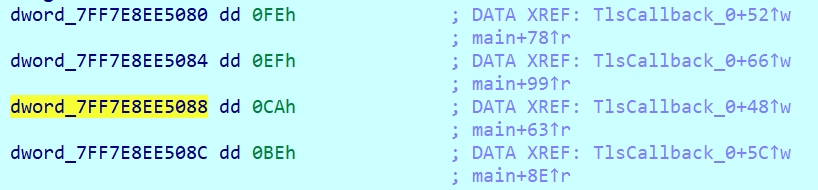

- Sau khi xong xuôi thì chúng ta đến việc ngồi tìm seed của bài này sao cho chuẩn, bằng kiểu format của flag là `KCSC{` thì khả năng cao các byte đầu tiên chính là `0x4b`, `0x43`, `0x53`, `0x43`, `0x7b`, bây giờ chúng ta chỉ cần tìm seed sao cho byte cuối các giá trị random đó bằng `flag_en[i] ^ KCSC[i]`. Tóm lược lại như sau (do time32 là kiểu dữ liệu 32 bit nên nó chỉ có giá trị từ 0 đến 2^32 - 1):

    ```C
    #include<stdio.h>
    #include <stdlib.h>
    int flag_en[101] = 
    {
        0xf4, 0xb6, 0x74, 0x47, 0x38, 0x1a, 0xae, 0x65, 0xd4, 0x82,
        0xa5, 0xbb, 0xea, 0x9f, 0xd0, 0x87, 0x9f, 0x97, 0x48, 0x6d,
        0x63, 0x06, 0xa9, 0x65, 0x9a, 0xc3, 0xae, 0xbe, 0xea, 0x8a,
        0xd6, 0x9a, 0xde, 0xd5, 0x55, 0x6b, 0x2a, 0x54, 0xb2, 0x65,
        0xd7, 0x82, 0xa5, 0xbb, 0xea, 0x92, 0xdf, 0x82, 0x9f, 0x99,
        0x48, 0x6d, 0x63, 0x15, 0xa8, 0x64, 0x9a, 0xc1, 0xa8, 0xa3,
        0xab, 0xde, 0xca, 0x9a, 0xd1, 0x92, 0x07, 0x60, 0x22, 0x19,
        0xe6, 0x62, 0xd5, 0xcb, 0xe0, 0xb7, 0xa4, 0x96, 0x9e, 0x96,
        0xda, 0x80, 0x07, 0x69, 0x2c, 0x00, 0xe6, 0x6d, 0xd3, 0x82,
        0xb4, 0xbe, 0xaf, 0xde, 0xd0, 0x8e, 0xc6, 0xd4, 0x06, 0x79
    };

    int KCSC[6] = 
    {
        0x4b, 0x43, 0x53, 0x43, 0x7b
    };

    int check[6] =
    {
        0xbf, 0xf5, 0x27, 0x04, 0x43
    };

    int main(){
        for (int i = 0; i < 4294967295; i++){
            srand(i);
            int count = 0;
            for (int j = 0; j < 5; j++){
                int tmp = rand();
                tmp &= 0xff;
                if (tmp == check[j]) count++;
                else break;
            }
            if (count == 5){
                printf("%d,\n", i);
                break;
            }
        }
    }
    ```

- Sau khi brute force để thấy có nhiều giá trị seed thỏa mãn, khi mình thử các seed đóa thì đều thỏa mãn các byte cuối giống nhau nên mình sẽ chỉ lấy đại diện một số thui (`13973678`).

    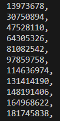

- Xong xuôi thì viết source code để lấy flag thoai:

    ```C
    #include<stdio.h>
    #include <stdlib.h>
    int flag_en[101] = 
    {
        0xf4, 0xb6, 0x74, 0x47, 0x38, 0x1a, 0xae, 0x65, 0xd4, 0x82,
        0xa5, 0xbb, 0xea, 0x9f, 0xd0, 0x87, 0x9f, 0x97, 0x48, 0x6d,
        0x63, 0x06, 0xa9, 0x65, 0x9a, 0xc3, 0xae, 0xbe, 0xea, 0x8a,
        0xd6, 0x9a, 0xde, 0xd5, 0x55, 0x6b, 0x2a, 0x54, 0xb2, 0x65,
        0xd7, 0x82, 0xa5, 0xbb, 0xea, 0x92, 0xdf, 0x82, 0x9f, 0x99,
        0x48, 0x6d, 0x63, 0x15, 0xa8, 0x64, 0x9a, 0xc1, 0xa8, 0xa3,
        0xab, 0xde, 0xca, 0x9a, 0xd1, 0x92, 0x07, 0x60, 0x22, 0x19,
        0xe6, 0x62, 0xd5, 0xcb, 0xe0, 0xb7, 0xa4, 0x96, 0x9e, 0x96,
        0xda, 0x80, 0x07, 0x69, 0x2c, 0x00, 0xe6, 0x6d, 0xd3, 0x82,
        0xb4, 0xbe, 0xaf, 0xde, 0xd0, 0x8e, 0xc6, 0xd4, 0x06, 0x79
    };

    int main(){
        srand(13973678);
        int a[16];
        for (int i = 0; i < 12; i++){
            int tmp = rand();
            a[i] = tmp & 0xff;
        }
        a[12] = 0xCA;
        a[13] = 0xFE;
        a[14] = 0xBE;
        a[15] = 0xEF;
        for (int i = 0; i < 100; i++){
            printf("%c", flag_en[i] ^ a[i % 16]);
        }
    }
    ```

- Flag:

    ```txt
    KCSC{nhin em anh boi roi anh thua roi tim em lam loi anh chua tung dam noi anh yeu mot ai the nay!!}
    ```


# 3_ELIF (Easy)

- Chall: [FILE](0_CHALL/3_ELIF.rar).

- Bài này cung cấp cho ta một file python có nhiệm vụ check_flag bằng hệ phương trình tổng các giá trị mã ASCII của input đầu vào. Z3 thui không có gì.

    ```python
    from z3 import *

    inp = [Int(f"inp[{i}]") for i in range(49)]
    s = Solver()

    s.add(inp[0] == 0x4b)
    s.add(inp[1] == 0x43)
    s.add(inp[2] == 0x53)
    s.add(inp[3] == 0x43)
    s.add(inp[4] == 0x7b)

    s.add(inp[30] + inp[44] + inp[16] + inp[38] + inp[47] + inp[7] == 398)
    s.add(inp[41] + inp[22] + inp[38] + inp[33] + inp[28] + inp[20] == 451)
    s.add(inp[10] + inp[3] + inp[39] + inp[14] + inp[4] + inp[47] == 440)
    s.add(inp[2] + inp[12] + inp[45] + inp[4] + inp[42] + inp[30] == 581)
    s.add(inp[36] + inp[36] + inp[26] + inp[43] + inp[21] + inp[1] == 587)
    s.add(inp[16] + inp[3] + inp[16] + inp[20] + inp[38] + inp[39] == 274)
    s.add(inp[28] + inp[39] + inp[18] + inp[38] + inp[47] + inp[8] == 372)
    s.add(inp[25] + inp[19] + inp[36] + inp[19] + inp[20] + inp[31] == 470)
    s.add(inp[44] + inp[27] + inp[5] + inp[41] + inp[16] + inp[42] == 565)
    s.add(inp[46] + inp[35] + inp[8] + inp[1] + inp[4] + inp[47] == 447)
    s.add(inp[41] + inp[20] + inp[42] + inp[40] + inp[3] + inp[43] == 503)
    s.add(inp[36] + inp[4] + inp[21] + inp[46] + inp[34] + inp[38] == 532)
    s.add(inp[43] + inp[45] + inp[3] + inp[45] + inp[3] + inp[17] == 382)
    s.add(inp[24] + inp[2] + inp[6] + inp[2] + inp[25] + inp[1] == 490)
    s.add(inp[38] + inp[41] + inp[33] + inp[34] + inp[21] + inp[42] == 569)
    s.add(inp[17] + inp[38] + inp[1] + inp[15] + inp[46] + inp[35] == 364)
    s.add(inp[40] + inp[17] + inp[34] + inp[33] + inp[39] + inp[19] == 398)
    s.add(inp[18] + inp[21] + inp[4] + inp[27] + inp[19] + inp[29] == 541)
    s.add(inp[30] + inp[34] + inp[42] + inp[26] + inp[18] + inp[47] == 588)
    s.add(inp[23] + inp[24] + inp[30] + inp[1] + inp[13] + inp[7] == 471)
    s.add(inp[17] + inp[16] + inp[32] + inp[16] + inp[15] + inp[14] == 343)
    s.add(inp[30] + inp[10] + inp[24] + inp[3] + inp[40] + inp[3] == 519)
    s.add(inp[10] + inp[34] + inp[27] + inp[38] + inp[46] + inp[40] == 480)
    s.add(inp[6] + inp[6] + inp[46] + inp[35] + inp[5] + inp[13] == 357)
    s.add(inp[18] + inp[16] + inp[5] + inp[6] + inp[12] + inp[32] == 411)
    s.add(inp[1] + inp[3] + inp[37] + inp[4] + inp[22] + inp[44] == 514)
    s.add(inp[26] + inp[11] + inp[12] + inp[47] + inp[22] + inp[2] == 541)
    s.add(inp[32] + inp[32] + inp[18] + inp[34] + inp[31] + inp[37] == 454)
    s.add(inp[38] + inp[25] + inp[1] + inp[23] + inp[28] + inp[27] == 403)
    s.add(inp[37] + inp[11] + inp[2] + inp[24] + inp[39] + inp[21] == 457)
    s.add(inp[21] + inp[4] + inp[3] + inp[11] + inp[42] + inp[2] == 588)
    s.add(inp[11] + inp[36] + inp[27] + inp[1] + inp[18] + inp[19] == 549)
    s.add(inp[16] + inp[18] + inp[37] + inp[41] + inp[25] + inp[45] == 446)
    s.add(inp[19] + inp[19] + inp[18] + inp[8] + inp[25] + inp[14] == 453)
    s.add(inp[19] + inp[2] + inp[40] + inp[34] + inp[27] + inp[5] == 461)
    s.add(inp[48] + inp[41] + inp[33] + inp[41] + inp[23] + inp[37] == 533)
    s.add(inp[45] + inp[9] + inp[8] + inp[32] + inp[4] + inp[26] == 531)
    s.add(inp[47] + inp[27] + inp[2] + inp[32] + inp[3] + inp[38] == 393)
    s.add(inp[32] + inp[27] + inp[2] + inp[34] + inp[27] + inp[14] == 506)
    s.add(inp[24] + inp[14] + inp[39] + inp[20] + inp[3] + inp[17] == 365)
    s.add(inp[10] + inp[17] + inp[43] + inp[28] + inp[48] + inp[48] == 565)
    s.add(inp[35] + inp[47] + inp[27] + inp[42] + inp[35] + inp[37] == 415)
    s.add(inp[10] + inp[37] + inp[37] + inp[44] + inp[21] + inp[15] == 502)
    s.add(inp[9] + inp[44] + inp[9] + inp[48] + inp[38] + inp[15] == 600)
    s.add(inp[16] + inp[47] + inp[12] + inp[27] + inp[39] + inp[16] == 386)
    s.add(inp[2] + inp[37] + inp[32] + inp[41] + inp[9] + inp[13] == 485)
    s.add(inp[25] + inp[18] + inp[25] + inp[41] + inp[40] + inp[11] == 566)
    s.add(inp[36] + inp[37] + inp[4] + inp[12] + inp[35] + inp[42] == 546)
    s.add(inp[45] + inp[32] + inp[12] + inp[19] + inp[16] + inp[3] == 371)


    if s.check() == sat:
        m = s.model()
        for c in inp: print(end = chr(m[c].as_long()))
    else:
        print("huhuhuu")
    ```

- Flag:

    ```txt
    KCSC{700_much_1f-3l53_f0r_fl46ch3ck3r!!!7ry_z3<3}
    ```

# 4_GO (Easy, Golang)

- Chall: [FILE](0_CHALL/4_GO.rar).

- Chương trình sơ sơ như sau:

    ```C
    void __cdecl main_main()
    {
    __int64 v0; // r14
    __int128 v1; // xmm15
    _QWORD *v2; // rcx
    __int64 i; // rax
    __int64 v4; // r9
    unsigned __int64 v5; // r8
    __int64 v6; // rax
    __int64 v7; // [rsp+38h] [rbp-200h]
    __int64 v8; // [rsp+40h] [rbp-1F8h]
    __int128 v9[4]; // [rsp+48h] [rbp-1F0h] BYREF
    char v10; // [rsp+90h] [rbp-1A8h] BYREF
    _QWORD *input; // [rsp+1D8h] [rbp-60h]
    __int128 v12; // [rsp+1E0h] [rbp-58h]
    void *v13; // [rsp+1F0h] [rbp-48h]
    char **v14; // [rsp+1F8h] [rbp-40h]
    void *v15; // [rsp+200h] [rbp-38h]
    char **v16; // [rsp+208h] [rbp-30h]
    const char *v17; // [rsp+210h] [rbp-28h]
    _QWORD *v18; // [rsp+218h] [rbp-20h]
    void *v19; // [rsp+220h] [rbp-18h]
    char **v20; // [rsp+228h] [rbp-10h]

    if ( (unsigned __int64)&v10 <= *(_QWORD *)(v0 + 16) )
        runtime_morestack_noctxt_abi0();
    v8 = 18LL;
    sub_5DF062(v9, (__int128 *)"\x1B");
    input = (_QWORD *)runtime_newobject();
    *input = 0LL;
    v19 = &10h;
    v20 = &aEnterYourFlag;
    fmt_Fprint();
    v17 = "\b";
    v18 = input;
    fmt_Fscanln();
    v2 = input;
    if ( input[1] != 51LL )
    {
        v15 = &10h;
        v16 = &aWrongLength;
        fmt_Fprintln();
        os_Exit();
        v2 = input;
    }
    for ( i = 0LL; i < 51; i = v4 + 1 )
    {
        if ( (unsigned __int64)i >= v2[1] )
        runtime_panicIndex();
        v4 = i;
        v5 = i - (i & 0xFFFFFFFFFFFFFFE0LL);
        if ( v5 >= 0x20 )
        runtime_panicIndex();
        if ( *(&v8 + i) != ((unsigned __int8)aYxv0ag9ybm9vym[v5] ^ (unsigned __int64)*(unsigned __int8 *)(i + *v2)) )
        {
        v7 = i;
        v13 = &10h;
        v14 = &aWrongFlag;
        fmt_Fprintln();
        os_Exit();
        v2 = input;
        v4 = v7;
        }
    }
    v12 = v1;
    runtime_concatstring2();
    v6 = runtime_convTstring();
    *(_QWORD *)&v12 = &10h;
    *((_QWORD *)&v12 + 1) = v6;
    fmt_Fprintln();
    os_Exit();
    }
    ```

- Về chall này thì sẽ thực hiện lấy input đề bài cho đi xor với các kí tự ở trong mảng `aYxv0ag9ybm9vym`. Sau đó so sánh giá trị xor được với mảng `v8`. Vậy chúng ta chỉ cần trích được phần data ở trong `v8` và mảng `aYxv0ag9ybm9vym`.

- Giải thích: `v5 = i - (i & 0xFFFFFFFFFFFFFFE0LL);`.

    `i & 0xFFFFFFFFFFFFFFE0LL:` Khi i & 0xFFFFFFFFFFFFFFE0LL, nó sẽ làm xóa 5 bit cuối cùng của i, tức là làm cho giá trị của i trở thành bội số gần nhất của `32` (vì `5` bit cuối cùng bằng `0` tương đương với chia hết cho `32`).
    
    `i - (i & 0xFFFFFFFFFFFFFFE0LL):` Sau khi thực hiện phép `and` ở bước trên, phần này tính giá trị `v5` bằng cách lấy giá trị của `i` trừ đi bội số gần nhất của `32`.
    
    Kết quả của phép trừ này chính là phần dư của `i` khi chia cho `32`, hoặc có thể hiểu đơn giản hơn: `v5` sẽ bằng `i` `%` `32` (phần dư khi `i` chia cho `32`).

- Về việc lấy dữ liệu ở trong mảng v8, ta thực hiện viết script (máy của mình bắt đầu từ địa chỉ `000000C0001C3D80`, cái này là tùy từng máy nhá). Do `v8` được là mảng các giá trị 8 byte nên khi viết script sẽ cần chú ý điều này.

    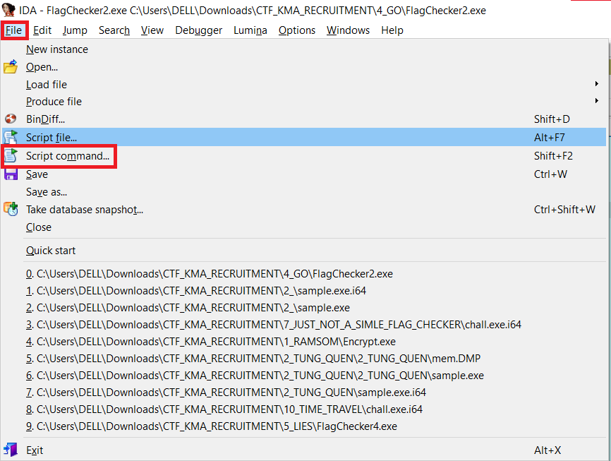

    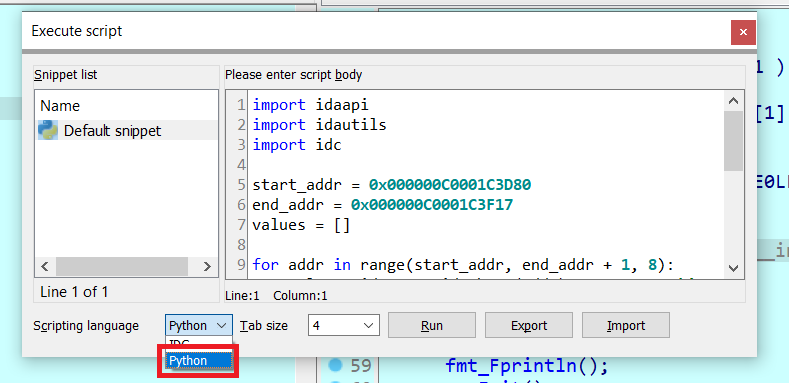

    ```python
    import idaapi
    import idautils
    import idc

    start_addr = 0x000000C0001C3D80
    end_addr = 0x000000C0001C3F17
    values = []

    for addr in range(start_addr, end_addr + 1, 8):
        value = idc.get_wide_byte(addr)     # Đọc giá trị byte tại địa chỉ `addr`
        values.append(value)                # Thêm giá trị vào danh sách
    print(values)

    f = open('z_file.txt', 'w')
    for i in range(len(values)):
        if i % 10 == 9: f.write(f"0x{values[i]:02x},\n")
        else: f.write(f"0x{values[i]:02x}, ")
    f.close()
    print("OK")
    ```

- Dán code trên vào rồi thực hiện, giá trị của biến `v8` sẽ được in ra `Console Output`.

- Sau khi lấy được hết rùi thì phần còn lại chỉ là thủ tục:

    ```python
    flag_en = [
        0x12, 0x1b, 0x05, 0x73, 0x1a, 0x70, 0x51, 0x48, 0x57, 0x32,
        0x08, 0x43, 0x06, 0x5e, 0x05, 0x5d, 0x1b, 0x5b, 0x05, 0x19,
        0x6e, 0x00, 0x7c, 0x29, 0x01, 0x3f, 0x40, 0x06, 0x0f, 0x01,
        0x23, 0x0b, 0x6a, 0x07, 0x61, 0x55, 0x00, 0x75, 0x5d, 0x18,
        0x53, 0x5a, 0x66, 0x4a, 0x6a, 0x51, 0x02, 0x49, 0x43, 0x4c,
        0x48
    ]

    xor = [
        0x59, 0x58, 0x56, 0x30, 0x61, 0x47, 0x39, 0x79, 0x62, 0x6D, 
        0x39, 0x76, 0x59, 0x6D, 0x31, 0x68, 0x62, 0x6D, 0x35, 0x75, 
        0x5A, 0x6E, 0x4A, 0x76, 0x62, 0x57, 0x74, 0x6A, 0x63, 0x32, 
        0x4D, 0x3D
    ]

    for i in range(len(flag_en)): print(end = chr(xor[i % 32] ^ flag_en[i]))
    ```

- Flag:

    ```txt
    KCSC{7h15_15_345y60l4n6_ch4ll3n63_7ea2da17_<3<3!!!}
    ```


<!-- 
# 5_LIES (Hard)

- Chall: [FILE](0_CHALL/5_LIES.rar).

# 6_SHELTER (Medium)

- Chall: [FILE](0_CHALL/6_SHELTER.rar).

# 7_JUST_NOT_A_SIMLE_FLAG_CHECKER (hard)

- Chall: [FILE](0_CHALL/7_JUST_NOT_A_SIMLE_FLAG_CHECKER.rar).-->

# 8_RIEL_WARMUP_DONE (warmup)

- Chall: [FILE](0_CHALL/8_RIEL_WARMUP_DONE.rar).

- Đây là một bài khởi động nhẹ nhàng và tình cảm, nhưng không đến nỗi `F5` là ra nên ai mà phụ thuộc vào `F5` quá nhiều thì chắc cũng thẹo.

    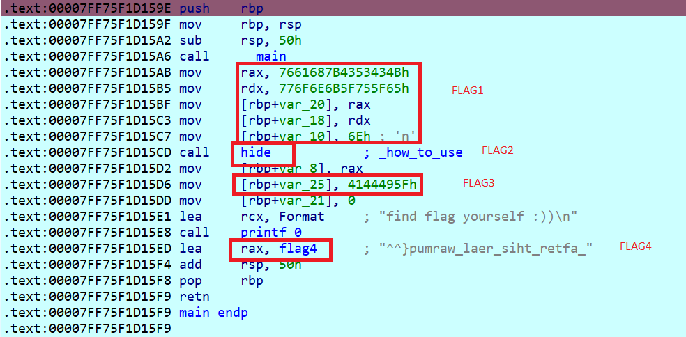

- FLAG1: một giá trị 8 byte được đẩy vào thanh `rax` và `rdx`, sau đó chuyển vào vùng bộ nhớ tại địa chỉ `[rbp-0x20]` và `[rbp+var_18]`, xong chuyển 0x6E vào vùng bộ nhớ tại địa chỉ [`rbp+var_10]`.

    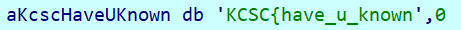

- FLAG2: 

    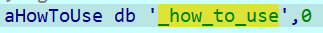

- FLAG3: tương tự FLAG1.

    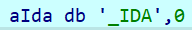

- FLAG4: chuỗi được đảo ngược lại.

    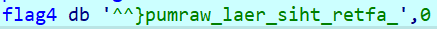

- Ghép 4 phần lại ta được flag:

    ```txt
    KCSC{have_u_known_how_to_use_IDA_after_this_real_warmup}
    ```

# 9_SIMPLE_FLAG_CHECKER_BUT_NO_SEE (medium, easy)

- Chall: [FILE](0_CHALL/9_SIMPLE_FLAG_CHECKER_BUT_NO_SEE.rar).

- Bài này cho ta một file Java và khi làm bài này tui phải ngồi đoán xem chương trình nó sẽ kiểm tra như thế nào vì dường như tác giả đã cố tình giấu tên hàm đi và cho ta một phần check khá là bựa.

    ```java
    if (check(check(check(check(check(ret, input), input, isDigit), input, pos), input, let), input, ""))
    ```

- Ta thực hiện từ trong ra ngoài, với **phần check đầu tiên:**

    ```java
    check(ret, input)
    ```

    Do chỉ có 2 tham số cần truyền vào nên ta sẽ ưu tiên tìm những hàm cần 2 tham số đầu vào. Khi xem ở trên thì chúng ta thấy có duy nhất 1 hàm thỏa mãn.

    ```java
	public static boolean check(boolean ret, String s) {
		if ((!s.substring(0, 5).equals("KCSC{")) || !(s.charAt(s.length() - 1) == '}'))
			ret = false;
		return ret;
	}
    ```

    Nội dung của hàm là check xem có đúng format của flag chưa, không có gì lắm

- **Phần check thứ 2:**

    ```java
    check(true, input, isDigit)
    ```

    Ta lần lượt mò từng hàm ở trên xem hàm nào có dính líu một xíu với isDigit hay check chữ số là ta tóm lun (`isDigit[]` là một mảng bool chứa các giá trị true và false). Sau một hồi ta tóm được hàm phù hợp nhất:

    ```java
	boolean[] isDigit = { false, false, false, false, false, false, false, false, false, false, true, false,
				false, false, false, true, false, false, false, true, false, false, false, false, false, false, false,
				false, true, false, true, false, false, false, false, false, false, false, false, false, false, false,
				false, false, true, false, false, false, false, true, false, false, false, false, false, false, false };

    static int[] pos = { 10, 15, 19, 28, 30, 44, 49 };

    public static boolean check(boolean ret, String s, boolean[] arr) {
        int[] num = new int[10];

        for (int i = 0; i < s.length(); ++i) {
            if (Character.isDigit(s.charAt(i)) != arr[i])
                ret = false;
        }
        for (int i = 0; i < pos.length; ++i) {
            num[i] = s.charAt(pos[i]) - 0x30;
        }
        if ((num[1] != num[6])
                || (num[0] != num[1] - num[6])
                || (num[3] + num[4] != num[1])
                || (num[6] * num[5] != 20)
                || (num[0] != num[2])
                || (Math.pow(num[3], num[5]) != 256)
                || ((num[1] ^ num[4]) != 4)
                || (num[1] != 5)) {
            ret = false;
        }
        return ret;
    }
    ```

    Như vậy thông qua hàm này là chúng ta biết được flag sẽ có chiều dài là `57` (dựa vào số phần tử của mảng `isDigit[]` và những vị trí được là chữ số hay không và có thể tìm luôn được những giá trị của kí tự đóa ở vị trí là chữ số).

    Bài sẽ lấy ra kí tự thứ `pos[i]` của flag rùi thực hiện lấy kí tự đó trừ đi 0x30, việc này làm lấy giá trị của kí tự đó 

    Để tìm được các giá trị đóa thì chúng ta 1 là nhìn nhanh (tui thấy tự nhẩm được giá trị), 2 là quăng vào `z3`. Sau khi nhẩm qua thì ta thấy có những giá trị như sau:

    ```python
    num[0] = 0
    num[1] = 5
    num[2] = 0
    num[3] = 4
    num[4] = 1
    num[5] = 4
    num[6] = 5
    ```

    Như vậy đến lúc này ta sẽ được flag như sau:

    ```txt
    KCSC{*****0****5***0********4*1*************4****5******}
    ```

- **Phần check thứ 3:**

    ```java
    check(true, input, pos)
    ```

    Tương tự như ở phần check thứ 2, ta không khó để tìm hàm phù hợp với phần check này.

    ```java
    int[] pos = { 17, 21, 24, 29, 32, 35, 38, 47, 52 };

    public static boolean check(boolean ret, String s, int[] arr) {
        for (int i = 0; i < arr.length; ++i) {
            if (s.charAt(arr[i]) != 95)
                return false;
        }
        return ret;
    }
    ```

    Hàm này chỉ đơn giản là kiểm tra những kí tự ở vị trí pos[i] xem nó có là kí tự `_` hay không. Sau phần này ta sẽ được flag như sau:

    ```txt
    KCSC{*****0****5*_*0*_**_***4_1*_**_**_*****4**_*5**_**?}
    ```

- **Phần check thứ 4:**

    ```txt
    check(true, input, let)
    ```

    ```java
    char[] let = { 't', 'P', 'i', 'o', 't', 'L', 'n', 'y', 'i', 'm', 'h', 'r', 'c', 'p', 'o', 'h', 'r', 'i', 'P', 'm' };
    
    public static boolean check(boolean ret, String s, char[] arr) {
        int l = 5, r = 55, cnt = 0;
        while (cnt < arr.length) {
            while (!Character.isLetter(s.charAt(l)))
                l++;
            while (!Character.isLetter(s.charAt(r)))
                r--;
            if (s.charAt(r) != arr[cnt] || s.charAt(l) != arr[cnt + 1]) {
                ret = false;
            }
            cnt += 2;
            l++;
            r--;
        }
        return ret;
    }
    ```

    Nội dung chính của hàm này đó chính là kiểm tra kí tự việc sử dụng 2 biến đánh dấu phần vị trí là `l` và `r`, vòng while đầu tiên sẽ thực hiện kiểm tra kí tự hiện tại có phải là chữ cái hay không, nếu không thì tăng biến l lên 1 đơn vị rùi check ở kí tự đó, đến khi nào tìm được kí tự là chữ cái thì dừng. Vòng while tiếp theo tương tự như thế nhưung mà chỉ là từ cuối lên trên thui. Sau khi tìm được vị trí là kí tự thì mới thực hiện so sánh với kết quả trong `let[]`.

    Ban đầu khi làm bài này là mình quá ngây thơ mà cứ việc lấy một cách lần lượt, bởi vì tất cả các phần từ còn lại đều không phải là chữ số, mình quên mất một điều là ngoài chữ cái, chữ số thì còn có những kí tự đặc biệt, nên như vậy thì hàm này chúng ta sẽ không thể biết chính xác được vị trí nào là chữ cái và là kí tự đặc biệt. Thế nên chúng ta sẽ thực hiện check ở **phần check thứ 5** trước rùi mới quay lại hàm này sau vì dường như hàm này hiện tại đang không thể mò ngược lại được. Vậy tại sao mình lại liên tưởng đến **kí tự đặc biệt**, ở **phần 5** có một `hint` cho điều đó.

- **Phần check thứ 5:**

    ```txt
    check(true, input, "")
    ```

    ```java
    static int[] f1nal = { 18, 20, 22, 23, 25, 26, 27, 31, 33, 34, 36, 37, 39, 40 };

    public static boolean check(boolean ret, String s, String tmp) {
        for (int i = 0; i < f1nal.length; ++i)
            tmp += s.charAt(f1nal[i]);

        if (((tmp.charAt(2) ^ tmp.charAt(0)) != 32)
                || (tmp.charAt(0) + tmp.charAt(5) + tmp.charAt(6) != 294)
                || (tmp.charAt(1) * tmp.charAt(3) != 8160)
                || ((tmp.charAt(3) ^ tmp.charAt(4)) != 44)
                || ((tmp.charAt(2) ^ tmp.charAt(3)) != 9)
                || (tmp.charAt(0) * tmp.charAt(3) != 8058)
                || (tmp.charAt(3) - tmp.charAt(4) != 28)
                || ((tmp.charAt(2) ^ tmp.charAt(7)) != 28)
                || (tmp.charAt(12) - tmp.charAt(13) + tmp.charAt(9) - tmp.charAt(8) != 38)
                || (tmp.charAt(3) - tmp.charAt(4) != 28)
                || ((tmp.charAt(2) ^ tmp.charAt(11)) != 0)
                || (tmp.charAt(4) - tmp.charAt(6) != -44)
                || ((tmp.charAt(6) ^ tmp.charAt(8)) != 19)
                || (tmp.charAt(9) - tmp.charAt(5) != 25)
                || (tmp.charAt(0) + tmp.charAt(5) + tmp.charAt(7) != 291)
                || ((tmp.charAt(10) ^ tmp.charAt(5)) != 21)
                || (tmp.charAt(1) != tmp.charAt(13))
                || (tmp.charAt(11) != 111)
                || (s.charAt(s.length() - 2) != 63)) {
            ret = false;
        }
        return
    }
    ```

    Nhìn vô hàm check này là `z3` rùi, điều đặc biệt trong lần check lần này đó chính là có một câu lệnh chả liên quan gì đến hầu hết các câu lệnh check còn lại đó chính là `(s.charAt(s.length() - 2) != 63)`, oce xem thử giá trị này là giá trị nào thì phát hiện ra một điều đó là kí tự `?`. Oce thế nên `mindset` ở phần check 4 là lấy lần lượt là cực kì sida, mình phải thực hiện check phần 5 trước rùi còn thừa những vị trí nào thì ta sẽ chèn lần lượt vô đó sau. Vì phần check 4 với phần check 5 không bị phụ thuộc lẫn nhau nên thoải mái.

    Phần Z3 tìm các giá trị trên:

    ```python
    from z3 import *

    a = [BitVec(f"a[{i}]", 64) for i in range(14)]
    s = Solver()

    s.add(a[0] + a[5] + a[6] == 294)
    s.add(a[1] * a[3] == 8160)
    s.add(a[3] ^ a[4] == 44)
    s.add(a[2] ^ a[3] == 9)
    s.add(a[0] * a[3] == 8058)
    s.add(a[3] - a[4] == 28)
    s.add(a[2] ^ a[7] == 28)
    s.add(a[12] - a[13] + a[9] - a[8] == 38)
    s.add(a[3] - a[4] == 28)
    s.add(a[2] ^ a[11] == 0)
    s.add(a[4] - a[6] == -44)
    s.add(a[6] ^ a[8] == 19)
    s.add(a[9] - a[5] == 25)
    s.add(a[0] + a[5] + a[7] == 291)
    s.add(a[10] ^ a[5] == 21)
    s.add(a[1] == a[13])
    s.add(a[11] == 111)

    if s.check() == sat:
        m = s.model()
        for c in a:
            print(f"'{chr(m[c].as_long())}'", end = ' ')
    # 'O' 'P' 'o' 'f' 'J' 'a' 'v' 's' 'e' 'z' 't' 'o' 'a' 'P'
    ```

    Đưa lần lượt các kí tự đó vào những ví trị mà đã được đánh dấu sẵn trong `f1nal[]` thui, ta được flag như sau:

    ```txt
    KCSC{*****0****5*_O0P_of_Jav4_1s_ez_to_aP***4**_*5**_**?}
    ```

- Bây giờ thì ngon rùi, còn đúng 20 kí tự chưa được biết mà bây giờ quay lại hàm check thứ 4 thì có đúng 20 kí tự kiểm tra, cứ thế mà spam vào và lấy flag thoai.

    ```txt
    KCSC{PoLym0rphi5m_O0P_of_Jav4_1s_ez_to_aPPro4ch_i5nt_it?}
    ```

# 10_TIME_TRAVEL (easy)

- Chall: [FILE](0_CHALL/10_TIME_TRAVEL.rar).

- Đây là một bài mã hóa file, việc max hóa na ná bài `2_TUNG_QUEN` nhưng ở mức độ dễ hơn, thui không có gì đề giải thích nữa vô thẳng viết source code luôn.

- Tìm seed:

    ```C
    #include<stdio.h>
    #include <stdlib.h>
    int flag_en[74] = 
    {
        0x68, 0x68, 0x7d, 0xc6, 0x37, 0x8e, 0xfd, 0xeb, 0x34, 0xfe,    
        0x17, 0xfe, 0x9d, 0x28, 0xe0, 0x04, 0x70, 0x85, 0xb7, 0x44,    
        0x68, 0x37, 0xc0, 0xfb, 0x22, 0xc9, 0xa0, 0x49, 0xbd, 0x2a,    
        0xb6, 0xcf, 0xb8, 0x45, 0xbd, 0x44, 0x50, 0x87, 0xb1, 0x48,    
        0xf3, 0xc9, 0x7c, 0x23, 0xb8, 0xf9, 0x2e, 0x83, 0xbd, 0xee,    
        0xa8, 0xd9, 0x08, 0xef, 0x37, 0x98, 0x1c, 0x76, 0xc5, 0x13,    
        0xf6, 0xf0, 0xdc, 0x0e, 0x2a, 0x51, 0xbd, 0xd4, 0x23, 0x64,    
        0x84, 0x53, 0xe1, 0x4b
    };

    int KCSC[6] = 
    {
        0x4b, 0x43, 0x53, 0x43, 0x7b
    };

    int check[6] =
    {
        0x23, 0x2b, 0x2e, 0x85, 0x4c
    };

    int main(){
        for (int i = 0; i < 4294967295; i++){
            srand(i);
            int count = 0;
            for (int j = 0; j < 5; j++){
                int tmp = rand();
                tmp &= 0xff;
                if (tmp == check[j]) count++;
                else break;
            }
            if (count == 5){
                printf("%d", i);
                break;
            }
        }
    }
    ```

    Tìm được 1 giá trị seed thỏa mãn là: `16777215`.

- Lấy flag:

    ```C
    #include<stdio.h>
    #include <stdlib.h>
    int flag_en[74] = 
    {
        0x68, 0x68, 0x7d, 0xc6, 0x37, 0x8e, 0xfd, 0xeb, 0x34, 0xfe,    
        0x17, 0xfe, 0x9d, 0x28, 0xe0, 0x04, 0x70, 0x85, 0xb7, 0x44,    
        0x68, 0x37, 0xc0, 0xfb, 0x22, 0xc9, 0xa0, 0x49, 0xbd, 0x2a,    
        0xb6, 0xcf, 0xb8, 0x45, 0xbd, 0x44, 0x50, 0x87, 0xb1, 0x48,    
        0xf3, 0xc9, 0x7c, 0x23, 0xb8, 0xf9, 0x2e, 0x83, 0xbd, 0xee,    
        0xa8, 0xd9, 0x08, 0xef, 0x37, 0x98, 0x1c, 0x76, 0xc5, 0x13,    
        0xf6, 0xf0, 0xdc, 0x0e, 0x2a, 0x51, 0xbd, 0xd4, 0x23, 0x64,    
        0x84, 0x53, 0xe1, 0x4b
    };

    int main(){
        srand(16777215);
        for (int i = 0; i < 74; i++){
            int tmp = rand();
            tmp &= 0xff;
            printf("%c", flag_en[i] ^ tmp);
        }
    }
    ```

- Flag:

    ```txt
    KCSC{0xffffff_is_1970-07-14,I_created_this_challenge_at_"the_end"_of_time}
    ```