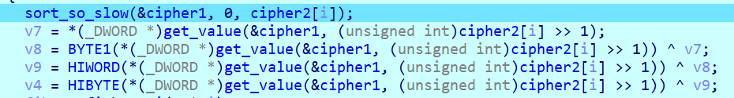
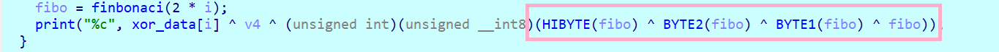

- Đây là một chall mình thấy khá là hay, tuy chương trình trông đơn giản và ngắn gọn nhưng cũng để tìm được flag cho bài này thì cũng không dễ dàng gì.

- Hàm `main()` của chương trình sẽ như sau:

    ```C
    int __fastcall main(int argc, const char **argv, const char **envp)
    {
    unsigned __int8 v4; // [rsp+21h] [rbp-27h]
    int i; // [rsp+24h] [rbp-24h]
    int fibo; // [rsp+28h] [rbp-20h]
    char v7; // [rsp+2Ch] [rbp-1Ch]
    char v8; // [rsp+30h] [rbp-18h]
    char v9; // [rsp+34h] [rbp-14h]

    for ( i = 0; i < 50; ++i )
    {
        sort_so_slow(&cipher1, 0, cipher2[i]);
        v7 = *(_DWORD *)get_value(&cipher1, (unsigned int)cipher2[i] >> 1);
        v8 = BYTE1(*(_DWORD *)get_value(&cipher1, (unsigned int)cipher2[i] >> 1)) ^ v7;
        v9 = HIWORD(*(_DWORD *)get_value(&cipher1, (unsigned int)cipher2[i] >> 1)) ^ v8;
        v4 = HIBYTE(*(_DWORD *)get_value(&cipher1, (unsigned int)cipher2[i] >> 1)) ^ v9;
        fibo = finbonaci(2 * i);
        print("%c", xor_data[i] ^ v4 ^ (unsigned int)(unsigned __int8)(HIBYTE(fibo) ^ BYTE2(fibo) ^ BYTE1(fibo) ^ fibo));
    }
    return 0;
    }
    ```

- Như ta thấy do chương trình này chỉ có nhiệm vụ là in ra các kí tự trong flag nên tất cả những tham số trong chương trình này đều là cố định. Chương trình thì có nhiệm vụ là thực hiện những thao tác để cho việc chương trình in ra flag chậm nhất có thể.

- Trước hết chúng ta sẽ phân tích hàm `sort_so_slow()`, chúng ta để ý là tham số truyền vào 2 hàm này có 2 tham số là địa chỉ của một dải `map_huge[]` và một số `index`:

    ```C
    __int64 __fastcall sort_so_slow(_QWORD *map_huge, signed int _0, unsigned int index)
    {
    __int64 result; // rax
    int *v4; // rax
    unsigned int _V5; // [rsp+20h] [rbp-28h]
    _DWORD *value1; // [rsp+28h] [rbp-20h]
    int *value; // [rsp+30h] [rbp-18h]

    result = index;
    if ( _0 < (int)index )
    {
        _V5 = (int)(index + _0) >> 1;
        sort_so_slow(map_huge, _0, _V5);
        sort_so_slow(map_huge, _V5 + 1, index);
        value1 = (_DWORD *)get_value1(map_huge, _V5);
        if ( *value1 > *(_DWORD *)get_value1(map_huge, (int)index) )
        {
        value = (int *)get_value(map_huge, (int)index);
        v4 = (int *)get_value(map_huge, _V5);
        swap(v4, value);
        }
        return sort_so_slow(map_huge, _0, index - 1);
    }
    return result;
    }
    ```

    Khi mình cố để hiểu hàm này có chức năng là gì trong lúc thi với `index = 0x64` thì mình thấy quá là khó để hình dung, việc phân tích hàm này bằng việc đoán cũng khó khăn vì hàm này sử dụng đệ quy liên tục. Khiến cho mình cảm thấy oải khi phải đoán xem giá trị trả về của từng lần đệ quy.

    Sau một thời gian cố gắng guessing thì mình không thu được kết quả gì (bởi vì index = 0x64 nên việc nhận ra quy luật biến đổi của mảng là cũng không dễ dàng), nên lúc này mình sẽ thực hiện chỉnh `index` truyền vào hàm này thành những giá trị nhỏ như 1, 2, 3 để có thể đoán được hành vi của hàm này, xem dải data thay đổi như thế nào. Vì trong hàm đệ quy này mình cũng thấy có một hàm là swap, điều kiện để swap là so sánh 2 số với nhau số lớn số bé, như vậy điều đầu tiên mình nghĩ tới chức năng của vòng lặp đệ quy này là để sắp xếp. 
    
    Sau vài lần thử với các số index nhỏ thì mình đã đoán được chức năng chính của hàm `sort_so_slow()` là dùng để sắp xếp mảng `map_huge[]` với `index + 1` phần tử đầu tiên của mảng này.

    Điều khiến cho việc in ra những kí tự của flag diễn ra siêu chậm là do chương trình thực hiện nhiều hàm đệ quy xong với một số lượng lớn những hàm đệ quy sinh ra nên bị delay khá là lâu.

- Sau khi sắp xếp `index + 1` phần tử đầu tiên của `map_huge[]` thì chương trình sẽ lấy phần tử `map_huge[index >> 1]`, lấy từng byte của giá trị dword đó rùi thực hiện xor với nhau.

    Ví dụ: `map_huge[index >> 1] = 0x12345678` thì lấy những byte `0x12`, `0x34`, `0x56`, `0x78` rùi thực hiện phép tính `0x12 ^ 0x34 ^ 0x56 ^ 0x78`. Kết quả được lưu vào biến `v4`.

    

- Tiếp theo chương trình sẽ thực hiện tìm số fibonaci thứ `2*i` (với i là số thứ tự của kí tự trong flag). Đây tiếp tục là một hàm đệ quy để tìm giá trị.

    ```C
    __int64 __fastcall finbonaci(int a1)
    {
    int v2; // [rsp+20h] [rbp-18h]

    if ( !a1 )
        return 0i64;
    if ( a1 == 1 )
        return 1i64;
    v2 = finbonaci(a1 - 1);
    return (unsigned int)finbonaci(a1 - 2) + v2;
    }
    ```

- Sau khi lấy được giá trị `fibonaci[2*i]` thì chương trình lại tiếp tục xor từng byte trong giá trị dword của số fibonaci đó.

    

- Cuối cùng sẽ in ra giá trị là kết quả của phép tính `v4 ^ xor_data[i] ^ fibo_xor`.

- Như vậy ta có thể tóm tắt lại chức năng của hàm main như sau:

    - `(1):` Sắp xếp `index + 1` phần tử đầu tiên của mảng `map_huge[]` (trong đó `index` là một dải dữ liệu đã có trước ở trong chương trình).

    - `(2):` Lấy giá trị dword của phần tử `map_huge[index >> 1]`, thực hiện xor từng byte của giá trị dword đó (giả sử kết quả là `xor_value`).

    - `(3):` Tính giá trị dword của số fibonaci thứ `2 * i`, thực hiện xor từng byte của giá trị dword đó (giả sử kết quả là `xor_data`).

    - `(4):` In ra kí tự của kết quả `xor_data ^ xor_value ^ xor_data[i]`.

- Như vậy bài này ta chỉ cần sử lý phần sắp xếp với cả phần số fibonaci thì sẽ lấy được flag của bài này, do số trong đề bài số fibonaci lớn nhất chỉ là số fibonaci thứ 100 nên ta thực hiện viết 1 hàm để có thể lấy ra các số fibonaci này.

    ```py
    def fibonacci(n):
        fib_list = [0, 0x1] 
        for i in range(2, n): 
            next_fib = fib_list[i - 1] + fib_list[i - 2]
            next_fib &= 0xFFFFFFFF
            fib_list.append(next_fib)
        return fib_list

    n = 100  
    fib_numbers = fibonacci(n)
    for i in range(len(fib_numbers)):
        if i % 10 == 9: print(f'0x{fib_numbers[i]:08X}', end = ',\n')
        else: print(f'0x{fib_numbers[i]:08X}', end = ', ')
    ```

    ```data
    0x00000000, 0x00000001, 0x00000001, 0x00000002, 0x00000003, 0x00000005, 0x00000008, 0x0000000D, 0x00000015, 0x00000022,
    0x00000037, 0x00000059, 0x00000090, 0x000000E9, 0x00000179, 0x00000262, 0x000003DB, 0x0000063D, 0x00000A18, 0x00001055,
    0x00001A6D, 0x00002AC2, 0x0000452F, 0x00006FF1, 0x0000B520, 0x00012511, 0x0001DA31, 0x0002FF42, 0x0004D973, 0x0007D8B5,
    0x000CB228, 0x00148ADD, 0x00213D05, 0x0035C7E2, 0x005704E7, 0x008CCCC9, 0x00E3D1B0, 0x01709E79, 0x02547029, 0x03C50EA2,
    0x06197ECB, 0x09DE8D6D, 0x0FF80C38, 0x19D699A5, 0x29CEA5DD, 0x43A53F82, 0x6D73E55F, 0xB11924E1, 0x1E8D0A40, 0xCFA62F21,
    0xEE333961, 0xBDD96882, 0xAC0CA1E3, 0x69E60A65, 0x15F2AC48, 0x7FD8B6AD, 0x95CB62F5, 0x15A419A2, 0xAB6F7C97, 0xC1139639,
    0x6C8312D0, 0x2D96A909, 0x9A19BBD9, 0xC7B064E2, 0x61CA20BB, 0x297A859D, 0x8B44A658, 0xB4BF2BF5, 0x4003D24D, 0xF4C2FE42,
    0x34C6D08F, 0x2989CED1, 0x5E509F60, 0x87DA6E31, 0xE62B0D91, 0x6E057BC2, 0x54308953, 0xC2360515, 0x16668E68, 0xD89C937D,
    0xEF0321E5, 0xC79FB562, 0xB6A2D747, 0x7E428CA9, 0x34E563F0, 0xB327F099, 0xE80D5489, 0x9B354522, 0x834299AB, 0x1E77DECD,
    0xA1BA7878, 0xC0325745, 0x61ECCFBD, 0x221F2702, 0x840BF6BF, 0xA62B1DC1, 0x2A371480, 0xD0623241, 0xFA9946C1, 0xCAFB7902
    ```

- [Tham khảo](print_flag.py) script để in ra flag.

# 
