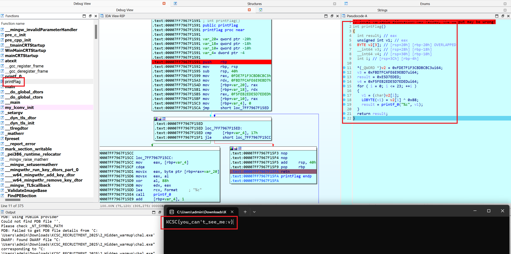
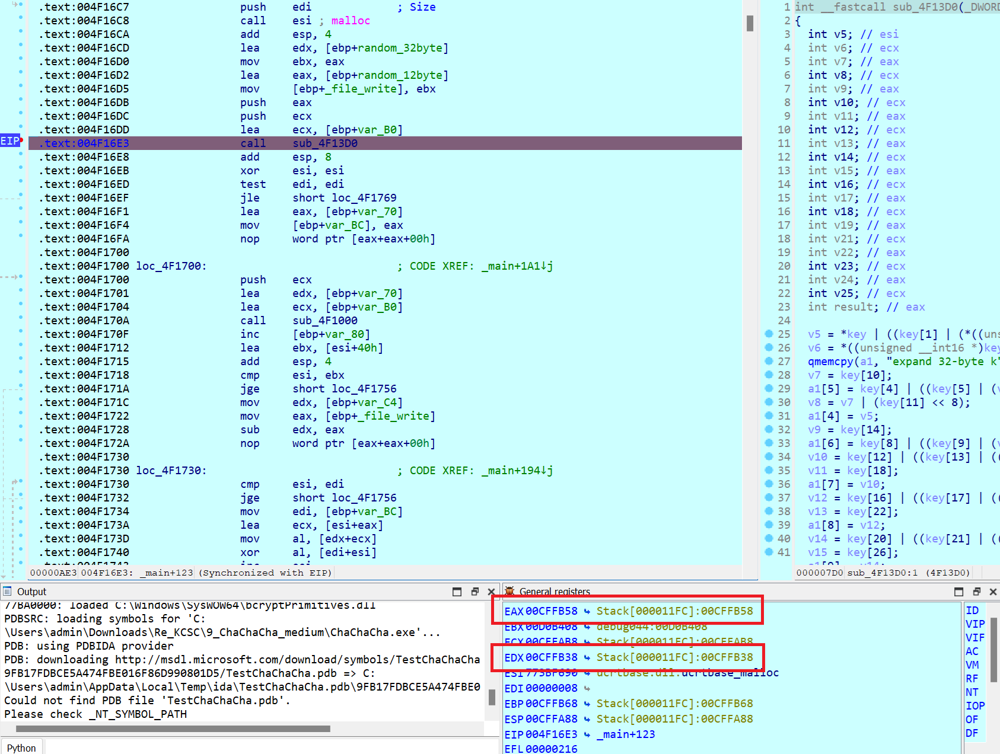
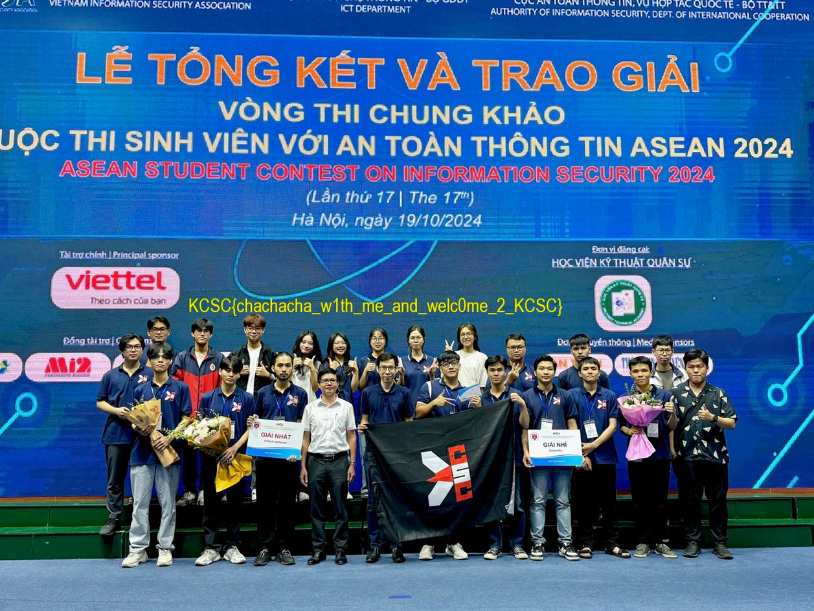

# 1_EZREV (EASY_DONE)

- Chall: [FILE](CHALL/1_EzRev.zip).

- Chương trình sẽ như sau:

    ```C
    int __fastcall main(int argc, const char **argv, const char **envp)
    {
    int i; // [rsp+20h] [rbp-28h]
    __int64 len; // [rsp+28h] [rbp-20h]

    print("Enter Something: ", argv, envp);
    scan("%s", input);
    if ( (unsigned int)check1(input) != 0x89D5B562 )
    {
        len = -1i64;
        do
        ++len;
        while ( input[len] );
        if ( len == 40 )
        {
        encrypt((__int64)input);
        isValid = 1;
        for ( i = 0; i < 40; ++i )
        {
            if ( flag_en[i] != input_en[i] )
            isValid = 0;
        }
        }
    }
    if ( isValid )
        print("Excellent!! Here is your flag: KCSC{%s}", input);
    else
        print("You're chicken!!!");
    return 0;
    }
    ```

    Ban đầu chương trình sẽ đọc dữ liệu từ bàn phím, thông qua hàm `check1()` với đầu vào là input rùi so sánh với giá trị cố định `0x89D5B562`. Nếu đúng sẽ thực hiện kiểm tra chiều dài input có là `40` hay không, sau đó thực hiện mã hóa từng kí tự trong input bằng hàm `encrypt()`. Cuối cùng check từng kí tự sau khi mã hóa với dải data `flag_en[]`.

- Hàm `check1()`:

    ```C
    __int64 __fastcall sub_7FF7C1691100(_BYTE *input)
    {
    unsigned int v2; // [rsp+0h] [rbp-28h]
    unsigned int i; // [rsp+4h] [rbp-24h]
    unsigned __int64 len_input; // [rsp+10h] [rbp-18h]

    v2 = 0x811C9DC5;
    len_input = 0xFFFFFFFFFFFFFFFFui64;
    do
        ++len_input;
    while ( input[len_input] );
    for ( i = 0; i < (unsigned int)len_input; ++i )
        v2 = 0x1000193 * ((char)input[i] ^ v2);
    return v2;
    }
    ```

    Hàm này như sau khi viết dưới python:

    ```py
    def check1(input):
        v2 = 0x811C9DC5
        for i in input:
            v2 = (0x1000193 * (i ^ v2)) & 0xFFFFFFFF
        return v2
    ```

    Do giá trị trả về của hàm này là một giá trị mà giá trị đó tính toán thông qua từng kí tự của input nên việc brute force ở hàm này là không khả thi, nên ta thực hiện setIP/chỉnh cờ/patch để có thể nhảy qua điều kiện check ở đoạn này.

- Hàm `encrypt()`:

    ```C
    __int64 __fastcall encrypt(_BYTE *INPUT)
    {
    __int64 result; // rax
    unsigned int INPPUT_I; // [rsp+0h] [rbp-38h]
    unsigned int i; // [rsp+4h] [rbp-34h]
    int j; // [rsp+8h] [rbp-30h]
    int v5; // [rsp+Ch] [rbp-2Ch]
    int v6; // [rsp+10h] [rbp-28h]
    __int64 LEN; // [rsp+18h] [rbp-20h]

    LEN = -1i64;
    do
        ++LEN;
    while ( INPUT[LEN] );
    for ( i = 0; ; ++i )
    {
        result = (unsigned int)LEN;
        if ( i >= (unsigned int)LEN )
        break;
        v5 = 4;
        v6 = 6;
        INPPUT_I = (unsigned __int8)INPUT[i];
        for ( j = 0; j < 5; ++j )
        {
        INPPUT_I ^= __ROL4__(INPPUT_I, v5) ^ __ROR4__(INPPUT_I, v6);
        v5 *= 2;
        v6 *= 2;
        }
        input_en[i] = INPPUT_I;
    }
    return result;
    }
    ```

    Hàm này thực hiện mã hóa 40 kí tự của input theo quy luật: Mỗi kí tự của `input` sẽ thực hiện biến đổi `5` lần, trong đó mỗi vòng lần sẽ thực hiện `xor` input với `2` giá trị (**giá trị 1** là giá trị dịch bit trái của kí tự đó `v5` bit và **giá trị 2** là giá trị dịch bit phải của kí tự đó `v6` bit. Chú ý mỗi vòng lặp thì giá trị của `v5` và `v6` sẽ gấp đôi giá trị của vòng lặp trước đó). 

- Sau khi mã hóa xong thì chương trình sẽ kiểm tra với dải `flag_en[]`, nếu khớp thì sẽ trả về thành công. Lúc này ta thực hiện brute force để tìm flag:

    ```python
    flag_en = [
        0xF30C0330, 0x340DDE9D, 0x750D9AC9, 0x391FBC2A, 0x9F16AF5B, 0xE6180661, 0x6C1AAC6B, 0x340DDE9D, 0xB60D5635, 0x9F16AF5B,
        0xA3195364, 0x681BBD3A, 0xF30C0330, 0xA3195364, 0xAB1B71C6, 0xF30C0330, 0xF21D5274, 0x9F16AF5B, 0xE6180661, 0x300CCFCC,
        0xF21D5274, 0x9F16AF5B, 0xAB1B71C6, 0xA3195364, 0x750D9AC9, 0xA3195364, 0x9F16AF5B, 0xF21D5274, 0xF30C0330, 0xA3195364,
        0xF21D5274, 0x351C8FD9, 0x710C8B98, 0xF70D1261, 0x2D1AE83F, 0xF30C0330, 0xEE1A24C3, 0xF70D1261, 0x6108CEDC, 0x6108CEDC
    ]

    all_char = [
        0x7a, 0x78, 0x63, 0x76, 0x62, 0x6e, 0x6d, 0x2c, 0x2e, 0x2f,
        0x5a, 0x58, 0x43, 0x56, 0x42, 0x4e, 0x4d, 0x3c, 0x3e, 0x3f,
        0x61, 0x73, 0x64, 0x66, 0x67, 0x68, 0x6a, 0x6b, 0x6c, 0x3b,
        0x27, 0x41, 0x53, 0x44, 0x46, 0x47, 0x48, 0x4a, 0x4b, 0x4c,
        0x3a, 0x22, 0x71, 0x77, 0x65, 0x72, 0x74, 0x79, 0x75, 0x69,
        0x6f, 0x70, 0x5b, 0x5d, 0x5c, 0x51, 0x57, 0x45, 0x52, 0x54,
        0x59, 0x55, 0x49, 0x4f, 0x50, 0x7b, 0x7d, 0x7c, 0x60, 0x31,
        0x32, 0x33, 0x34, 0x35, 0x36, 0x37, 0x38, 0x39, 0x30, 0x2d,
        0x3d, 0x7e, 0x21, 0x40, 0x23, 0x24, 0x25, 0x5e, 0x26, 0x2a,
        0x28, 0x29, 0x5f, 0x2b
    ] 

    def __ROL4__(value, shift):
        value &= 0xFFFFFFFF 
        shift %= 32        
        return ((value << shift) | (value >> (32 - shift))) & 0xFFFFFFFF

    def __ROR4__(value, shift):
        value &= 0xFFFFFFFF  
        shift %= 32         
        return ((value >> shift) | (value << (32 - shift))) & 0xFFFFFFFF


    print(end = "KCSC{")
    for i in range(len(flag_en)):
        for j in all_char:
            v5 = 4            
            v6 = 6    
            tmp = j
            for k in range(5):
                tmp ^= __ROL4__(tmp, v5) ^ __ROR4__(tmp, v6)
                v5 *= 2
                v6 *= 2
            if (tmp == flag_en[i]): 
                print(end = chr(j))
                break
    print(end = "}")

    # KCSC{345y_fl46_ch3ck3r_f0r_kc5c_r3cru17m3n7!!}
    ```

# 2_HIDDEN (WARMUP_DONE)

- Chall: [FILE](CHALL/2_Hidden.zip).

- Bài này thì hàm in ra flag là một hàm không được gọi đến khi chạy chương trình, muốn lấy được flag thì chúng ta có thể setIP để có thể nhảy được vào hoặc ngồi nhìn mã giả rùi tự build lại hàm đó. Tui chọn làm theo cách thứ nhất.

    

- Hoặc có thể tự dựng lại chương trình in `PrintFlag` như sau:

    ```py
    flag_en = [
        0xC3, 0xCB, 0xDB, 0xCB, 0xF3, 0xF1, 0xE7, 0xFD, 0xD7, 0xEB, 
        0xE9, 0xE6, 0xAF, 0xFC, 0xD7, 0xFB, 0xED, 0xED, 0xD7, 0xE5, 
        0xED, 0xB2, 0xFE, 0xF5
    ]

    for i in flag_en: print(end = chr(i ^ 0x88))

    # KCSC{you_can't_see_me:v}
    ```

# 3_EASYRE (EASY_DONE)

- Chall: [FILE](CHALL/3_easyre.zip).

- Hàm main của chương trình sẽ như sau:

    ```C
    // local variable allocation has failed, the output may be wrong!
    int __fastcall main(int argc, const char **argv, const char **envp)
    {
    FILE *v3; // rax
    size_t v4; // rax
    __int64 LEN; // rax
    unsigned int v6; // edx
    unsigned int v7; // r8d
    unsigned __int64 v8; // rax
    __m128 v9; // xmm0
    __m128 v10; // xmm1
    __int64 v11; // rcx
    __int64 v12; // rax
    char *v13; // rcx
    char input[16]; // [rsp+20h] [rbp-68h] BYREF
    __int128 v16; // [rsp+30h] [rbp-58h] BYREF
    int v17; // [rsp+40h] [rbp-48h]
    _BYTE v18[2]; // [rsp+48h] [rbp-40h] OVERLAPPED BYREF
    __int128 v19; // [rsp+58h] [rbp-30h]
    __int64 v20; // [rsp+68h] [rbp-20h]
    int v21; // [rsp+70h] [rbp-18h]
    char v22; // [rsp+74h] [rbp-14h]

    LOBYTE(v17) = 0;
    v20 = 0i64;
    *(_OWORD *)input = 0i64;
    v21 = 0;
    v16 = 0i64;
    v22 = 0;
    *(_OWORD *)v18 = 0i64;
    v19 = 0i64;
    PRINT("Enter flag: ");
    v3 = _acrt_iob_func(0);
    fgets(input, 33, v3);
    v4 = strcspn(input, "\n");
    if ( v4 >= 0x21 )
        sub_7FF6BC5B1558();
    input[v4] = 0;
    LEN = -1i64;
    do
        ++LEN;
    while ( input[LEN] );
    if ( LEN == 32 )
    {
        toBase64(input, v18);
        v6 = 0;
        v7 = 0;
        v8 = 0i64;
        do
        {
        v9 = (__m128)_mm_loadu_si128((const __m128i *)&byte_7FF6BC5B5078[v8]);
        v7 += 32;
        v10 = (__m128)_mm_loadu_si128((const __m128i *)&v18[v8]);
        v8 += 32i64;
        *(__m128 *)&dword_7FF6BC5B5058[v8 / 4] = _mm_xor_ps(v10, v9);
        *(__m128 *)&qword_7FF6BC5B5068[v8 / 8] = _mm_xor_ps(
                                                    (__m128)_mm_loadu_si128((const __m128i *)((char *)&v16 + v8 + 8)),
                                                    (__m128)_mm_loadu_si128((const __m128i *)&qword_7FF6BC5B5068[v8 / 8]));
        }
        while ( v7 < 0x20 );
        v11 = (int)v7;
        if ( (unsigned __int64)(int)v7 < 0x2C )
        {
        do
        {
            ++v7;
            byte_7FF6BC5B5078[v11] ^= v18[v11];
            ++v11;
        }
        while ( v7 < 0x2C );
        }
        v12 = 0i64;
        while ( byte_7FF6BC5B32F0[v12] == byte_7FF6BC5B5078[v12] )
        {
        ++v6;
        ++v12;
        if ( v6 >= 0x2C )
        {
            v13 = "Correct!\n";
            goto LABEL_13;
        }
        }
    }
    v13 = "Incorrect!\n";
    LABEL_13:
    PRINT(v13);
    return 0;
    }
    ```

- Tóm tắt hàm main:

    - Đọc dữ liệu từ bàn phím (`input`).

        

    - Mã hóa `input` sang `base64`.

        

        Hàm mã hóa `base64`: 

        

    - Xor `input` sau khi mã hóa base64 với daira data `xor_base64[]`:

        

    - Kiểm tra với dải data `flag_en[]`:

        

- Sau khi biết được chức năng chính của hàm main ta thực hiện nhặt data, thực hiện xor trước rùi giải mã bằng base64 là sẽ được flag.

    ```py
    xor_base64 = [
        0x92, 0xA1, 0x27, 0xE0, 0x37, 0xCA, 0x70, 0x7E, 0xE6, 0xBE, 
        0x33, 0x1D, 0x5D, 0xFE, 0x29, 0x93, 0xB6, 0x66, 0xF9, 0x02, 
        0x6A, 0x74, 0x0D, 0xDF, 0xD6, 0xEC, 0x5A, 0x71, 0xC8, 0xA3, 
        0xFD, 0x84, 0xC5, 0x13, 0x1E, 0x87, 0xC7, 0x52, 0x50, 0x55, 
        0x01, 0x16, 0xFD, 0xCF
    ]

    flag_en = [
        0xC1, 0x91, 0x69, 0xB4, 0x66, 0xF9, 0x04, 0x12, 0xB2, 0xD3, 
        0x7D, 0x6B, 0x0F, 0xB9, 0x7F, 0xF5, 0xD2, 0x1C, 0xBF, 0x32, 
        0x0B, 0x32, 0x34, 0x9C, 0x98, 0xA4, 0x14, 0x37, 0x86, 0xC9, 
        0xAF, 0xE2, 0x9C, 0x46, 0x2B, 0xEC, 0x9F, 0x63, 0x38, 0x23, 
        0x54, 0x78, 0xCD, 0xF2
    ]

    base64_string = ''

    for i in range(len(flag_en)):
    base64_string += (chr(flag_en[i] ^ xor_base64[i]))

    import base64
    decoded_bytes = base64.b64decode(base64_string)
    print(decoded_bytes)

    # b'KCSC{eNcoDe_w1th_B4sE64_aNd_XoR}'
    ```

# 4_WAITERFALL (EASY_DONE)

- Chall: [FILE](CHALL/4_Waiterfall.zip).

- Hàm main có chức năng như sau:

    ```C
    int __fastcall main(int argc, const char **argv, const char **envp)
    {
    unsigned __int8 v3; // di
    unsigned int v4; // esi
    __int64 v5; // r14
    __int64 v6; // rbp
    __int64 v7; // r15
    __int64 v8; // r12
    __int64 v9; // r13
    char v10; // al
    __int64 v11; // rdx
    char *v12; // rcx
    __int64 v14; // rcx
    __int64 v15; // rcx
    __int64 v16; // rcx
    __int64 v17; // rcx
    __int64 v18; // rcx
    __int64 v19; // rcx
    __int64 v20; // rcx
    char v21[80]; // [rsp+20h] [rbp-88h]

    v3 = 0;
    sub_7FF6BB1D1020("Show your skill :))\n");
    v4 = 0;
    v5 = 0x1000008020020i64;
    v6 = 0i64;
    v7 = 0x60010020000100i64;
    v8 = 0x100020080408000i64;
    v9 = 0x844000044000i64;
    do
    {
        scan("%c");
        v10 = v21[v6];
        if ( (unsigned __int8)v10 < 0x43u )
        {
    LABEL_190:
        Sleep(0x2710u);
        goto LABEL_191;
        }
        switch ( v10 )
        {
        case 'C':
            v3 += ((v4 - 1) & 0xFFFFFFFD) == 0;
            break;
        case 'D':
        case 'E':
        case 'F':
        case 'G':
        case 'H':
        case 'I':
        case 'J':
            goto LABEL_190;
        case 'K':
            v3 += v4 == 0;
            break;
        case 'L':
        case 'M':
        case 'N':
        case 'O':
        case 'P':
        case 'Q':
        case 'R':
            goto LABEL_190;
        case 'S':
            v3 += v4 == 2;
            break;
        case 'T':
        case 'U':
        case 'V':
        case 'W':
        case 'X':
        case 'Y':
        case 'Z':
        case '[':
        case '\\':
        case ']':
        case '^':
            goto LABEL_190;
        case '_':
            if ( v4 <= 0x31 )
            {
            v20 = 0x2101004011000i64;
            if ( _bittest64(&v20, v4) )
                ++v3;
            }
            break;
        case '`':
            goto LABEL_190;
        case 'a':
            if ( v4 <= 0x34 )
            {
            v19 = 0x10000210000040i64;
            if ( _bittest64(&v19, v4) )
                ++v3;
            }
            break;
        case 'b':
            goto LABEL_190;
        case 'c':
            v3 += v4 == 37;
            break;
        case 'd':
            v3 += v4 == 20;
            break;
        case 'e':
            if ( v4 <= 0x37 )
            {
            v18 = 0x80000040200000i64;
            if ( _bittest64(&v18, v4) )
                ++v3;
            }
            break;
        case 'f':
            if ( v4 <= 0x32 )
            {
            v17 = 0x4200100802000i64;
            if ( _bittest64(&v17, v4) )
                ++v3;
            }
            break;
        case 'g':
            if ( v4 == 11 || v4 == 60 )
            ++v3;
            break;
        case 'h':
            goto LABEL_190;
        case 'i':
            if ( v4 <= 0x3A )
            {
            v16 = 0x400000000000280i64;
            if ( _bittest64(&v16, v4) )
                ++v3;
            }
            break;
        case 'j':
        case 'k':
            goto LABEL_190;
        case 'l':
            if ( v4 <= 0x33 )
            {
            v15 = 0x8480C02000000i64;
            if ( _bittest64(&v15, v4) )
                ++v3;
            }
            break;
        case 'm':
            goto LABEL_190;
        case 'n':
            if ( v4 <= 0x3B )
            {
            v14 = 0xA00008000080400i64;
            if ( _bittest64(&v14, v4) )
                ++v3;
            }
            break;
        case 'o':
            if ( v4 <= 0x2F && _bittest64(&v9, v4) )
            ++v3;
            break;
        case 'p':
        case 'q':
            goto LABEL_190;
        case 'r':
            if ( v4 <= 0x38 && _bittest64(&v8, v4) )
            ++v3;
            break;
        case 's':
            goto LABEL_190;
        case 't':
            if ( v4 <= 0x36 && _bittest64(&v7, v4) )
            ++v3;
            break;
        case 'u':
            v3 += v4 == 24;
            break;
        case 'v':
            goto LABEL_190;
        case 'w':
            if ( v4 <= 0x30 && _bittest64(&v5, v4) )
            ++v3;
            break;
        case 'x':
        case 'y':
        case 'z':
            goto LABEL_190;
        case '{':
            v3 += v4 == 4;
            break;
        case '|':
            goto LABEL_190;
        case '}':
            v3 += v4 == 61;
            break;
        default:
            if ( v10 > 125
            || v10 == (char)0x80
            || v10 == -127
            || v10 == -126
            || v10 == -125
            || v10 == -124
            || v10 == -123
            || v10 == -122
            || v10 == -121
            || v10 == -120
            || v10 == -119
            || v10 == -118
            || v10 == -117
            || v10 == -116
            || v10 == -115
            || v10 == -114
            || v10 == -113
            || v10 == -112
            || v10 == -111
            || v10 == -110
            || v10 == -109
            || v10 == -108
            || v10 == -107
            || v10 == -106
            || v10 == -105
            || v10 == -104
            || v10 == -103
            || v10 == -102
            || v10 == -101
            || v10 == -100
            || v10 == -99
            || v10 == -98
            || v10 == -97
            || v10 == -96
            || v10 == -95
            || v10 == -94
            || v10 == -93
            || v10 == -92
            || v10 == -91
            || v10 == -90
            || v10 == -89
            || v10 == -88
            || v10 == -87
            || v10 == -86
            || v10 == -85
            || v10 == -84
            || v10 == -83
            || v10 == -82
            || v10 == -81
            || v10 == -80
            || v10 == -79
            || v10 == -78
            || v10 == -77
            || v10 == -76
            || v10 == -75
            || v10 == -74
            || v10 == -73
            || v10 == -72
            || v10 == -71
            || v10 == -70
            || v10 == -69
            || v10 == -68
            || v10 == -67
            || v10 == -66
            || v10 == -65
            || v10 == -64
            || v10 == -63
            || v10 == -62
            || v10 == -61
            || v10 == -60
            || v10 == -59
            || v10 == -58
            || v10 == -57
            || v10 == -56
            || v10 == -55
            || v10 == -54
            || v10 == -53
            || v10 == -52
            || v10 == -51
            || v10 == -50
            || v10 == -49
            || v10 == -48
            || v10 == -47
            || v10 == -46
            || v10 == -45
            || v10 == -44
            || v10 == -43
            || v10 == -42
            || v10 == -41
            || v10 == -40
            || v10 == -39
            || v10 == -38
            || v10 == -37
            || v10 == -36
            || v10 == -35
            || v10 == -34
            || v10 == -33
            || v10 == -32
            || v10 == -31
            || v10 == -30
            || v10 == -29
            || v10 == -28
            || v10 == -27
            || v10 == -26
            || v10 == -25
            || v10 == -24
            || v10 == -23
            || v10 == -22
            || v10 == -21
            || v10 == -20
            || v10 == -19
            || v10 == -18
            || v10 == -17
            || v10 == -16
            || v10 == -15
            || v10 == -14
            || v10 == -13
            || v10 == -12
            || v10 == -11
            || v10 == -10
            || v10 == -9
            || v10 == -8
            || v10 == -7
            || v10 == -6
            || v10 == -5
            || v10 == -4
            || v10 == -3
            || v10 == -2 )
            {
            goto LABEL_190;
            }
            break;
        }
    LABEL_191:
        ++v4;
        ++v6;
    }
    while ( (int)v4 < 62 );
    v11 = -1i64;
    do
        ++v11;
    while ( v21[v11] );
    v12 = "Correct\n";
    if ( v3 != v11 )
        v12 = ":((";
    sub_7FF6BB1D1020(v12);
    return 0;
    }
    ```

- Tóm tắt hàm main:

    - Thực hiện đọc lần lượt từng kí tự từ input (đọc 62 kí tự):

        

    - Kiểm tra mã ASCII của kí tự đó với `0x43`, nếu nhỏ hơn sẽ thực hiện sleep 10 giây và chuyển sang đọc kí tự tiếp theo.

    - Ngược lại sẽ check từng kí tự đó bằng việc sử dụng `switch case`.

        Trong switch case lần lượt là kiểm tra từng kí tự một với 1 điều kiện cho trước, nếu mà đúng thì biến `count_tmp` sẽ tăng thêm 1. Sau `62` lần check thì sẽ kiểm tra giá trị `count_tmp` với `62`, nếu bằng thì in ra `Correct`.

        

- Như vậy ta có thể giới hạn được từ có trong flag sẽ nằm ở switch-case này, sau khi loại bỏ đi những kí tự mà nó sẽ nhảy đến `LABEL_190` thì ta sẽ lấy lại được những từ có khả năng xuất hiện trong flag như sau:

    ```C
    case 'C':
    count_tmp += ((v4 - 1) & 0xFFFFFFFD) == 0

    case 'K':
    count_tmp += v4 == 0

    case 'S':
    count_tmp += v4 == 2

    case '_':
    if ( v4 <= 0x31 )
    {
        v20 = 0x2101004011000
        if ( _bittest64(&v20, v4) )
        ++count_tmp
    }

    case 'a':
    if ( v4 <= 0x34 )
    {
        v19 = 0x10000210000040
        if ( _bittest64(&v19, v4) )
        ++count_tmp
    }

    case 'c':
    count_tmp += v4 == 37

    case 'd':
    count_tmp += v4 == 20

    case 'e':
    if ( v4 <= 0x37 )
    {
        v18 = 0x80000040200000
        if ( _bittest64(&v18, v4) )
        ++count_tmp
    }

    case 'f':
    if ( v4 <= 0x32 )
    {
        v17 = 0x4200100802000
        if ( _bittest64(&v17, v4) )
        ++count_tmp
    }

    case 'g':
    if ( v4 == 11 || v4 == 60 )
        ++count_tmp

    case 'i':
    if ( v4 <= 0x3A )
    {
        v16 = 0x400000000000280
        if ( _bittest64(&v16, v4) )
        ++count_tmp
    }

    case 'l':
    if ( v4 <= 0x33 )
    {
        v15 = 0x8480C02000000
        if ( _bittest64(&v15, v4) )
        ++count_tmp
    }

    case 'n':
    if ( v4 <= 0x3B )
    {
        v14 = 0xA00008000080400
        if ( _bittest64(&v14, v4) )
        ++count_tmp
    }

    case 'o':
    v9 = 0x844000044000
    if ( v4 <= 0x2F && _bittest64(&v9, v4) )
        ++count_tmp

    case 'r':
    v8 = 0x100020080408000
    if ( v4 <= 0x38 && _bittest64(&v8, v4) )
        ++count_tmp

    case 't':
    v7 = 0x60010020000100
    if ( v4 <= 0x36 && _bittest64(&v7, v4) )
        ++count_tmp

    case 'u':
    count_tmp += v4 == 24

    case 'w':
    v5 = 0x1000008020020
    if ( v4 <= 0x30 && _bittest64(&v5, v4) )
        ++count_tmp

    case '{':
    count_tmp += v4 == 4

    case '}':
    count_tmp += v4 == 61
    ```

- Những case chỉ có 2 điều kiện để kiểm tra: 
    
    - `(1)`: Kiểm tra xem vị trí kí tự đó có bằng 1 giá trị cố định cho trước hay không.

        

    - `(2)`: sử dụng `_bittest64` để kiểm tra một bit cụ thể trong một số 64-bit có được thiết lập hay không (bit đó có bằng 1 hay không). 

        

- Sau khi biết đc ta sẽ viết script lấy flag:

    ```py
    def convert_to_bit_list(number):
        bit_list = [0] * 64
        for i in range(64):
            bit_list[63 - i] = (number >> i) & 1 
        return bit_list

    flag = ["@"] * 62
    flag[0] = 'K'
    flag[1] = 'C'
    flag[2] = 'S'
    flag[3] = 'C'
    flag[4] = '{'
    flag[61] = '}'
    flag[24] = 'u'
    flag[11] = 'g'
    flag[60] = 'g'
    flag[37] = 'c'
    flag[20] = 'd'

    number = [0x2101004011000, 0x10000210000040, 0x80000040200000, 0x4200100802000, 0x400000000000280, 0x8480C02000000, 0xA00008000080400, 0x844000044000, 0x100020080408000, 0x60010020000100, 0x1000008020020]
    chr = ['_', 'a', 'e', 'f', 'i', 'l', 'n', 'o', 'r', 't', 'w']
    cond = [0x31, 0x34, 0x37, 0x32, 0x3A, 0x33, 0x3B, 0x2F, 0x38, 0x36, 0x30]

    for _ in range(len(number)):
        bit_list = convert_to_bit_list(number[_])
        bit_list = bit_list[::-1]
        for i in range(len(bit_list)):
            if i <= cond[_] and bit_list[i] == 1: 
                flag[i] = chr[_]

    for i in flag: print(end = i)

    # KCSC{waiting_for_wonderful_waterfall_control_flow_flatterning}
    ```

# 5_SPYROOM (EASY_DONE)

- Chall: [FILE](CHALL/5_SpyRoom.zip).

- Bài này cho chúng ta một file được viết bằng `C#`, ta sử dụng công dnSpy để phân tích file.

    

- Ta tìm được hàm `main` của chương trình:

    

    Nội dung hàm main:

    ```C#
    // TestEzDotNET.Program
    // Token: 0x06000001 RID: 1 RVA: 0x00002050 File Offset: 0x00000250
    private static void Main()
    {
        Console.Write("Enter Something: ");
        char[] array = Console.ReadLine().ToCharArray();
        int num = array.Length;
        char[] array2 = array.Take(num / 4).ToArray<char>();
        char[] array3 = array.Skip(num / 4).Take(num / 4).ToArray<char>();
        char[] array4 = array.Skip(2 * num / 4).Take(num / 4).ToArray<char>();
        char[] array5 = array.Skip(3 * num / 4).ToArray<char>();
        array2 = Program.Xor(array2, array3);
        array3 = Program.Xor(array3, array4);
        array4 = Program.Xor(array4, array5);
        array5 = Program.Xor(array5, array2);
        char[] array6 = array2.Concat(array3).Concat(array4).Concat(array5).ToArray<char>();
        string text = "https://www.youtube.com/watch?v=L8XbI9aJOXk";
        array6 = Program.Xor(array6, text.ToCharArray());
        byte[] source = new byte[]
        {
            85,
            122,
            105,
            71,
            17,
            94,
            71,
            24,
            114,
            78,
            107,
            11,
            108,
            106,
            107,
            113,
            121,
            51,
            91,
            117,
            86,
            110,
            100,
            18,
            124,
            104,
            71,
            66,
            123,
            3,
            111,
            99,
            74,
            107,
            69,
            77,
            111,
            2,
            120,
            125,
            83,
            99,
            62,
            99,
            109,
            76,
            119,
            111,
            59,
            32,
            1,
            93,
            69,
            117,
            84,
            106,
            73,
            85,
            112,
            66,
            114,
            92,
            61,
            80,
            80,
            104,
            111,
            72,
            98,
            28,
            88,
            94,
            27,
            120,
            15,
            76,
            15,
            67,
            86,
            117,
            81,
            108,
            18,
            37,
            34,
            101,
            104,
            109,
            23,
            30,
            62,
            78,
            88,
            10,
            2,
            63,
            43,
            72,
            102,
            38,
            76,
            23,
            34,
            62,
            21,
            97,
            1,
            97
        };
        if (!array6.SequenceEqual((from e in source
        select (char)e).ToArray<char>()))
        {
            Console.WriteLine("Wrong!!");
            return;
        }
        Console.WriteLine("Decode It!!");
    }

    ```

- Tóm tắt hàm main sẽ thực hiện những chức năng sau:

    - `(1)`: Đọc dữ liệu từ bàn phím.

        ```C#
        Console.Write("Enter Something: ");
        char[] array = Console.ReadLine().ToCharArray();
        int num = array.Length;
        ```

    - `(2)`: Chia dữ liệu thành 4 phần.

        ```C#
        char[] array2 = array.Take(num / 4).ToArray<char>();
        char[] array3 = array.Skip(num / 4).Take(num / 4).ToArray<char>();
        char[] array4 = array.Skip(2 * num / 4).Take(num / 4).ToArray<char>();
        char[] array5 = array.Skip(3 * num / 4).ToArray<char>();
        ```

    - `(3)`: xor giữa các phần của chuỗi mới chia ở trên.

        ```C#
        array2 = Program.Xor(array2, array3);
        array3 = Program.Xor(array3, array4);
        array4 = Program.Xor(array4, array5);
        array5 = Program.Xor(array5, array2);
        ```

    - `(4)`: Nối các phần đã `XOR` lại với nhau.

        ```C#
        char[] array6 = array2.Concat(array3).Concat(array4).Concat(array5).ToArray<char>();
        ```

    - `(5)`: xor với `text`.

        ```C#
        string text = "https://www.youtube.com/watch?v=L8XbI9aJOXk";
        array6 = Program.Xor(array6, text.ToCharArray());
        ```

    - `(6)`: kiểm tra kết quả xor với mảng `source[]` cho trước.

- Hàm `main()` mã hóa chủ yếu là phép `xor` nên ta chỉ cần chú ý xor đúng thứ tự rùi ghép lại để lấy được flag.

    ```py
    def xor(a, b):
        num = max(len(a), len(b))
        result = []
        for i in range(num):
            if len(a) >= len(b):
                result.append(chr(ord(a[i]) ^ ord(b[i % len(b)])))
            else:
                result.append(chr(ord(a[i % len(a)]) ^ ord(b[i])))
        return ''.join(result)

    source = [
        0x55, 0x7A, 0x69, 0x47, 0x11, 0x5E, 0x47, 0x18, 0x72, 0x4E,
        0x6B, 0x0B, 0x6C, 0x6A, 0x6B, 0x71, 0x79, 0x33, 0x5B, 0x75,
        0x56, 0x6E, 0x64, 0x12, 0x7C, 0x68, 0x47, 0x42, 0x7B, 0x03,
        0x6F, 0x63, 0x4A, 0x6B, 0x45, 0x4D, 0x6F, 0x02, 0x78, 0x7D,
        0x53, 0x63, 0x3E, 0x63, 0x6D, 0x4C, 0x77, 0x6F, 0x3B, 0x20,
        0x01, 0x5D, 0x45, 0x75, 0x54, 0x6A, 0x49, 0x55, 0x70, 0x42,
        0x72, 0x5C, 0x3D, 0x50, 0x50, 0x68, 0x6F, 0x48, 0x62, 0x1C,
        0x58, 0x5E, 0x1B, 0x78, 0x0F, 0x4C, 0x0F, 0x43, 0x56, 0x75,
        0x51, 0x6C, 0x12, 0x25, 0x22, 0x65, 0x68, 0x6D, 0x17, 0x1E,
        0x3E, 0x4E, 0x58, 0x0A, 0x02, 0x3F, 0x2B, 0x48, 0x66, 0x26,
        0x4C, 0x17, 0x22, 0x3E, 0x15, 0x61, 0x01, 0x61
    ]

    fixed_text = "https://www.youtube.com/watch?v=L8XbI9aJOXk"

    array6 = ''.join(chr(b) for b in source)
    decoded_array6 = xor(array6, fixed_text)

    num = len(decoded_array6)
    array2 = decoded_array6[:num // 4]
    array3 = decoded_array6[num // 4:2 * num // 4]
    array4 = decoded_array6[2 * num // 4:3 * num // 4]
    array5 = decoded_array6[3 * num // 4:]

    array5 = xor(array5, array2)
    array4 = xor(array4, array5)
    array3 = xor(array3, array4)
    array2 = xor(array2, array3)

    flag = array2 + array3 + array4 + array5
    print(flag)

    # VXpCT1ZGRXpkRVpaV0U0MVdEQldkVmt6U2pWalNGSndZakkxWmxZeWJEQmhSamxGWWpOU1QxSldVbVpWU0VwMldqTkthR0pVYjNwbVVUMDk=
    ```

- Ta đưa decode base64 `3` lần sẽ được flag:

    

    ```txt
    KCSC{Easy_Encryption_With_DotNET_Program:3}
    ```

# 6_REVERSE_ME (MEDIUM_DONE)

- Chall: [FILE](CHALL/6_reverse_me.zip).

- Bài này cho chúng ta một file ELF. Ta tiến hành debug thì thấy hàm main có nội dung như sau:

    ```C
    __int64 __fastcall main(int a1, char **a2, char **a3)
    {
    int i; // [rsp+18h] [rbp-58h]
    int j; // [rsp+1Ch] [rbp-54h]
    char input[56]; // [rsp+30h] [rbp-40h] BYREF
    unsigned __int64 v7; // [rsp+68h] [rbp-8h]

    v7 = __readfsqword(0x28u);
    memset(input, 0, 0x31uLL);
    printf("FLAG: ");
    __isoc99_scanf("%48s", input);
    for ( i = 0; i <= 47; i += 8 )
        xtea_encrypt((unsigned int *)&input[i], (unsigned int *)&input[i + 4]);
    for ( j = 0; ; ++j )
    {
        if ( j > 47 )
        {
        puts("Correct!");
        return 0LL;
        }
        if ( input[j] != flag_en[j] )
        break;
    }
    puts("Incorrect!");
    return 0LL;
    }
    ```

- Chương trình thực hiện mã hóa bằng thuật toán `XTEA`, với tham số đặc trưng là `0x9E3779B9`:

    ```C
    unsigned int *__fastcall xtea_encrypt(unsigned int *a1, unsigned int *a2)
    {
    unsigned int *result; // rax
    unsigned int i; // [rsp+10h] [rbp-10h]
    unsigned int input1; // [rsp+14h] [rbp-Ch]
    unsigned int input2; // [rsp+18h] [rbp-8h]
    unsigned int v6; // [rsp+1Ch] [rbp-4h]

    input1 = *a1;
    input2 = *a2;
    v6 = 0;
    for ( i = 0; i < 20; ++i )
    {
        input1 += (((input2 >> 5) ^ (16 * input2)) + input2) ^ (key[v6 & 3] + v6);
        v6 += 0x9E3779B9;
        input2 += (((input1 >> 5) ^ (16 * input1)) + input1) ^ (key[(v6 >> 11) & 3] + v6);
    }
    *a1 = input1;
    result = a2;
    *a2 = input2;
    return result;
    }
    ```

- Nhưng trong bài này, khi ta click vào mảng `DWORD key` thì ta còn nhận thấy key còn được sử dụng ở một vị trí khác ở trong chương trình ngoài hàm `xtea encrypt`, khi ta click vảo thì thấy key được sinh ra ở một hàm khác.

    

    

- Đến đây ta thấy dường như key của thuật toán `xtea` được tạo ra tùy thuộc vào điều kiện check `ptrace()`. Hàm `ptrace()` dùng để kiểm tra xem tiến trình có đang bị gỡ lỗi hay không. Nếu hàm trả về giá trị `-1` nghĩa là tiến trình đang bị gỡ lỗi bởi một tiến trình gỡ lỗi khác, ngược lại sẽ trả về giá trị `0`.

- Đến đây ta nhận thấy dấu hiệu của `anti-debug` nên ta sẽ thực hiện set lại giá trị của chỗ này để có thể lấy được key chuẩn của chương trình.

- Viết script để lấy được flag:

    ```py
    def encipher(v, k):
        y=v[0];z=v[1];sum=0;delta=0x9E3779B9;n=32
        w=[0,0]
        while(n>0):
            y += (z << 4 ^ z >> 5) + z ^ sum + k[sum & 3]
            y &= 4294967295
            sum += delta
            z += (y << 4 ^ y >> 5) + y ^ sum + k[sum>>11 & 3]
            z &= 4294967295
            n -= 1

        w[0]=y; w[1]=z
        return w

    def decipher(v, k):
        y=v[0]
        z=v[1]
        sum=0xC6EF3720
        delta=0x9E3779B9
        n=32
        w=[0,0]

        while(n>0):
            z -= (y << 4 ^ y >> 5) + y ^ sum + k[sum>>11 & 3]
            z &= 4294967295
            sum -= delta
            y -= (z << 4 ^ z >> 5) + z ^ sum + k[sum&3]
            y &= 4294967295
            n -= 1

        w[0]=y; w[1]=z
        return w

    key = [0x3AB27278, 0x0A840805B, 0x0E864925B, 0x0B7B1EEDE]

    flag_en = [
        0x1C37B6EC, 0xB0E36676, 0x4137C16F, 0x454D466D, 0x7A0AFE3B, 0x235B5B39, 0xCA317196, 0x7DB9C036, 0xBAC3881C, 0x089925A4,
        0xFE2A59A9, 0x94E61826
    ]

    if __name__ == "__main__":
        ans = []
        for i in range(0, len(flag_en), 2):
            v = flag_en[i:i+2:1]
            k = key[::]
            tmp = decipher(v, k)
            ans += tmp

        for i in ans:
            while i: 
                print(end = chr(i & 0xff))
                i >>= 8
    # KCSC{XTEA_encryption_and_debugger_detection_:>>}
    ```

# 7_OPTIMUSPRIZE (MEDIUM_DONE)

- Chall: [FILE](CHALL/8_OptimusPrize.zip).

- Khi thực thi chương trình này thì ta nhận thấy chương trình này có nhiệm vụ là in lần lượt từng kí tự của flag ra, vì tui là một con người kiên nhẫn nên tui đã ngồi đợi và lấy được [FLAG](8_OptimusPrize_medium/8_OptimusPrize/uhmmm/readme.md) là:

    ```txt
    KCSC{just_a_sort_of_O-OoOptim...ize_references}
    ```

# 8_MIXTURE (HARD_DONE)

- Chall: [FILE](CHALL/10_Mixture.zip).

- Khi debug thì ta thấy hàm `main()` như sau:

    

- Có vẻ nhưng hàm hàm chỉ là một lời gọi để khiến cho việc xảy ra ngoại lệ được diễn ra, để phân tích bài này ta thực hiện `xref` hàm `main()` xem có những gì.

    

- Sau khi xref hàm main() ta thấy chương trình như sau:

    

    Ban đầu ta nhận ra giá trị `check_value` có giá mặc định bằng 0, sau đó sẽ được gán bằng 1 và chương trình có có sử dụng 2 hàm là `initterm` và `initterm_e`. Hai hàm này được sử dụng trong quá trình khởi động để gọi các hàm khởi tạo trước khi bắt đầu thực thi mã chính của chương trình. Sau khi thực hiện 2 hàm đó thì chương trình mới bắt đầu thực hiện nhảy vô hàm `main()`.

- Ta thấy trong hàm `initterm` có 4 hàm được gọi trước khi bắt đầu vào hàm `main()` như sau:

    

    Ta bắt đầu phân tích từng hàm được gọi trước trong `initterm`.

- Hàm `sub_FC21C6()`:

    

    

    Hàm này sử dụng 2 hàm chính là **SetUnhandledExceptionFilter** (dể thiết lập bộ lọc ngoại lệ toàn cục nếu có lỗi) và **UserMathErrorFunction** dùng để đăng kí và xử lý các lỗi toán học.

- Hàm `sub_FC1000()`:

    

    

    Ta xem chức năng của hàm `sub_FC1060()` được gọi đến trong hàm trên:

    ```C
    // bad sp value at call has been detected, the output may be wrong!
    char __usercall sub_FC1060@<al>(int a1@<ebx>, int a2@<edi>, int a3@<esi>)
    {
    int *v3; // eax
    int v4; // ecx
    int *v5; // eax
    int v6; // ecx
    int *v7; // eax
    int v8; // ecx
    struct _LIST_ENTRY *lib; // eax
    int (__cdecl *GetCurrentProcessId__)(int, int, int, int); // esi
    int v11; // ebx
    int (__stdcall *Process32FirstW)(int, int *); // edi
    int v13; // esi
    int v14; // edi
    int v15; // esi
    char v16; // bl
    char v17; // bh
    unsigned int v18; // ecx
    unsigned int v19; // ecx
    int v20; // eax
    unsigned int v21; // ecx
    unsigned int v22; // ecx
    int v23; // eax
    unsigned int v24; // eax
    unsigned int v25; // eax
    int v26; // eax
    int v29; // [esp+0h] [ebp-49Ch]
    void (__cdecl *_CloseHandle)(int); // [esp+0h] [ebp-49Ch]
    int v31; // [esp+4h] [ebp-498h]
    int (__stdcall *v32)(int, int *); // [esp+4h] [ebp-498h]
    int v33; // [esp+8h] [ebp-494h]
    int (__stdcall *v34)(int, int *); // [esp+8h] [ebp-494h]
    int v35; // [esp+Ch] [ebp-490h]
    int (__stdcall *v36)(int, _DWORD); // [esp+Ch] [ebp-490h]
    void (__stdcall *v37)(int); // [esp+10h] [ebp-48Ch]
    int (__stdcall *v38)(int, int *); // [esp+14h] [ebp-488h]
    char v39; // [esp+1Bh] [ebp-481h]
    int v40[139]; // [esp+1Ch] [ebp-480h] BYREF
    int v41[139]; // [esp+248h] [ebp-254h] BYREF
    int v42[3]; // [esp+474h] [ebp-28h] BYREF
    char v43; // [esp+480h] [ebp-1Ch]
    int v44[3]; // [esp+484h] [ebp-18h] BYREF
    int v45[2]; // [esp+490h] [ebp-Ch] BYREF

    v44[0] = 0xF7FBEACE;
    v3 = v44;
    v44[1] = 0xADE6F1F6;
    v4 = 12;
    v44[2] = 0x83E6FBE6;
    do
    {
        *(_BYTE *)v3 ^= 0x83u;
        v3 = (int *)((char *)v3 + 1);
        --v4;
    }
    while ( v4 );
    v45[0] = 0xADE7EEE0;
    v5 = v45;
    v45[1] = 0x83E6FBE6;
    v6 = 8;
    do
    {
        *(_BYTE *)v5 ^= 0x83u;
        v5 = (int *)((char *)v5 + 1);
        --v6;
    }
    while ( v6 );
    v42[0] = 0xEFF3FBE6;
    v7 = v42;
    v42[1] = 0xF1E6F1EC;
    v8 = 13;
    v42[2] = 0xE6FBE6AD;
    v43 = -125;
    do
    {
        *(_BYTE *)v7 ^= 0x83u;
        v7 = (int *)((char *)v7 + 1);
        --v8;
    }
    while ( v8 );
    GetCurrentProcessId = (int (__stdcall *)(_DWORD, _DWORD, _DWORD))get_procAdress((void *)0xFCCA572B);
    CreateToolhelp32Snapshot = (int)get_procAdress((void *)0xF3FFD4A7);
    ::Process32FirstW = (int)get_procAdress((void *)0xF9BD7A1C);
    Process32NextW = (int)get_procAdress((void *)0xFDAA1062);
    CloseHandle = (int)get_procAdress((void *)0xFC95A7B0);
    SetUnhandledExceptionFilter = (int (__stdcall *)(_DWORD))get_procAdress((void *)0xF6CACF0B);
    LoadLibraryA = (int)get_procAdress((void *)0xF1C2F5AC);
    lib = get_procAdress((void *)0xF9D023F7);
    GetCurrentProcessId__ = (int (__cdecl *)(int, int, int, int))GetCurrentProcessId;
    GetProcAddress = (int)lib;
    v35 = CreateToolhelp32Snapshot;
    v33 = ::Process32FirstW;
    v31 = Process32NextW;
    v29 = CloseHandle;
    v39 = 0;
    GetCurrentProcessId(a2, a3, a1);
    v11 = GetCurrentProcessId__(v29, v31, v33, v35);
    get_proc_Adress();
    Process32FirstW = (int (__stdcall *)(int, int *))::Process32FirstW;
    v38 = (int (__stdcall *)(int, int *))Process32NextW;
    v37 = (void (__stdcall *)(int))CloseHandle;
    memset(&v40[1], 0, 0x228u);
    v40[0] = 556;
    v13 = ((int (__stdcall *)(int, _DWORD))CreateToolhelp32Snapshot)(2, 0);
    if ( Process32FirstW(v13, v40) )
    {
        while ( v40[2] != v11 )
        {
        if ( !v38(v13, v40) )
            goto LABEL_10;
        }
        v14 = v40[6];
    }
    else
    {
    LABEL_10:
        v14 = -1;
    }
    v37(v13);
    memset(&v41[1], 0, 0x228u);
    v41[0] = 556;
    v15 = v36(2, 0);
    if ( v34(v15, v41) )
    {
        v16 = v44[0];
        v17 = v45[0];
        while ( 1 )
        {
        if ( v41[2] == v14 )
        {
            v18 = 0;
            if ( v16 )
            {
            do
            {
                word_FC4418[v18] = *((char *)v44 + v18);
                ++v18;
            }
            while ( *((_BYTE *)v44 + v18) );
            }
            v19 = v18;
            if ( v19 >= 256 )
    LABEL_37:
            sub_FC2036();
            word_FC4418[v19] = 0;
            v20 = wcscmp((const unsigned __int16 *)&v41[9], word_FC4418);
            if ( v20 )
            v20 = v20 < 0 ? -1 : 1;
            if ( v20 )
            {
            v21 = 0;
            if ( v17 )
            {
                do
                {
                word_FC4418[v21] = *((char *)v45 + v21);
                ++v21;
                }
                while ( *((_BYTE *)v45 + v21) );
            }
            v22 = v21;
            if ( v22 >= 256 )
                goto LABEL_37;
            word_FC4418[v22] = 0;
            v23 = wcscmp((const unsigned __int16 *)&v41[9], word_FC4418);
            if ( v23 )
                v23 = v23 < 0 ? -1 : 1;
            if ( v23 )
            {
                v24 = 0;
                if ( LOBYTE(v42[0]) )
                {
                do
                {
                    word_FC4418[v24] = *((char *)v42 + v24);
                    ++v24;
                }
                while ( *((_BYTE *)v42 + v24) );
                }
                v25 = v24;
                if ( v25 >= 256 )
                goto LABEL_37;
                word_FC4418[v25] = 0;
                v26 = wcscmp((const unsigned __int16 *)&v41[9], word_FC4418);
                if ( v26 )
                v26 = v26 < 0 ? -1 : 1;
                if ( v26 )
                break;
            }
            }
        }
        if ( !v32(v15, v41) )
            goto LABEL_35;
        }
        v39 = 1;
    }
    LABEL_35:
    _CloseHandle(v15);
    return v39;
    }
    ```

    Hàm này ban đầu có sử dụng những vòng do while và phép xor để có thể lấy ra những chuỗi có sẵn trong chương trình, kết quả như sau:

    

    

    Sau đó chương trình thực hiện lấy địa chỉ của những hàm cần tìm thông qua 1 số đại diện cho giá trị băm của tên hàm đó cụ thể như sau:

    

    

    Hàm này thực hiện việc duyệt qua danh sách các module trong bộ nhớ (thông qua `InMemoryOrderModuleList` của cấu trúc `PEB`), tìm kiếm một module có thông tin băm (hash) trùng với một giá trị cho trước `this` và sau đó kiểm tra một số thông tin cụ thể trong module để trả về địa chỉ module phù hợp.

    Sau khi lấy được những chuỗi cần thiết như (`Mixture.exe`, `cmd.exe` và `explorer.exe`) và lấy được địa chỉ của những winAPI cần thiết thì hàm này sẽ tiến hành kiểm tra xem tiến trình hiện tại có phải là một trong những tiến trình cụ thể (những chuổi ở trên) hay không, nếu đúng thì trả về giá trị `0`, nếu sai thì trả về giá trị `1` (sử dụng `CurrentProcessId` lưu ID của tiến trình hiện tại; tạo một snapshot của tất cả tiến trình hiện tại `CreateToolhelp32Snapshot`; sử dụng `Process32FirstW` và `Process32NextW` để duyệt qua từng tiến trình; So sánh tên tiến trình với các tên được định nghĩa trước bằng `wcscmp`).

    Do chúng ta đang debug bằng ida.exe nên lúc này tiến trình lúc này sẽ là `ida.exe`:

    

    Như vậy tóm tắt lại hàm `sub_FC1000()` có chức năng lấy địa chỉ của những winAPI cần thiết là kiểm tra xem tiến trình cha đang chạy có phải là một trong những tiến trình như `cmd.exe`, `Mixture.exe` hay `explorer.exe` hay không.

- Hàm `sub_FC1010()`:

    

    

    Hàm này sử dụng biến kiểm tra giá trị trong hàm `sub_FC1000()` để gián những chuỗi base64 phù hợp, như ta đã đề cập ở trên thì lúc này chương trình cần nhảy vào câu lệnh else thì mới đúng.

    Trong câu lệnh else có gọi hàm `sub_FC1440()`, hàm này có chức năng chính là lấy địa chỉ của những winAPI trong thư viện `Advapi32.dll` phục vụ cho việc mã hóa như `CryptAcquireContextA`, `CryptCreateHash`,`CryptHashData`,...

    

    

- Hàm `sub_3E1040()`:

    

    

    Hàm kiểm tra giá trị biến `dword_FC4404` và so sánh nó với chuỗi mã hóa base64. Nếu điều kiện đúng, hàm sẽ thiết lập một bộ lọc ngoại lệ chưa xử lý bằng cách gọi `SetUnhandledExceptionFilter` với tham số là hàm `sub_FC18D0` và hàm `sub_FC18D0` chính là hàm chính của chương trình.

- Như vậy sau khi phân tích những hàm được gọi trong `initterm` ta tóm tắt lại như sau:

    - `sub_FC21C6`: Thiết lập ngoại lệ về xử lý các lỗi toán học. 

    - `sub_FC1000`: Lấy địa chỉ những WinAPI cần thiết và kiểm tra tiến trình hiện tại có phải cmd, mixture, explorer hay không.

    - `sub_FC1010`: tiến trình cha thỏa mãn điều kiện trên sẽ thực hiện lấy địa chỉ của những hàm WinAPI cần thiết để thực hiện mã hóa và gán vào biến check một chuỗi base64.

    - `sub_FC1040`: Kiểm tra biến check với chuỗi base64 cho trước, nếu đúng thì sẽ thực hiện đăng kí xử lý ngoại lệ với hàm `sub_FC18D0()` sẽ được gọi.

- Trong hàm `main()` chỉ có mỗi `hlt`, mục đích là cố tình tạo Exception để nhảy vào hàm `sub_FC18D0()` (hằm bắt nhập và encrypt).

- Phân tích hàm `sub_FC18D0()`:

    

    Ta phân tích hàm encrypt trong hàm `sub_FC18D0()`:

    ```C
    char __thiscall encrypt(const char *this)
    {
    int (__stdcall *CryptCreateHash)(HCRYPTPROV, int, _DWORD, _DWORD, HCRYPTHASH *); // edi
    void (__stdcall *_CryptDestroyHash)(HCRYPTHASH); // esi
    void (__stdcall *v3)(HCRYPTPROV, _DWORD); // ebx
    int *v4; // eax
    int v5; // ecx
    int v6; // eax
    size_t dwBufLen; // esi
    void *v8; // edi
    int v9; // ecx
    int v10; // edi
    int v12; // [esp-4h] [ebp-64h]
    int (__stdcall *CryptEncrypt)(int, _DWORD, int, _DWORD, void *, size_t *, size_t); // [esp+Ch] [ebp-54h]
    int (__stdcall *CryptDeriveKey)(HCRYPTPROV, int, HCRYPTHASH, _DWORD, int *); // [esp+14h] [ebp-4Ch]
    BOOL (__stdcall *CryptHashData)(HCRYPTHASH, const BYTE *, DWORD, DWORD); // [esp+18h] [ebp-48h]
    void (__stdcall *v17)(int); // [esp+1Ch] [ebp-44h]
    size_t Size; // [esp+20h] [ebp-40h] BYREF
    int phKey; // [esp+24h] [ebp-3Ch] BYREF
    HCRYPTHASH phHash; // [esp+28h] [ebp-38h] BYREF
    HCRYPTPROV phProv; // [esp+2Ch] [ebp-34h] BYREF
    int link_youtube[10]; // [esp+30h] [ebp-30h] BYREF
    __int16 v23; // [esp+58h] [ebp-8h]
    char v24; // [esp+5Ah] [ebp-6h]

    Size = strlen(this);
    if ( Size == 40 )
        return 0;
    CryptCreateHash = (int (__stdcall *)(HCRYPTPROV, int, _DWORD, _DWORD, HCRYPTHASH *))::CryptCreateHash;
    _CryptDestroyHash = (void (__stdcall *)(HCRYPTHASH))CryptDestroyHash;
    v3 = (void (__stdcall *)(HCRYPTPROV, _DWORD))CryptReleaseContext;
    CryptHashData = ::CryptHashData;
    CryptDeriveKey = (int (__stdcall *)(HCRYPTPROV, int, HCRYPTHASH, _DWORD, int *))::CryptDeriveKey;
    CryptEncrypt = (int (__stdcall *)(int, _DWORD, int, _DWORD, void *, size_t *, size_t))::CryptEncrypt;
    v17 = (void (__stdcall *)(int))CryptDestroyKey;
    if ( !CryptAcquireContextA(&phProv, 0, 0, 1u, 0) )
        return 0;
    if ( CryptCreateHash(phProv, 0x8004, 0, 0, &phHash) )
    {
        link_youtube[0] = 0xDEDADAC6;
        v4 = link_youtube;
        link_youtube[1] = 0x818194DD;
        v5 = 43;
        link_youtube[2] = 0x80D9D9D9;
        link_youtube[3] = 0xDADBC1D7;
        link_youtube[4] = 0x80CBCCDB;
        link_youtube[5] = 0x81C3C1CD;
        link_youtube[6] = 0xCDDACFD9;
        link_youtube[7] = 0x93D891C6;
        link_youtube[8] = 0x9AD9FFCA;
        link_youtube[9] = 0xC9F997D9;
        v23 = 0xCDF6;
        v24 = 0xFF;
        do
        {
        *(_BYTE *)v4 ^= 0xAEu;
        v4 = (int *)((char *)v4 + 1);
        --v5;
        }
        while ( v5 );
        if ( CryptHashData(phHash, (const BYTE *)link_youtube, 43, 0) )
        {
        v6 = CryptDeriveKey(phProv, 0x6801, phHash, 0, &phKey);
        v12 = phHash;
        if ( v6 )
        {
            _CryptDestroyHash(phHash);
            dwBufLen = Size + 1;
            v8 = malloc(Size + 1);
            memcpy(v8, this, Size);
            *((_BYTE *)v8 + Size) = 0;
            if ( CryptEncrypt(phKey, 0, 1, 0, v8, &Size, dwBufLen) )
            {
            v9 = 0;
            v10 = (_BYTE *)v8 - flag_en;
            while ( flag_en[v10 + v9] == flag_en[v9] )
            {
                if ( ++v9 >= 40 )
                {
                v17(phKey);
                v3(phProv, 0);
                return 1;
                }
            }
            }
            v17(phKey);
            goto LABEL_16;
        }
        }
        else
        {
        v12 = phHash;
        }
        _CryptDestroyHash(v12);
    }
    LABEL_16:
    v3(phProv, 0);
    return 0;
    }
    ```

    Phần mã hóa của hàm này sử dụng thuật toán RC4 để mã hóa dữ liệu, với khóa được dẫn xuất từ giá trị băm SHA1 của chuỗi linkyoutube.

    

- Ta viết script tìm flag:

    ```C
    #include <windows.h>
    #include <wincrypt.h>
    #include <iostream>
    #include <cstring> 


    int main() {
        HCRYPTPROV phProv;
        HCRYPTHASH phHash;
        HCRYPTKEY phKey;
        char link_youtube[100] = "https://www.youtube.com/watch?v=dQw4w9WgXcQ";
        unsigned char flag[40] = {
            0x74, 0x75, 0x6E, 0x67, 0x64, 0x76, 0x61, 0x6E, 0x74, 0x75,
            0x6E, 0x67, 0x64, 0x76, 0x61, 0x6E, 0x74, 0x75, 0x6E, 0x67,
            0x64, 0x76, 0x61, 0x6E, 0x74, 0x75, 0x6E, 0x67, 0x64, 0x76,
            0x61, 0x6E, 0x74, 0x75, 0x6E, 0x67, 0x64, 0x76, 0x61, 0x6E
        };

        unsigned char flag_en[40] = {
            0xE7, 0x7B, 0xFA, 0xF3, 0xF0, 0x7F, 0x0E, 0xD6, 0x37, 0x2B,
            0xBE, 0xCB, 0xF7, 0x61, 0xF1, 0xDC, 0xF4, 0x45, 0xBC, 0xA5,
            0x0B, 0x81, 0x5D, 0xD1, 0x65, 0x4A, 0x5F, 0xAE, 0x59, 0x3B,
            0x0B, 0xCB, 0xCC, 0x17, 0x9B, 0x7E, 0x55, 0xA0, 0x18, 0xB5
        };
        if (!CryptAcquireContextA(&phProv, 0, 0, 1, 0)) {
            printf("Error CryptAcquireContextA");
        }

        if (!CryptCreateHash(phProv, 0x8004, 0, 0, &phHash)) {
            printf("Error CryptCreateHash");
        }

        if (!CryptHashData(phHash, (BYTE *)link_youtube, 43, 0)) {
            printf("Error CryptHashData");
        }

        if (!CryptDeriveKey(phProv, 0x6801, phHash, 0, &phKey)) {
            printf("Error CryptDeriveKey");
        }

        if (!CryptDestroyHash(phHash)) {
            printf("Error CryptDestroyHash");
        }
        DWORD pdwDataLen = 40;
        DWORD dwBufLen = 0x29;
        //if (!CryptEncrypt(phKey, 0, TRUE, 0, (BYTE*)flag, &pdwDataLen, dwBufLen)) {
        //	printf("Error CryptEncrypt");
        //}

        if (!CryptDecrypt(phKey, 0, TRUE, 0, (BYTE*)flag_en, &pdwDataLen)) {
            printf("Error CryptDecrypt");
        }

        for (int i = 0; i < 40; i++) printf("%c", flag_en[i]);
        return 0;
    }
    // The_m1xture_mak3_hard_challenge_4_y0u!!!
    ```

    ```txt
    KCSC{The_m1xture_mak3_hard_challenge_4_y0u!!!}
    ```

# 9_CHACHACHA (MEDIUM_DONE)

- Chall: [FILE](CHALL/9_ChaChaCha.zip).

- Bài cho chúng ta 3 file, 1 file thực thi, 1 file dmp và 1 file encrypt. Ta thực hiện debug file thực thi thì thấy hàm main như sau:

    ```C
    int __cdecl main(int argc, const char **argv, const char **envp)
    {
    HMODULE LibraryA; // eax
    BOOLEAN (__stdcall *SystemFunction036)(PVOID, ULONG); // eax
    HMODULE v5; // eax
    BOOLEAN (__stdcall *ProcAddress)(PVOID, ULONG); // eax
    HANDLE FileW; // eax
    void *v8; // ebx
    signed int FileSize; // edi
    _BYTE *file_write; // ebx
    int v12; // ecx
    signed int v13; // esi
    signed int v14; // ebx
    _BYTE *v15; // eax
    _BYTE *v16; // ecx
    char v17; // al
    HANDLE hFile; // [esp+Ch] [ebp-CCh]
    signed int v19; // [esp+10h] [ebp-C8h]
    char *v20; // [esp+14h] [ebp-C4h]
    _BYTE *_file_write; // [esp+18h] [ebp-C0h]
    char *v22; // [esp+1Ch] [ebp-BCh]
    DWORD NumberOfBytesWritten; // [esp+20h] [ebp-B8h] BYREF
    DWORD NumberOfBytesRead; // [esp+24h] [ebp-B4h] BYREF
    char v25[48]; // [esp+28h] [ebp-B0h] BYREF
    int v26; // [esp+58h] [ebp-80h]
    char v27[64]; // [esp+68h] [ebp-70h] BYREF
    char key[32]; // [esp+A8h] [ebp-30h] BYREF
    unsigned __int8 nounce[12]; // [esp+C8h] [ebp-10h] BYREF

    LibraryA = LoadLibraryA("advapi32.dll");
    SystemFunction036 = (BOOLEAN (__stdcall *)(PVOID, ULONG))GetProcAddress(LibraryA, "SystemFunction036");
    SystemFunction036(key, 32);
    v5 = LoadLibraryA("advapi32.dll");
    ProcAddress = (BOOLEAN (__stdcall *)(PVOID, ULONG))GetProcAddress(v5, "SystemFunction036");
    ProcAddress(nounce, 12);
    FileW = CreateFileW(FileName, 0xC0000000, 0, 0, 3u, 0x80u, 0);
    v8 = FileW;
    hFile = FileW;
    if ( FileW == (HANDLE)-1 )
    {
        print("Cannot Open File");
        CloseHandle((HANDLE)0xFFFFFFFF);
        return 1;
    }
    else
    {
        FileSize = GetFileSize(FileW, 0);
        v19 = FileSize;
        v20 = (char *)malloc(FileSize);
        if ( ReadFile(v8, v20, FileSize, &NumberOfBytesRead, 0) )
        {
        file_write = malloc(FileSize);
        _file_write = file_write;
        sub_4F13D0(v25, (unsigned __int8 *)key, v12, nounce);
        v13 = 0;
        if ( FileSize > 0 )
        {
            v22 = v27;
            do
            {
            sub_4F1000((__m128i *)v25, (int)v27);
            ++v26;
            v14 = v13 + 64;
            if ( !__OFSUB__(v13, v13 + 64) )
            {
                v15 = _file_write;
                do
                {
                if ( v13 >= FileSize )
                    break;
                v16 = &v15[v13];
                v17 = v22[v13] ^ v15[v13 + v20 - _file_write];
                ++v13;
                FileSize = v19;
                *v16 = v17;
                v15 = _file_write;
                }
                while ( v13 < v14 );
            }
            v22 -= 64;
            v13 = v14;
            }
            while ( v14 < FileSize );
            file_write = _file_write;
        }
        SetFilePointer(hFile, 0, 0, 0);
        if ( WriteFile(hFile, file_write, FileSize, &NumberOfBytesWritten, 0) )
        {
            CloseHandle(hFile);
            print("Some important file has been encrypted!!!\n", FileName);
            return 0;
        }
        else
        {
            print("Cannot Write File");
            CloseHandle(hFile);
            return 1;
        }
        }
        else
        {
        print("Cannot Read File");
        CloseHandle(v8);
        return 1;
        }
    }
    }
    ```

- Ta phân tích từng phần trong hàm `main()`:

    - `(1):` Load thư viện và tải những hàm cần thiết.

        

        Chương trình thực hiện tải thư viện `advapi32.dll` và lấy địa chỉ của hàm `SystemFunction036` từ thư viện đó.

        Hàm `SystemFunction036` được sử dụng để tạo ra các giá trị ngẫu nhiên hoặc thực hiện các thao tác liên quan đến mật mã. Như vậy lúc này chương trình đang thực hiện tạo ra những giá trị ngẫu nhiên 32 byte và 12 byte.

    - `(2):` Mở tập tin và đọc dữ liệu.

        

        Chương trình mở một tệp có tên là `important_note.txt` với quyền đọc và ghi, lấy kích thước của tệp đó và cấp phát bộ nhớ để chứa dữ liệu tệp tin (dùng hàm ReadFile để đọc nội dung tệp đó).

    - `(3):` Mã hóa dữ liệu.

        Gọi hàm `sub_4F13D0`, truyền vào mảng `random_12byte` và `random_32byte` để tạo ra một dữ liệu mã hóa cho tệp tin. Hàm này có thể thực hiện một phép toán mã hóa hoặc tạo ra một chuỗi mã hóa dựa trên 2 tham số trên.

        

        Sau khi tra chatGPT thì tui được gợi ý một thuật toán mã hóa tên là `ChaCha20`, sau khi liên tưởng tới tên bài này thì tui đoán chương trình đang thực hiện mã hóa dữ liệu bằng thuật toán ChaCha20. Và hàm `sub_4F13D0` thực hiện quá trình khởi tạo trạng thái (state) trong thuật toán mã hóa ChaCha. Nó kết hợp các giá trị từ `key 32 byte` và `nonce 12 byte` để tạo ra một bộ dữ liệu khởi tạo cho ChaCha.

        Sau khi khởi tạo trạng thái state thì chương gọi hàm `sub_4F1000` để thực hiện mã hóa ChaCha20 (confirm by ChatGPT)

        

    - `(4):` Sau khi mã hóa xong thì sẽ thực hiện ghi lại vào file `important_note.txt` và in ra thông báo.

        

- Như vậy sau khi biết được chức năng chính của hàm `main()` và thuật toán mã hóa chính của chương trình thì ta sẽ thực hiện tìm xem những tham số cần thiết cho mã hóa `ChaCha20` đó là `key` và `nounce`.

- `Key` là một giá trị 32 byte còn `nounce` là một giá trị 12 byte, nhưng mà trong bài này `key` và `nouce` lại được lấy random, vậy làm sao ta có thể tìm thấy `key` và `nouce`. Thật may vì tác giả cho cho chúng ta một file `dmp`. Ta cùng phân tích file dmp đó để có thể tìm được `key` và `nouce`. 

- Ta thực hiện mở file bằng IDA ta sẽ thấy như sau:

    

    Ta lướt lên một đoạn rùi thực hiện make code byte `0x55`.

    

    Tại sao lại là `0x55`, vì đó là opcode tương ứng cho lệnh `push ebp`, một lệnh thường thường thấy khi bắt đầu một hàm.

    

    Sau khi make code thì ta thấy được chương trình đang dừng lại ở một hàm như sau.

    

    Ta thấy hàm này chính là hàm thực hiện quá trình khởi tạo trạng thái (state), có tham số truyền vào là `key` và `nounce`. Vậy ta có một ý tưởng có thể lấy `key` và `nouce` ở chính điểm dừng này. 
    
    Ta để ý một chút là `key` và `nounce` được truyền vào trong hàm này là một dải data liên tiếp, tức là 32 byte `key` rùi đến 12 byte `nounce` lun, và 2 giá trị này trước khi truyền vào hàm là được lưu ở thanh `eax` và thanh `edx`.

    

    

    Và sau khi kết thúc hàm này thì ta nhận thấy thanh ghi `edx` vẫn lưu giá trị của `nouce`, như vậy ở file `dmp` ta thấy có một điểm dừng ở cuối hàm trên, như vậy lúc này ta chỉ cần lấy trực tiếp những giá trị từ thanh ghi edx trỏ tới là ta có thể lấy được key và nouce để mã hóa trong bài này.

    

    Couter trong bài này là giá trị `0x4353434B`, được khởi tạo ở trong hàm khởi tạo trạng thái state.

    

    ```py
    key = [
        0xD9, 0xFA, 0xBB, 0x42, 0x0C, 0x2D, 0xB8, 0x08, 0xD1, 0xF8, 
        0xBF, 0xA5, 0x89, 0x0A, 0xC3, 0xB3, 0x84, 0x9F, 0x69, 0xE2, 
        0xF3, 0x30, 0xD4, 0xA9, 0x0D, 0xB1, 0x19, 0xBD, 0x4E, 0xA0, 
        0xB8, 0x30
    ]

    nouce = [
        0xDB, 0x7B, 0xE6, 0x93, 0xEE, 0x9B, 0xC1, 0xA4, 0x70, 0x73, 
        0xCA, 0x4B
    ]

    count = 0x4353434B
    ```

- Ta thực hiện ném file lên cycber chef:

    

    Sau khi mã hóa được ta được một file thực thi, thực hiện run file đó ta được nội dung như sau.

    

    

    Ta đưa vào die để nhận dạng đó là file ảnh rùi thực hiện đổi định dạng file `jpeg`:

    

    ```txt
    KCSC{chachacha_w1th_me_and_welc0me_2_KCSC}
    ```

# 10_STEAL (HARD_đang hoàn thiện)

- Chall: [FILE](CHALL/7_steal_hard.zip).

- File này cho chúng ta 1 file thực thi và một file `pcapng`. Ta tiến hành phân tích hàm file thực thi trước.

- Nhìn sơ qua chall này thì ta thấy có hàm `TlsCallBack`, đầy là một hàm được gọi trước hàm `main()` và thường được dùng để check chương trình có đang bị debug hay không. Trong bài này hàm đó cũng có mục đích như vậy.

    

    Chương trình sử dụng `IsDebuggerPresent()` và `DebugBreak()` để kiểm tra xem có chương trình có đang bị debug hay không, nếu đang bị debug sẽ nhảy qua luồng gọi 2 hàm `sub_7FF729AB1070` và `sub_7FF729AB1070`.

    

- Phân tích hàm `sub_7FF729AB1070()`:

    ```C
    int sub_7FF729AB1250()
    {
    HRSRC ResourceW; // rax
    signed int v1; // edx
    __int64 v2; // rcx
    __m128 v3; // xmm0
    __m128 v4; // xmm1
    __int64 v5; // rax
    HMODULE ModuleHandleW; // rdi
    HRSRC v7; // rsi
    size_t v8; // rbx
    HRSRC v9; // r14
    char *v10; // rdi
    unsigned int v11; // r9d
    char *v12; // rcx
    __int64 v13; // rax
    __int128 v15; // [rsp+10h] [rbp-F0h]
    FILE *Stream; // [rsp+20h] [rbp-E0h] BYREF
    DWORD Stream_8; // [rsp+28h] [rbp-D8h] BYREF
    char Format[16]; // [rsp+30h] [rbp-D0h] BYREF
    int v19; // [rsp+40h] [rbp-C0h]
    int v20; // [rsp+44h] [rbp-BCh]
    int v21; // [rsp+48h] [rbp-B8h]
    int v22; // [rsp+4Ch] [rbp-B4h]
    int v23; // [rsp+50h] [rbp-B0h]
    int v24; // [rsp+54h] [rbp-ACh]
    CHAR Buffer[256]; // [rsp+60h] [rbp-A0h] BYREF

    *(_DWORD *)Format = 0x5A8D39D3;
    *(_DWORD *)&Format[4] = 0x9D5DB16E;
    *(_DWORD *)&Format[8] = 0x65FC17D7;
    *(_DWORD *)&Format[12] = 0xB97C17DA;
    v19 = 0x4B8F2CC8;
    v20 = 0x3598DA68;
    v21 = 0xF882F503;
    v22 = 0x8CC789FB;
    v23 = 0x9D8E9FA3;
    v24 = 0xD04829;
    Stream_8 = 0x100;
    LODWORD(ResourceW) = GetUserNameA(Buffer, &Stream_8);
    if ( (_DWORD)ResourceW )
    {
        v1 = 0;
        v2 = 0i64;
        do
        {
        v3 = (__m128)_mm_loadu_si128((const __m128i *)&Format[v2]);
        v1 += 32;
        v4 = (__m128)_mm_loadu_si128((const __m128i *)&byte_7FF729AB34C0[v2]);
        v5 = v1;
        v2 += 32i64;
        *(__int128 *)((char *)&v15 + v2) = (__int128)_mm_xor_ps(v4, v3);
        *(__m128 *)((char *)&Stream + v2) = _mm_xor_ps(
                                                (__m128)_mm_loadu_si128((const __m128i *)&cp[v2]),
                                                (__m128)_mm_loadu_si128((const __m128i *)((char *)&Stream + v2)));
        }
        while ( (unsigned __int64)v1 < 0x20 );
        if ( (unsigned __int64)v1 < 0x28 )
        {
        do
        {
            ++v1;
            Format[v5] ^= byte_7FF729AB34C0[v5];
            ++v5;
        }
        while ( (unsigned int)v1 < 0x28 );
        }
        write_file(FileName, 0x104ui64, Format);
        ModuleHandleW = GetModuleHandleW(0i64);
        ResourceW = FindResourceW(ModuleHandleW, (LPCWSTR)0x65, L"BIN");
        v7 = ResourceW;
        if ( ResourceW )
        {
        LODWORD(ResourceW) = SizeofResource(ModuleHandleW, ResourceW);
        v8 = (unsigned int)ResourceW;
        if ( (_DWORD)ResourceW )
        {
            ResourceW = (HRSRC)LoadResource(ModuleHandleW, v7);
            if ( ResourceW )
            {
            ResourceW = (HRSRC)LockResource(ResourceW);
            v9 = ResourceW;
            if ( ResourceW )
            {
                v10 = (char *)operator new((unsigned int)v8);
                memcpy(v10, v9, (unsigned int)v8);
                v11 = 0;
                if ( (_DWORD)v8 )
                {
                v12 = v10;
                do
                {
                    ++v12;
                    v13 = v11++ & 0x1F;
                    *(v12 - 1) ^= byte_7FF729AB34C0[v13 + 40];
                }
                while ( v11 < (unsigned int)v8 );
                }
                Stream = 0i64;
                LODWORD(ResourceW) = fopen_s(&Stream, FileName, "wb");
                if ( Stream )
                {
                fwrite(v10, 1ui64, v8, Stream);
                LODWORD(ResourceW) = fclose(Stream);
                }
            }
            }
        }
        }
    }
    return (int)ResourceW;
    }
    ```

    Hàm `GetUserNameA` sử dụng để lấy tên người dùng hiện tại đang đăng nhập trên hệ thống. 

    

    Vòng `while-do` thực hiện phép xor và để có thể lấy được đường dẫn (chương trình sử dụng phép xor để khó có thể khó nhận ra khi debug):

    

    Thực hiện lấy handle của tiến trình hiện tại và lấy handle của `resource`.

    

    

    Thực hiện lấy kích thước và dữ liệu của resource.

    

    

    Chương trình thực hiện phép xor dữ liệu trong resource với dải byte cho trước. Sau đó tiến hành ghi vào file trong đường dẫn cho trước (trong TH này là file Evil.dll).

    

    Như vậy hàm này có chức năng load dữ liệu ở trong resource rùi thực hiện xor để  lấy được dữ liệu thực sự để để ghi vào file `Evil.dll`.

- Hàm `sub_7FF7BB771070()`:

    ```C
    int sub_7FF7BB771070()
    {
    HMODULE ModuleHandleW; // rax
    HMODULE (__stdcall *LoadLibraryA)(LPCSTR); // rsi
    HANDLE Toolhelp32Snapshot; // rbx
    __int64 v3; // rax
    char v4; // cl
    DWORD th32ProcessID; // r8d
    HANDLE RemoteThread; // rax
    void *v7; // rbx
    void *v8; // rdi
    void *v9; // rdi
    __int64 PtNumOfCharConverted[2]; // [rsp+40h] [rbp-378h] BYREF
    PROCESSENTRY32W pe; // [rsp+50h] [rbp-368h] BYREF
    char Dst[272]; // [rsp+290h] [rbp-128h] BYREF

    ModuleHandleW = GetModuleHandleW(L"kernel32.dll");
    LoadLibraryA = (HMODULE (__stdcall *)(LPCSTR))GetProcAddress(ModuleHandleW, "LoadLibraryA");
    pe.dwSize = 568;
    Toolhelp32Snapshot = CreateToolhelp32Snapshot(2u, 0);
    if ( Process32FirstW(Toolhelp32Snapshot, &pe) )
    {
        do
        {
        PtNumOfCharConverted[0] = 0i64;
        wcstombs_s((size_t *)PtNumOfCharConverted, Dst, 0x104ui64, pe.szExeFile, 0xFFFFFFFFFFFFFFFFui64);
        v3 = 0i64;
        while ( 1 )
        {
            v4 = Dst[v3++];
            if ( v4 != aCmdExe[v3 - 1] )
            break;
            if ( v3 == 8 )
            {
            th32ProcessID = pe.th32ProcessID;
            goto LABEL_8;
            }
        }
        }
        while ( Process32NextW(Toolhelp32Snapshot, &pe) );
    }
    CloseHandle(Toolhelp32Snapshot);
    th32ProcessID = 0;
    LABEL_8:
    RemoteThread = OpenProcess(0x43Au, 0, th32ProcessID);
    v7 = RemoteThread;
    if ( RemoteThread )
    {
        RemoteThread = VirtualAllocEx(RemoteThread, 0i64, 0x104ui64, 0x3000u, 0x40u);
        v8 = RemoteThread;
        if ( RemoteThread )
        {
        LODWORD(RemoteThread) = WriteProcessMemory(v7, RemoteThread, FileName, 0x104ui64, 0i64);
        if ( (_DWORD)RemoteThread )
        {
            RemoteThread = CreateRemoteThread(v7, 0i64, 0i64, (LPTHREAD_START_ROUTINE)LoadLibraryA, v8, 0, 0i64);
            v9 = RemoteThread;
            if ( RemoteThread )
            {
            WaitForSingleObject(RemoteThread, 0xFFFFFFFF);
            CloseHandle(v7);
            CloseHandle(v9);
            remove(FileName);
            ExitProcess(0);
            }
        }
        }
    }
    return (int)RemoteThread;
    }
    ```

    Hàm này sẽ thực hiện tạo một danh sách các tiến trình trong hệ thống, lật lượt duyệt các tiến trình rùi kiểm tra xem có tiến trình `cmd.exe` không. Nếu thấy sẽ lưu lại ID của tiến trình.

    Sau đó chương trình mở tiến trình cmd.exe với các quyền cấn thiết như đọc, ghi. Rùi cấp phát một vùng nhớ trong không gian địa chỉ của tiến trình đó. Tạo một luông từ xa để thực thi thư viện `Evil.dll`.

    Như vậy tóm tắt lại hàm `sub_7FF7BB771070()` được dùng để tiêm dll vào tiến trình `cmd`.

    `Em sẽ hoàn thành nốt bài này trong thời gian sớm nhất ạ.`