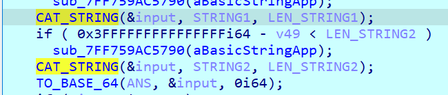

# 3_REV_INTERACTIVE

- Chall: [FILE](CHALL/3_rev_interactive.rar).

- Bài này cho chúng ta 2 file gồm một file thực thi và một file chứa output, sau khi ta thực hiện đưa file thực thi vào DIE thì phát hiện ra file này đã bị pack.

    

    Sau khi ta thực hiện unpack bằng UPX thì ta có được một file, điều đặc biệt của file lần này là file có một chút khác khác so với file pack.

    

    Như vậy file unpack kia đã bị thay đổi, vậy nên ta sẽ thực hiện debug trên file pack.

- Do file đã bị pack nên những những section chính đã bị mã hóa hết, chỉ còn những hàm sau:

    

    Vào hàm `sub_140118150`, thực hiện tìm lệnh `jmp` cuối cùng rùi đặt `breakpoint` ở đó.

    

    

    

    Sau những thao tác trên thì ta đến được hàm `main` của chương trình:

    ```C
    __int64 MAIN()
    {
    unsigned int v0; // eax
    _QWORD *v1; // rbx
    __int64 v2; // rax
    _BYTE *v3; // rsi
    __int64 v4; // rdx
    __int64 v5; // rax
    _QWORD *v6; // rbp
    __int64 v7; // rax
    _BYTE *v8; // rbx
    __int64 v9; // r8
    char *MAP_RAND; // r12
    __int64 LEN_MAP_RAND; // rax
    _QWORD *_INPUT; // rbx
    int v13; // eax
    __int64 STRING2_ORIGINAL; // rsi
    __int64 LEN_STRING2_ORIGINAL; // rax
    unsigned __int64 LEN_STRING1; // rdi
    unsigned __int64 LEN_STRING2; // rsi
    _QWORD *v18; // rbx
    __int64 v19; // rax
    _BYTE *v20; // rdi
    __int64 v21; // rdx
    __int64 v22; // rax
    __int64 (__fastcall *v23)(); // rax
    __int64 (__fastcall *v24)(); // rax
    __int64 (__fastcall *v26)(); // rax
    __int64 STRING1; // [rsp+40h] [rbp-3A8h]
    __int64 STRING2; // [rsp+48h] [rbp-3A0h]
    char v29[8]; // [rsp+78h] [rbp-370h] BYREF
    char _MAP_RAND[16]; // [rsp+80h] [rbp-368h] BYREF
    char v31; // [rsp+90h] [rbp-358h] BYREF
    __int64 v32[2]; // [rsp+A0h] [rbp-348h] BYREF
    char BUFFER[16]; // [rsp+B0h] [rbp-338h] BYREF
    const __m128i *v34[4]; // [rsp+C0h] [rbp-328h] BYREF
    char *INPUT; // [rsp+E0h] [rbp-308h] BYREF
    unsigned __int64 LEN_INPUT; // [rsp+E8h] [rbp-300h]
    char v37; // [rsp+F0h] [rbp-2F8h] BYREF
    __int64 *DATA_MAP_RAND; // [rsp+100h] [rbp-2E8h] BYREF
    unsigned __int64 v39; // [rsp+108h] [rbp-2E0h]
    __int64 v40[2]; // [rsp+110h] [rbp-2D8h] BYREF
    __int128 v41[2]; // [rsp+120h] [rbp-2C8h] BYREF
    __int64 *v42; // [rsp+140h] [rbp-2A8h] BYREF
    unsigned __int64 v43; // [rsp+148h] [rbp-2A0h]
    __int64 v44[2]; // [rsp+150h] [rbp-298h] BYREF
    __int64 v45[2]; // [rsp+160h] [rbp-288h] BYREF
    __int64 v46; // [rsp+170h] [rbp-278h] BYREF
    __int64 *input; // [rsp+180h] [rbp-268h] BYREF
    __int64 v48; // [rsp+188h] [rbp-260h]
    __int64 v49[2]; // [rsp+190h] [rbp-258h] BYREF
    char v50[584]; // [rsp+1A0h] [rbp-248h] BYREF

    sub_7FF759A00020();
    v0 = ((__int64 (__fastcall *)(_QWORD))TIME64[230])(0i64);
    SRAND(v0);
    v32[0] = (__int64)BUFFER;
    strcpy(BUFFER, "2 + 2 = 4");
    v32[1] = 9i64;
    v1 = (_QWORD *)PRINT(qword_7FF759AD2040[158], BUFFER, 9i64);
    v2 = *(_QWORD *)(*v1 - 24i64);
    v3 = *(_BYTE **)((char *)v1 + v2 + 240);
    if ( !v3 )
        sub_7FF759AC5620();
    if ( v3[56] )
    {
        v4 = (unsigned int)(char)v3[67];
    }
    else
    {
        sub_7FF759A1DE90(*(_QWORD *)((char *)v1 + v2 + 240));
        v4 = 10i64;
        v26 = *(__int64 (__fastcall **)())(*(_QWORD *)v3 + 48i64);
        if ( v26 != sub_7FF759A1E6B0 )
        v4 = (unsigned int)((char (__fastcall *)(_BYTE *, __int64))v26)(v3, 10i64);
    }
    v5 = sub_7FF759A71560(v1, v4);
    sub_7FF759A71780(v5);
    sub_7FF7599F5350(v34);
    v37 = 0;
    v6 = (_QWORD *)qword_7FF759AD2040[152];
    INPUT = &v37;
    LEN_INPUT = 0i64;
    while ( 1 )
    {
        PRINT(qword_7FF759AD2040[158], &unk_7FF759ACC583, 2i64);
        v7 = *(_QWORD *)(*v6 - 24i64);
        v8 = *(_BYTE **)((char *)v6 + v7 + 240);
        if ( !v8 )
        sub_7FF759AC5620();
        if ( v8[56] )
        {
        v9 = (unsigned int)(char)v8[67];
        }
        else
        {
        sub_7FF759A1DE90(*(_QWORD *)((char *)v6 + v7 + 240));
        v9 = 10i64;
        v23 = *(__int64 (__fastcall **)())(*(_QWORD *)v8 + 48i64);
        if ( v23 != sub_7FF759A1E6B0 )
            v9 = (unsigned int)((char (__fastcall *)(_BYTE *, __int64, __int64))v23)(v8, 10i64, 10i64);
        }
        SCAN(v6, &INPUT, v9);
        if ( LEN_INPUT > 0x64 )
        {
        sub_7FF7599F5110(aInputTooLong);
        EXIT(0i64);
        }
        if ( LEN_INPUT == 4 && *(_DWORD *)INPUT == 'tixe' )
        break;
        sub_7FF7599F20E0(v29, 2i64);
        MAP_RAND = _MAP_RAND;
        do
        *MAP_RAND++ = RAND();
        while ( MAP_RAND != &v31 );
        v31 = 0;
        DATA_MAP_RAND = v40;
        LEN_MAP_RAND = STRLEN(_MAP_RAND);
        COPY_MAP(&DATA_MAP_RAND, _MAP_RAND, &_MAP_RAND[LEN_MAP_RAND]);
        _INPUT = (_QWORD *)PKCS7_Paddin(INPUT, LEN_INPUT, 16i64);
        v13 = memcpy(v50, *_INPUT, _INPUT[1]);
        v41[0] = (__int128)_mm_loadu_si128(v34[0]);
        v41[1] = (__int128)_mm_loadu_si128(v34[0] + 1);
        STRING2_ORIGINAL = ENCRYPT((unsigned int)v29, v13, _INPUT[1], (unsigned int)v41, (__int64)_MAP_RAND);
        *(_BYTE *)(STRING2_ORIGINAL + *((unsigned int *)_INPUT + 2)) = 0;
        v42 = v44;
        if ( !STRING2_ORIGINAL )
        sub_7FF759AC56A0(aBasicStringCon);
        LEN_STRING2_ORIGINAL = STRLEN(STRING2_ORIGINAL);
        COPY_MAP(&v42, STRING2_ORIGINAL, STRING2_ORIGINAL + LEN_STRING2_ORIGINAL);
        LEN_STRING1 = v39;
        LEN_STRING2 = v43;
        input = v49;
        STRING1 = (__int64)DATA_MAP_RAND;
        LOBYTE(v49[0]) = 0;
        STRING2 = (__int64)v42;
        v48 = 0i64;
        SET_INPUT_VALUE(&input, v39 + v43);
        if ( 0x3FFFFFFFFFFFFFFFi64 - v48 < LEN_STRING1 )
        sub_7FF759AC5790(aBasicStringApp);
        CAT_STRING(&input, STRING1, LEN_STRING1);
        if ( 0x3FFFFFFFFFFFFFFFi64 - v48 < LEN_STRING2 )
        sub_7FF759AC5790(aBasicStringApp);
        CAT_STRING(&input, STRING2, LEN_STRING2);
        sub_7FF7599F43C0(v45, &input, 0i64);
        if ( input != v49 )
        sub_7FF759AC4190(input, v49[0] + 1);
        v18 = (_QWORD *)PRINT(qword_7FF759AD2040[158], v45[0], v45[1]);
        v19 = *(_QWORD *)(*v18 - 24i64);
        v20 = *(_BYTE **)((char *)v18 + v19 + 240);
        if ( !v20 )
        sub_7FF759AC5620();
        if ( v20[56] )
        {
        v21 = (unsigned int)(char)v20[67];
        }
        else
        {
        sub_7FF759A1DE90(*(_QWORD *)((char *)v18 + v19 + 240));
        v21 = 10i64;
        v24 = *(__int64 (__fastcall **)())(*(_QWORD *)v20 + 48i64);
        if ( v24 != sub_7FF759A1E6B0 )
            v21 = (unsigned int)((char (__fastcall *)(_BYTE *, __int64))v24)(v20, 10i64);
        }
        v22 = sub_7FF759A71560(v18, v21);
        sub_7FF759A71780(v22);
        if ( (__int64 *)v45[0] != &v46 )
        sub_7FF759AC4190(v45[0], v46 + 1);
        if ( v42 != v44 )
        sub_7FF759AC4190(v42, v44[0] + 1);
        if ( DATA_MAP_RAND != v40 )
        sub_7FF759AC4190(DATA_MAP_RAND, v40[0] + 1);
    }
    sub_7FF759A9F470(&INPUT);
    sub_7FF759A9F470(v34);
    sub_7FF759A9F470(v32);
    return 0i64;
    }
    ``` 

- Ta có thể tóm tắt lại hàm main như sau:

    - Khởi tạo bộ sinh ngẫu nhiên bằng hàm `srand()` với `seed` là thời gian hiện tại, lấy `16` byte random.

        

        

    - Chương trình sẽ nhảy vào trong vòng while. Vòng while thực hiện đọc dữ liệu nhập từ bàn phím, nếu là chuỗi `exit` thì thoát chương trình, nếu chiều dài lớn hơn `0x64` thì thực hiện in ra `Input too long!!!`, còn không sẽ đến phần mã hóa.

        

    - Chương trình thực hiện mã hóa input bằng thuật toán AES mode CBC, với `key` cố định là `DF07382F4AFC180322896590E0C40E93100431CE49578379C413295A74266099`, còn IV `là` 16 byte random thì hàm `srand()`.

    - Sau khi thực hiện mã hóa xong thì chương trình sẽ lấy `IV` ghép với `input` đã được mã hóa rùi thực hiện mã hóa bằng `base64` (mã hóa base64 nhưng mà bị có chút thay đổi là ký tự in thường sẽ chuyển sang ký tự in hoa và ngược lại).

        

    - In ra màn hình kết quả.

- Do trong bài này trước khi mã hóa AES thì có thực hiện nối IV với chuỗi mã hóa, vậy nên chỉ cần giải mã base64 là ta có `IV`, còn `key` thì đã cố định có sẵn trong chương trình.

    ```python
    import base64
    from Crypto.Cipher import AES
    from Crypto.Util.Padding import pad, unpad

    def encrypt_aes(key, iv, plaintext_bytes):
        cipher = AES.new(key, AES.MODE_CBC, iv) 
        ciphertext = cipher.encrypt(pad(plaintext_bytes, AES.block_size)) 
        return ciphertext

    def decrypt_aes(key, iv, ciphertext):
        cipher = AES.new(key, AES.MODE_CBC, iv)  
        plaintext_bytes = unpad(cipher.decrypt(ciphertext), AES.block_size)  
        return plaintext_bytes

    if __name__ == "__main__":
        input_string = 'vYHAW7QX6DXGkNTRiDVlK8IGELPs/zyQ4124RObD6IqNCer8ipVSMipChgu/tVKcX/IB/Zz2XmS053UxuEiQLq=='
        output_string = input_string.swapcase()
        base64_string = output_string
        decoded_bytes = base64.b64decode(base64_string)
        IV = ''.join(f'{byte:02x}' for byte in decoded_bytes[0:16])
        key = 'DF07382F4AFC180322896590E0C40E93100431CE49578379C413295A74266099'
        cipher = ''.join(f'{byte:02x}' for byte in decoded_bytes[16:len(decoded_bytes)])
        key = bytes.fromhex(key) 
        IV = bytes.fromhex(IV)
        cipher = bytes.fromhex(cipher) 
        decrypted_bytes = decrypt_aes(key, IV, cipher)
        print(decrypted_bytes)
    # b'W1{do_you_enjoy_it?_06f171f7399c}'
    ```

- Flag: 

    ```txt
    W1{do_you_enjoy_it?_06f171f7399c}
    ```
